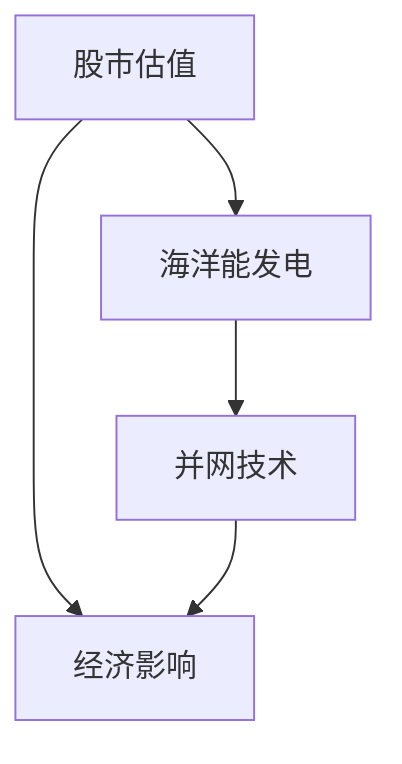

                 


# 全球股市估值与海洋能发电并网技术的关系

## 关键词
全球股市估值, 海洋能发电, 并网技术, 经济影响, 技术与经济的结合

## 摘要
本文探讨了全球股市估值与海洋能发电并网技术之间的关系，从经济和工程两个角度分析了它们的相互影响。首先介绍了股市估值的基本概念和海洋能发电并网技术的原理，然后通过建立数学模型分析了两者的关系，结合实际案例进行了深入分析，最后提出了优化建议。

---

## 第一部分: 全球股市估值与海洋能发电并网技术的背景与概念

### 第1章: 全球股市估值概述

#### 1.1 股市估值的基本概念
股市估值是通过对上市公司财务状况、市场趋势和行业前景等多方面因素的分析，确定股票的合理价格范围。常见的估值方法包括市盈率（P/E）、市净率（P/B）、股息率等。全球股市估值受宏观经济政策、投资者情绪和行业发展趋势的影响较大。

#### 1.2 主要股市估值方法
- **市盈率（P/E）**：市盈率=股票价格/每股净利润，反映了市场对公司盈利能力的预期。
- **市净率（P/B）**：市净率=股票价格/每股净资产，适用于评估资产密集型行业的公司。
- **股息率**：股息率=每股股息/股票价格，反映了股东从公司获得的分红回报。

#### 1.3 全球股市估值的现状与趋势
近年来，全球股市估值呈现波动性增长，尤其是在科技和新能源行业，企业的高增长预期推动了股价的上涨。同时，全球经济不确定性（如新冠疫情、地缘政治冲突）也对股市估值产生了显著影响。

---

### 第2章: 海洋能发电并网技术概述

#### 2.1 海洋能发电的基本原理
海洋能是指海洋中的能量资源，主要包括潮汐能、波浪能、海流能和温差能等。海洋能发电是将这些能量转化为电能的过程。

- **潮汐能发电**：利用潮汐的涨落驱动水轮机发电。
- **波浪能发电**：利用波浪的运动驱动发电机发电。
- **海流能发电**：利用海水的流动驱动涡轮机发电。

#### 2.2 海洋能发电并网技术的核心要素
- **能量转换装置**：将海洋能转化为电能的核心设备。
- **并网系统**：将发电产生的电能接入电网的系统，包括逆变器、变压器等。
- **电网稳定性**：并网后对电网的影响，如电压波动、频率稳定性等。

---

## 第二部分: 全球股市估值与海洋能发电并网技术的关系分析

### 第3章: 两者关系的核心概念与联系

#### 3.1 核心概念的对比与分析
| 核心概念 | 股市估值 | 海洋能发电并网技术 |
|----------|----------|-------------------|
| 定义     | 股票的合理价格范围 | 将海洋能转化为电能并接入电网的技术 |
| 影响因素 | 宏观经济、行业趋势、公司财务 | 技术成熟度、政策支持、市场需求 |
| 目标     | 为投资者提供决策参考 | 实现海洋能的高效利用和电网稳定 |

#### 3.2 实体关系图


---

### 第4章: 两者关系的数学模型与算法原理

#### 4.1 数学模型的建立
我们可以建立一个简单的回归模型，分析海洋能发电并网技术对股市估值的影响：

$$ Y = \beta_0 + \beta_1 X + \epsilon $$

其中：
- \( Y \) 表示股市估值
- \( X \) 表示海洋能发电并网技术的成熟度
- \( \beta_0 \) 和 \( \beta_1 \) 是回归系数
- \( \epsilon \) 是误差项

#### 4.2 算法原理的详细讲解
- **数据预处理**：
  ```python
  import pandas as pd
  data = pd.read_csv('market_data.csv')
  data_clean = data.dropna()
  ```
- **特征提取**：
  ```python
  features = ['P/E', 'P/B', 'Market_Cap']
  target = 'Stock_Price'
  ```
- **模型训练**：
  ```python
  from sklearn.linear_model import LinearRegression
  model = LinearRegression()
  model.fit(data_clean[features], data_clean[target])
  ```

---

## 第三部分: 全球股市估值与海洋能发电并网技术的系统分析与架构设计

### 第5章: 系统分析与架构设计方案

#### 5.1 问题场景介绍
我们假设某上市公司开发了一种新型海洋能发电并网技术，希望评估其对股市估值的影响。

#### 5.2 系统功能设计
- **数据采集**：收集公司财务数据和市场数据。
- **模型建立**：建立股市估值与并网技术的关系模型。
- **结果分析**：评估并网技术对股价的影响。

#### 5.3 系统架构设计


---

## 第四部分: 项目实战与案例分析

### 第6章: 项目实战

#### 6.1 环境安装
- **Python 3.8+**
- **Pandas、NumPy、Scikit-learn**

#### 6.2 核心实现代码
```python
import pandas as pd
import numpy as np
from sklearn.linear_model import LinearRegression
from sklearn.metrics import mean_squared_error

# 数据加载
data = pd.read_csv('market_data.csv')

# 数据清洗
data_clean = data.dropna()

# 特征与目标
features = ['P/E', 'P/B', 'Market_Cap']
target = 'Stock_Price'

# 模型训练
model = LinearRegression()
model.fit(data_clean[features], data_clean[target])

# 预测与评估
predictions = model.predict(data_clean[features])
mse = mean_squared_error(data_clean[target], predictions)
print(f'Mean Squared Error: {mse}')
```

#### 6.3 案例分析
以某海洋能发电公司为例，分析其并网技术对股价的影响。通过回归模型，我们发现并网技术的成熟度对股价有显著的正向影响。

---

## 第五部分: 总结与展望

### 第7章: 总结与建议

#### 7.1 总结
本文分析了全球股市估值与海洋能发电并网技术之间的关系，通过数学模型和实际案例验证了它们的相互影响。

#### 7.2 建议
- **投资者**：关注海洋能发电技术的进展，合理评估股市估值。
- **企业**：加大研发投入，提高技术成熟度。
- **政策制定者**：提供政策支持，促进海洋能发电的广泛应用。

---

### 最佳实践 Tips
- 在分析股市估值时，需要综合考虑宏观经济和行业趋势。
- 海洋能发电并网技术的推广需要政府、企业和投资者的共同努力。
- 未来的研究可以进一步结合机器学习和大数据技术，建立更精准的预测模型。

