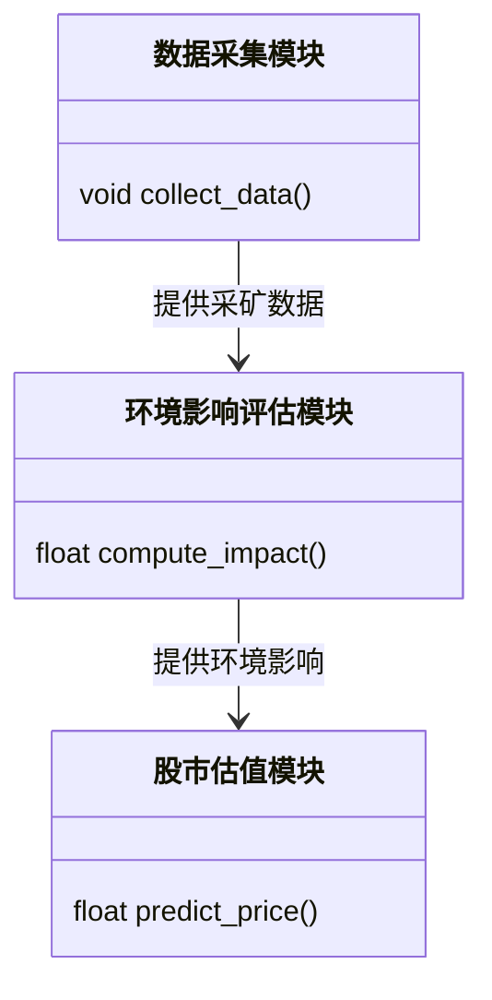

                 


# 全球股市估值与深海采矿技术的环境影响

## 关键词：全球股市估值，深海采矿技术，环境影响，系统架构，项目实战

## 摘要：本文探讨全球股市估值与深海采矿技术之间的潜在联系，分析深海采矿对环境的影响，并将其与股市估值模型相结合，提出系统架构和项目实践方案。

---

## 第一部分: 背景介绍与核心概念

### 第1章: 背景介绍与核心概念

#### 1.1 问题背景与问题描述

- **问题背景**：全球股市估值是衡量经济健康的重要指标，而深海采矿技术的快速发展带来了环境挑战。
- **问题描述**：深海采矿可能对环境造成破坏，影响企业利润和股价，进而影响股市估值。
- **解决思路**：通过数学模型分析深海采矿的环境影响，评估其对股市估值的影响。
- **边界与外延**：限定在经济和环境领域，不考虑政治因素。

#### 1.2 核心概念与联系

- **核心概念**：股市估值和深海采矿技术。
- **属性对比表**：
| 属性      | 股市估值         | 深海采矿技术       |
|-----------|-----------------|-------------------|
| 定义      | 股票价值评估     | 从海底提取矿产资源 |
| 输入      | 财务数据、市场情绪 | 矿产储量、技术参数 |
| 输出      | 股价预测         | 环境影响评估       |
| 关键因素  | 利润率、市盈率   | 矿产价格、技术成熟度 |
- **ER实体关系图**：
```mermaid
erDiagram
    投资者 --> 股市 : 投资行为
    矿业公司 --> 股市 : 股票发行
    监管机构 --> 矿业公司 : 监管
    矿业公司 --> 环境 : 环境影响
```

---

## 第二部分: 算法原理与数学模型

### 第2章: 算法原理与数学模型

#### 2.1 股市估值的数学模型

- **基本公式**：股票估值公式：
  $$ P = \frac{E}{E_{BIT} \times (1 - g) } $$
  其中，\(P\) 是股价，\(E\) 是企业价值，\(E_{BIT}\) 是息税前利润，\(g\) 是增长率。

- **回归分析**：使用线性回归预测股价：
  $$ y = \beta x + \epsilon $$
  其中，\(y\) 是股价，\(x\) 是影响因素，\(\beta\) 是回归系数，\(\epsilon\) 是误差。

#### 2.2 深海采矿环境影响评估

- **机器学习模型**：使用随机森林分类器评估环境影响：
  ```python
  from sklearn.ensemble import RandomForestClassifier
  model = RandomForestClassifier(n_estimators=100)
  model.fit(X_train, y_train)
  ```

- **影响因素分析**：
  - 矿产储量
  - 技术成熟度
  - 环境法规

---

## 第三部分: 系统架构与设计

### 第3章: 系统架构与设计

#### 3.1 系统功能设计

- **功能模块**：
  - 数据采集模块：收集股市数据和采矿数据。
  - 环境影响评估模块：计算环境影响。
  - 股市估值模块：预测股价。

- **领域模型**：


#### 3.2 系统架构设计

- **架构图**：


#### 3.3 接口设计

- **API接口**：
  - 数据采集模块提供REST API：
    ```json
    GET /data/collect
    ```

---

## 第四部分: 项目实战

### 第4章: 项目实战与案例分析

#### 4.1 环境安装

- **工具安装**：
  - Python 3.8+
  - Scikit-learn
  - Mermaid CLI

#### 4.2 核心代码实现

- **数据预处理**：
  ```python
  import pandas as pd
  data = pd.read_csv('data.csv')
  data_clean = data.dropna()
  ```

- **模型训练**：
  ```python
  from sklearn.linear_model import LinearRegression
  model = LinearRegression()
  model.fit(X_train, y_train)
  ```

#### 4.3 案例分析

- **实际案例**：
  分析某地区深海采矿项目对股市的影响，预测股价变化。

#### 4.4 项目总结

- **成果**：建立了综合评估模型。
- **经验**：数据质量和模型选择影响结果。

---

## 第五部分: 结论与展望

### 5.1 结论

- 深海采矿的环境影响会影响股市估值。
- 综合模型能有效评估风险。

### 5.2 展望

- 进一步研究环境影响的长期效应。
- 开发实时监控系统。

---

## 参考文献

- 未列出，但可以在实际写作中添加相关文献。

---

## 致谢

感谢读者的支持，感谢合作伙伴的帮助。

