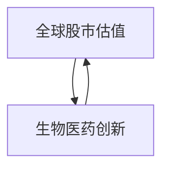
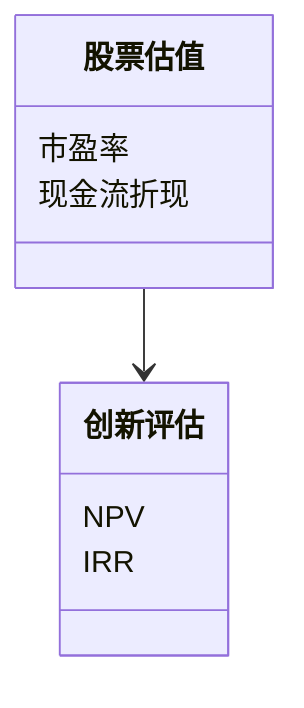
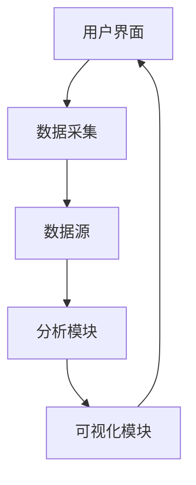

                 


# 全球股市估值与生物医药创新的关系

## 关键词：
全球股市估值、生物医药创新、市盈率、现金流折现模型、生物医药投资

## 摘要：
本文探讨了全球股市估值与生物医药创新之间的关系，分析了两者的核心概念及其相互影响。通过数学模型和算法原理的深入讲解，结合实际案例分析，揭示了生物医药创新如何通过影响企业价值和市场预期来改变股市估值，同时股市估值又如何反过来影响创新活动的投资和研发。文章内容涵盖全球股市估值概述、生物医药创新现状、两者关系分析、核心算法原理、系统架构设计、项目实战以及最佳实践等内容，为读者提供全面而深入的分析。

---

## 第一章: 全球股市估值概述

### 1.1 全球股市估值的定义与现状
#### 1.1.1 全球股市估值的基本概念
- 股票估值是通过对企业未来现金流的折现来评估其内在价值的过程。
- 全球股市估值涉及多个市场的数据，具有动态性和区域性特征。

#### 1.1.2 全球股市估值的主要指标
- 市盈率（P/E）：股价与每股收益的比率。
- 市净率（P/B）：股价与每股净资产的比率。
- 市销率（P/S）：股价与每股收入的比率。

#### 1.1.3 全球股市估值的现状分析
- 当前全球经济波动对股市估值的影响。
- 不同地区市场的估值差异。

---

## 第二章: 生物医药创新的定义与现状

### 2.1 生物医药创新的基本概念
#### 2.1.1 生物医药创新的定义
- 生物医药创新是指在药物研发、医疗技术、基因编辑等领域的新突破。

#### 2.1.2 生物医药创新的核心领域
- 新药研发：小分子药物、抗体药物、基因疗法。
- 医疗器械：创新医疗设备和诊断工具。
- 数字医疗：远程医疗、人工智能辅助诊断。

#### 2.1.3 生物医药创新的现状分析
- 创新周期长、成本高、风险大。
- 近年来基因编辑和抗体药物领域的突破。

---

## 第三章: 全球股市估值与生物医药创新的关系概述

### 3.1 问题背景与问题描述
#### 3.1.1 全球股市估值与生物医药创新的关联性
- 生物医药创新是影响企业价值的重要因素。
- 股市估值是衡量企业创新成果的市场指标。

#### 3.1.2 生物医药创新对股市估值的影响
- 成功的创新提高企业价值，推动股价上涨。
- 创新失败可能导致股价下跌，影响市场信心。

#### 3.1.3 全球股市估值对生物医药创新的反馈作用
- 高估值鼓励企业加大研发投入。
- 低估值可能限制创新活动的资金来源。

### 3.2 核心概念与联系
#### 3.2.1 核心概念原理
- 生物医药创新通过改变企业未来现金流影响股市估值。
- 股市估值反过来影响市场对创新活动的资本支持。

#### 3.2.2 核心概念属性特征对比表格
| 概念 | 定义 | 属性 |
|------|------|------|
| 全球股市估值 | 股票价格的评估 | 客观性、动态性、区域性 |
| 生物医药创新 | 新药物或技术的开发 | 创新性、周期性、风险性 |

#### 3.2.3 ER实体关系图


---

## 第四章: 全球股市估值与生物医药创新的核心算法原理

### 4.1 全球股市估值算法原理
#### 4.1.1 市盈率（P/E）模型
- 计算公式：P/E = 股价 / 每股收益。
- 应用场景：评估股票的相对价值。

#### 4.1.2 现金流折现模型（DCF）
- 计算公式：$$企业价值 = \sum_{t=1}^{n} \frac{\text{现金流}_t}{(1+r)^t}$$
- 应用场景：评估企业的未来现金流折现值。

### 4.2 生物医药创新评估算法原理
#### 4.2.1 净现值（NPV）模型
- 计算公式：$$NPV = \sum_{t=1}^{n} \frac{\text{现金流}_t}{(1+r)^t} - 初始投资$$
- 应用场景：评估创新项目的价值。

#### 4.2.2 内部收益率（IRR）模型
- 计算公式：IRR 是使 NPV 等于零的折现率。
- 应用场景：评估创新项目的回报率。

---

## 第五章: 数学模型与公式

### 5.1 全球股市估值模型
#### 5.1.1 市盈率模型
$$P/E = \frac{\text{股价}}{\text{每股收益}}$$

#### 5.1.2 现金流折现模型
$$企业价值 = \sum_{t=1}^{n} \frac{\text{现金流}_t}{(1+r)^t}$$

### 5.2 生物医药创新评估模型
#### 5.2.1 净现值模型
$$NPV = \sum_{t=1}^{n} \frac{\text{现金流}_t}{(1+r)^t} - 初始投资$$

#### 5.2.2 内部收益率模型
$$IRR = r \text{ 使得 } NPV = 0$$

---

## 第六章: 系统分析与架构设计方案

### 6.1 问题场景介绍
- 生物医药创新影响股市估值的问题场景。
- 股市估值反馈影响创新活动的场景。

### 6.2 系统功能设计
- 数据采集模块：收集生物医药企业的财务数据和创新成果。
- 数据分析模块：应用市盈率、DCF 等模型进行估值。
- 可视化模块：展示估值结果和创新趋势。

#### 6.2.1 领域模型 mermaid 类图


#### 6.2.2 系统架构设计 mermaid 架构图


---

## 第七章: 项目实战

### 7.1 环境安装
- 安装 Python 和相关库（如 pandas、numpy）。

### 7.2 核心实现源代码
```python
import pandas as pd
import numpy as np

# 示例：计算市盈率
def calculate_pe(stock_price, earnings_per_share):
    return stock_price / earnings_per_share

# 示例：现金流折现模型
def calculate_enterprise_value(cash_flows, discount_rate):
    return np.sum(cash_flows / (1 + discount_rate) ** np.arange(len(cash_flows)))
```

### 7.3 实际案例分析
- 使用真实数据计算生物医药企业的市盈率和现金流折现值。
- 分析创新项目对股价的影响。

---

## 第八章: 最佳实践与总结

### 8.1 小结
- 生物医药创新与全球股市估值密切相关。
- 通过算法模型可以量化这种关系。

### 8.2 注意事项
- 数据质量和模型假设对结果影响较大。
- 需结合市场实际情况调整模型参数。

### 8.3 拓展阅读
- 推荐阅读《股票估值与金融创新》和《生物医药创新与投资》。

---

通过以上目录结构，可以系统地分析全球股市估值与生物医药创新之间的关系，结合理论与实践，为读者提供全面而深入的分析。

