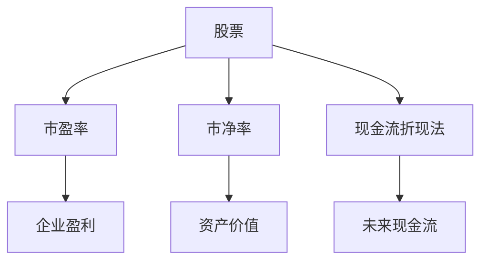
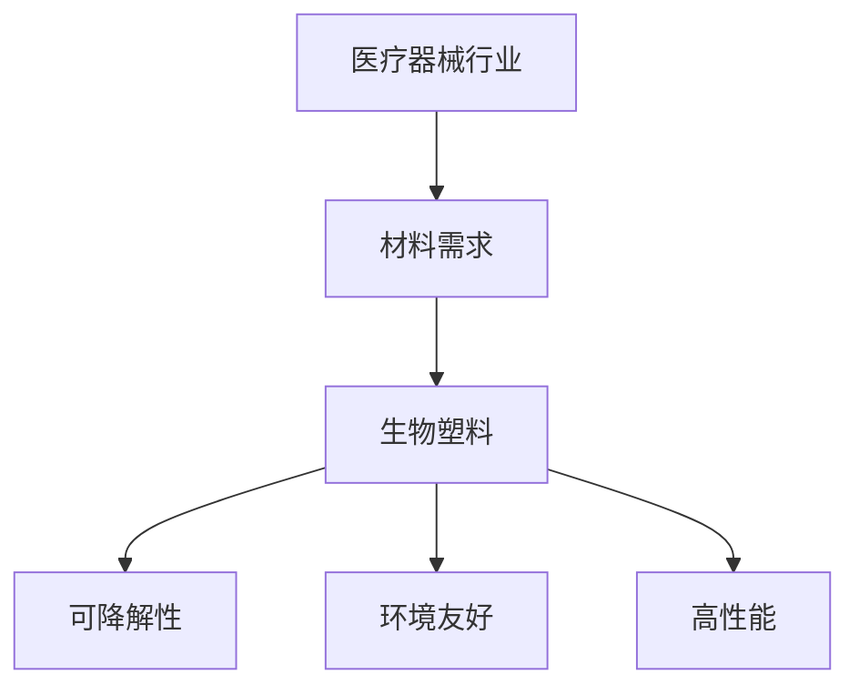

                 

# 全球股市估值与生物塑料在医疗器械中的应用

> 关键词：全球股市估值、生物塑料、医疗器械、可持续发展、投资分析、环境影响

> 摘要：本文探讨了全球股市估值与生物塑料在医疗器械中的应用之间的关系。通过分析生物塑料的特性及其在医疗器械行业的应用前景，结合股市估值的核心概念和算法，提出了如何通过生物塑料在医疗器械中的应用影响股市估值的方法。本文旨在为投资者和行业从业者提供有价值的见解，帮助他们更好地理解生物塑料在医疗器械中的潜力，从而做出更明智的投资决策。

---

# 第一部分: 全球股市估值与生物塑料的背景介绍

## 第1章: 全球股市估值的背景与概念

### 1.1 股市估值的基本概念

股市估值是评估公司股票价值的过程，旨在确定股票的合理价格。常见的估值方法包括市盈率（P/E）、市净率（P/B）和现金流折现法（DCF）等。股市估值不仅受公司基本面影响，还受到宏观经济环境和市场情绪的左右。

股市估值的核心在于平衡当前表现与未来预期，确保投资者能够获得合理的回报。

### 1.2 全球股市的现状与趋势

全球股市近年来呈现波动性增长，受全球经济复苏、政策变化和地缘政治影响较大。投资者需关注宏观经济指标（如GDP增长率、通胀率）和市场情绪（如投资者信心指数）。

### 1.3 生物塑料的定义与特性

生物塑料是由可再生资源（如淀粉、纤维素）制成，具有可降解性、环境友好性和可持续性。与传统塑料相比，生物塑料在生产过程中能耗更低，对环境影响更小。

---

## 第2章: 生物塑料在医疗器械中的应用前景

### 2.1 医疗器械行业的现状与需求

医疗器械行业是全球医疗健康的重要组成部分，市场规模庞大。随着人们对健康关注度的提高，对高性能、可持续材料的需求也在增加。生物塑料因其优良性能，逐渐成为医疗器械材料的优选。

### 2.2 生物塑料在医疗器械中的具体应用

#### 2.2.1 生物塑料在医用耗材中的应用

生物塑料广泛应用于注射器、输液袋等一次性医用耗材。其可降解性减少了医疗废物对环境的污染，同时降低了企业的生产成本。

#### 2.2.2 生物塑料在医疗设备中的应用

在高端医疗设备中，生物塑料用于制造外壳、内部组件等。其高强度和轻量化特点提升了设备性能，同时降低了生产成本。

#### 2.2.3 生物塑料在可穿戴医疗设备中的应用

可穿戴设备对材料的要求极高，生物塑料因其柔软性和透气性，成为理想的材料选择。例如，智能手表中的某些部件可采用生物塑料制造。

---

## 第3章: 全球股市估值与生物塑料行业的关联性分析

### 3.1 股市估值与生物塑料行业的互动关系

#### 3.1.1 生物塑料企业的上市与融资

生物塑料企业通过上市融资，吸引投资者关注。股市估值的高低直接影响企业的融资能力，进而影响其研发和生产能力。

#### 3.1.2 股市波动对生物塑料行业的影响

宏观经济波动会导致股市整体波动，进而影响生物塑料企业的股价。例如，经济衰退可能导致投资者抛售股票，进而影响企业的资金链。

#### 3.1.3 生物塑料行业对股市估值的反向影响

生物塑料行业的技术创新和市场拓展会影响企业的盈利能力，从而影响股市估值。例如，成功研发新型生物塑料材料可能会提升企业的市盈率。

---

### 3.2 全球经济环境对股市估值与生物塑料行业的影响

#### 3.2.1 宏观经济因素对股市估值的影响

GDP增长率、通胀率和利率等宏观经济指标直接影响股市估值。例如，低利率环境通常会推高股市估值。

#### 3.2.2 环境政策对生物塑料行业的影响

政府对环保的重视和政策支持（如税收优惠、补贴）会推动生物塑料行业的发展，进而影响相关企业的股市估值。

---

## 第4章: 生物塑料在医疗器械中的环境与经济影响

### 4.1 生物塑料的环境影响

生物塑料的生产过程能耗低，且可降解，减少了对环境的污染。相比传统塑料，生物塑料的碳足迹更低，符合可持续发展的理念。

### 4.2 生物塑料的经济影响

随着生物塑料技术的成熟，其生产成本逐渐降低，市场竞争力增强。这将推动医疗器械行业的成本优化，同时为企业带来更高的利润率。

---

## 第5章: 投资策略与未来展望

### 5.1 投资策略

投资者应关注生物塑料技术的突破和政策变化，选择具有强大研发能力和市场前景的企业。同时，需分散投资风险，避免过度集中在单一领域。

### 5.2 未来展望

随着技术进步和政策支持，生物塑料在医疗器械中的应用将更加广泛。未来，生物塑料可能成为医疗器械行业的主流材料，推动整个行业的可持续发展。

---

## 结语

本文通过分析全球股市估值与生物塑料在医疗器械中的应用，揭示了两者的相互影响。生物塑料的环境友好性和可持续性不仅为医疗器械行业带来了新的发展机遇，也为投资者提供了新的投资方向。未来，随着技术进步和政策支持，生物塑料将在医疗器械行业中发挥更大的作用，推动整个行业的创新与变革。

---

# 推荐阅读

1. [生物塑料在医疗行业的应用](https://example.com/bioplastic-medicine)
2. [股市估值的核心算法](https://example.com/stock-valuation-algorithm)
3. [可持续发展与投资](https://example.com/sustainable-investing)

---

通过本文的分析，读者可以更好地理解生物塑料在医疗器械中的潜力，以及如何通过股市估值来把握投资机会。希望本文能为投资者和行业从业者提供有价值的参考。

