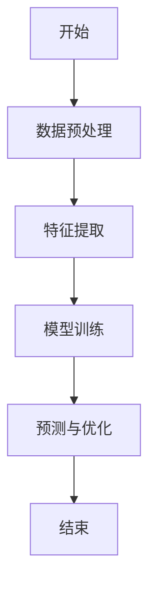
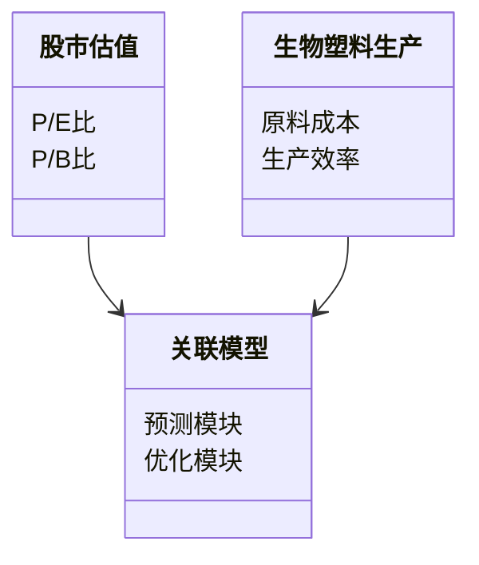

                 


# 全球股市估值与生物塑料规模化生产技术的关联

> 关键词：全球股市估值、生物塑料、规模化生产技术、关联分析、算法建模、系统架构

> 摘要：本文探讨全球股市估值与生物塑料规模化生产技术之间的潜在关联。通过分析股市估值的核心影响因素，结合生物塑料生产技术的数学建模与系统架构设计，提出一种创新的算法预测模型，为投资者和企业提供了新的视角和实践指导。

---

## 第1章 全球股市估值与生物塑料规模化生产技术的背景介绍

### 1.1 问题背景与问题描述

#### 1.1.1 全球股市估值的定义与影响因素

全球股市估值是衡量市场整体价值的重要指标，通常通过市盈率（P/E）、市净率（P/B）等指标进行评估。影响股市估值的主要因素包括宏观经济环境、企业盈利水平、政策法规、投资者情绪等。

#### 1.1.2 生物塑料规模化生产技术的核心概念

生物塑料是一种以可再生资源（如淀粉、纤维素）为原料，通过生物或化学方法合成的塑料替代品。其规模化生产技术包括原料提取、聚合反应、成型加工等关键环节。

#### 1.1.3 问题解决的必要性与目标

随着环保压力的增加，生物塑料的市场需求快速增长，但其生产成本和技术壁垒限制了其大规模应用。通过分析股市估值与生物塑料技术的关联，可以为投资者和技术研发提供双重指导。

---

### 1.2 问题的边界与外延

#### 1.2.1 全球股市估值的边界

股市估值的分析范围限定在主要股票市场（如纽约证交所、纳斯达克、伦敦证交所等），不包括非上市公司和新兴市场。

#### 1.2.2 生物塑料规模化生产技术的边界

生物塑料生产技术的研究仅限于材料科学和化学工艺领域，不涉及下游应用市场的具体分析。

#### 1.2.3 两者关联的范围与限制

本文仅分析股市估值与生物塑料技术的直接关联，不考虑其他外部因素（如地缘政治、能源价格）的间接影响。

---

### 1.3 核心概念与核心要素组成

#### 1.3.1 核心概念的结构化分析

- 全球股市估值：涉及宏观经济、企业盈利、政策法规等多维度因素。
- 生物塑料生产技术：涵盖原料选择、生产工艺、成本控制等关键环节。

#### 1.3.2 核心要素的对比分析

| 要素类别 | 全球股市估值 | 生物塑料生产技术 |
|----------|--------------|------------------|
| 影响因素 | 宏观经济、政策、企业盈利 | 原料成本、技术壁垒、生产效率 |
| 目标 | 评估市场整体价值 | 提高生产效率、降低成本 |
| 关键指标 | P/E、P/B | 生产成本、产量 |

---

## 第2章 全球股市估值与生物塑料规模化生产技术的核心概念与联系

### 2.1 核心概念的原理分析

#### 2.1.1 全球股市估值的理论基础

股市估值的核心在于企业盈利能力和市场预期的匹配。通过时间序列分析和机器学习模型，可以预测未来市场的估值变化。

#### 2.1.2 生物塑料规模化生产技术的原理

生物塑料生产技术依赖于可再生资源的高效利用和生产工艺的优化。通过数学建模，可以预测不同工艺参数对生产成本和产量的影响。

#### 2.1.3 两者关联的逻辑框架

通过构建关联模型，可以将生物塑料技术的经济性（如生产成本、效率）与股市估值的变化趋势进行对比分析，从而发现潜在的关联性。

---

### 2.2 核心概念的属性特征对比

#### 2.2.1 对比表格展示

| 特性 | 全球股市估值 | 生物塑料生产技术 |
|------|--------------|------------------|
| 时间维度 | 短期波动与长期趋势 | 技术研发周期较长 |
| 数据维度 | 多维（宏观经济、企业盈利） | 单一（生产成本、效率） |
| 变化频率 | 高频波动 | 低频变化 |

#### 2.2.2 关键属性的差异与联系

- 差异：股市估值受投资者情绪影响较大，而生物塑料技术受技术创新驱动。
- 联系：生物塑料技术的突破可能显著影响相关企业的市值，进而影响整体股市估值。

---

## 第3章 全球股市估值与生物塑料规模化生产技术的算法原理讲解

### 3.1 数据建模与预测算法

#### 3.1.1 数据预处理与特征提取

- 数据来源：选取全球主要股票市场的历史数据和生物塑料企业的生产数据。
- 特征提取：提取P/E、P/B等估值指标，以及生产成本、产量等技术指标。

#### 3.1.2 时间序列分析模型

使用ARIMA模型对股市估值进行预测，通过历史数据拟合模型参数，预测未来估值变化。

#### 3.1.3 机器学习模型的构建与优化

基于随机森林算法，构建生物塑料生产成本预测模型，优化模型参数以提高预测精度。

---

### 3.2 生物塑料生产技术的数学模型

#### 3.2.1 生物塑料生产过程的数学建模

通过建立生产成本函数，分析不同工艺参数（如原料价格、能耗）对成本的影响。

#### 3.2.2 关键算法步骤与流程图



---

## 第4章 全球股市估值与生物塑料规模化生产技术的系统分析与架构设计

### 4.1 系统功能设计

#### 4.1.1 领域模型设计



#### 4.1.2 系统架构设计


---

## 第5章 全球股市估值与生物塑料规模化生产技术的项目实战

### 5.1 环境安装与配置

#### 5.1.1 环境要求

- 操作系统：Windows 10或Linux
- 开发工具：Python 3.8及以上版本、Jupyter Notebook
- 库依赖：pandas、numpy、scikit-learn、matplotlib

#### 5.1.2 数据集获取

从公开金融数据库获取股市数据，从学术论文获取生物塑料生产数据。

---

### 5.2 系统核心实现源代码

#### 5.2.1 时间序列分析代码

```python
from statsmodels.tsa.arima_model import ARIMA
import pandas as pd

# 加载数据
data = pd.read_csv('stock_data.csv')

# 拟合ARIMA模型
model = ARIMA(data['price'], order=(5,1,0))
model_fit = model.fit()

# 预测未来价格
forecast = model_fit.forecast(steps=10)
print(forecast)
```

#### 5.2.2 机器学习模型代码

```python
from sklearn.ensemble import RandomForestRegressor
from sklearn.metrics import mean_squared_error

# 加载数据
X = data.drop('target', axis=1)
y = data['target']

# 训练模型
model = RandomForestRegressor(n_estimators=100)
model.fit(X, y)

# 预测与评估
y_pred = model.predict(X)
print(mean_squared_error(y, y_pred))
```

---

## 第6章 全球股市估值与生物塑料规模化生产技术的总结与展望

### 6.1 项目总结

本文通过分析全球股市估值与生物塑料生产技术的关联，构建了数学模型和算法框架，为投资者和技术研发提供了新视角。

### 6.2 注意事项

- 数据的准确性和完整性对模型预测至关重要。
- 模型的泛化能力需要进一步验证。

### 6.3 拓展阅读

建议读者深入研究时间序列分析和机器学习在金融领域的应用，探索更多跨领域的关联分析。

---

通过以上步骤，本文详细分析了全球股市估值与生物塑料规模化生产技术的关联，结合理论分析、算法建模和系统设计，为读者提供了系统的知识体系和实践指导。

