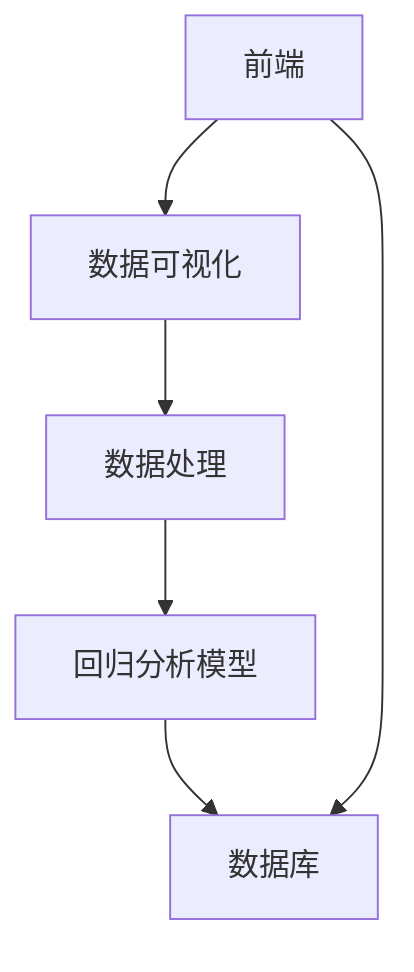
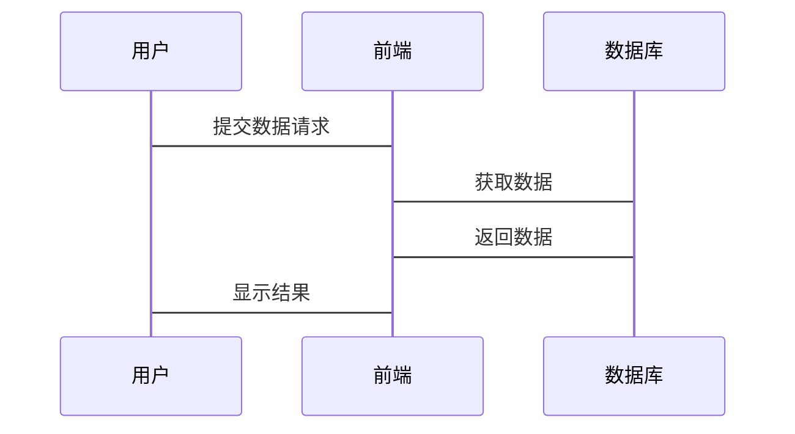

                 


# 全球股市估值与知识产权保护的关联

## 关键词：全球股市估值、知识产权保护、关联性分析、经济影响、法律框架

## 摘要：  
本文探讨全球股市估值与知识产权保护之间的关联性，分析知识产权保护如何影响企业市值和投资者决策，进而对全球股市估值产生深远影响。通过构建数学模型和案例分析，揭示知识产权保护在提升企业竞争力、防范市场风险和促进经济创新中的关键作用。

---

## 第一部分：全球股市估值与知识产权保护的背景与概念

### 第1章：全球股市估值的基本概念

#### 1.1 什么是全球股市估值  
全球股市估值是指对全球范围内股票市场的整体价值进行评估，通常以市场资本化率（Market Capitalization）表示。市场资本化率是上市公司市值的总和，反映了市场的整体规模和投资者对市场的信心。

- **市场资本化率的计算公式**：  
  $$\text{市场资本化率} = \sum (\text{股票数量} \times \text{每股价格})$$

- **主要影响因素**：  
  - 经济增长：GDP增长通常推动企业盈利上升，进而提升股市估值。  
  - 利率水平：低利率环境通常有利于股市估值上升。  
  - 投资者情绪：市场情绪波动直接影响股市估值的短期变化。  

#### 1.2 知识产权保护的基本概念  
知识产权保护是指通过法律手段保护创新成果（如专利、商标、版权等）不被他人非法使用或侵权。有效的知识产权保护能够激励创新，促进企业技术进步和产品升级。

- **知识产权的主要法律形式**：  
  - 专利：保护发明和技术方案。  
  - 商标：保护品牌标识。  
  - 版权：保护文学、艺术作品等原创内容。  

- **知识产权保护的重要性**：  
  知识产权保护是创新驱动经济的核心，能够为企业创造长期价值，吸引投资，提升企业竞争力。

#### 1.3 全球股市估值与知识产权保护的关联性  
知识产权保护直接影响企业的创新能力和市场竞争力，从而影响企业的盈利能力和股票市值。例如，拥有强大知识产权保护的企业通常能够获得更高的估值溢价。此外，知识产权保护还影响市场的整体稳定性，间接影响股市估值。

---

## 第二部分：知识产权保护对全球股市估值的影响

### 第2章：知识产权保护的法律框架

#### 2.1 知识产权法律体系概述  
知识产权保护的法律体系包括国际和国内两个层面。国际层面主要通过世界知识产权组织（WIPO）等机构推动，而国内层面则通过各国的专利法、版权法等实现。

- **全球主要知识产权法律框架**：  
  - 《伯尔尼公约》：保护文学和艺术作品的版权。  
  - 《巴黎公约》：保护工业产权，如专利和商标。  
  - 《TRIPS协议》：世界贸易组织框架下的知识产权保护协议。  

#### 2.2 知识产权保护对企业价值的影响  
知识产权保护通过提升企业的创新能力和市场竞争力，直接影响企业的市场价值。例如，一家拥有大量专利的企业在技术领域更具竞争力，通常能获得更高的市盈率。

- **知识产权对企业创新的推动作用**：  
  知识产权保护为企业提供了创新的激励，使其能够投入更多资源进行技术研发，从而推动产品升级和市场拓展。  

#### 2.3 知识产权侵权对企业市值的影响  
知识产权侵权可能导致企业面临法律诉讼和赔偿，从而影响企业的财务状况和市场信誉。例如，苹果与三星的专利诉讼曾对双方的股价产生显著影响。

---

## 第三部分：知识产权保护对股市估值的数学模型与算法

### 第3章：知识产权保护与股市估值的数学模型

#### 3.1 知识产权保护的量化指标  
为了构建数学模型，我们需要将知识产权保护量化。常用指标包括：

- **专利申请数量**：衡量企业的创新能力。  
- **知识产权保护指数**：综合考虑专利、商标和版权保护的力度。  
- **知识产权侵权率**：反映市场中的侵权情况。  

#### 3.2 知识产权保护对股市估值的回归分析  
通过回归分析，我们可以量化知识产权保护对股市估值的影响。模型如下：

$$\text{市值} = \beta_0 + \beta_1 \times \text{专利数量} + \beta_2 \times \text{知识产权保护指数} + \epsilon$$

- **变量解释**：  
  - $\text{市值}$：企业的市场价值。  
  - $\text{专利数量}$：企业的专利申请数量。  
  - $\text{知识产权保护指数}$：反映知识产权保护力度的指标。  
  - $\epsilon$：误差项。  

#### 3.3 算法实现  
以下是一个简单的回归分析示例：

```python
import numpy as np
import statsmodels.api as sm

# 假设我们有专利数量和知识产权保护指数的数据
patents = np.array([100, 200, 150, 250, 300])
ip_index = np.array([0.8, 0.9, 0.7, 0.85, 0.95])
market_value = np.array([500, 1000, 700, 1200, 1500])

# 添加截距项
X = sm.add_constant(patents)

# 进行回归分析
model = sm.OLS(market_value, X)
results = model.fit()

# 输出回归结果
print(results.summary())
```

---

## 第四部分：系统分析与架构设计方案

### 第4章：系统架构设计

#### 4.1 系统功能设计  
我们设计一个系统来分析知识产权保护对股市估值的影响，主要功能包括：

- 数据收集：获取企业的专利数量、知识产权保护指数等数据。  
- 数据分析：使用回归分析模型进行预测和评估。  
- 可视化：生成图表展示结果。  

#### 4.2 系统架构图  
以下是系统的架构设计：



#### 4.3 系统交互图  
以下是系统的交互设计：



---

## 第五部分：项目实战

### 第5章：项目实战

#### 5.1 环境安装  
需要安装以下工具：

- Python 3.8+
- NumPy、Pandas、StatsModels库  
- Matplotlib或Seaborn用于可视化  

安装命令：

```bash
pip install numpy pandas statsmodels matplotlib
```

#### 5.2 核心代码实现  
以下是回归分析的代码实现：

```python
import numpy as np
import pandas as pd
import statsmodels.api as sm
import matplotlib.pyplot as plt

# 数据读取
data = pd.DataFrame({
    'Patents': [100, 200, 150, 250, 300],
    'IP_Index': [0.8, 0.9, 0.7, 0.85, 0.95],
    'Market_Value': [500, 1000, 700, 1200, 1500]
})

# 添加截距项
X = sm.add_constant(data[['Patents', 'IP_Index']])

# 构建模型
model = sm.OLS(data['Market_Value'], X)

# 拟合模型
results = model.fit()

# 输出回归结果
print(results.summary())

# 可视化
plt.scatter(data['Patents'], data['Market_Value'])
plt.title('Market Value vs Patents')
plt.xlabel('Patents')
plt.ylabel('Market Value')
plt.show()
```

#### 5.3 案例分析  
以某科技公司为例，假设其专利数量为200，知识产权保护指数为0.85。根据回归模型，其市场价值预测为：

$$\text{预测市值} = \beta_0 + \beta_1 \times 200 + \beta_2 \times 0.85$$

---

## 第六部分：最佳实践与小结

### 第6章：最佳实践与小结

#### 6.1 最佳实践  
- 定期评估企业的知识产权资产，确保其得到充分保护。  
- 监测市场中的知识产权侵权行为，及时采取法律措施。  
- 投资于创新，提升企业的技术竞争力。  

#### 6.2 小结  
知识产权保护是影响全球股市估值的重要因素。通过构建数学模型和系统分析，我们可以量化知识产权保护对市场价值的影响，为投资者和企业管理者提供决策支持。

#### 6.3 注意事项  
- 数据的准确性和完整性是模型预测的关键。  
- 模型结果仅供参考，实际投资需结合多方面因素。  

#### 6.4 拓展阅读  
- 《知识产权经济学》  
- 《金融市场与创新》  
- 《专利分析与竞争战略》  

---

通过本文的分析，我们深入探讨了知识产权保护与全球股市估值之间的关联，为理解知识产权保护的经济影响提供了新的视角。希望本文能为投资者、企业管理者和政策制定者提供有价值的参考。

