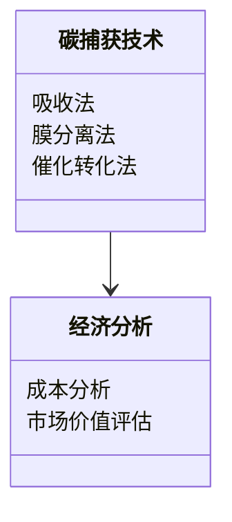

                 


# 全球股市估值与碳捕获与利用技术的经济可行性

> **关键词**：全球股市估值、碳捕获技术、经济可行性、碳利用技术、股市投资
>
> **摘要**：本文探讨了全球股市估值与碳捕获与利用技术之间的经济联系，分析了碳捕获技术的成本、市场潜力及其对股市估值的影响，结合实际案例，评估其经济可行性。

---

## 第一部分：全球股市估值基础

### 第1章：全球股市估值概述

#### 1.1 全球股市估值的定义与背景

**1.1.1 什么是全球股市估值**

全球股市估值是指对全球范围内股票市场的整体价值进行评估。它是通过对上市公司市值的总和进行分析，反映全球经济状况的重要指标。股市估值不仅帮助投资者了解市场的整体表现，还为政策制定者提供了经济运行的参考。

**1.1.2 全球股市估值的重要性**

股市估值是衡量经济健康状况的关键指标。它反映了企业的盈利能力、市场的信心和整体经济的趋势。通过分析股市估值，投资者可以做出更明智的投资决策，而政策制定者则可以根据估值调整宏观经济政策。

**1.1.3 全球股市估值的演变历程**

随着经济全球化的发展，股市估值从早期的区域市场分析逐渐转向全球视角。近年来，随着气候变化和可持续发展的重要性日益凸显，碳捕获技术等绿色科技对股市估值的影响也逐渐成为研究的焦点。

---

#### 1.2 全球股市估值的核心概念

**1.2.1 市场资本化率**

市场资本化率是衡量股市整体规模与国内生产总值（GDP）的比例，反映了经济活动的金融化程度。公式为：

$$ 市场资本化率 = \frac{市场总市值}{GDP} $$

**1.2.2 市盈率与市净率**

市盈率（P/E）是股票价格与每股收益的比率，用于评估股票的估值水平：

$$ P/E = \frac{股价}{每股收益} $$

市净率（P/B）是股票价格与每股净资产的比率，用于评估股票的资产价值：

$$ P/B = \frac{股价}{每股净资产} $$

**1.2.3 股息率与股息收益率**

股息率是股票的股息与股价的比率，反映了投资回报率：

$$ 股息率 = \frac{股息}{股价} \times 100\% $$

---

### 第2章：全球股市估值的影响因素

#### 2.1 经济因素对股市估值的影响

**2.1.1 经济周期与股市估值的关系**

经济周期的波动直接影响股市估值。在经济扩张期，企业盈利增加，股市估值上升；在经济衰退期，企业盈利下降，股市估值下降。

**2.1.2 利率与股市估值的互动**

低利率环境通常会推高股市估值，因为资金成本降低，更多资金流入股市。反之，高利率环境会抑制股市估值，资金流向债券等固定收益资产。

**2.1.3 通货膨胀对股市估值的影响**

适度的通货膨胀有助于股市估值上升，但过高的通货膨胀会削弱企业的盈利能力，导致股市估值下降。

#### 2.2 行业因素对股市估值的影响

**2.2.1 行业生命周期与估值**

处于成长期的行业通常具有较高的估值，而成熟期的行业估值较为稳定，衰退期的行业估值较低。

**2.2.2 行业竞争结构与估值**

垄断竞争的行业通常具有较高的估值，而高度竞争的行业估值可能较低。

**2.2.3 行业政策环境与估值**

政策支持的行业通常具有较高的估值，例如环保行业受到政策鼓励，估值可能上升。

---

## 第二部分：碳捕获与利用技术的经济可行性

### 第3章：碳捕获与利用技术概述

#### 3.1 碳捕获技术的基本原理

**3.1.1 吸收法**

吸收法利用化学溶剂捕获二氧化碳，例如使用MEA（甲乙胺）溶液。其优点是技术成熟，但成本较高。

**3.1.2 膜分离法**

膜分离法通过选择性透过膜分离二氧化碳，适用于高浓度排放源。

**3.1.3 催化转化法**

催化转化法将二氧化碳转化为有用的化学品，例如合成燃料或塑料。

#### 3.2 碳利用技术的分类

**3.2.1 石化产品生产**

将二氧化碳转化为烯烃、甲醇等石化产品。

**3.2.2 水泥与建筑材料生产**

利用二氧化碳生产低碳水泥和混凝土。

**3.2.3 碳基材料生产**

将二氧化碳转化为石墨烯、碳纳米管等高性能材料。

---

### 第4章：碳捕获与利用技术的经济分析

#### 4.1 碳捕获技术的成本构成

**4.1.1 设备投资成本**

碳捕获设备的初期投资较大，包括吸收塔、压缩机等。

**4.1.2 运行与维护成本**

包括能源消耗、维护费用和人工成本。

**4.1.3 能源消耗成本**

碳捕获过程需要大量能源，尤其是压缩和液化二氧化碳。

#### 4.2 碳利用技术的市场价值评估

**4.2.1 产品市场价格波动**

石化产品价格受供需影响较大，需关注市场波动。

**4.2.2 技术成熟度与规模效应**

技术成熟度直接影响生产成本，规模效应可降低单位成本。

**4.2.3 政策补贴与市场激励**

政府补贴和碳交易机制对碳利用技术的经济可行性有重要影响。

---

## 第三部分：全球股市估值与碳捕获技术的结合

### 第5章：碳捕获技术对全球股市估值的影响

#### 5.1 碳捕获技术对企业估值的影响

**5.1.1 技术壁垒与竞争优势**

掌握碳捕获技术的企业可能具有竞争优势，提升市场估值。

**5.1.2 降低碳排放的成本优势**

通过碳捕获技术降低碳排放，可减少碳税等成本，提升企业盈利能力。

**5.1.3 碳信用与市场价值**

碳信用的交易价值直接影响企业的碳捕获项目收益，从而影响股市估值。

#### 5.2 碳捕获技术对全球经济的影响

**5.2.1 技术成熟度与经济潜力**

技术成熟度越高，经济潜力越大，推动股市估值上升。

**5.2.2 政策补贴与市场激励**

政府补贴和碳交易机制对碳捕获技术的经济可行性有重要影响，进而影响股市估值。

---

## 第四部分：系统分析与架构设计方案

### 第6章：碳捕获技术的系统架构设计

#### 6.1 项目介绍

本项目旨在分析碳捕获技术的经济可行性，并评估其对股市估值的影响。

#### 6.2 系统功能设计

**功能模块**：
- 数据采集与处理
- 技术成本分析
- 市场价值评估
- 经济可行性分析

**领域模型（Mermaid 类图）**：



---

### 第7章：项目实战

#### 7.1 环境安装

安装Python和必要的库，如NumPy、Pandas、Matplotlib。

#### 7.2 核心实现代码

```python
import numpy as np
import pandas as pd
import matplotlib.pyplot as plt

# 示例数据：碳捕获技术的成本和收益
costs = np.array([100, 200, 150])  # 设备、运营、能源成本（百万美元）
revenues = np.array([150, 250, 200])  # 碳信用和产品收入（百万美元）

# 经济可行性分析
def economic_feasibility(costs, revenues):
    return revenues - costs

feasibility = economic_feasibility(costs, revenues)
print("经济可行性分析结果：", feasibility)

# 可视化
plt.figure(figsize=(10, 6))
plt.bar(range(len(feasibility)), feasibility, color='blue', alpha=0.6)
plt.title('碳捕获技术经济可行性分析')
plt.xlabel('技术类型')
plt.ylabel('净收益（百万美元）')
plt.show()
```

#### 7.3 实际案例分析

以某公司为例，分析其碳捕获项目对股市估值的影响。通过对比项目前后的企业市值变化，评估技术的经济可行性。

---

## 第五部分：总结与展望

### 第8章：总结与最佳实践

#### 8.1 总结

碳捕获技术对全球股市估值具有重要影响，通过降低碳排放和创造新价值，提升了企业的市场竞争力和估值。然而，技术成本和市场波动仍需关注。

#### 8.2 最佳实践 tips

- 投资者应关注碳捕获技术的成熟度和市场潜力。
- 企业应优化碳捕获技术的成本结构，提升经济可行性。
- 政府应制定支持政策，促进碳捕获技术的广泛应用。

---

## 结语

全球股市估值与碳捕获与利用技术的经济可行性密切相关。通过深入分析两者的关系，可以更好地把握投资机会，推动可持续发展。未来，随着技术进步和政策支持，碳捕获技术将对全球经济和股市估值产生更大的影响。

