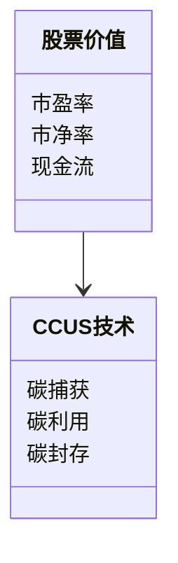
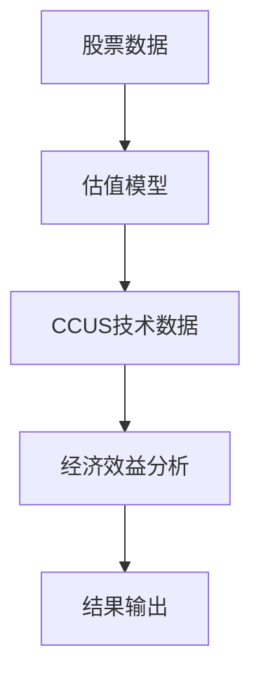

                 


# 全球股市估值与碳捕获利用与封存技术的经济效益

> 关键词：全球股市估值、碳捕获利用与封存技术、经济效益、股票市场、碳中和

> 摘要：本文探讨全球股市估值与碳捕获利用与封存技术（CCUS）的经济效益，分析股市估值对CCUS技术的影响，以及CCUS技术对股市的推动作用。通过背景介绍、核心概念、算法原理、系统架构和项目实战，深入剖析两者之间的关系，为投资者和决策者提供参考。

---

## 第1章: 全球股市估值与碳捕获利用与封存技术的背景介绍

### 1.1 全球股市估值的定义与背景

#### 1.1.1 股市估值的基本概念
股市估值是指通过对公司财务数据和市场因素的分析，估算其股票的内在价值。主要方法包括市盈率（P/E）、市净率（P/B）和现金流折现法（DCF）。

#### 1.1.2 全球股市估值的发展历程
从19世纪末的华尔街到现代电子交易系统，股市估值经历了从简单到复杂的演变，技术进步和金融创新推动了估值方法的多样化。

#### 1.1.3 股市估值的重要性与应用领域
股市估值帮助投资者做出投资决策，评估公司的投资价值，同时为企业的融资提供参考。广泛应用于金融分析、投资策略制定等领域。

### 1.2 碳捕获利用与封存技术（CCUS）的定义与背景

#### 1.2.1 碳捕获利用与封存技术的基本概念
CCUS技术通过捕获工业排放中的二氧化碳，进行再利用或封存，减少温室气体排放，是实现碳中和的重要手段。

#### 1.2.2 CCUS技术的发展历程
从实验室研究到工业应用，CCUS技术经历了技术突破和成本下降，成为全球应对气候变化的关键技术之一。

#### 1.2.3 CCUS技术的重要性与应用领域
CCUS技术在能源、化工、水泥等行业有广泛应用，有助于实现低碳转型，减少碳排放。

---

## 第2章: 股市估值与CCUS技术的核心概念与联系

### 2.1 股市估值的核心概念

#### 2.1.1 股票价值的评估方法
股票价值可以通过市盈率、市净率等指标进行评估，公式如下：
$$ P/E = \frac{Price}{Earnings} $$
$$ P/B = \frac{Price}{Book\ Value} $$

#### 2.1.2 市盈率与市净率的定义与计算
市盈率反映市场对每股收益的支付倍数，市净率则反映股价与账面价值的关系。

#### 2.1.3 股票市场的波动性与风险评估
股票市场的波动性影响股市估值，风险评估通过VaR等方法进行量化。

### 2.2 CCUS技术的核心概念

#### 2.2.1 碳捕获技术的原理与分类
碳捕获技术包括燃烧后捕获、燃烧前捕获和 oxy-fuel技术，适用于不同工业过程。

#### 2.2.2 碳利用技术的种类与应用
碳利用包括制备化学品、生产燃料和增强采油，CCS技术则是将CO2封存在地质构造中。

#### 2.2.3 碳封存技术的定义与实现方式
碳封存通过将CO2注入地下储层，如盐水层和枯竭的油田，长期储存。

### 2.3 股市估值与CCUS技术的联系

#### 2.3.1 CCUS技术对股市估值的影响
CCUS技术的广泛应用将提升相关企业的市场价值，推动股市估值上升。

#### 2.3.2 碳中和目标对股市估值的推动作用
碳中和目标的实现将带来结构性投资机会，推动相关股票价格上涨。

#### 2.3.3 CCUS技术的经济效益
通过降低碳排放，CCUS技术可减少企业的碳税支出，提升企业的盈利能力。

---

## 第3章: 股市估值与CCUS技术的算法原理

### 3.1 股市估值的算法原理

#### 3.1.1 市盈率模型的数学表达
市盈率模型通过公司的市盈率和行业平均市盈率对比，评估股票的内在价值。

#### 3.1.2 现金流折现法（DCF）的数学模型
DCF模型通过将未来现金流折现，计算股票的公允价值：
$$ V = \sum_{t=1}^{n} \frac{CF_t}{(1+r)^t} $$

#### 3.1.3 股票市场的波动性与风险评估
使用VaR模型评估市场风险，计算公式为：
$$ VaR = \mu + z\sigma $$

### 3.2 CCUS技术的经济效益分析

#### 3.2.1 碳捕获成本的估算
碳捕获成本包括技术成本和运营成本，公式为：
$$ COE = \frac{Total\ Cost}{Annual\ CO2\ Capture} $$

#### 3.2.2 碳利用与封存的经济性分析
碳利用带来的收入和封存的成本比较，确定项目的经济可行性。

#### 3.2.3 经济效益的综合评估
结合碳价格、技术成本和市场因素，评估CCUS项目的经济效益。

---

## 第4章: 股市估值与CCUS技术的系统分析与架构设计

### 4.1 问题场景介绍
分析CCUS技术对企业价值的影响，构建评估模型，指导投资决策。

### 4.2 系统功能设计

#### 4.2.1 领域模型


### 4.3 系统架构设计



### 4.4 系统接口设计
API接口定义数据输入和输出，实现模块化设计。

---

## 第5章: 股市估值与CCUS技术的项目实战

### 5.1 环境安装
安装Python、Pandas、Matplotlib等工具，配置数据源。

### 5.2 核心实现代码

```python
import pandas as pd

# 示例：计算市盈率
def calculate_pe(stock_price, earnings_per_share):
    return stock_price / earnings_per_share

# 示例：计算碳捕获成本
def calculate_co2_cost(total_cost, captured_co2):
    return total_cost / captured_co2
```

### 5.3 代码解读与分析
解释代码功能，展示如何计算股市估值和CCUS成本。

### 5.4 实际案例分析
分析某区域股市和CCUS项目，展示模型的应用和结果。

### 5.5 项目小结
总结项目成果，提出改进建议。

---

## 第6章: 总结与展望

### 6.1 核心发现
CCUS技术将推动股市估值上升，碳中和目标带来投资机会。

### 6.2 未来展望
技术创新和政策支持将进一步提升CCUS技术的经济效益，股市估值将更加依赖于企业的低碳表现。

### 6.3 最佳实践 tips
- 关注政策动向，合理配置投资组合。
- 采用先进的估值方法和技术工具。

---

## 第7章: 参考文献

列出相关的学术论文、书籍和技术报告，为读者提供进一步阅读的方向。

---

通过以上结构，文章系统地探讨了全球股市估值与CCUS技术的经济效益，结合理论分析和实际案例，为读者提供了全面的视角。

