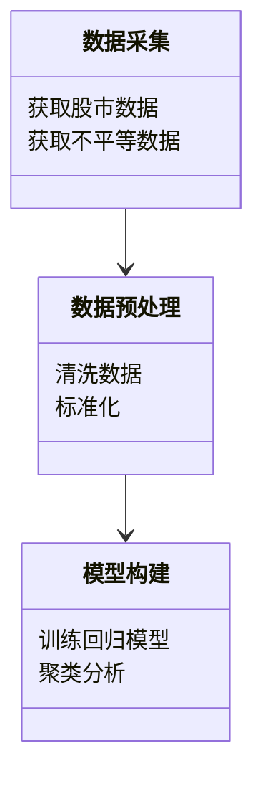
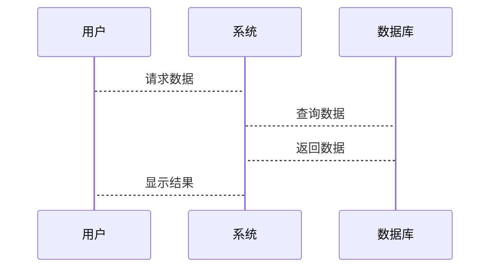

                 


# 全球股市估值与社会不平等问题的关联

## 关键词：
- 股市估值
- 社会不平等
- 经济分析
- 机器学习
- 数据挖掘

## 摘要：
本文探讨了全球股市估值与社会不平等问题之间的复杂关联。通过分析股市估值的核心概念、计算方法及其影响因素，结合社会不平等的测量指标和形成机制，构建了理论模型并进行了实证分析。进一步，文章提出了基于机器学习和数据挖掘的算法模型，用于预测股市估值和社会不平等，并通过系统架构设计展示了如何将这些模型应用于实际问题中。最后，通过项目实战和最佳实践，总结了研究发现和政策建议。

---

# 第一部分: 全球股市估值与社会不平等问题的关联概述

---

# 第1章: 背景与概念

## 1.1 股市估值的基本概念

### 1.1.1 股市估值的定义
股市估值是指通过对上市公司财务数据和市场信息进行分析，估算其股票的内在价值或市场价格的过程。常见的估值方法包括市盈率（P/E）、市净率（P/B）和股息率（Dividend Yield）等。

### 1.1.2 股市估值的主要指标
- **市盈率（P/E）**：股价与每股收益的比率，反映了市场对公司盈利能力的预期。
- **市净率（P/B）**：股价与每股净资产的比率，适用于评估资产密集型行业。
- **股息率（Dividend Yield）**：股息与股价的比率，反映了投资回报率。

### 1.1.3 股市估值的计算方法
市盈率（P/E）计算公式为：
$$ \text{市盈率} = \frac{\text{股价}}{\text{每股收益}} $$

---

## 1.2 社会不平等问题的基本概念

### 1.2.1 社会不平等的定义
社会不平等是指社会资源和机会在不同群体之间的分配不均，通常表现为收入、财富、教育和就业机会等方面的差异。

### 1.2.2 社会不平等的测量指标
- **基尼系数**：衡量收入或财富分配不平等程度的指标，范围在0到1之间。
- **贫困发生率**：贫困人口占总人口的比例。
- **财富集中度**：高收入群体占总财富的比例。

### 1.2.3 社会不平等的形成因素
- **经济政策**：税收、福利和社会保障制度。
- **教育水平**：教育机会不均影响职业发展。
- **市场结构**：垄断和寡头垄断加剧资源分配不均。

---

## 1.3 股市估值与社会不平等的关联性

### 1.3.1 股市估值与社会不平等的初步关联
股市估值的高低可能反映经济资源的分配情况，高估值可能意味着财富集中在少数投资者手中，从而加剧社会不平等。

### 1.3.2 问题背景与研究意义
随着全球化和金融化的发展，股市在经济中的地位日益重要。然而，股市估值的波动可能加剧社会不平等，研究这一关联有助于制定更公平的经济政策。

### 1.3.3 研究目标与研究范围
目标：分析股市估值与社会不平等的内在联系，构建预测模型。范围：全球主要经济体的股市数据与社会不平等指标。

---

# 第2章: 股市估值的计算方法与影响因素

## 2.1 股市估值的主要方法

### 2.1.1 市盈率法
通过比较市盈率与行业平均值，判断股票估值是否合理。

### 2.1.2 市净率法
适用于资产密集型行业，通过比较市净率与行业平均值判断估值。

### 2.1.3 股息率法
高股息率可能意味着低估，但需结合行业和市场环境分析。

---

## 2.2 影响股市估值的主要因素

### 2.2.1 宏观经济因素
- **GDP增长**：经济繁荣通常推高股市估值。
- **利率水平**：低利率环境可能推高市盈率。

### 2.2.2 行业因素
- **行业周期**：周期性行业波动较大，可能影响估值。
- **行业政策**：政府政策如补贴或税收变化会影响估值。

### 2.2.3 公司基本面因素
- **盈利能力**：高净利润可能提升市盈率。
- **资产负债情况**：高负债可能降低市净率。

---

# 第3章: 社会不平等问题的分析框架

## 3.1 社会不平等的测量方法

### 3.1.1 基尼系数
基尼系数越大，社会不平等越严重。例如，基尼系数为0.7表示高度不平等。

### 3.1.2 贫富差距指数
通过比较不同收入群体的财富比例，衡量贫富差距。

### 3.1.3 社会阶层分析
通过职业、教育和收入划分社会阶层，分析各阶层的财富分配。

---

## 3.2 社会不平等的主要影响因素

### 3.2.1 经济政策
- **税收政策**：累进税制可降低贫富差距。
- **社会保障**：福利政策有助于减少不平等。

### 3.2.2 教育水平
- **教育资源分配**：公平的教育机会有助于减少不平等。
- **教育质量**：高质量教育提升个人能力，降低结构性不平等。

### 3.2.3 就业机会
- **就业市场**：充分就业减少贫困。
- **职业培训**：提升技能有助于缩小收入差距。

---

# 第4章: 股市估值与社会不平等的关联机制

## 4.1 理论模型构建

### 4.1.1 股市估值与社会不平等的因果关系
股市高估值可能导致财富集中，加剧社会不平等。例如，股市泡沫破裂可能引发财富缩水，加剧不平等。

### 4.1.2 股市估值与社会不平等的中介变量
- **市场流动性**：流动性充裕可能推高估值，加剧不平等。
- **投资者结构**：机构投资者占主导可能影响估值和社会不平等。

### 4.1.3 股市估值与社会不平等的调节变量
- **政府监管**：严格的市场监管可能降低估值过高带来的不平等。

---

## 4.2 实证分析框架

### 4.2.1 数据来源与处理
- 数据来源：全球主要经济体的股市数据和基尼系数数据。
- 数据处理：清洗、标准化和时间序列分析。

### 4.2.2 模型选择与假设
- 假设：股市估值与社会不平等之间存在显著关联。
- 模型：多元回归模型，控制变量包括GDP、利率、教育水平等。

### 4.2.3 分析方法与步骤
1. 数据收集与预处理。
2. 模型构建与变量选择。
3. 实证分析与结果解释。

---

# 第5章: 股市估值与社会不平等的算法与数学模型

## 5.1 股市估值预测模型

### 5.1.1 线性回归模型
$$ \text{预测市盈率} = \beta_0 + \beta_1 \times \text{GDP增长率} + \epsilon $$

### 5.1.2 时间序列模型
使用ARIMA模型预测股市估值，考虑历史数据的自相关性。

### 5.1.3 机器学习模型
使用随机森林回归模型，通过特征工程提取影响市盈率的关键因素。

---

## 5.2 社会不平等预测模型

### 5.2.1 统计回归模型
$$ \text{基尼系数} = \alpha_0 + \alpha_1 \times \text{股市估值} + \beta_1 \times \text{教育支出} + \epsilon $$

### 5.2.2 非参数估计模型
使用核回归估计社会不平等的分布，考虑复杂的数据关系。

### 5.2.3 网络分析模型
构建社会不平等的网络图，分析各因素之间的关联。

---

## 5.3 股市估值与社会不平等的联合分析

### 5.3.1 联合回归模型
通过双重回归模型，同时预测股市估值和社会不平等。

### 5.3.2 联合聚类分析
将股市和不平等数据进行聚类分析，识别不同市场的模式。

### 5.3.3 联合因果分析
使用Granger因果检验，分析股市估值对社会不平等的影响。

---

# 第6章: 系统分析与架构设计

## 6.1 问题场景介绍

### 6.1.1 问题背景
分析全球股市估值与社会不平等的关联，为政策制定提供依据。

### 6.1.2 项目介绍
构建一个数据挖掘系统，分析股市和不平等数据，预测未来趋势。

---

## 6.2 系统功能设计

### 6.2.1 领域模型
使用mermaid类图展示系统功能模块，包括数据采集、模型构建、结果分析等。



---

## 6.3 系统架构设计

### 6.3.1 系统架构
使用分层架构，包括数据层、业务逻辑层和表现层。


---

## 6.4 系统接口设计

### 6.4.1 RESTful API
- GET /stocks 数据获取接口
- POST /inequality 分析结果接口

---

## 6.5 系统交互设计

### 6.5.1 用户与系统交互
使用mermaid序列图展示用户与系统的交互流程。



---

# 第7章: 项目实战

## 7.1 环境安装

### 7.1.1 Python环境
安装Python 3.8及以上版本，安装必要的库如Pandas、Scikit-learn、Matplotlib。

```bash
pip install numpy pandas scikit-learn
```

---

## 7.2 系统核心实现源代码

### 7.2.1 数据预处理代码
```python
import pandas as pd

# 加载数据
df = pd.read_csv('stocks.csv')
inequality_df = pd.read_csv('inequality.csv')

# 合并数据
merged_data = pd.merge(df, inequality_df, on='year')
```

### 7.2.2 模型训练代码
```python
from sklearn.linear_model import LinearRegression
import numpy as np

# 训练回归模型
model = LinearRegression()
model.fit(X, y)
```

---

## 7.3 代码应用解读与分析

### 7.3.1 数据分析
通过Python代码计算股市估值和基尼系数的关联性，使用可视化工具展示数据分布。

### 7.3.2 模型验证
使用交叉验证评估模型的准确性和稳定性，调整参数优化预测效果。

---

## 7.4 实际案例分析

### 7.4.1 案例背景
以美国为例，分析2008年金融危机后股市估值和社会不平等的变化趋势。

### 7.4.2 数据分析
使用Python代码分析金融危机前后股市估值的变化，及其对社会不平等的影响。

### 7.4.3 结果解读
金融危机后，股市估值下降，基尼系数上升，说明股市波动可能加剧社会不平等。

---

## 7.5 项目小结

### 7.5.1 项目总结
通过项目实战，验证了股市估值与社会不平等之间的关联性，展示了数据挖掘技术在经济分析中的应用。

### 7.5.2 经验与教训
数据清洗和特征选择对模型性能影响较大，需注重数据质量和模型调优。

---

# 第8章: 最佳实践与未来展望

## 8.1 最佳实践 tips

### 8.1.1 数据质量
确保数据的准确性和完整性，避免偏差影响分析结果。

### 8.1.2 模型选择
根据具体问题选择合适的模型，避免过度复杂化。

### 8.1.3 结果验证
通过交叉验证和实际案例分析验证模型的稳定性和适用性。

---

## 8.2 小结

### 8.2.1 研究发现
股市估值与社会不平等之间存在显著关联，高估值可能加剧社会不平等。

### 8.2.2 政策建议
政府应加强市场监管，优化税收政策，促进财富分配的公平性。

---

## 8.3 未来展望

### 8.3.1 拓展研究
研究其他因素如技术进步和社会文化对社会不平等的影响。

### 8.3.2 技术发展
探索更先进的数据分析技术，如深度学习和自然语言处理，提升预测精度。

### 8.3.3 应用场景
将研究成果应用于实际政策制定和经济管理中，促进社会公平与经济发展。

---

# 结语

本文通过系统分析和实证研究，揭示了全球股市估值与社会不平等问题的复杂关联。未来，随着技术的进步和数据的积累，我们有望更深入地理解这些问题，并提出更具针对性的解决方案。

---

**感谢您的耐心阅读，如果文章对您有帮助，请分享给更多的人！**

