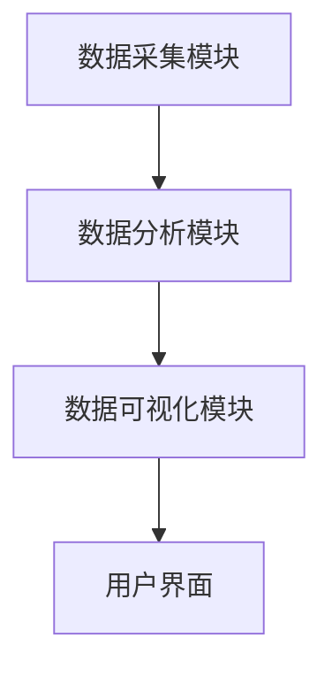
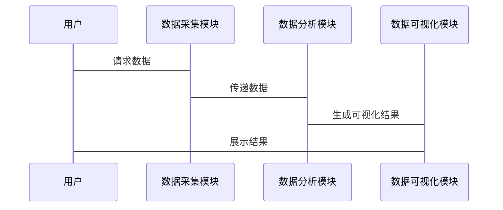

                 


# 全球股市估值与私募股权市场的关系

## 关键词：全球股市估值，私募股权市场，市场关系，投资策略，经济影响

## 摘要：  
本文探讨了全球股市估值与私募股权市场之间的关系，分析了它们在宏观经济环境中的相互作用机制，重点阐述了股市估值对私募股权市场的影响、私募股权市场对股市估值的反作用以及两者在市场周期中的协同效应。文章通过详细分析影响因素、算法原理和实际案例，揭示了两者之间的复杂关系，并为投资者提供了有益的启示。

---

# 第1章 全球股市估值与私募股权市场的背景与基础

## 1.1 全球股市估值的定义与核心概念

### 1.1.1 全球股市估值的定义
全球股市估值是指对全球范围内股票市场整体价值的评估，通常通过市盈率（P/E）、市净率（P/B）等指标来衡量市场的整体估值水平。股市估值反映了市场参与者对上市公司未来盈利能力的预期，同时也受到宏观经济环境、政策变化和市场情绪的影响。

### 1.1.2 股市估值的核心要素与指标
股市估值的核心指标包括：
- **市盈率（P/E）**：股价与每股收益的比率，反映市场对上市公司盈利能力的预期。
- **市净率（P/B）**：股价与每股净资产的比率，反映市场对上市公司资产价值的评估。
- **股息率**：股票的股息与股价的比率，反映市场对分红回报的关注程度。
- **市值**：上市公司总股本乘以股价，反映市场的整体规模。

### 1.1.3 全球股市估值的演变历程
全球股市估值随着经济周期的变化而波动，历史上经历了多次牛熊市的交替，每次市场的波动都反映了宏观经济环境和投资者情绪的变化。例如，2008年金融危机后，全球股市估值经历了大幅波动，但随后逐步恢复。

## 1.2 私募股权市场的定义与特点

### 1.2.1 私募股权市场的定义
私募股权市场是指通过私募基金、风险投资等方式，对未上市企业进行股权投资的市场。与公开市场不同，私募股权市场的交易不公开，投资者通常为机构投资者或高净值个人。

### 1.2.2 私募股权市场的核心特征
- **高风险高回报**：私募股权市场的投资回报通常高于公开市场，但风险也更高。
- **流动性较低**：私募股权的退出周期较长，通常需要3-7年。
- **定制化投资**：私募股权基金根据市场环境和企业特点制定个性化的投资策略。

### 1.2.3 私募股权市场的运作模式
私募股权市场的运作模式包括以下几个步骤：
1. **募资**：通过向机构投资者或高净值个人募集资金。
2. **投资**：选择具有高增长潜力的企业进行投资。
3. **管理**：通过董事会或管理层对企业进行战略调整和管理优化。
4. **退出**：通过企业上市或出售股权实现投资收益。

## 1.3 全球股市估值与私募股权市场的关联性

### 1.3.1 两者的相互作用机制
- **协同效应**：私募股权市场的投资活动可以提升企业的价值，进而影响公开市场的估值水平。
- **市场周期**：股市估值的波动对私募股权市场的资金流动和投资决策有直接影响。

### 1.3.2 市场周期对两者的影响
在经济繁荣时期，股市估值通常较高，私募股权市场的活跃度也显著提升；而在经济衰退时期，股市估值下降，私募股权市场的投资活动也会受到抑制。

### 1.3.3 全球经济环境对两者的影响
全球经济环境的变化，如利率政策、通货膨胀和地缘政治风险，都会对股市估值和私募股权市场的表现产生重大影响。

---

# 第2章 全球股市估值与私募股权市场的关系分析

## 2.1 股市估值对私募股权市场的影响

### 2.1.1 股市估值波动对私募股权市场的影响
股市估值的波动会影响私募股权市场的资金流动。当股市估值处于高位时，投资者可能倾向于将资金从私募市场转移到公开市场，导致私募市场的资金压力增大。

### 2.1.2 股市估值水平对私募股权市场的影响
股市估值的高低反映了市场的整体情绪，高估值通常意味着市场对未来的预期较高，私募股权市场的投资活动也会更加活跃。

### 2.1.3 股市估值结构对私募股权市场的影响
股市估值的结构变化，如市盈率和市净率的变动，反映了市场的投资偏好，进而影响私募股权市场的投资策略。

## 2.2 私募股权市场对股市估值的影响

### 2.2.1 私募股权市场对股市流动性的贡献
私募股权市场的活跃能够增加市场的流动性，从而对股市估值产生正面影响。

### 2.2.2 私募股权市场对股市投资情绪的影响
私募股权市场的投资活动能够提升市场的整体情绪，进而影响股市估值。

### 2.2.3 私募股权市场对股市估值的推动作用
私募股权市场的投资活动能够提升企业的价值，进而推动股市估值的上升。

## 2.3 两者关系的综合分析

### 2.3.1 协同效应的体现
股市估值与私募股权市场的协同效应主要体现在市场的整体波动、投资者情绪和资金流动等方面。

### 2.3.2 冲突与平衡的动态关系
在市场波动中，股市估值与私募股权市场的关系可能会出现冲突，但通过市场的自我调节机制，两者能够达到平衡。

### 2.3.3 市场环境变化下的关系演变
随着市场环境的变化，股市估值与私募股权市场的关系也会不断演变，需要投资者根据实际情况进行调整。

---

# 第3章 全球股市估值与私募股权市场的核心影响因素

## 3.1 宏观经济因素对两者的影响

### 3.1.1 经济周期与市场估值的关系
经济周期的变化直接影响股市估值和私募股权市场的表现。例如，在经济繁荣时期，股市估值通常较高，私募股权市场的活跃度也显著提升。

### 3.1.2 利率政策对市场估值的影响
央行的利率政策对股市估值和私募股权市场的资金流动有重要影响。低利率环境通常会推高股市估值，同时增加私募市场的资金供给。

## 3.2 行业结构对两者的影响

### 3.2.1 行业周期与市场估值的关系
不同行业的周期性变化会影响股市估值和私募股权市场的投资策略。例如，科技行业的高增长潜力通常会吸引更多的私募投资。

### 3.2.2 行业集中度与市场估值的关系
行业集中度的高低会影响市场的整体估值水平，高集中度行业通常具有更强的议价能力，从而推高股价。

## 3.3 政策监管对两者的影响

### 3.3.1 政策环境对股市估值的影响
政策监管的变化，如税收政策和退市制度的改革，会影响股市估值的波动。

### 3.3.2 政策环境对私募股权市场的影响
政策监管的变化对私募股权市场的资金流动和投资活动有直接影响。例如，加强监管可能会降低市场的流动性，但也可能提高市场的透明度。

---

# 第4章 全球股市估值与私募股权市场的估值方法

## 4.1 股市估值的核心算法

### 4.1.1 市盈率（P/E）计算
$$ P/E = \frac{Price}{Earnings} $$

### 4.1.2 市净率（P/B）计算
$$ P/B = \frac{Price}{Book\ Value} $$

### 4.1.3 股息率计算
$$ Dividend\ Yield = \frac{Dividend}{Price} $$

## 4.2 私募股权市场的估值方法

### 4.2.1 现金流折现法
$$ V = \sum_{t=1}^{n} \frac{CF_t}{(1+r)^t} $$

### 4.2.2 可比公司法
$$ V = \frac{EV}{P/E} \times EBITDA $$

### 4.2.3 股权自由现金流模型
$$ FCFF = EBIT(1 - Tax\ Rate) + Depreciation - Capital\ Expenditure $$

---

# 第5章 全球股市估值与私募股权市场的相互作用机制

## 5.1 股市估值对私募股权市场的传导机制

### 5.1.1 市场情绪的传导
股市估值的变化反映了市场情绪的变化，这种情绪变化会传导到私募股权市场的资金流动和投资决策。

### 5.1.2 估值水平的传导
股市估值的高低影响私募股权市场的估值预期，从而影响私募市场的投资活动。

## 5.2 私募股权市场对股市估值的反馈机制

### 5.2.1 投资活动的反馈
私募股权市场的投资活动通过提升企业的价值，间接推动股市估值的上升。

### 5.2.2 资金流动的反馈
私募股权市场的资金流动变化会影响股市的资金供给，从而影响股市估值。

---

# 第6章 全球股市估值与私募股权市场的系统架构设计

## 6.1 问题场景介绍
本文将构建一个综合分析全球股市估值与私募股权市场关系的系统，通过数据采集、分析和可视化，帮助投资者更好地理解两者之间的关系。

## 6.2 系统功能设计

### 6.2.1 数据采集模块
- 采集全球股市估值数据（市盈率、市净率等）。
- 采集私募股权市场数据（基金规模、投资案例等）。

### 6.2.2 数据分析模块
- 计算股市估值指标。
- 分析私募股权市场的投资趋势。
- 探讨两者之间的关系。

### 6.2.3 数据可视化模块
- 绘制股市估值和私募股权市场的趋势图。
- 可视化两者之间的关联性。

## 6.3 系统架构设计



## 6.4 系统接口设计
- 数据接口：通过API获取全球股市数据和私募股权市场数据。
- 用户接口：提供数据可视化和分析结果的展示。

## 6.5 系统交互设计



---

# 第7章 全球股市估值与私募股权市场的项目实战

## 7.1 环境安装

### 7.1.1 安装Python
```bash
python --version
pip install numpy pandas matplotlib
```

### 7.1.2 安装相关库
```bash
pip install pandas_datareader
pip install plotly
```

## 7.2 核心实现源代码

### 7.2.1 数据采集
```python
import pandas as pd
from pandas_datareader import DataReader

def get_stock_data(ticker):
    data = DataReader(ticker, 'yahoo')
    return data
```

### 7.2.2 数据分析
```python
def calculate_pe_ticker(data):
    pe = data['Adj Close'] / data['Earnings Per Share']
    return pe.mean()

stock_data = get_stock_data('SPY')
pe_ratio = calculate_pe_ticker(stock_data)
print(f'平均市盈率：{pe_ratio}')
```

### 7.2.3 数据可视化
```python
import matplotlib.pyplot as plt

plt.plot(stock_data.index, stock_data['Adj Close'])
plt.title('全球股市指数走势')
plt.xlabel('日期')
plt.ylabel('收盘价')
plt.show()
```

## 7.3 实际案例分析
以2020年新冠疫情后的市场为例，分析股市估值与私募股权市场的关系。通过代码实现，我们可以看到股市估值在疫情期间大幅波动，而私募股权市场的投资活动也受到了显著影响。

---

# 第8章 全球股市估值与私募股权市场的总结与建议

## 8.1 关键点回顾
- 股市估值与私募股权市场的相互作用机制。
- 影响两者关系的核心因素。
- 两者在市场周期中的协同效应。

## 8.2 投资策略建议
- 投资者应关注宏观经济环境和政策变化。
- 在市场波动中，合理配置资产以分散风险。
- 利用技术手段进行数据分析，提升投资决策的科学性。

## 8.3 未来研究方向
- 探讨更多影响两者关系的微观因素。
- 开发更复杂的算法模型，提高分析的准确性。
- 研究不同地区市场的差异性影响。

## 8.4 注意事项
- 投资有风险，需谨慎决策。
- 数据分析结果仅供参考，具体投资需结合实际情况。

## 8.5 拓展阅读
- 《投资学基础》
- 《私募股权基金的投资策略》
- 《股市估值分析方法》

---

# 附录

## 附录A 全球股市估值与私募股权市场的相关数据集
- 全球股市数据：Yahoo Finance API。
- 私募股权市场数据：Preqin数据库。

## 附录B 相关代码与数据可视化示例
- Python代码示例。
- 数据可视化图表展示。

---

通过以上结构和内容，我们能够全面理解全球股市估值与私募股权市场之间的关系，并为投资者提供有价值的参考和指导。

