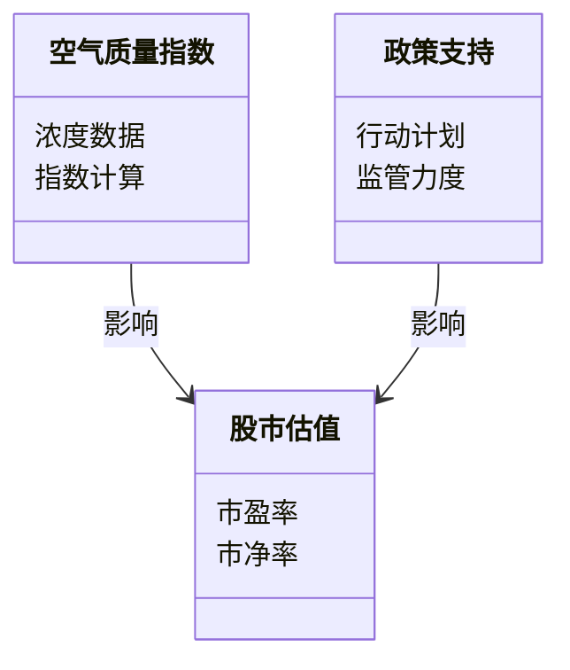
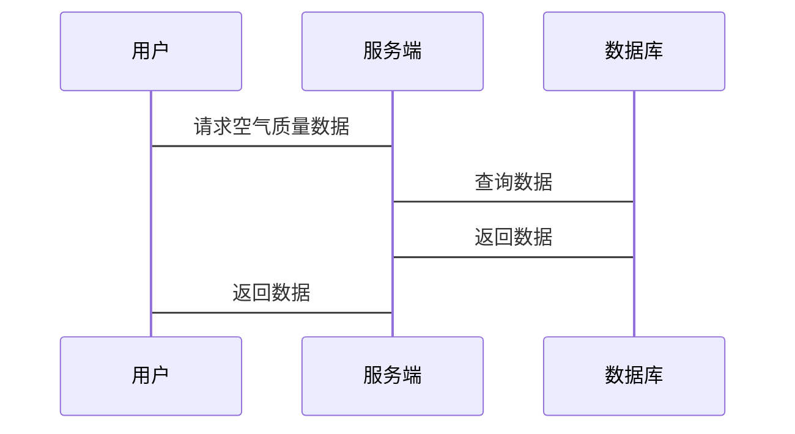

                 


```markdown
# 全球股市估值与空气质量改善措施的关系

> 关键词：全球股市、空气质量、环境政策、金融模型、大数据分析、时间序列分析

> 摘要：本文系统探讨了全球股市估值与空气质量改善措施之间的关系，通过数学模型和实际案例分析，揭示了空气质量对股市估值的影响机制。文章从环境政策、经济活动和金融市场的角度出发，结合大数据分析和时间序列分析方法，构建了空气质量改善措施对股市估值的预测模型，并提出了相应的优化建议。

---

## 正文

### 第一章：背景介绍

#### 1.1 问题背景
##### 1.1.1 环境问题与经济活动的关系
环境问题，尤其是空气污染，不仅影响居民健康，还对经济活动产生深远影响。空气污染可能导致企业生产成本增加、员工工作效率下降，从而影响整体经济表现。

##### 1.1.2 空气质量对经济活动的影响
空气质量差可能导致企业生产中断、物流受阻，进而影响企业的盈利能力。同时，空气污染还可能影响消费行为，例如减少户外活动相关产业的收入。

##### 1.1.3 股市估值与经济活动的关联性
股市估值是衡量经济健康的重要指标。当经济活动受到影响时，股市估值也会随之波动。空气质量作为影响经济活动的重要因素，自然也会影响股市估值。

#### 1.2 问题描述
##### 1.2.1 空气质量改善措施的定义
空气质量改善措施包括政府和企业采取的各种措施，如减少污染物排放、推广清洁能源、加强环保监管等。

##### 1.2.2 股市估值的定义与计算方法
股市估值通常通过市盈率（P/E ratio）和市净率（P/B ratio）等指标衡量。这些指标反映了市场对企业的估值和信心。

##### 1.2.3 空气质量改善与股市估值的关系
空气质量改善可能通过降低企业生产成本、提高员工健康状况等方式间接影响股市估值。同时，空气质量改善也可能通过提升企业形象和可持续发展能力，增强投资者信心。

#### 1.3 问题解决
##### 1.3.1 研究目标的设定
本文旨在探讨空气质量改善措施对股市估值的具体影响路径，建立数学模型，量化其影响程度。

##### 1.3.2 数据收集与分析方法
通过收集全球主要城市的空气质量数据和对应股市数据，采用大数据分析和时间序列分析方法，研究两者之间的相关性。

##### 1.3.3 研究假设与验证
假设空气质量改善措施能够显著提高股市估值，通过实证分析验证这一假设。

#### 1.4 边界与外延
##### 1.4.1 研究范围的界定
本文主要研究空气质量改善措施对股市估值的影响，不考虑其他环境因素（如水污染）的影响。

##### 1.4.2 研究的局限性
由于数据限制，本文仅考虑主要城市的空气质量数据和股市数据，未能涵盖所有相关因素。

##### 1.4.3 研究与其他领域的关联
空气质量改善与股市估值的关系可以扩展到环境政策、可持续发展等领域。

#### 1.5 概念结构与核心要素
##### 1.5.1 核心概念的组成
空气质量指数（AQI）、市盈率（P/E ratio）、市净率（P/B ratio）。

##### 1.5.2 概念之间的关系
空气质量指数影响企业的生产成本和员工健康，进而影响企业的盈利能力和股市估值。

##### 1.5.3 模型的初步构建
初步构建空气质量指数与股市估值的线性回归模型。

---

### 第二章：核心概念与联系

#### 2.1 空气质量指数的定义与计算
##### 2.1.1 空气质量指数（AQI）的组成部分
AQI包括二氧化硫（SO₂）、氮氧化物（NOx）、颗粒物（PM2.5和PM10）等指标。

##### 2.1.2 AQI的计算公式与方法
AQI通过加权平均法计算各污染物浓度与对应的健康影响曲线，最终得出综合指数。

##### 2.1.3 AQI与健康及经济活动的关系
AQI越高，健康风险越大，经济活动受到的负面影响也越大。

#### 2.2 股市估值的定义与计算
##### 2.2.1 市盈率（P/E ratio）的定义
市盈率是股票价格与每股收益的比值，反映市场对企业的估值。

##### 2.2.2 市净率（P/B ratio）的定义
市净率是股票价格与每股净资产的比值，反映市场对企业的资产估值。

##### 2.2.3 股市指数的定义
股市指数如道琼斯指数、纳斯达克指数，反映整体股市的走势。

#### 2.3 空气质量改善措施对股市估值的影响
##### 2.3.1 空气质量改善措施的分类
包括污染治理、能源结构调整、环保技术推广等。

##### 2.3.2 不同措施对股市估值的影响路径
污染治理可能降低企业生产成本，能源结构调整可能提升企业竞争力，环保技术推广可能增强企业创新能力。

##### 2.3.3 空气质量与股市估值的关联性分析
通过数据分析，验证空气质量改善措施对股市估值的具体影响。

---

### 第三章：核心概念与联系的数学模型

#### 3.1 空气质量指数与股市估值的关系模型
##### 3.1.1 线性回归模型的建立
建立空气质量指数与股市估值的线性回归模型，用于预测空气质量变化对股市估值的影响。

##### 3.1.2 模型的数学表达式
$$ Y = \beta_0 + \beta_1 X + \epsilon $$
其中，Y为股市估值，X为空气质量指数，$\beta_0$和$\beta_1$为回归系数，$\epsilon$为误差项。

#### 3.2 空气质量改善措施对股市估值的影响模型
##### 3.2.1 多元回归模型的建立
引入更多变量，如GDP增长率、政策支持力度等，构建多元回归模型。

##### 3.2.2 模型的数学表达式
$$ Y = \beta_0 + \beta_1 X_1 + \beta_2 X_2 + \beta_3 X_3 + \epsilon $$
其中，$X_1$为空气质量指数，$X_2$为政策支持力度，$X_3$为GDP增长率。

---

### 第四章：系统分析与架构设计

#### 4.1 系统功能设计
##### 4.1.1 领域模型
使用mermaid类图展示空气质量、股市估值、政策支持等核心概念的关系。



#### 4.2 系统架构设计
##### 4.2.1 系统架构
使用mermaid架构图展示系统架构。


#### 4.3 系统接口设计
##### 4.3.1 接口设计
定义空气质量数据接口和股市数据接口，确保数据流畅传输。

#### 4.4 系统交互设计
##### 4.4.1 交互流程
使用mermaid序列图展示用户与系统的交互流程。



---

### 第五章：项目实战

#### 5.1 环境安装
##### 5.1.1 Python环境安装
安装Python和相关库（如pandas、numpy、scikit-learn）。

#### 5.2 核心代码实现
##### 5.2.1 数据清洗与预处理
使用pandas进行数据清洗，处理缺失值和异常值。

##### 5.2.2 模型训练与预测
使用scikit-learn训练线性回归模型，预测空气质量对股市估值的影响。

#### 5.3 案例分析
##### 5.3.1 实际案例
分析某城市的空气质量改善措施对股市估值的具体影响。

#### 5.4 项目总结
总结项目成果，提出改进建议。

---

### 第六章：最佳实践与小结

#### 6.1 总结
总结空气质量改善措施对股市估值的影响，强调环境政策的重要性。

#### 6.2 未来研究方向
建议进一步研究其他环境因素对股市估值的影响，以及不同地区的差异性。

#### 6.3 注意事项
提醒读者在实际操作中注意数据质量和模型的适用性。

#### 6.4 拓展阅读
推荐相关书籍和论文，供读者深入学习。

---

## 结语

本文通过系统分析和实证研究，揭示了空气质量改善措施对全球股市估值的影响机制，为环境政策制定和企业投资决策提供了理论依据和实践指导。
```

