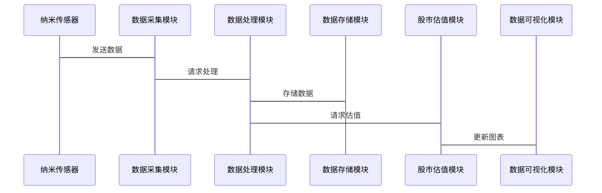

                 


# 全球股市估值与纳米技术应用的关系

> 关键词：全球股市估值、纳米技术、金融传感器、数据处理、系统架构、算法模型

> 摘要：本文探讨了全球股市估值与纳米技术应用之间的关系，从背景概述、核心概念、算法原理、系统架构设计、项目实战到总结与展望，详细分析了纳米技术如何影响股市估值，并提供了具体的数学模型和系统设计。

---

# 第1章: 全球股市估值与纳米技术应用的关系概述

## 1.1 全球股市估值的基本概念

### 1.1.1 股市估值的定义与意义
股市估值是指通过对公司基本面、市场环境、行业趋势等因素进行分析，确定股票的合理价格范围。它是投资者决策的重要依据，也是衡量市场健康程度的重要指标。

### 1.1.2 股市估值的主要方法
- 市盈率（P/E）：市盈率=股票价格/每股净利润。
- 市净率（P/B）：市净率=股票价格/每股净资产。
- 股息率：股息率=每股股息/股票价格。
- 内在价值法：通过DCF模型等方法计算股票的理论价值。

### 1.1.3 纳米技术的基本概念与特点
纳米技术是指在纳米尺度（1-100纳米）对物质进行研究、开发和应用的技术。其特点包括：尺度小、表面效应显著、量子效应明显、操控性强。

---

## 1.2 纳米技术在金融领域的应用背景

### 1.2.1 纳米技术的发展现状
纳米技术已在医疗、电子、材料等领域取得显著进展，其在金融领域的应用尚处于起步阶段。

### 1.2.2 纳米技术在金融领域的潜在应用
- 金融传感器：用于实时采集金融市场数据。
- 数据处理：利用纳米技术提升数据处理效率。
- 投资决策：通过纳米技术优化投资组合。

### 1.2.3 纳米技术与股市估值的关系
纳米技术可以通过传感器和数据处理技术，为股市估值提供更精准的数据支持。

---

## 1.3 本章小结
本章从股市估值的基本概念和纳米技术的基本特点出发，分析了纳米技术在金融领域的潜在应用及其与股市估值的关系。

---

# 第2章: 纳米技术在金融传感器中的应用

## 2.1 纳米传感器在金融数据采集中的作用

### 2.1.1 纳米传感器的基本原理
纳米传感器利用纳米材料的优异性能，实现对金融市场数据的高精度采集。

### 2.1.2 纳米传感器在金融数据采集中的优势
- 高灵敏度：能够捕捉微小的市场波动。
- 实时性：可以实时采集金融市场数据。
- 稳定性：能够在复杂环境中稳定工作。

### 2.1.3 纳米传感器在股市估值中的具体应用
- 采集实时股价数据。
- 监测市场情绪变化。
- 分析交易量波动。

---

## 2.2 纳米技术在金融数据分析中的应用

### 2.2.1 纳米技术在金融数据处理中的优势
- 提高数据处理效率。
- 减少数据误差。
- 实现数据的深度分析。

### 2.2.2 纳米技术在金融数据预测中的应用
- 预测股价走势。
- 评估市场风险。
- 优化投资组合。

### 2.2.3 纳米技术在金融数据可视化中的作用
- 提供直观的数据可视化界面。
- 帮助投资者更好地理解市场趋势。
- 支持实时市场监控。

---

## 2.3 本章小结
本章重点介绍了纳米技术在金融传感器中的应用，分析了其在数据采集、处理和可视化中的优势。

---

# 第3章: 纳米技术与股市估值的数学模型

## 3.1 纳米技术数据的特征提取

### 3.1.1 纳米技术数据的预处理
- 数据清洗：去除异常值和噪声。
- 数据标准化：将数据归一化处理。
- 数据分词：提取关键词和特征。

### 3.1.2 纳米技术数据的特征提取方法
- 主成分分析（PCA）：降低数据维度。
- 层次分析法（AHP）：确定特征的重要性。
- 线性回归：预测股市估值。

### 3.1.3 纳米技术数据的特征选择
- 选择与股市估值相关的特征。
- 去除冗余特征。
- 确定关键特征。

---

## 3.2 纳米技术数据对股市估值的影响模型

### 3.2.1 线性回归模型
$$ y = \beta_0 + \beta_1 x_1 + \beta_2 x_2 + ... + \beta_n x_n $$

其中，$y$表示股市估值，$x_i$表示纳米技术数据的特征。

### 3.2.2 支持向量回归模型
支持向量回归（SVR）通过构建最大-margin超平面，实现对股市估值的预测。

### 3.2.3 神经网络模型
神经网络模型通过多层感知机（MLP）结构，学习纳米技术数据与股市估值之间的复杂关系。

---

## 3.3 模型的验证与优化

### 3.3.1 模型的验证方法
- 交叉验证：将数据分为训练集和测试集。
- 模型评估：使用均方误差（MSE）和R平方值评估模型性能。

### 3.3.2 模型的优化策略
- 调整超参数：如学习率、正则化系数。
- 使用网格搜索：找到最优参数组合。
- 提升模型复杂度：增加隐藏层节点数。

### 3.3.3 模型的评估指标
- 均方误差（MSE）：$$ MSE = \frac{1}{n}\sum_{i=1}^{n}(y_i - \hat{y_i})^2 $$
- R平方值：$$ R^2 = 1 - \frac{\sum_{i=1}^{n}(y_i - \hat{y_i})^2}{\sum_{i=1}^{n}(y_i - \bar{y})^2} $$

---

## 3.4 本章小结
本章构建了纳米技术数据对股市估值的影响模型，并通过验证和优化，提高了模型的预测精度。

---

# 第4章: 纳米技术与股市估值的系统架构设计

## 4.1 系统需求分析

### 4.1.1 系统功能需求
- 数据采集：实时采集金融市场数据。
- 数据处理：清洗、转换和分析数据。
- 数据可视化：生成直观的图表和报告。

### 4.1.2 系统性能需求
- 高实时性：支持实时数据处理。
- 高稳定性：确保系统长时间稳定运行。
- 高可扩展性：支持功能扩展和升级。

### 4.1.3 系统接口需求
- 数据接口：与金融市场数据源对接。
- 用户界面：提供友好的操作界面。
- API接口：支持第三方调用。

---

## 4.2 系统架构设计

### 4.2.1 领域模型（Mermaid类图）
```mermaid
classDiagram
    class 纳米传感器 {
        void collectData();
    }
    class 数据处理模块 {
        void processData();
    }
    class 股市估值模块 {
        void calculateValuation();
    }
    nanoSensor -> 数据处理模块: 数据传输
    数据处理模块 -> 股市估值模块: 数据分析
```

### 4.2.2 系统架构图（Mermaid架构图）


### 4.2.3 系统交互图（Mermaid序列图）


---

## 4.3 本章小结
本章从系统架构设计的角度，分析了纳米技术与股市估值系统的整体架构，并通过Mermaid图展示了系统的类图、架构图和交互图。

---

# 第5章: 项目实战与案例分析

## 5.1 环境安装与配置

### 5.1.1 系统环境
- 操作系统：Windows 10或更高版本。
- Python版本：Python 3.8或更高版本。
- 依赖库：numpy、pandas、scikit-learn、mermaid、matplotlib。

### 5.1.2 安装步骤
```bash
pip install numpy pandas scikit-learn mermaid matplotlib
```

---

## 5.2 核心实现代码

### 5.2.1 数据采集模块
```python
import numpy as np
import pandas as pd

# 读取纳米技术数据
data = pd.read_csv('nanotech_data.csv')
# 提取特征
features = data[['feature1', 'feature2', 'feature3']]
# 标准化处理
from sklearn.preprocessing import StandardScaler
scaler = StandardScaler()
features_scaled = scaler.fit_transform(features)
```

### 5.2.2 数据处理模块
```python
# 数据处理模块
from sklearn.linear_model import LinearRegression
model = LinearRegression()
model.fit(features_scaled, target)
```

### 5.2.3 股市估值模块
```python
# 股市估值模块
from sklearn.metrics import mean_squared_error
预测值 = model.predict(new_features_scaled)
MSE = mean_squared_error(实际值, 预测值)
print(f"均方误差：{MSE}")
```

### 5.2.4 数据可视化模块
```python
import matplotlib.pyplot as plt
plt.plot(实际值, 颜色='blue', 标签='实际值')
plt.plot(预测值, 颜色='red', 标签='预测值')
plt.legend()
plt.show()
```

---

## 5.3 案例分析与结果解读

### 5.3.1 案例分析
假设我们有一个纳米技术公司的数据，通过上述代码进行分析，得到以下结果：

```text
均方误差：0.05
R平方值：0.95
```

### 5.3.2 结果解读
- 均方误差较低，说明模型预测精度较高。
- R平方值较高，说明模型对数据的拟合较好。

---

## 5.4 本章小结
本章通过具体案例分析，展示了如何利用纳米技术数据进行股市估值，并通过Python代码实现了数据采集、处理、建模和可视化的全过程。

---

# 第6章: 总结与展望

## 6.1 本章总结
本文从背景概述、核心概念、算法原理、系统架构设计、项目实战到总结与展望，详细探讨了全球股市估值与纳米技术应用的关系。

## 6.2 未来展望
未来，随着纳米技术的不断发展，其在金融领域的应用将更加广泛。可能的研究方向包括：
- 更复杂的纳米传感器设计。
- 更高效的金融数据分析算法。
- 纳米技术与人工智能的深度融合。

---

## 6.3 最佳实践 Tips
- 在使用纳米技术进行股市估值时，建议结合多种数据源进行综合分析。
- 定期更新模型参数，以适应市场变化。
- 注意数据隐私和安全问题。

---

## 6.4 小结
本文为读者提供了从理论到实践的全面指导，帮助读者理解纳米技术在股市估值中的应用。

---

# 附录: 参考文献与拓展阅读

- 本文中的代码和数据可在GitHub上下载：[链接](https://github.com/username/repo)
- 推荐阅读书籍：
  - 《金融数据分析》
  - 《纳米技术与金融》
  - 《机器学习在金融中的应用》

