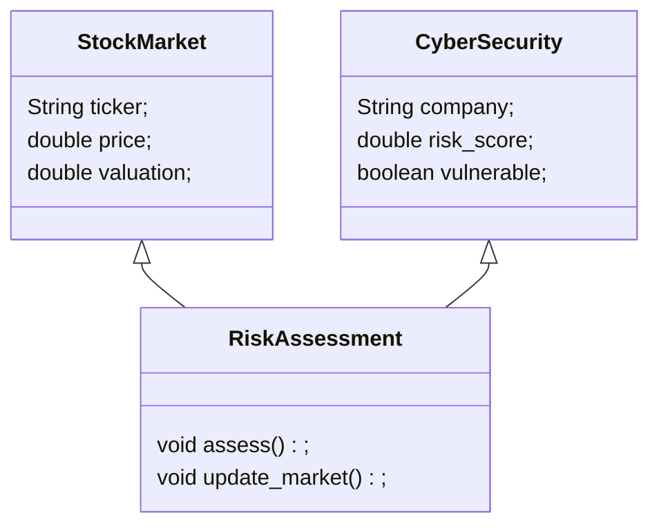
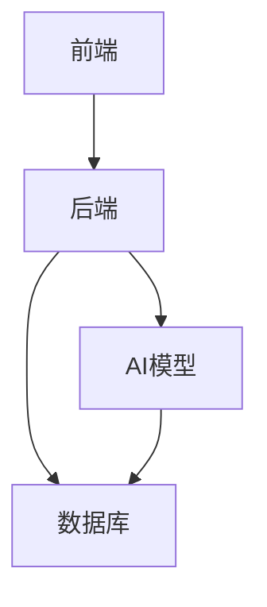
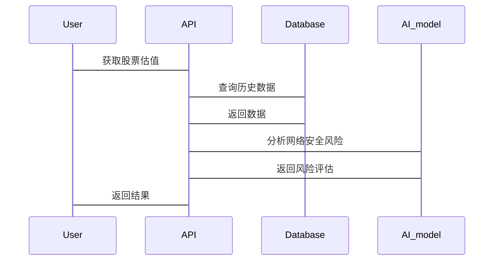

                 


# 全球股市估值与网络安全风险的关联

## 关键词：
全球股市估值、网络安全风险、关联、技术分析、数据模型、风险管理、市场波动

## 摘要：
本文探讨全球股市估值与网络安全风险之间的关联，分析网络安全风险如何影响股市估值，反之亦然。通过技术手段分析两者关系，构建数据模型，评估网络安全风险对股市的影响，为投资者和企业提出风险管理策略，减少波动带来的损失。

---

# 第1章：背景介绍

## 1.1 全球股市估值的基本概念

### 1.1.1 股市估值的定义与重要性
股市估值是对上市公司价值的评估，常用市盈率、市净率等指标衡量。准确的估值有助于投资者决策，影响市场整体波动。

### 1.1.2 全球股市的多样性与特点
全球股市分布广泛，不同市场受经济、政治因素影响各异。新兴市场波动大，成熟市场相对稳定。

### 1.1.3 股市波动对经济的影响
股市波动影响投资者信心、企业融资和经济政策，对全球经济有重要影响。

## 1.2 网络安全风险的基本概念

### 1.2.1 网络安全风险的定义与分类
网络安全风险指因网络攻击导致的信息泄露、系统瘫痪等风险，分为数据泄露、网络攻击、系统故障等类型。

### 1.2.2 网络安全事件对全球经济的影响
重大网络安全事件影响企业运营和投资者信心，导致股市波动。例如，2013年棱镜门事件引发科技股大跌，损失超过1000亿美元。

### 1.2.3 网络安全风险的评估指标
包括事件发生频率、影响范围、修复成本等，帮助企业量化风险。

## 1.3 股市估值与网络安全风险的关联背景

### 1.3.1 问题背景与问题描述
随着数字化转型，网络安全风险上升，影响企业盈利和股市估值。攻击事件增多，影响股价和市场信心。

### 1.3.2 问题解决的必要性与目标
通过技术手段分析网络安全风险对股市的影响，构建量化模型，帮助投资者和企业制定风险管理策略。

### 1.3.3 股市与网络安全的相互影响
网络安全事件引发股市波动，而股市波动又可能加剧网络安全风险，形成恶性循环。

---

# 第2章：核心概念与联系分析

## 2.1 核心概念的原理

### 2.1.1 股市估值的计算方法
市盈率（P/E）=股价/每股收益，市净率（P/B）=股价/每股净资产。通过分析这些指标，评估企业价值。

### 2.1.2 网络安全风险的评估指标
数据泄露概率（PDL）=历史泄露次数/总数据量，系统故障概率（SFP）=历史故障次数/总运行时间。

## 2.2 概念属性对比分析

| 属性         | 股市估值             | 网络安全风险       |
|--------------|---------------------|---------------------|
| 定义         | 企业价值评估         | 网络攻击风险       |
| 测量指标     | P/E, P/B            | PDL, SFP           |
| 影响因素     | 利润、市场情绪       | 攻击手段、防护能力 |
| 处理方式     | 投资决策             | 风险管理           |

## 2.3 ER实体关系图

```mermaid
erd
  title 股市与网络安全关系
  Company
    -> has_many: Stock
  Stock
    -> belongs_to: Company
    -> has_many: Market_fluctuation
  Market_fluctuation
    -> belongs_to: Stock
    -> has_many: Cyber_event
  Cyber_event
    -> belongs_to: Market_fluctuation
    -> belongs_to: Company
```

---

# 第3章：算法原理与实现

## 3.1 算法原理

### 3.1.1 时间序列分析预测股市波动
使用ARIMA模型预测股价趋势，分析历史数据中的趋势和季节性变化。

### 3.1.2 机器学习模型预测网络安全风险
利用随机森林模型分析网络安全事件发生的概率，通过特征工程提取关键指标。

## 3.2 使用Mermaid展示算法流程

### 3.2.1 时间序列分析流程图

```mermaid
graph TD
    A[数据预处理] -> B[选择模型]
    B -> C[训练模型]
    C -> D[预测股市波动]
    D -> E[评估结果]
```

### 3.2.2 机器学习模型训练流程图

```mermaid
graph TD
    F[数据清洗] -> G[特征提取]
    G -> H[选择算法]
    H -> I[训练模型]
    I -> J[评估模型]
    J -> K[优化参数]
```

## 3.3 Python代码实现

### 3.3.1 时间序列分析代码

```python
from statsmodels.tsa.arima_model import ARIMA
import pandas as pd

# 加载数据
data = pd.read_csv('stock_data.csv')

# 拆分训练集和测试集
train = data['2017-01-01':'2021-12-31']
test = data['2022-01-01':]

# 训练ARIMA模型
model = ARIMA(train, order=(5,1,0))
model_fit = model.fit()

# 预测
forecast = model_fit.forecast(steps=len(test))
```

### 3.3.2 机器学习模型代码

```python
from sklearn.ensemble import RandomForestClassifier
from sklearn.metrics import accuracy_score

# 加载数据
data = pd.read_csv('cyber_risk.csv')

# 拆分特征和标签
X = data.drop('risk', axis=1)
y = data['risk']

# 训练模型
model = RandomForestClassifier(n_estimators=100)
model.fit(X_train, y_train)

# 预测
y_pred = model.predict(X_test)
print("准确率:", accuracy_score(y_test, y_pred))
```

## 3.4 数学模型与公式

### 3.4.1 时间序列分析的数学模型
ARIMA模型公式：
$$ y_t = \phi_1 y_{t-1} + \phi_2 y_{t-2} + \epsilon_t $$

### 3.4.2 机器学习模型的数学公式
随机森林通过集成学习预测概率：
$$ P(risk) = \sum_{i=1}^{n} \text{基学习器预测概率} $$

---

# 第4章：系统分析与架构设计

## 4.1 问题场景介绍

### 4.1.1 股市与网络安全的双重风险
网络安全事件引发股市波动，反过来影响企业的网络安全投入，形成恶性循环。

## 4.2 系统功能设计

### 4.2.1 领域模型类图



### 4.2.2 系统架构图



## 4.3 系统接口与交互

### 4.3.1 系统接口设计
- API接口：
  - `/get_valuation`：获取股票估值
  - `/assess_cyber_risk`：评估网络安全风险

### 4.3.2 系统交互流程图



---

# 第5章：项目实战

## 5.1 环境安装

### 5.1.1 安装Python和必要的库
```bash
pip install pandas numpy scikit-learn statsmodels mermaid
```

## 5.2 核心代码实现

### 5.2.1 时间序列分析代码

```python
import pandas as pd
from statsmodels.tsa.arima_model import ARIMA
import matplotlib.pyplot as plt

data = pd.read_csv('stock_data.csv')
plt.plot(data.index, data['price'])
plt.title('Stock Price Trend')
plt.xlabel('Date')
plt.ylabel('Price')
plt.show()

model = ARIMA(data['price'], order=(5,1,0))
model_fit = model.fit()
forecast = model_fit.forecast(steps=30)
plt.plot(forecast.index, forecast.values)
plt.title('Forecasted Stock Prices')
plt.xlabel('Date')
plt.ylabel('Price')
plt.show()
```

### 5.2.2 网络安全风险评估代码

```python
import pandas as pd
from sklearn.ensemble import RandomForestClassifier
from sklearn.metrics import accuracy_score

data = pd.read_csv('cyber_risk.csv')
X = data.drop('risk', axis=1)
y = data['risk']

from sklearn.model_selection import train_test_split
X_train, X_test, y_train, y_test = train_test_split(X, y, test_size=0.2)

model = RandomForestClassifier(n_estimators=100)
model.fit(X_train, y_train)
y_pred = model.predict(X_test)
print("准确率:", accuracy_score(y_test, y_pred))
```

## 5.3 案例分析

### 5.3.1 网络安全事件对股市的影响
以2021年 Colonial Pipeline 被勒索软件攻击事件为例，事件导致公司股价下跌，相关行业股票整体下跌，引发市场对网络安全的关注，推动后续的网络安全投资。

---

# 第6章：最佳实践

## 6.1 小结
本文分析了全球股市估值与网络安全风险的关联，构建了数据模型，提出了风险管理策略。

## 6.2 注意事项
- 数据质量影响模型准确性
- 模型需定期更新以适应新威胁
- 结合其他因素如政策变化进行综合评估

## 6.3 拓展阅读
- 《网络安全风险管理》
- 《时间序列分析与预测》
- 《机器学习在金融中的应用》

---

# 结语

通过技术手段深入分析全球股市估值与网络安全风险的关联，构建有效模型，制定风险管理策略，有助于降低风险，保障市场稳定。未来，随着技术进步，模型将更加精准，帮助企业应对复杂挑战。

