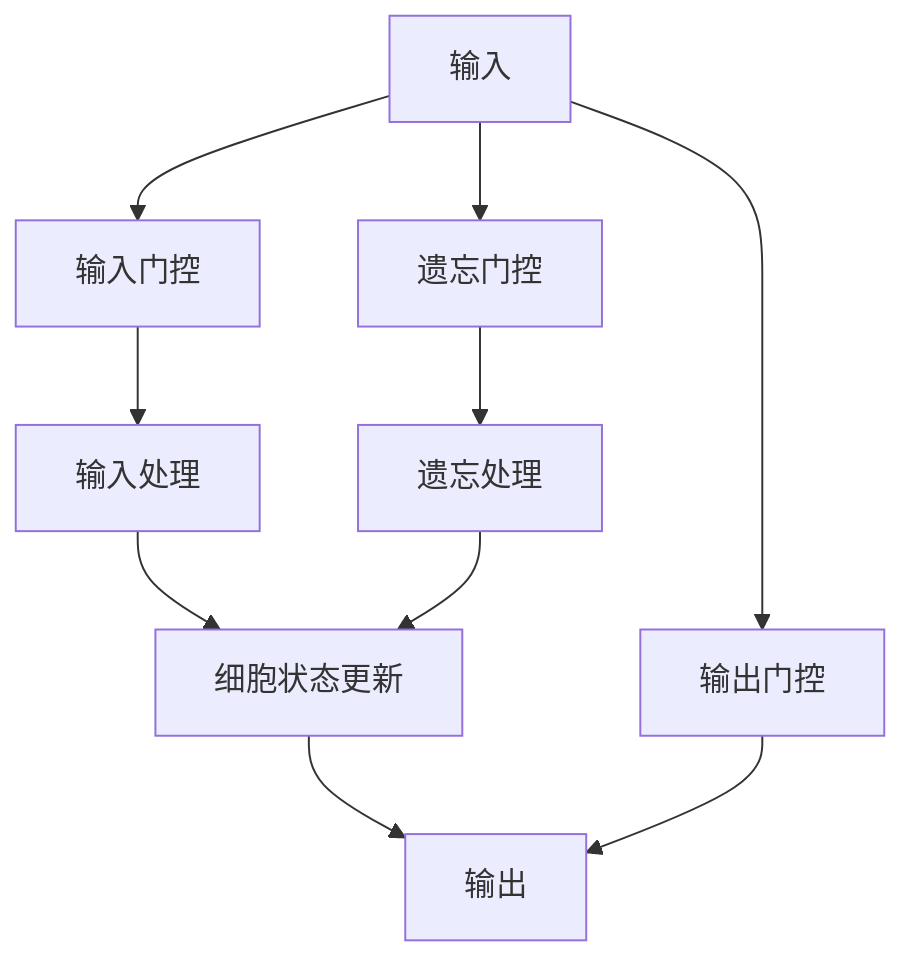
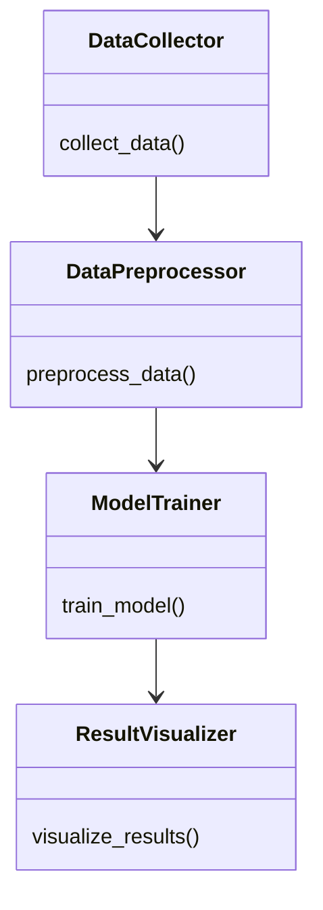
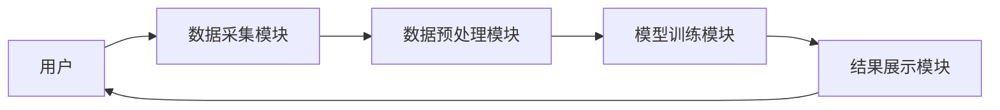

                 


# 全球股市估值与脑机接口在认知增强中的应用

---

## 关键词：
全球股市估值、脑机接口、认知增强、时间序列分析、机器学习、系统架构设计

---

## 摘要：
本文探讨了全球股市估值与脑机接口在认知增强中的应用，从股市估值的核心指标与算法到脑机接口技术的基本原理与实际应用，再到两者的结合与未来展望，深入分析了如何利用技术手段提升股市分析能力与人类认知水平。

---

# 第一部分: 全球股市估值基础

## 第1章: 全球股市估值概述

### 1.1 股市估值的基本概念

#### 1.1.1 股市估值的定义与意义
股市估值是通过对公司财务数据、市场环境等多方面因素进行分析，评估公司股票的合理价格区间。其意义在于帮助投资者做出理性决策，避免盲目跟风。

#### 1.1.2 股市估值的核心指标
- **市盈率（P/E）**：市盈率=股价/每股收益，衡量股票价格是否被高估或低估。
- **市净率（P/B）**：市净率=股价/每股净资产，反映股票相对于其资产价值的高低。
- **股息率（Dividend Yield）**：股息率=每股股息/股价，衡量股票的投资回报率。

#### 1.1.3 股市估值的分类与特点
股市估值可分为绝对估值和相对估值。绝对估值基于公司未来现金流折现，相对估值则通过比较同类公司进行评估。

### 1.2 股市估值的背景与现状

#### 1.2.1 全球股市的现状分析
近年来，全球股市波动加剧，技术进步和经济政策变化对股市估值提出了新的挑战。

#### 1.2.2 股市估值技术的发展历程
从传统的基本面分析到现代的机器学习算法，股市估值技术不断演进。

#### 1.2.3 当前股市估值的主要挑战
数据量爆炸、市场波动性增加、算法复杂性提升等。

---

## 第2章: 股市估值的核心指标与模型

### 2.1 股市估值的关键指标

#### 2.1.1 市盈率（P/E）
市盈率=股价/每股收益。例如，某公司股价为50元，每股收益为5元，则市盈率为10倍。

#### 2.1.2 市净率（P/B）
市净率=股价/每股净资产。例如，某公司股价为30元，每股净资产为10元，则市净率为3倍。

#### 2.1.3 股息率（Dividend Yield）
股息率=每股股息/股价。例如，某公司每股股息为2元，股价为20元，则股息率为10%。

### 2.2 股市估值模型

#### 2.2.1 市盈率模型
市盈率模型基于P/E指标，适用于盈利稳定的公司。

#### 2.2.2 现金流量折现模型（DCF）
DCF模型通过预测未来现金流并贴现至现值，评估公司内在价值。

#### 2.2.3 市净率模型
市净率模型适用于资产-heavy的公司，如银行和制造业。

---

## 第3章: 股市估值的算法与实现

### 3.1 时间序列分析

#### 3.1.1 时间序列的基本概念
时间序列是按时间顺序排列的数据，常见于股票价格、经济指标等。

#### 3.1.2 ARIMA模型的原理与实现
ARIMA（Autoregressive Integrated Moving Average）模型通过自回归和移动平均部分拟合时间序列数据。

**ARIMA模型公式：**
$$ ARIMA(p, d, q) $$
其中，p为自回归阶数，d为差分阶数，q为移动平均阶数。

**ARIMA实现代码示例：**
```python
from statsmodels.tsa.arima_model import ARIMA
data = [1, 2, 3, 4, 5]  # 示例数据
model = ARIMA(data, order=(1, 1, 1))
model_fit = model.fit()
```

#### 3.1.3 LSTM在时间序列预测中的应用
LSTM（长短期记忆网络）通过细胞状态和门控机制捕捉长期依赖关系，适用于复杂时间序列预测。

**LSTM结构示意图：**


### 3.2 机器学习在股市估值中的应用

#### 3.2.1 支持向量回归（SVR）
SVR通过在高维空间中构建超平面，实现非线性回归。

**SVR实现代码示例：**
```python
from sklearn.svm import SVR
X = [[x] for x in range(10)]  # 示例数据
y = [x**2 for x in range(10)]
model = SVR(kernel='rbf')
model.fit(X, y)
```

#### 3.2.2 随机森林回归
随机森林通过集成学习提高模型鲁棒性，适用于高维数据特征提取。

**随机森林实现代码示例：**
```python
from sklearn.ensemble import RandomForestRegressor
X = [[x] for x in range(10)]
y = [x**2 for x in range(10)]
model = RandomForestRegressor(n_estimators=10)
model.fit(X, y)
```

#### 3.2.3 XGBoost在股市预测中的应用
XGBoost通过正则化和提升算法，优化模型泛化能力。

**XGBoost实现代码示例：**
```python
import xgboost as xgb
X = [[x] for x in range(10)]
y = [x**2 for x in range(10)]
model = xgb.XGBRegressor()
model.fit(X, y)
```

---

## 第4章: 股市估值系统的架构设计

### 4.1 系统功能设计

#### 4.1.1 数据采集模块
负责收集股票价格、财务数据等。

#### 4.1.2 数据预处理模块
清洗数据，处理缺失值和异常值。

#### 4.1.3 模型训练模块
基于预处理数据，训练时间序列模型或机器学习模型。

#### 4.1.4 结果展示模块
将模型预测结果以可视化形式展示。

### 4.2 系统架构设计

#### 4.2.1 系统功能模块的类图


#### 4.2.2 系统整体架构图


---

## 第二部分: 脑机接口在认知增强中的应用

## 第5章: 脑机接口技术基础

### 5.1 脑机接口的基本概念

#### 5.1.1 脑机接口的定义与分类
脑机接口（BCI）是连接人脑与外部设备的接口，按类型可分为侵入式和非侵入式。

#### 5.1.2 脑机接口的工作原理
通过采集脑电信号（EEG），分析并提取有用信息，控制外部设备。

### 5.2 脑机接口的核心技术

#### 5.2.1 脑电信号采集
使用EEG电极采集大脑皮层的电信号。

#### 5.2.2 脑电信号处理
通过滤波、特征提取等方法处理信号，提取有用信息。

#### 5.2.3 信号分类与控制
基于机器学习算法，分类信号并控制外部设备。

---

## 第6章: 脑机接口在认知增强中的应用

### 6.1 注意力监测与增强

#### 6.1.1 注意力监测的基本原理
通过EEG信号分析，监测用户的注意力水平。

#### 6.1.2 注意力增强的实现方法
通过反馈训练，提升用户的注意力集中能力。

### 6.2 情绪识别与调节

#### 6.2.1 情绪识别的基本原理
通过分析EEG信号中的情绪特征，识别用户情绪状态。

#### 6.2.2 情绪调节的实现方法
结合反馈机制，调节用户情绪状态，提升认知能力。

---

## 第7章: 脑机接口与股市估值的结合

### 7.1 数据融合与分析

#### 7.1.1 脑机接口数据与股市数据的融合
将用户的注意力和情绪数据与股市数据结合，提升预测准确性。

#### 7.1.2 联合分析方法
通过多模态数据融合，提升模型的预测能力。

### 7.2 应用案例分析

#### 7.2.1 注意力驱动的股市预测
基于用户的注意力状态，优化股市预测模型。

#### 7.2.2 情绪影响的交易策略
根据用户情绪变化，制定动态交易策略。

---

## 总结与展望

全球股市估值与脑机接口在认知增强中的应用，体现了技术与人类认知的深度融合。未来，随着技术进步，脑机接口将为股市分析提供新的视角，帮助投资者做出更明智的决策。

---

通过以上内容，我们可以看到，技术与人类认知的结合将推动股市估值与脑机接口领域的进一步发展，为投资者和科技行业带来新的机遇与挑战。

