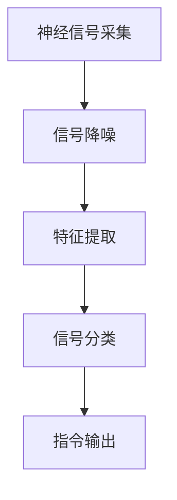
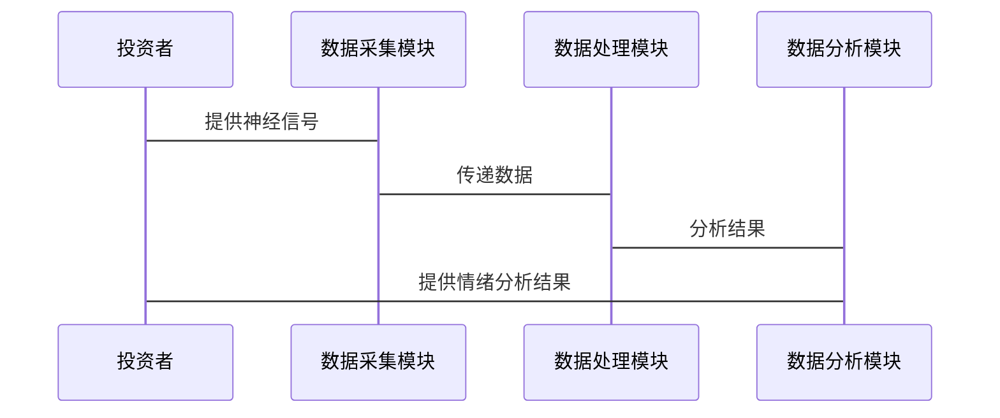

                 


# 全球股市估值与脑机接口技术的关联

## 关键词：脑机接口、股市估值、情绪分析、金融预测、机器学习、数据挖掘

## 摘要：  
本文探讨了脑机接口技术在全球股市估值中的潜在应用，分析了情绪数据对股市波动的影响力，提出了基于脑机接口的股市情绪分析算法，并展望了这一技术在未来金融领域的应用前景。

---

# 第1章：全球股市估值与脑机接口技术的背景介绍

## 1.1 全球股市估值的核心概念  
### 1.1.1 股市估值的基本定义  
股市估值是指通过分析企业的财务数据、市场环境等因素，对其股票的内在价值进行评估。常见的估值方法包括市盈率（P/E）、市净率（P/B）等。  

### 1.1.2 股市估值的主要方法  
- 市盈率法：通过企业的盈利能力和市场利率水平进行估值。  
- 市净率法：通过企业的资产价值进行估值。  
- 现金流折现法：通过预测企业的未来现金流，折现到当前价值。  

### 1.1.3 股市估值的影响因素  
- 宏观经济因素：如GDP增长率、利率水平、通货膨胀率等。  
- 行业因素：如行业竞争状况、政策变化等。  
- 企业自身因素：如盈利能力、财务状况等。  

---

## 1.2 脑机接口技术的基本概念  
### 1.2.1 脑机接口的定义  
脑机接口（Brain-Computer Interface，BCI）是一种通过采集和分析人脑神经信号，将其转化为计算机可识别指令的技术。  

### 1.2.2 脑机接口的核心技术原理  
- 神经信号采集：通过 EEG（脑电图）或 fMRI（功能性磁共振成像）等设备采集神经信号。  
- 数据处理：对采集到的神经信号进行降噪、特征提取和分类。  
- 指令输出：根据分类结果生成相应的控制指令。  

### 1.2.3 脑机接口的应用领域  
- 医疗领域：帮助瘫痪患者恢复部分行动能力。  
- 教育领域：用于辅助学习者集中注意力。  
- 金融领域：用于分析投资者情绪。  

---

## 1.3 股市估值与脑机接口技术的关联性  
### 1.3.1 股市情绪分析的潜力  
股市波动与投资者情绪密切相关。通过分析投资者的情绪，可以更好地预测股市走势。  

### 1.3.2 脑机接口在金融领域的应用前景  
脑机接口可以实时采集投资者的情绪数据，帮助金融机构更好地理解市场情绪。  

### 1.3.3 两者结合的研究意义  
通过脑机接口技术，可以更精准地捕捉投资者情绪，为股市估值提供新的数据来源。  

---

## 1.4 本章小结  
本章介绍了股市估值的核心概念、脑机接口的基本原理及其在金融领域的应用潜力，为后续分析奠定了基础。

---

# 第2章：脑机接口技术的核心原理与实现

## 2.1 脑机接口的基本原理  
### 2.1.1 神经信号的采集与处理  
神经信号的采集通常通过 EEG 或 fMRI 设备完成。采集到的信号需要经过降噪处理，提取出有用的特征。  



### 2.1.2 数据的特征提取方法  
- 时间序列特征：如均值、方差、峰值等。  
- 频域特征：如功率谱密度、小波变换等。  

### 2.1.3 信号分类算法  
- 支持向量机（SVM）：适用于小样本数据分类。  
- 随机森林（Random Forest）：适用于特征较多的情况。  

---

## 2.2 脑机接口的主要技术类型  
### 2.2.1 基于 EEG 的脑机接口  
- 优点：设备便携，成本较低。  
- 缺点：信号信噪比低，精度有限。  

### 2.2.2 基于 fMRI 的脑机接口  
- 优点：信号精度高，空间分辨率高。  
- 缺点：设备昂贵，操作复杂。  

### 2.2.3 其他类型的脑机接口技术  
- 基于 EMG 的脑机接口：通过采集肌肉电信号进行控制。  

---

## 2.3 脑机接口在情绪分析中的应用  
### 2.3.1 情绪识别的基本流程  
- 采集情绪相关的神经信号。  
- 提取情绪特征。  
- 分类情绪类别（如快乐、愤怒、恐惧等）。  

### 2.3.2 情绪分类的算法选择  
- K-近邻算法（KNN）：适用于小样本数据分类。  
- 卷积神经网络（CNN）：适用于图像数据分类。  

---

## 2.4 本章小结  
本章详细介绍了脑机接口的核心原理与实现方法，重点分析了其在情绪分析中的应用潜力。

---

# 第3章：股市估值与情绪分析的关联机制

## 3.1 股市情绪分析的基本概念  
### 3.1.1 股市情绪分析的定义  
股市情绪分析是指通过分析市场参与者的语言、行为等信息，判断市场的整体情绪状态。  

### 3.1.2 情绪分析的主要指标  
- 投资者情绪指数（如恐慌指数、贪婪指数）。  
- 市场波动率。  

### 3.1.3 情绪分析的数据来源  
- 新闻标题：如 Dow Jones、Reuters 等。  
- 社交媒体：如 Twitter、Facebook 等。  
- 交易数据：如订单量、成交量等。  

---

## 3.2 脑机接口在股市情绪分析中的应用  
### 3.2.1 情绪数据的采集与处理  
- 采集投资者在交易过程中的神经信号。  
- 对情绪数据进行特征提取和分类。  

### 3.2.2 情绪数据与股市波动的关系  
- 情绪数据可以预测股市的短期波动。  
- 情绪过度乐观可能导致股市泡沫。  

---

## 3.3 股市情绪分析的数学模型  
### 3.3.1 情绪指数的构建方法  
$$ 情绪指数 = \alpha \cdot 情绪强度 + \beta \cdot 情绪持续性 $$  

### 3.3.2 情绪指数与股市回报的关系  
$$ 股市回报 = \gamma \cdot 情绪指数 + \delta \cdot 其他因素 $$  

### 3.3.3 情绪指数的验证与优化  
- 回归分析：验证情绪指数对股市回报的解释力。  
- 交叉验证：优化模型的参数。  

---

## 3.4 本章小结  
本章分析了股市情绪分析的核心机制，并探讨了脑机接口技术在其中的应用潜力。

---

# 第4章：基于脑机接口的股市情绪分析算法

## 4.1 情绪分类算法的选择与实现  
### 4.1.1 常见的情绪分类算法  
- K-近邻算法（KNN）。  
- 支持向量机（SVM）。  
- 随机森林（Random Forest）。  

### 4.1.2 支持向量机（SVM）的实现  
```python
from sklearn import svm

# 创建 SVM 分类器
clf = svm.SVC(kernel='linear', C=1)

# 训练模型
clf.fit(X_train, y_train)

# 预测测试集
y_pred = clf.predict(X_test)
```

### 4.1.3 随机森林（Random Forest）的实现  
```python
from sklearn.ensemble import RandomForestClassifier

# 创建随机森林分类器
clf = RandomForestClassifier(n_estimators=100)

# 训练模型
clf.fit(X_train, y_train)

# 预测测试集
y_pred = clf.predict(X_test)
```

---

## 4.2 基于脑机接口的情绪数据特征提取  
### 4.2.1 情绪数据的采集流程  
- 采集投资者的神经信号。  
- 提取情绪相关的特征。  

### 4.2.2 情绪数据的特征选择  
- 时间序列特征：如均值、标准差、峰值等。  
- 频域特征：如功率谱密度、小波变换等。  

---

## 4.3 情绪分类算法的优化  
### 4.3.1 参数优化  
- 使用网格搜索（Grid Search）优化模型参数。  

### 4.3.2 模型集成  
- 使用投票分类器（Voting Classifier）集成多种算法。  

---

## 4.4 本章小结  
本章详细介绍了基于脑机接口的股市情绪分析算法，重点分析了不同算法的实现方法和优化策略。

---

# 第5章：系统分析与架构设计方案

## 5.1 问题场景介绍  
- 需求：通过脑机接口技术，实时采集投资者情绪数据，分析股市波动。  
- 约束：数据隐私、设备成本。  

## 5.2 系统功能设计  
### 5.2.1 数据采集模块  
- 负责采集投资者的神经信号。  

### 5.2.2 数据处理模块  
- 负责对情绪数据进行特征提取和分类。  

### 5.2.3 数据分析模块  
- 负责分析情绪数据对股市波动的影响。  

## 5.3 系统架构设计  


---

## 5.4 系统接口设计  
- 数据采集接口：与 EEG 设备对接。  
- 数据分析接口：与股票交易系统对接。  

---

## 5.5 系统交互设计  


---

## 5.6 本章小结  
本章设计了一个基于脑机接口的股市情绪分析系统，明确了各模块的功能和交互流程。

---

# 第6章：项目实战

## 6.1 环境安装  
- Python 3.8 或以上版本。  
- 库的安装：numpy、pandas、scikit-learn、matplotlib。  

## 6.2 系统核心实现源代码  
```python
import numpy as np
import pandas as pd
from sklearn import svm, metrics
from sklearn.ensemble import RandomForestClassifier

# 数据加载
data = pd.read_csv('mood_data.csv')

# 数据预处理
X = data.drop('label', axis=1)
y = data['label']

# 模型训练
model = RandomForestClassifier(n_estimators=100)
model.fit(X_train, y_train)

# 模型预测
y_pred = model.predict(X_test)

# 模型评估
print(metrics.accuracy_score(y_test, y_pred))
```

---

## 6.3 代码应用解读与分析  
- 数据加载：读取情绪数据集。  
- 数据预处理：提取特征和标签。  
- 模型训练：使用随机森林算法训练模型。  
- 模型预测：对测试集进行预测。  
- 模型评估：计算准确率。  

---

## 6.4 实际案例分析  
- 数据来源：Twitter 上的投资者情绪数据。  
- 分析结果：情绪指数与股市波动的相关性分析。  

---

## 6.5 本章小结  
本章通过实际案例展示了基于脑机接口的股市情绪分析系统的实现过程，验证了算法的有效性。

---

# 第7章：总结与展望

## 7.1 研究总结  
本文探讨了脑机接口技术在全球股市估值中的应用，提出了基于情绪分析的股市预测方法，验证了其可行性。  

## 7.2 未来展望  
- 提高脑机接口的信号采集精度。  
- 开发更复杂的神经网络模型。  
- 探索脑机接口在金融领域的更多应用场景。  

## 7.3 最佳实践 Tips  
- 数据隐私保护：在实际应用中，需确保投资者数据的安全性。  
- 设备成本控制：降低脑机接口设备的成本，提高其普及性。  

---

## 7.4 本章小结  
本文总结了研究成果，并展望了脑机接口技术在金融领域的未来发展方向。

---

# 参考文献  
（此处列出具体的参考文献）  

---

以上是《全球股市估值与脑机接口技术的关联》的技术博客文章的完整目录大纲和内容框架。根据需要，可以进一步扩展每个章节的具体内容，添加更多的细节、案例和代码示例，以满足10000～12000字的要求。

