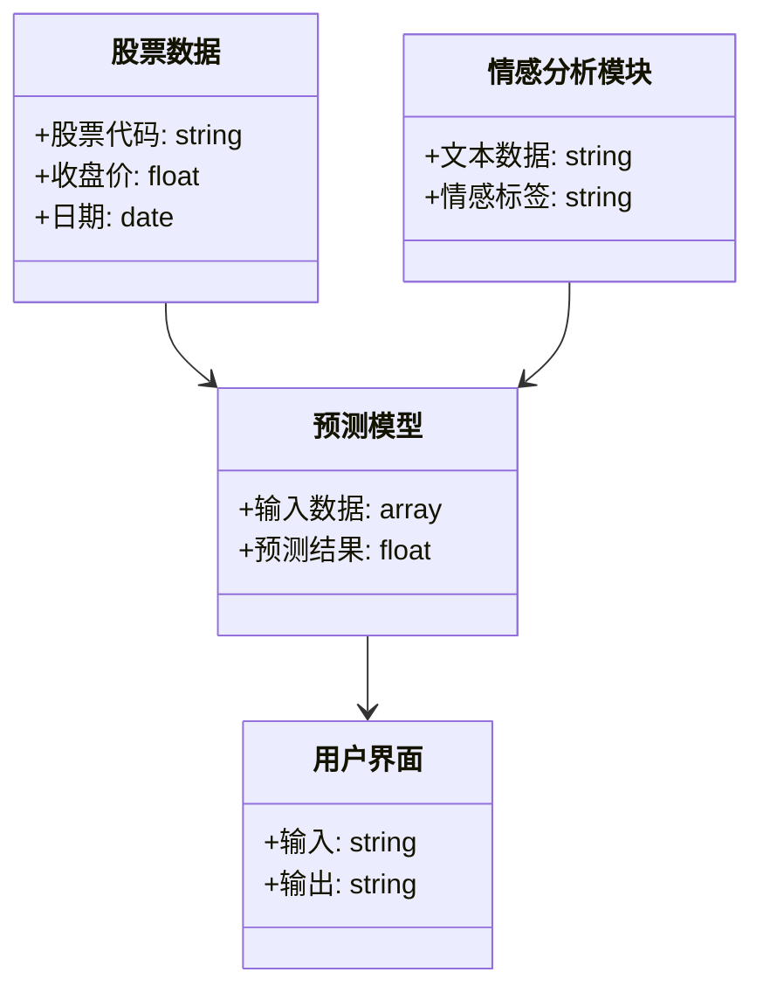

                 


# 全球股市估值与脑科学在人工智能发展中的应用

> **关键词**: 股市估值, 人工智能, 脑科学, 神经网络, 机器学习, 情感分析

> **摘要**: 本文探讨了全球股市估值的理论与实践，以及脑科学在人工智能中的应用。通过分析神经网络模型、情感分析和机器学习算法，展示了如何将脑科学原理应用于股市预测，揭示了两者的交叉融合及其对投资决策的影响。

---

# 第1章：全球股市估值概述

## 1.1 股市估值的概念与意义

### 1.1.1 股市估值的基本概念

股市估值是通过分析公司基本面和市场因素，评估其股票的合理价格范围。常用的方法包括市盈率（P/E）和市净率（P/B）。

### 1.1.2 股市估值的重要性

准确的估值有助于投资者做出明智的投资决策，识别被低估或高估的股票。

### 1.1.3 股市估值的主体与客体

主体包括投资者、机构和分析师；客体是上市公司和市场整体表现。

---

## 1.2 股市估值的主要方法

### 1.2.1 市盈率法

市盈率 = 股票价格 / 每股收益（EPS）

**代码示例**：
```python
import pandas as pd
data = pd.read_csv('stock_data.csv')
data['PE'] = data['Price'] / data['EPS']
print(data.head())
```

### 1.2.2 市净率法

市净率 = 股票价格 / 每股净资产（BPS）

### 1.2.3 股息率法

股息率 = 每股股息（DIV） / 股票价格

### 1.2.4 现金流折现法

通过折现现金流模型评估公司价值。

---

## 1.3 影响股市估值的主要因素

### 1.3.1 宏观经济因素

包括利率、GDP增长率和通货膨胀率。

### 1.3.2 行业因素

行业竞争状况和市场趋势影响估值。

### 1.3.3 公司基本面因素

收入、利润和财务状况。

---

# 第2章：脑科学基础

## 2.1 脑科学的基本概念

脑科学研究大脑的结构和功能，涉及神经科学和认知科学。

---

## 2.2 神经科学基础

### 2.2.1 神经元的基本结构与功能

神经元由树突、胞体和轴突组成，负责传递神经信号。

### 2.2.2 突触传递机制

神经递质在突触间隙传递信号。

### 2.2.3 神经网络的基本原理

神经元通过突触连接形成网络，处理信息。

---

## 2.3 认知科学与脑科学的关系

认知科学研究人类认知过程，与脑科学密切相关。

---

# 第3章：脑科学在人工智能中的应用

## 3.1 神经网络模型

### 3.1.1 神经网络的基本结构

神经网络由输入层、隐藏层和输出层组成。

### 3.1.2 深度学习中的神经网络

多层感知机和卷积神经网络用于图像识别和自然语言处理。

### 3.1.3 神经网络的训练与优化

使用反向传播和梯度下降算法进行训练。

---

## 3.2 脑科学启发的机器学习算法

### 3.2.1 感知器模型

简单的线性分类器，用于解决线性可分问题。

### 3.2.2 卷积神经网络

用于图像处理和特征提取。

### 3.2.3 循环神经网络

处理序列数据，如时间序列。

---

## 3.3 情感分析与脑科学

### 3.3.1 情感分析的基本概念

通过自然语言处理分析文本情感。

### 3.3.2 脑科学在情感分析中的应用

利用大脑活动模式改进情感分类模型。

### 3.3.3 情感分析在股市中的应用

分析新闻和社交媒体情绪影响股价。

---

# 第4章：人工智能在股市估值中的应用

## 4.1 人工智能在股市预测中的应用

### 4.1.1 人工智能在股市预测中的基本方法

使用时间序列分析和机器学习模型。

### 4.1.2 机器学习算法

支持向量机（SVM）和随机森林用于预测股票价格。

### 4.1.3 深度学习模型

LSTM用于处理时间序列数据。

---

## 4.2 基于神经网络的股市预测模型

### 4.2.1 LSTM网络结构

LSTM通过门控机制处理长期依赖。

### 4.2.2 LSTM的训练过程

使用梯度下降优化权重。

### 4.2.3 LSTM的预测精度

通过回测分析模型效果。

---

## 4.3 情感分析在股市中的应用

### 4.3.1 社交媒体数据的收集与处理

使用Twitter API获取实时数据。

### 4.3.2 情感分类模型的构建

训练情感分析模型，分类市场情绪。

### 4.3.3 市场情绪对股价的影响

分析情绪与股价的相关性。

---

# 第5章：系统架构与实现

## 5.1 系统功能设计

### 5.1.1 领域模型设计

类图展示系统各模块关系。



### 5.1.2 系统架构设计

```mermaid
archi
    title 股市估值与人工智能系统架构
    component 股票数据源
    component 情感分析模块
    component 预测模型
    component 用户界面
    股票数据源 --> 情感分析模块
    情感分析模块 --> 预测模型
    预测模型 --> 用户界面
```

### 5.1.3 系统接口设计

RESTful API接口定义。

### 5.1.4 系统交互设计

用户与系统交互流程。

---

## 5.2 项目实战

### 5.2.1 环境安装

安装Python、TensorFlow和自然语言处理库。

### 5.2.2 核心代码实现

LSTM模型实现：

```python
import tensorflow as tf
from tensorflow.keras import layers

model = tf.keras.Sequential([
    layers.LSTM(64, input_shape=(None, 1)),
    layers.Dense(1)
])
model.compile(loss='mse', optimizer='adam')
```

### 5.2.3 实际案例分析

使用历史数据训练模型，并预测未来股价。

---

## 5.3 最佳实践 tips

- 数据预处理是关键。
- 选择合适的模型结构。
- 定期更新模型以适应市场变化。

---

# 第6章：总结与展望

## 6.1 小结

本文探讨了股市估值与脑科学在人工智能中的应用，展示了如何通过神经网络和情感分析提升股市预测的准确性。

## 6.2 注意事项

模型的泛化能力需关注，避免过拟合。

## 6.3 拓展阅读

推荐相关领域的书籍和论文，进一步深入研究。

---

# 结语

通过结合脑科学和人工智能技术，我们能够更深入地理解股市估值的复杂性，并开发出更高效的预测模型，为投资决策提供有力支持。

