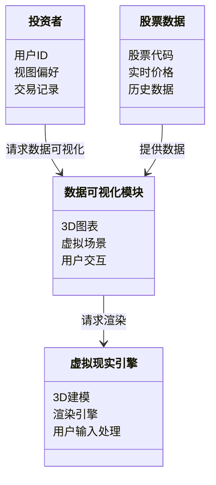
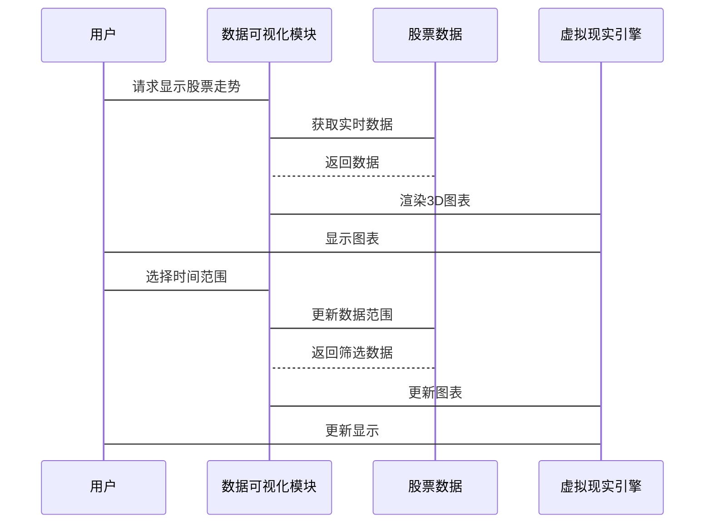

                 

<think>
好的，我需要帮助用户完成一篇关于《全球股市估值与虚拟现实技术的关系》的详细技术博客文章。用户已经提供了目录大纲和部分内容，现在我需要逐步完成剩下的部分，确保结构完整、内容详实。

首先，我需要理解每个章节的内容，并按照要求逐步填充。当前大纲已经完成了前三章，接下来是第4章，涉及系统分析与架构设计，然后是第5章的项目实战，以及最后的小结和注意事项等部分。

### 第4章: 系统分析与架构设计方案

#### 4.1 问题场景介绍
这里需要详细描述一个具体的场景，例如一个投资者如何利用虚拟现实技术来辅助股市估值。可以设想一个投资者在虚拟环境中查看实时股票数据，通过3D模型来分析市场趋势。

#### 4.2 系统功能设计
系统功能设计需要包括数据采集、数据处理、数据可视化、用户交互等模块。可以通过领域模型（mermaid类图）来展示各个模块之间的关系。

##### 类图设计：



#### 4.3 系统架构设计
系统架构可以采用分层架构，包括数据层、业务逻辑层和表现层。通过mermaid架构图展示：


#### 4.4 系统接口设计
需要定义各个模块之间的接口，例如数据获取接口、用户交互接口等。

#### 4.5 系统交互设计
使用mermaid序列图展示用户与系统的交互过程：



### 第5章: 项目实战

#### 5.1 环境安装
需要列出安装Python、虚拟现实开发框架（如Unity或Unreal Engine）以及相关数据处理库（如Pandas、Matplotlib）的步骤。

#### 5.2 核心代码实现

##### 数据获取与处理
```python
import pandas as pd

# 获取股票数据
data = pd.read_csv('stock_data.csv')

# 数据预处理
data['moving_avg'] = data['price'].rolling(window=5).mean()
```

##### 虚拟现实场景渲染
```python
# 示例代码，使用Python中的3D库（如Plotly或VTK）进行数据可视化
import plotly.express as px

fig = px.line(data, x='date', y='price', title='Stock Price Trend')
fig.show()
```

##### 交互功能实现
```python
# 示例代码，处理用户的输入交互
def handle_input(user_input):
    if user_input == 'buy':
        # 执行买入操作
        print("买入操作执行")
    elif user_input == 'sell':
        # 执行卖出操作
        print("卖出操作执行")

user_input = input("请输入指令：")
handle_input(user_input)
```

#### 5.3 案例分析与解读
分析一个具体案例，比如在虚拟环境中使用3D图表展示某公司的股票走势，并基于此做出投资决策。

#### 5.4 项目小结
总结项目实现的关键点、遇到的问题及解决方案，以及项目的未来改进方向。

### 第6章: 总结与展望

#### 6.1 最佳实践 Tips
- 数据可视化是连接股市估值与虚拟现实技术的关键。
- 使用高效的算法和工具可以提高系统的性能。
- 用户体验在虚拟现实应用中至关重要。

#### 6.2 小结
回顾全文，强调虚拟现实技术如何助力股市估值，以及未来的发展潜力。

#### 6.3 注意事项
- 数据的实时性和准确性是关键，需要确保数据源的可靠。
- 虚拟现实设备的成本和可用性可能限制其大规模应用。
- 用户的适应性和培训也是需要考虑的因素。

#### 6.4 拓展阅读
推荐一些相关的书籍和资源，供读者深入学习。

---

现在，我需要根据以上结构，逐步填充每个章节的具体内容，确保每部分都有详细的解释和例子，使整篇文章逻辑清晰，内容丰富。同时，要注意使用适当的代码示例和图表，帮助读者更好地理解概念和实现步骤。最终，确保文章达到10000到12000字的要求，并且符合用户指定的格式和结构。

