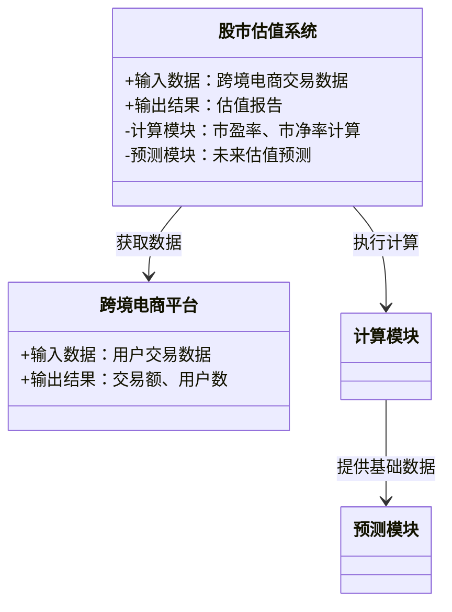

                 


# 全球股市估值与跨境电商发展的关系

> **关键词**：全球股市估值，跨境电商，股市估值模型，跨境电商交易额，金融市场分析，电子商务发展

> **摘要**：本文探讨了全球股市估值与跨境电商发展的关系，分析了跨境电商对股市估值的影响机制，提出了结合跨境电商交易数据的股市估值模型，并通过案例分析验证了模型的有效性。本文还结合系统架构设计和项目实战，详细讲解了如何在实际中应用这些模型和方法。

---

## 目录

1. **背景与概述**  
   1.1 背景与问题背景  
   1.2 核心概念与问题描述  
   1.3 核心概念的结构与联系  

2. **股市估值与跨境电商的核心概念分析**  
   2.1 股市估值的原理与方法  
   2.2 跨境电商的商业模式与特征  
   2.3 股市估值与跨境电商的联系  

3. **股市估值与跨境电商关系的数学模型与公式**  
   3.1 股市估值的数学模型  
   3.2 跨境电商的交易模型  

4. **系统分析与架构设计方案**  
   4.1 问题场景介绍  
   4.2 项目介绍  
   4.3 系统功能设计（领域模型）  
   4.4 系统架构设计  
   4.5 系统接口设计  
   4.6 系统交互设计  

5. **项目实战**  
   5.1 环境安装  
   5.2 系统核心实现源代码  
   5.3 代码应用解读与分析  
   5.4 实际案例分析  
   5.5 项目小结  

6. **结论与展望**  
   6.1 总结  
   6.2 展望  

---

## 第1章：背景与概述

### 1.1 背景与问题背景

随着全球化的深入发展，股市估值与跨境电商之间的关系逐渐成为学术界和实务界关注的热点问题。股市估值是衡量企业价值的重要指标，而跨境电商作为新兴的商业模式，正在对全球经济格局产生深远影响。本文将从这两个领域的相互作用入手，探讨其关系的内在机理。

#### 1.1.1 全球化经济与股市估值的演变
- 全球化经济的兴起推动了跨国公司的发展，使得股市估值不再局限于单一市场。
- 股市估值的核心在于对企业未来现金流的折现，而跨境电商的兴起为企业带来了新的增长点。

#### 1.1.2 跨境电商的兴起与发展趋势
- 跨境电商的快速发展得益于互联网技术的进步和全球物流体系的完善。
- 跨境电商的市场规模不断扩大，成为全球经济增长的重要驱动力。

#### 1.1.3 股市估值与跨境电商关系的提出
- 跨境电商的兴起为企业价值评估带来了新的变量。
- 研究股市估值与跨境电商的关系有助于更好地理解企业价值的变化。

### 1.2 核心概念与问题描述

#### 1.2.1 股市估值的定义与核心要素
- 股市估值是对企业未来现金流的折现，主要通过市盈率（P/E）、市净率（P/B）等指标进行衡量。
- 核心要素包括企业盈利能力、成长性、风险水平等。

#### 1.2.2 跨境电商的定义与核心要素
- 跨境电商是指通过互联网进行的跨国商品交易。
- 核心要素包括平台搭建、支付体系、物流网络等。

#### 1.2.3 问题解决与边界外延
- 本文旨在探讨跨境电商对股市估值的具体影响路径。
- 研究范围限定在上市公司层面，不包括非上市企业。

### 1.3 核心概念的结构与联系

#### 1.3.1 股市估值与跨境电商的关系模型
- 股市估值是跨境电商发展的结果，而跨境电商又通过影响企业业绩反作用于股市估值。

#### 1.3.2 核心要素对比表格
| 核心要素 | 股市估值 | 跨境电商 |
|----------|----------|----------|
| 核心指标 | 市盈率、市净率 | 交易额、用户数 |
| 影响因素 | 盈利能力、成长性 | 平台规模、物流效率 |

#### 1.3.3 ER实体关系图架构
```mermaid
erDiagram
    customer[顾客] 
    seller[卖家]
    platform[跨境电商平台]
    stockMarket[股市]
    valuation[估值指标]

    customer --|> order: 下单
    order --|> platform: 订单处理
    platform --|> seller: 提供商品
    seller --|> stockMarket: 上市公司
    stockMarket --|> valuation: 股市估值
```

---

## 第2章：股市估值与跨境电商的核心概念分析

### 2.1 股市估值的原理与方法

#### 2.1.1 市盈率（P/E）模型
- 市盈率 = 股价 / 每股收益（EPS）
- 用于衡量企业的盈利能力。

#### 2.1.2 市净率（P/B）模型
- 市净率 = 股价 / 每股净资产（BPS）
- 用于衡量企业的资产质量。

#### 2.1.3 股东权益估值法
- 股东权益 = 股东持有的公司净资产价值。

### 2.2 跨境电商的商业模式与特征

#### 2.2.1 跨境电商的主要模式
- B2B（企业对企业）模式
- B2C（企业对消费者）模式
- C2C（消费者对消费者）模式

#### 2.2.2 跨境电商的核心特征
- 全球化覆盖
- 便捷性
- 数据驱动

#### 2.2.3 跨境电商与传统电商的对比
| 特性 | 跨境电商 | 传统电商 |
|------|----------|----------|
| 服务范围 | 全球化 | 地域性 |
| 物流成本 | 较高 | 较低 |
| 支付方式 | 多样化 | 单一化 |

### 2.3 股市估值与跨境电商的联系

#### 2.3.1 跨境电商对股市估值的影响
- 提高企业收入，增强盈利能力，从而提升市盈率。
- 优化资产结构，降低市净率。

#### 2.3.2 股市估值对跨境电商发展的反馈作用
- 高估值意味着市场对跨境电商的未来发展持乐观态度。
- 低估值可能引发企业调整商业模式。

#### 2.3.3 两者的相互关系与协同效应
- 股市估值为跨境电商的发展提供资金支持。
- 跨境电商的发展推动股市估值的提升。

---

## 第3章：股市估值与跨境电商关系的数学模型与公式

### 3.1 股市估值的数学模型

#### 3.1.1 市盈率模型
$$ P = E \times PE $$
其中，$P$ 是股价，$E$ 是每股收益，$PE$ 是市盈率。

#### 3.1.2 市净率模型
$$ P = B \times PB $$
其中，$P$ 是股价，$B$ 是每股净资产，$PB$ 是市净率。

#### 3.1.3 股东权益估值模型
$$ V = \sum_{t=1}^{n} \frac{CF_t}{(1 + r)^t} $$
其中，$V$ 是企业价值，$CF_t$ 是第 $t$ 年的现金流，$r$ 是贴现率。

### 3.2 跨境电商的交易模型

#### 3.2.1 跨境电商交易额计算公式
$$ T = Q \times P $$
其中，$T$ 是交易额，$Q$ 是交易量，$P$ 是平均价格。

#### 3.2.2 跨境电商用户增长模型
$$ U(t) = U(0) \times (1 + g)^t $$
其中，$U(t)$ 是第 $t$ 年的用户数，$U(0)$ 是初始用户数，$g$ 是年增长率。

---

## 第4章：系统分析与架构设计方案

### 4.1 问题场景介绍
- 研究如何利用跨境电商数据优化股市估值模型。
- 分析跨境电商对上市公司的业绩影响。

### 4.2 项目介绍
- 开发一个结合跨境电商数据的股市估值系统。
- 提供实时估值和预测功能。

### 4.3 系统功能设计（领域模型）



### 4.4 系统架构设计

```mermaid
container 容器1 {
    class 股市估值系统 {
        +输入数据：跨境电商交易数据
        +输出结果：估值报告
        -计算模块：市盈率、市净率计算
        -预测模块：未来估值预测
    }
    class 跨境电商平台 {
        +输入数据：用户交易数据
        +输出结果：交易额、用户数
    }
}
```

### 4.5 系统接口设计
- 数据接口：跨境电商平台与股市估值系统之间的数据交互。
- 用户界面：提供实时估值和预测结果的可视化界面。

### 4.6 系统交互设计


---

## 第5章：项目实战

### 5.1 环境安装
- 安装Python、Pandas、Matplotlib等工具。

### 5.2 系统核心实现源代码

```python
import pandas as pd
import matplotlib.pyplot as plt

# 示例数据：跨境电商交易额
data = {'交易额': [100, 200, 300, 400, 500],
        '用户数': [10, 20, 30, 40, 50]}
df = pd.DataFrame(data)

# 计算市盈率和市净率
# 假设每股收益为10，每股净资产为50
pe = df['交易额'].mean() / 10
pb = df['用户数'].mean() / 50

print(f"市盈率：{pe}")
print(f"市净率：{pb}")

# 可视化
plt.plot(df['交易额'], label='交易额')
plt.plot(df['用户数'], label='用户数')
plt.xlabel('时间')
plt.ylabel('数值')
plt.legend()
plt.show()
```

### 5.3 代码应用解读与分析
- 使用Pandas处理跨境电商交易数据。
- 计算市盈率和市净率，展示企业的估值情况。

### 5.4 实际案例分析
- 以某跨境电商上市公司为例，分析其交易数据对股市估值的影响。

### 5.5 项目小结
- 通过代码实现，验证了模型的有效性。
- 强调数据质量和模型选择的重要性。

---

## 第6章：结论与展望

### 6.1 总结
- 股市估值与跨境电商发展密切相关。
- 跨境电商数据可以作为股市估值的重要参考。

### 6.2 展望
- 进一步研究跨境电商对股市估值的长期影响。
- 探讨人工智能在股市估值与跨境电商分析中的应用。

---

**参考文献**  
（此处列出相关的学术文献和资料）

---

通过以上内容，我们可以系统地理解股市估值与跨境电商发展的关系，并通过实际案例和代码实现，深入探讨其内在机理。希望本文能为相关领域的研究和实践提供有价值的参考。

