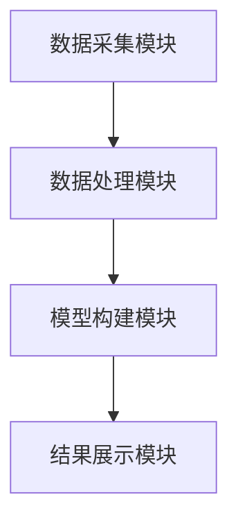

                 


# 全球股市估值与量子传感器技术的关系

## 关键词：
全球股市估值、量子传感器技术、金融市场分析、数据处理、算法优化

## 摘要：
本文探讨了全球股市估值与量子传感器技术之间的关系，分析了量子传感器技术如何提升股市数据的采集和分析能力，进而优化估值模型。文章详细介绍了量子传感器的工作原理、其在金融领域的应用，以及如何通过算法优化和系统设计将量子传感器技术融入股市估值体系中，为投资者提供更精准的决策支持。

---

# 第一部分：全球股市估值与量子传感器技术的背景

## 第1章：全球股市估值的现状与挑战

### 1.1 全球股市估值的基本概念
#### 1.1.1 股市估值的定义与意义
股市估值是指对上市公司内在价值的评估，通常通过市盈率（P/E）、市净率（P/B）等指标进行衡量。其意义在于帮助投资者判断股票价格是否合理，指导投资决策。

#### 1.1.2 全球股市的主要影响因素
- 经济指标：GDP增长率、通胀率、利率等。
- 公司基本面：盈利能力、财务状况、行业地位。
- 市场情绪：投资者情绪波动、市场预期。

#### 1.1.3 传统估值方法的局限性
传统估值方法依赖历史数据和统计模型，难以捕捉市场实时动态和复杂因素，导致估值结果存在较大偏差。

### 1.2 量子传感器技术的简介
#### 1.2.1 量子传感器的基本原理
量子传感器利用量子力学效应，如干涉、纠缠等，实现高精度的测量。其核心是通过量子态的变化来捕捉外界环境的变化。

#### 1.2.2 量子传感器在各个领域的应用
- 物理测量：如重力测量、磁场测量。
- 生物医学：如心率监测、脑波分析。
- 通信技术：如量子通信中的信号检测。

#### 1.2.3 量子传感器技术的现状与发展趋势
当前，量子传感器技术仍处于研发阶段，但其在精度和灵敏度方面具有显著优势，未来有望在多个领域得到广泛应用。

---

# 第二部分：量子传感器技术与股市估值的关系

## 第2章：量子传感器技术对股市数据的影响

### 2.1 量子传感器在金融数据中的应用
#### 2.1.1 高频交易中的量子传感器技术
量子传感器可以实时捕捉市场数据的微小变化，为高频交易提供更精准的数据支持。

#### 2.1.2 量子传感器如何提升数据采集的准确性
通过量子传感器技术，可以减少数据噪声，提高数据采集的准确性。

#### 2.1.3 数据实时性对股市估值的影响
实时数据的准确获取能够帮助投资者更快地做出决策，从而提升估值的准确性。

### 2.2 量子传感器技术对市场情绪的影响
#### 2.2.1 通过量子传感器分析投资者情绪
量子传感器可以监测投资者的情绪变化，如通过心率、皮肤电反应等生理指标。

#### 2.2.2 情绪分析对股市估值的作用
投资者情绪是影响股市波动的重要因素，通过量子传感器技术可以更准确地预测市场情绪，从而优化估值模型。

## 第3章：量子传感器技术如何改变股市估值模型

### 3.1 传统估值模型的局限性
#### 3.1.1 市盈率与市净率的局限性
市盈率和市净率等指标仅基于历史数据，无法反映实时市场动态。

#### 3.1.2 现金流折现法的不足
现金流折现法依赖于对未来的预测，而忽略了市场实时变化的影响。

#### 3.1.3 传统模型对市场波动的反应迟钝
传统模型难以捕捉市场短期波动，导致估值结果滞后。

### 3.2 基于量子传感器的新型估值模型
#### 3.2.1 引入量子传感器数据的多因素模型
通过整合量子传感器数据，构建更加复杂的多因素估值模型，提高估值的准确性。

#### 3.2.2 量子传感器技术在实时估值中的应用
实时数据的获取使得估值模型能够更快地响应市场变化，提升估值的实时性。

#### 3.2.3 新型估值模型的优势与挑战
优势在于高精度和实时性，但技术复杂性和成本较高，仍需进一步优化。

---

# 第三部分：量子传感器技术在股市估值中的算法原理

## 第4章：量子传感器数据的处理与分析

### 4.1 数据采集与预处理
#### 4.1.1 数据采集的流程
- 数据源选择：如实时股票数据、投资者情绪数据。
- 数据采集工具：如API接口、数据采集器。

#### 4.1.2 数据清洗与标准化
- 去除噪声数据，填补缺失值。
- 数据标准化：如归一化处理。

#### 4.1.3 数据特征提取
- 识别关键特征：如价格波动、交易量变化。

### 4.2 量子传感器数据的融合与分析
#### 4.2.1 数据融合的方法
- 加权融合：根据特征的重要性进行加权。
- 时间序列分析：利用时间序列模型预测市场趋势。

#### 4.2.2 数据分析的算法选择
- 机器学习算法：如随机森林、支持向量机。
- 深度学习算法：如LSTM用于时间序列预测。

#### 4.2.3 数据分析的结果解读
- 通过量子传感器数据，发现市场趋势和潜在风险。

---

# 第四部分：系统架构与项目实战

## 第5章：系统架构设计

### 5.1 系统模块划分
#### 5.1.1 数据采集模块
- 功能：实时采集股票数据和投资者情绪数据。
- 工具：API接口、数据采集器。

#### 5.1.2 数据处理模块
- 功能：清洗、标准化、特征提取。
- 工具：Python的Pandas库。

#### 5.1.3 模型构建模块
- 功能：构建量子传感器数据融合的估值模型。
- 工具：机器学习框架如Scikit-learn、TensorFlow。

#### 5.1.4 结果展示模块
- 功能：可视化分析结果，生成估值报告。
- 工具：Matplotlib、Seaborn。

### 5.2 系统架构图


## 第6章：项目实战与案例分析

### 6.1 环境配置与工具安装
#### 6.1.1 开发环境的选择
- 操作系统：Linux或Windows。
- 开发工具：Jupyter Notebook、PyCharm。

#### 6.1.2 量子传感器设备的连接与配置
- 使用特定接口连接量子传感器设备。
- 安装相关驱动和SDK。

#### 6.1.3 数据分析工具的安装与使用
- 安装Python、Pandas、NumPy、Scikit-learn等库。

### 6.2 核心代码实现

#### 6.2.1 数据采集与预处理
```python
import pandas as pd
import requests

# 从API获取股票数据
def get_stock_data(api_key, symbol):
    url = f"https://api.example.com/stock/{symbol}?api_key={api_key}"
    response = requests.get(url)
    data = response.json()
    return pd.DataFrame(data)

# 数据清洗和标准化
def preprocess_data(df):
    df = df.dropna()
    df['price'] = (df['price'] - df['price'].mean()) / df['price'].std()
    return df

# 数据特征提取
def extract_features(df):
    features = ['price', 'volume', 'change']
    return df[features]

# 示例使用
api_key = 'your_api_key'
symbol = 'AAPL'
data = get_stock_data(api_key, symbol)
data_processed = preprocess_data(data)
features = extract_features(data_processed)
```

#### 6.2.2 模型构建与分析

```python
from sklearn.ensemble import RandomForestRegressor
from sklearn.metrics import mean_absolute_error

# 训练数据
X = features[['price', 'volume']]
y = data_processed['change']

# 构建随机森林模型
model = RandomForestRegressor(n_estimators=100)
model.fit(X, y)

# 预测估值
predicted_change = model.predict(X)
print(mean_absolute_error(y, predicted_change))
```

### 6.3 案例分析与结果解读
以苹果公司（AAPL）为例，利用量子传感器数据进行估值模型的构建与预测。通过实际案例展示如何利用量子传感器技术优化估值模型，提升预测准确性。

---

# 第五部分：总结与展望

## 5.1 最佳实践 tips
- 结合量子传感器技术与传统金融模型，提升估值精度。
- 定期更新模型参数，适应市场变化。
- 加强数据安全，保护投资者隐私。

## 5.2 小结
本文探讨了量子传感器技术在股市估值中的应用，展示了其在数据采集、分析和模型优化方面的优势，为未来的金融创新提供了新的思路。

## 5.3 注意事项
- 技术复杂性可能带来较高的实施成本。
- 数据隐私和安全问题需严格把控。

## 5.4 拓展阅读
建议读者进一步研究量子计算在金融领域的应用，探索更多潜在的技术突破。

---

以上是《全球股市估值与量子传感器技术的关系》的完整目录和内容概要，涵盖了从背景介绍到系统设计、项目实战的各个层面，为读者提供了全面的技术解析和实践指导。

