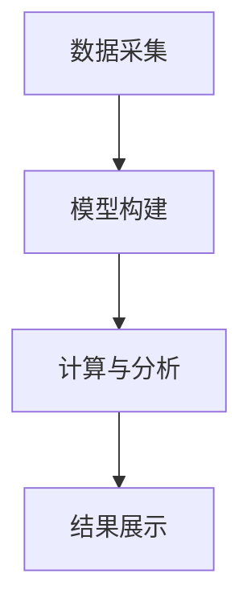
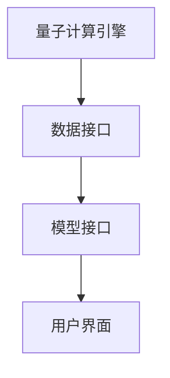

                 


# 全球股市估值与量子计算在金融建模中的应用

---

## 关键词：
全球股市估值，量子计算，金融建模，投资组合优化，风险管理，定价模型

---

## 摘要：
本文深入探讨了全球股市估值的现状与挑战，以及量子计算在金融建模中的应用潜力。通过分析量子计算的基本原理及其在投资组合优化、风险管理、金融定价等领域的具体应用，本文展示了量子计算如何提升金融建模的效率和准确性。文章结合数学模型、算法原理和实际案例，详细阐述了量子计算在金融建模中的优势，并对未来的发展方向进行了展望。

---

## 第1章: 全球股市估值与量子计算概述

### 1.1 全球股市估值的现状与挑战

#### 1.1.1 全球股市估值的基本概念
全球股市估值是指对全球范围内股票市场的整体价值进行评估。传统的估值方法主要包括市盈率（P/E）、市净率（P/B）、股息率等指标，这些方法在一定程度上能够反映市场的健康状况。然而，随着金融市场的复杂化和数据量的指数级增长，传统估值方法的局限性日益显现。

#### 1.1.2 传统股市估值方法的局限性
- 数据维度有限：传统方法主要依赖财务数据，难以捕捉市场情绪、投资者行为等非结构化数据的影响。
- 计算复杂性：面对海量数据，传统方法的计算效率和准确性难以满足实时金融建模的需求。
- 市场波动性：传统方法在应对市场剧烈波动时往往表现不佳，无法捕捉复杂的价格走势。

#### 1.1.3 量子计算在金融建模中的潜力
量子计算通过利用量子叠加和量子纠缠等特性，可以在短时间内处理海量数据，并快速找到最优解。这使得量子计算在金融建模中具有巨大的潜力，尤其是在投资组合优化、风险管理等领域。

### 1.2 量子计算的基本概念与优势

#### 1.2.1 量子计算的定义与基本原理
量子计算是一种基于量子力学原理的计算方式。与经典计算不同，量子计算的核心在于利用量子位（qubit）的叠加态和纠缠态来处理信息。量子位可以同时处于多个状态的叠加态，从而实现并行计算。

#### 1.2.2 量子计算与经典计算的区别
- 表示信息的方式：经典计算使用二进制位，而量子计算使用量子位。
- 并行计算能力：量子计算可以在一次运算中处理大量可能性，而经典计算需要逐一处理。

#### 1.2.3 量子计算在金融建模中的优势
- 高效性：量子计算可以在短时间内解决复杂优化问题。
- 准确性：量子算法能够捕捉市场中的非线性关系，提高模型的预测能力。

### 1.3 本书的核心内容与目标
- **核心内容**：探讨量子计算在金融建模中的应用，包括投资组合优化、风险管理、金融定价等。
- **目标**：通过理论与实践相结合的方式，展示量子计算如何提升金融建模的效率和准确性。

---

## 第2章: 量子计算的核心原理

### 2.1 量子位与量子叠加

#### 2.1.1 量子位的定义
量子位是量子计算的基本单位，可以用 $|0\rangle$ 和 $|1\rangle$ 表示。

#### 2.1.2 量子叠加原理
量子叠加允许量子位同时处于多个状态的叠加态。例如，一个量子位可以表示为：
$$ |q\rangle = \alpha|0\rangle + \beta|1\rangle $$
其中，$\alpha$ 和 $\beta$ 是复数，满足 $|\alpha|^2 + |\beta|^2 = 1$。

#### 2.1.3 量子叠加在计算中的应用
量子叠加使得量子计算机能够在一次运算中同时处理多个可能性，从而提高计算效率。

### 2.2 量子纠缠与量子通信

#### 2.2.1 量子纠缠的定义
量子纠缠是量子系统中两个或多个粒子之间存在的特殊关联，使得其中一个粒子的状态会直接影响另一个粒子的状态。

#### 2.2.2 量子纠缠的特性
- 不可分割性：纠缠态无法通过局部操作单独改变其中一个粒子的状态。
- 非局域性：纠缠态的影响可以瞬间传递到远距离。

#### 2.2.3 量子纠缠在金融建模中的潜在应用
量子纠缠可以用于分布式计算，提高金融建模的并行处理能力。

### 2.3 量子算法与经典算法的对比

#### 2.3.1 常见量子算法简介
- **Shor算法**：用于大整数分解，对密码学有重要影响。
- **Grover算法**：用于无序数据库搜索，可以在 $O(\sqrt{N})$ 时间内找到目标。

#### 2.3.2 量子算法与经典算法的性能对比
- **时间复杂度**：量子算法在某些问题上具有指数级的优势。
- **空间复杂度**：量子算法通常需要更少的空间资源。

#### 2.3.3 量子算法在金融建模中的优势
- **优化问题**：量子算法可以高效地解决投资组合优化问题。
- **预测能力**：量子算法能够捕捉复杂的非线性关系，提高金融模型的预测能力。

---

## 第3章: 量子计算在金融建模中的核心应用

### 3.1 量子计算在投资组合优化中的应用

#### 3.1.1 投资组合优化的基本概念
投资组合优化是指在给定风险承受能力下，寻找最优的资产配置，以实现收益最大化。

#### 3.1.2 量子计算在投资组合优化中的算法设计
量子算法可以通过优化问题的数学模型，快速找到最优解。例如，使用量子模拟退火算法（Quantum Annealing）来解决投资组合优化问题。

#### 3.1.3 实例分析：量子算法在投资组合优化中的实现
假设我们有一个包含 $n$ 种资产的投资组合，目标是最小化风险（方差）并最大化收益。量子算法可以通过以下步骤实现：
1. **问题建模**：将投资组合优化问题转化为一个优化问题。
2. **量子算法设计**：设计一个量子算法来求解该优化问题。
3. **计算结果**：通过量子计算机求解得到最优资产配置。

---

## 第4章: 量子计算在风险管理中的应用

### 4.1 量子计算在风险管理中的核心作用

#### 4.1.1 风险管理的基本概念
风险管理是指识别、评估和应对潜在的金融风险，以保护投资组合免受损失。

#### 4.1.2 量子计算在风险管理中的算法设计
量子算法可以通过分析市场波动性、相关性等复杂因素，快速评估风险。

#### 4.1.3 实例分析：量子算法在风险管理中的应用
例如，使用量子蒙特卡罗方法（Quantum Monte Carlo）来评估投资组合在不同市场条件下的风险。

---

## 第5章: 量子计算在金融定价中的应用

### 5.1 量子计算在金融定价中的优势

#### 5.1.1 金融定价的基本概念
金融定价是指对金融资产的市场价格进行评估，通常基于资产的内在价值、市场供求等因素。

#### 5.1.2 量子计算在金融定价中的算法设计
量子算法可以通过分析市场数据，快速计算出资产的定价。

#### 5.1.3 实例分析：量子算法在金融定价中的应用
例如，使用量子算法来计算期权的定价，考虑市场的波动性、利率等因素。

---

## 第6章: 量子计算在金融建模中的系统架构设计

### 6.1 系统功能设计

#### 6.1.1 系统功能模块
- **数据采集**：收集市场数据、资产信息等。
- **模型构建**：设计量子算法模型。
- **计算与分析**：通过量子计算机求解模型，得到结果。
- **结果展示**：将结果可视化，供用户参考。

#### 6.1.2 系统功能流程图


### 6.2 系统架构设计

#### 6.2.1 系统架构图


### 6.3 系统接口设计

#### 6.3.1 数据接口
- **输入**：市场数据、资产信息。
- **输出**：数据预处理结果。

#### 6.3.2 模型接口
- **输入**：数据预处理结果。
- **输出**：量子算法计算结果。

---

## 第7章: 量子计算在金融建模中的项目实战

### 7.1 项目环境配置

#### 7.1.1 量子计算平台选择
选择合适的量子计算平台，例如 IBM Q Experience、Rigetti Quantum Computing 等。

#### 7.1.2 开发工具安装
安装必要的开发工具，例如 Qiskit（量子编程框架）、Python 等。

### 7.2 核心代码实现

#### 7.2.1 投资组合优化的量子算法实现
```python
from qiskit import QuantumCircuit, Aer, execute

def quantum_portfolio_optimization(n_assets):
    # 创建量子电路
    qc = QuantumCircuit(n_assets)
    # 添加量子门操作
    qc.h(range(n_assets))
    qc.measure(range(n_assets), range(n_assets))
    # 执行量子计算
    backend = Aer.get_backend('qasm_simulator')
    job = execute(qc, backend)
    result = job.result()
    return result.get_counts()
```

#### 7.2.2 风险管理的量子算法实现
```python
from qiskit.aqua import QuantumInstance
from qiskit.aqua.algorithms import QuantumApproximateOptimizationAlgorithm

def quantum_risk_management(n_assets):
    problem = {'name': 'portfolio_optimization',
               'version': '1.0.0',
               'parameters': {'N': n_assets},
               'variables': ['x_{}'.format(i) for i in range(n_assets)]}
    algorithm = QuantumApproximateOptimizationAlgorithm()
    quantum_instance = QuantumInstance(backend=Aer.get_backend('qasm_simulator'))
    result = algorithm.run(problem, quantum_instance)
    return result
```

### 7.3 案例分析

#### 7.3.1 投资组合优化案例
假设我们有3种资产，目标是最小化风险并最大化收益。通过量子算法，我们可以快速找到最优的资产配置。

#### 7.3.2 风险管理案例
通过量子算法，我们可以评估投资组合在不同市场条件下的风险，并制定相应的风险管理策略。

---

## 第8章: 结论与展望

### 8.1 全书总结
通过本书的介绍，我们了解了量子计算在金融建模中的巨大潜力，尤其是在投资组合优化、风险管理、金融定价等领域。

### 8.2 未来展望
随着量子计算技术的不断发展，其在金融建模中的应用将更加广泛。未来的研究方向包括开发更高效的量子算法、优化量子计算平台的性能等。

---

## 附录

### 附录A: 量子算法的代码示例
```python
from qiskit import QuantumCircuit, Aer, execute

def quantum_algorithm_example(n_qubits):
    qc = QuantumCircuit(n_qubits)
    qc.h(range(n_qubits))
    qc.measure(range(n_qubits), range(n_qubits))
    backend = Aer.get_backend('qasm_simulator')
    job = execute(qc, backend)
    result = job.result()
    return result.get_counts()
```

### 附录B: 扩展阅读
- "Quantum Computing for Finance" by Michael B. R. Rastans
- "Quantum Algorithms for Optimization Problems" by John Preskill

---

通过以上内容，我们全面介绍了全球股市估值与量子计算在金融建模中的应用。希望本文能够为读者提供有价值的参考，帮助他们更好地理解量子计算在金融领域的潜力与应用。

