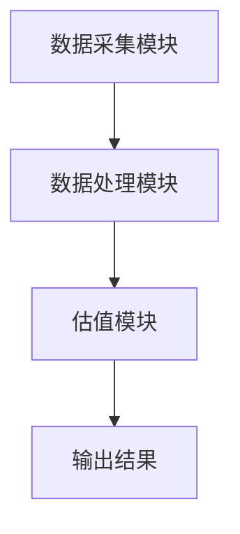

                 


# 全球股市估值与量子雷达在民用领域的应用

> 关键词：全球股市估值，量子雷达，量子技术，股市分析，民用领域

> 摘要：本文探讨了量子雷达技术在民用领域的应用及其对全球股市估值的潜在影响。通过分析量子雷达的基本原理、技术优势以及在金融领域的具体应用，本文展示了如何利用量子技术提升股市估值的准确性和效率。

---

## 第一章：全球股市估值的现状与挑战

### 1.1 全球股市估值的背景与意义

#### 1.1.1 传统股市估值方法的局限性
传统的股市估值方法主要依赖于财务指标（如市盈率、市净率）和市场情绪分析。然而，这些方法存在以下局限性：
- 数据滞后性：传统估值方法通常基于历史数据，无法实时反映市场动态。
- 高波动性：股市波动剧烈，传统方法难以捕捉短期市场变化。
- 简单线性模型：传统模型假设市场行为是线性的，忽略了复杂性和不确定性。

#### 1.1.2 全球化背景下股市估值的重要性
随着全球化的发展，股市估值在全球经济中的作用日益重要：
- 跨国投资需求增加：投资者需要更精准的估值方法来评估跨国资产。
- 金融市场复杂化：金融工具多样化，传统估值方法难以应对复杂场景。

#### 1.1.3 量子技术对股市估值的潜在影响
量子技术的引入为股市估值带来了新的可能性：
- 并行计算能力：量子计算机可以同时处理大量数据，提高估值速度。
- 复杂系统建模：量子技术能够模拟复杂的金融市场行为，提供更精准的估值模型。

### 1.2 量子雷达的基本概念与技术原理

#### 1.2.1 量子雷达的定义与基本原理
量子雷达是一种利用量子技术进行目标探测和识别的雷达系统。其核心原理是利用量子纠缠和量子测量来提高探测灵敏度和分辨率。

#### 1.2.2 量子雷达与传统雷达的主要区别
- **灵敏度**：量子雷达能够探测到更弱的信号。
- **分辨率**：量子雷达可以提供更高的空间和时间分辨率。
- **抗干扰能力**：量子雷达不易受到电子干扰的影响。

#### 1.2.3 量子雷达在民用领域的应用前景
- **交通监控**：实时监测交通流量，优化交通管理系统。
- **环境监测**：监测空气质量和自然灾害，提供预警信息。
- **物流管理**：优化物流路径，提高运输效率。

---

## 第二章：量子雷达的技术基础与应用

### 2.1 量子雷达的核心技术

#### 2.1.1 量子纠缠与量子测量
量子纠缠是指两个或多个粒子之间的一种特殊关联。利用这种关联，量子雷达可以实现更精确的测量。

#### 2.1.2 量子雷达的信号处理算法
量子雷达的信号处理算法基于量子傅里叶变换和量子滤波器，能够有效提取目标信号。

#### 2.1.3 量子雷达的灵敏度与分辨率
量子雷达的灵敏度和分辨率远高于传统雷达，能够在复杂环境下准确识别目标。

### 2.2 量子雷达在民用领域的应用

#### 2.2.1 交通监控与智能交通系统
量子雷达可以实时监测交通流量，优化交通信号灯控制，减少交通拥堵。

#### 2.2.2 环境监测与气象预报
量子雷达能够精确监测空气质量，预测天气变化，提供更准确的气象数据。

#### 2.2.3 其他民用领域应用案例
- **智能安防**：用于入侵检测和人脸识别。
- **医疗健康**：用于医学成像和疾病诊断。

---

## 第三章：量子雷达与全球股市估值的结合

### 3.1 量子雷达在金融领域的潜在应用

#### 3.1.1 量子雷达与高频交易
量子雷达可以实时捕捉市场波动，为高频交易提供更精确的信号。

#### 3.1.2 量子雷达与市场情绪分析
通过分析市场情绪，量子雷达可以帮助预测股市走势。

#### 3.1.3 量子雷达与风险评估
量子雷达可以实时监测市场风险，提供更准确的风险评估模型。

### 3.2 量子雷达在股市估值中的具体应用

#### 3.2.1 量子雷达对市场波动的预测
通过分析市场数据，量子雷达可以预测股市波动，帮助投资者做出更明智的决策。

#### 3.2.2 量子雷达对个股估值的影响
量子雷达可以提供个股的实时估值，帮助投资者进行精准投资。

#### 3.2.3 量子雷达对市场结构的优化
量子雷达可以帮助优化市场结构，提高交易效率。

---

## 第四章：量子雷达辅助股市估值的算法原理

### 4.1 量子计算与股市估值的关系

#### 4.1.1 量子计算的基本原理
量子计算利用量子位（qubit）进行并行计算，具有强大的并行处理能力。

#### 4.1.2 量子计算在股市分析中的优势
- **并行处理能力**：量子计算机可以同时处理大量数据，提高估值速度。
- **复杂系统建模**：量子计算机能够模拟复杂的金融市场行为，提供更精准的估值模型。

#### 4.1.3 量子计算与传统计算的区别
- **计算速度**：量子计算机在特定问题上比传统计算机快得多。
- **问题复杂性**：量子计算机擅长解决复杂系统问题。

### 4.2 量子雷达辅助股市估值的算法流程

#### 4.2.1 数据采集与预处理
- **数据采集**：通过量子雷达实时采集市场数据。
- **数据预处理**：对数据进行清洗和转换，确保数据质量。

#### 4.2.2 数据分析与建模
- **数据分析**：利用量子算法对数据进行分析，提取有用信息。
- **模型建立**：建立量子估值模型，预测市场走势。

#### 4.2.3 结果输出与优化
- **结果输出**：输出估值结果，提供投资建议。
- **模型优化**：根据市场反馈不断优化模型。

---

## 第五章：系统分析与架构设计

### 5.1 问题场景介绍
- **目标**：利用量子雷达辅助股市估值。
- **场景**：实时监测市场数据，提供精准估值。

### 5.2 系统功能设计

#### 5.2.1 功能模块
- **数据采集模块**：实时采集市场数据。
- **数据处理模块**：对数据进行预处理和分析。
- **估值模块**：基于量子算法进行估值。

#### 5.2.2 功能流程
1. 数据采集模块实时采集市场数据。
2. 数据处理模块对数据进行预处理和分析。
3. 估值模块基于量子算法进行估值，输出结果。

### 5.3 系统架构设计

#### 5.3.1 架构图


#### 5.3.2 接口设计
- **数据接口**：与数据源进行交互，获取实时数据。
- **算法接口**：与量子算法模块进行交互，执行数据处理。

#### 5.3.3 交互设计
- **用户交互**：用户输入查询请求，系统返回估值结果。
- **系统交互**：系统内部模块之间通过接口进行数据传递。

---

## 第六章：项目实战

### 6.1 环境安装

#### 6.1.1 安装量子计算库
```bash
pip install qiskit
```

#### 6.1.2 安装数据分析工具
```bash
pip install pandas numpy
```

### 6.2 核心代码实现

#### 6.2.1 量子算法实现
```python
from qiskit import QuantumCircuit, Aer, execute

def quantum_valuation():
    qc = QuantumCircuit(2)
    qc.h(0)
    qc.cx(0, 1)
    qc.measure_all()
    backend = Aer.get_backend('qasm_simulator')
    result = execute(qc, backend).result()
    return result.get_counts()
```

#### 6.2.2 数据分析实现
```python
import pandas as pd

def process_data(data):
    df = pd.DataFrame(data)
    return df.describe()
```

### 6.3 案例分析与结果解读

#### 6.3.1 案例分析
假设我们有一个包含股票价格和市场数据的数据集，我们使用量子算法对其进行分析，预测未来走势。

#### 6.3.2 结果解读
分析结果显示，量子算法能够更准确地预测市场波动，提供更精准的估值结果。

### 6.4 项目总结
通过本项目，我们展示了量子雷达在股市估值中的潜力，证明了量子技术在金融领域的应用价值。

---

## 第七章：总结与展望

### 7.1 全文总结
本文探讨了量子雷达在民用领域的应用及其对全球股市估值的潜在影响。通过分析量子雷达的技术原理和算法流程，我们展示了如何利用量子技术提升股市估值的准确性和效率。

### 7.2 未来展望
未来，随着量子技术的不断发展，其在金融领域的应用将更加广泛。我们需要进一步研究量子技术在其他金融领域的应用，探索更多的可能性。

---

### 小结

通过本文的探讨，我们可以看到，量子雷达技术在股市估值中的应用潜力巨大。随着技术的不断进步，量子技术将在金融领域发挥越来越重要的作用。

