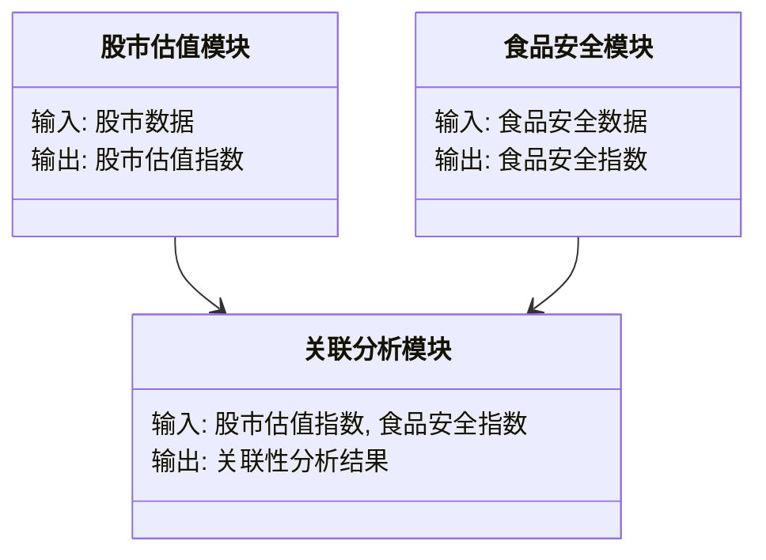

                 


# 全球股市估值与食品安全问题的关联

> 关键词：全球股市估值、食品安全问题、关联性、数学模型、经济影响

> 摘要：本文探讨了全球股市估值与食品安全问题之间的关联性，分析了食品安全问题对股市估值的影响机制，并通过构建数学模型和案例分析，揭示了两者之间的复杂关系。文章旨在为投资者和政策制定者提供参考。

---

## 第1章: 全球股市估值的概述

### 1.1 全球股市估值的基本概念

#### 1.1.1 股市估值的定义与意义

股市估值是指通过对股票价格、市盈率、市净率等指标的分析，评估市场整体或特定行业或公司的价值。股市估值是投资者进行决策的重要依据，也是衡量经济健康状况的重要指标。

#### 1.1.2 全球股市的主要指标与衡量标准

- **市盈率（P/E）**：股价与每股收益的比率，用于衡量股票的估值是否合理。
- **市净率（P/B）**：股价与每股净资产的比率，用于评估股票相对于其资产价值的高低。
- **市值**：公司股票的总价值，反映市场对公司规模和价值的评估。

#### 1.1.3 股市估值与宏观经济的关系

股市估值与宏观经济密切相关。经济繁荣时，股市估值通常上升；经济衰退时，股市估值可能下跌。股市估值的变化反映了市场对经济前景的预期。

---

### 1.2 全球股市的结构与特点

#### 1.2.1 主要股市的分布与特点

全球主要股市包括纽约证券交易所（NYSE）、纳斯达克（NASDAQ）、伦敦金融时报指数（FTSE 100）等。不同股市的结构和特点各异，但都反映了所在地区的经济状况和市场参与者的信心。

#### 1.2.2 全球股市的波动性与风险

股市具有高度的波动性，受多种因素影响，如经济数据、政策变化、国际局势等。食品安全问题作为一种突发事件，也可能引发股市的波动。

#### 1.2.3 股市估值的周期性与季节性

股市估值具有周期性，通常经历牛市和熊市的交替。季节性波动也可能存在，例如节假日前后市场情绪的变化。

---

## 第2章: 食品安全问题的概述

### 2.1 食品安全的基本概念

#### 2.1.1 食品安全的定义与范围

食品安全指食品在生产、加工、运输、销售和消费过程中符合相关标准，确保消费者健康和安全。

#### 2.1.2 食品安全问题的主要表现形式

- **食品污染**：包括生物污染（如细菌、病毒）、化学污染（如农药残留）、物理污染（如异物）。
- **食品欺诈**：如假冒伪劣食品、虚假标签等。
- **食品borne疾病**：因食用不安全食品导致的疾病。

#### 2.1.3 食品安全对公共健康的影响

食品安全问题直接影响公众健康，可能导致大规模疾病爆发，甚至威胁社会稳定。

---

### 2.2 食品安全问题的全球性与区域性

#### 2.2.1 全球食品安全问题的现状与趋势

全球化背景下，食品供应链跨越国界，食品安全问题具有全球性。近年来，食品安全问题频发，如“毒奶粉”事件、“瘦肉精”事件等。

#### 2.2.2 区域性食品安全问题的特点

不同地区面临的食品安全问题不同，例如发展中国家可能面临更多的食品污染问题，而发达国家可能更关注转基因食品的安全性。

#### 2.2.3 食品安全问题的经济与社会影响

食品安全问题可能导致企业倒闭、行业受损，进而影响股市估值。此外，食品安全问题还可能引发社会恐慌，影响消费者信心。

---

## 第3章: 全球股市估值与食品安全问题的关联性分析

### 3.1 股市估值与食品安全问题的直接关联

#### 3.1.1 食品安全问题对股市的影响路径

食品安全问题可能直接影响相关企业的股价，如食品加工企业、农业企业等。此外，食品安全问题还可能引发连锁反应，影响整个行业的估值。

#### 3.1.2 食品安全事件对特定行业的影响

例如，某食品企业发生重大食品安全事故，可能导致该企业股价暴跌，甚至引发行业整体估值下降。

#### 3.1.3 食品安全政策变化对股市的影响

政府出台更严格的食品安全法规，可能增加企业的合规成本，影响企业的盈利能力，从而影响股价。

---

### 3.2 股市估值与食品安全问题的间接关联

#### 3.2.1 食品安全问题对消费者行为的影响

消费者对食品安全的关注可能影响消费习惯，进而影响企业的销售业绩和股价。

#### 3.2.2 消费者信心与股市估值的关系

消费者信心下降可能导致股市整体估值下降，因为消费者信心是经济活动的重要指标。

#### 3.2.3 食品安全问题对供应链的影响

食品安全问题可能影响供应链的稳定性，导致生产成本上升，进而影响企业的盈利能力。

---

## 第4章: 全球股市估值与食品安全问题的数学模型构建

### 4.1 股市估值与食品安全问题的变量分析

#### 4.1.1 自变量：食品安全问题的关键指标

- 食品安全事故频率
- 食品安全监管力度
- 消费者信心指数

#### 4.1.2 因变量：股市估值的核心指标

- 股市指数（如道琼斯指数、标普500指数）
- 市盈率
- 市净率

#### 4.1.3 控制变量：宏观经济与政策因素

- 国内生产总值（GDP）
- 利率
- 汇率

### 4.2 股市估值与食品安全问题的联立方程

#### 4.2.1 模型构建的理论基础

基于多元线性回归模型，分析食品安全问题的关键指标对股市估值的影响。

#### 4.2.2 模型的数学表达式

$$
Y = \beta_0 + \beta_1X_1 + \beta_2X_2 + \epsilon
$$

其中，$Y$ 表示股市估值指数，$X_1$ 表示食品安全事故频率，$X_2$ 表示消费者信心指数，$\beta$ 表示回归系数，$\epsilon$ 表示误差项。

---

### 4.3 模型的验证与优化

#### 4.3.1 数据来源与处理方法

数据来源包括历史股市数据、食品安全事件记录、消费者信心指数等。数据需要清洗和预处理，确保数据的准确性和完整性。

#### 4.3.2 模型的拟合优度分析

通过R²值评估模型的拟合优度，R²越接近1，模型的解释力越强。

#### 4.3.3 模型的显著性检验

通过t检验和F检验，评估模型中各变量的显著性，剔除不显著的变量，优化模型结构。

---

## 第5章: 全球股市估值与食品安全问题的系统分析与架构设计

### 5.1 系统功能设计（领域模型）

#### 5.1.1 领域模型设计

使用Mermaid图展示系统功能模块：



#### 5.1.2 系统架构设计

使用Mermaid图展示系统架构：


---

### 5.2 项目实战

#### 5.2.1 环境安装

需要安装Python、Pandas、NumPy、Matplotlib等库，用于数据处理和可视化。

#### 5.2.2 核心实现源代码

```python
import pandas as pd
import numpy as np
import matplotlib.pyplot as plt
from sklearn.linear_model import LinearRegression
from sklearn.metrics import r2_score

# 数据加载
df = pd.read_csv('stock_food.csv')

# 数据预处理
X = df[['food_safety_incidents', 'consumer_confidence']]
y = df['stock_valuation']

# 模型训练
model = LinearRegression()
model.fit(X, y)

# 模型评估
y_pred = model.predict(X)
r2 = r2_score(y, y_pred)
print(f'R² = {r2}')

# 可视化
plt.scatter(y, y_pred)
plt.xlabel('实际股市估值')
plt.ylabel('预测股市估值')
plt.title('股市估值预测模型')
plt.show()
```

#### 5.2.3 案例分析与结果解读

以某地区食品安全事件为例，分析事件发生前后的股市估值变化，验证模型的预测能力。

#### 5.2.4 项目小结

总结项目的实现过程，指出模型的优势和局限性，提出改进建议。

---

## 第6章: 总结与展望

### 6.1 总结

本文通过理论分析和实证研究，探讨了全球股市估值与食品安全问题之间的关联性，构建了数学模型，并通过案例分析验证了模型的可行性。

### 6.2 展望

未来研究可以进一步优化模型，引入更多变量，如社交媒体情绪分析、政策变化等，提高模型的预测精度。同时，可以研究不同地区、不同行业之间的差异，为投资者提供更精准的决策支持。

---

## 附录

### 附录A: 数据来源与处理方法

详细说明数据来源、数据清洗过程和数据格式。

### 附录B: 术语表

列出文章中涉及的专业术语及其定义。

### 附录C: 参考文献

列出文章中引用的文献和资料。

---

通过以上结构，本文系统地探讨了全球股市估值与食品安全问题的关联性，为投资者和政策制定者提供了理论依据和实践指导。

