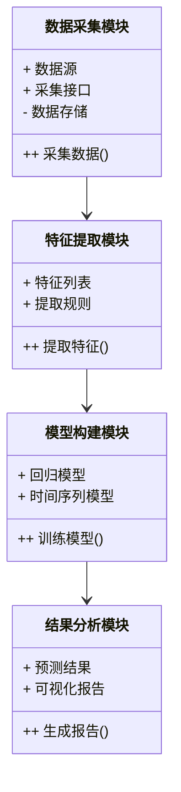

                 


# 全球股市估值差异的原因探讨

## 关键词：全球股市、估值差异、市场结构、投资者行为、信息不对称、数学模型

## 摘要：本文从全球股市估值差异的现象出发，分析了市场结构、投资者行为和信息不对称等因素对估值的影响。通过建立数学模型，结合具体案例，探讨了估值差异的根源，并提出了相应的解决方案。

---

## 第一部分：全球股市估值差异的背景与核心概念

### 第1章：全球股市估值差异的背景与问题描述

#### 1.1 股市估值的基本概念
股票估值是通过对公司财务数据、行业地位、市场前景等因素进行分析，确定股票的合理价格范围。常用的估值指标包括市盈率（P/E）、市净率（P/B）、股息率等。这些指标反映了市场对公司的认可程度，同时也受到市场环境和投资者情绪的影响。

#### 1.2 问题背景与研究意义
全球股市估值差异的现象普遍存在。例如，同一家公司在不同市场的估值可能相差较大，这种差异不仅影响投资者的决策，也反映了不同市场之间的差异。研究这些差异的原因，有助于投资者更好地理解市场机制，优化投资策略。

#### 1.3 问题解决与研究目标
本研究旨在通过分析市场结构、投资者行为和信息不对称等因素，揭示全球股市估值差异的根源，并提出相应的解决方案。研究目标包括建立数学模型，量化各因素对估值差异的影响。

---

### 第2章：全球股市估值差异的核心概念与联系

#### 2.1 市场结构差异
不同市场的制度差异显著影响估值。例如，成熟市场的监管更严格，投资者更理性；新兴市场的监管可能存在漏洞，投资者情绪波动较大。

#### 2.2 投资者行为差异
投资者行为受文化、教育水平和市场经验的影响。机构投资者更注重基本面分析，而散户可能受短期情绪驱动。

#### 2.3 信息不对称与估值差异
信息不对称导致市场参与者无法获得相同的信息，影响价格发现。信息传播的延迟和不完全可能导致估值差异。

---

## 第二部分：全球股市估值差异的算法原理与数学模型

### 第3章：估值差异的数学模型

#### 3.1 基于回归分析的估值差异模型
回归分析是研究变量之间关系的统计方法。本文建立一个多元回归模型，将市场结构、投资者行为和信息不对称等因素作为自变量，估值差异作为因变量。

$$ Y = \beta_0 + \beta_1 X_1 + \beta_2 X_2 + \beta_3 X_3 + \epsilon $$

其中，$Y$ 表示估值差异，$X_1$、$X_2$、$X_3$ 分别表示市场结构、投资者行为和信息不对称的指标。

#### 3.2 时间序列分析在估值差异中的应用
时间序列分析适用于研究估值差异的变化趋势。本文采用ARIMA模型，通过历史数据预测未来估值差异。

---

### 第4章：估值差异的算法实现

#### 4.1 基于Python的回归分析实现
以下是回归分析的Python代码示例：

```python
import pandas as pd
from sklearn.linear_model import LinearRegression
from sklearn.metrics import mean_squared_error

# 数据预处理
data = pd.read_csv('stock_data.csv')
X = data[['market_structure', 'investor_behavior', 'info_asymmetry']]
y = data['valuation_difference']

# 建立回归模型
model = LinearRegression()
model.fit(X, y)

# 预测与评估
y_pred = model.predict(X)
mse = mean_squared_error(y, y_pred)
print('均方误差:', mse)
```

---

## 第三部分：系统分析与架构设计

### 第5章：系统分析与架构设计

#### 5.1 问题场景介绍
本文构建了一个分析框架，用于量化各因素对估值差异的影响。系统功能包括数据采集、特征提取、模型构建和结果分析。

#### 5.2 系统功能设计
以下是系统功能模块的类图（mermaid）：



---

## 第四部分：项目实战与案例分析

### 第6章：项目实战与案例分析

#### 6.1 项目环境安装
需要安装以下库：
- Python 3.8+
- Pandas、NumPy、Scikit-learn、Matplotlib

#### 6.2 核心代码实现
以下是回归分析的实现代码：

```python
import pandas as pd
import numpy as np
import matplotlib.pyplot as plt
from sklearn.linear_model import LinearRegression
from sklearn.metrics import mean_squared_error

# 数据加载
data = pd.read_csv('global_stock_valuations.csv')

# 数据清洗
data.dropna(inplace=True)

# 特征选择
X = data[['P/E', 'P/B', 'market_cap']]
y = data['valuation_diff']

# 模型训练
model = LinearRegression()
model.fit(X, y)

# 预测与可视化
y_pred = model.predict(X)
 residuals = y - y_pred

 plt.scatter(y_pred, residuals)
 plt.xlabel('Predicted Values')
 plt.ylabel('Residuals')
 plt.title('Residuals vs Predicted Values')
 plt.show()
```

---

## 第五部分：最佳实践与总结

### 第7章：最佳实践与总结

#### 7.1 小结
本文通过分析市场结构、投资者行为和信息不对称等因素，揭示了全球股市估值差异的根源，并提出了相应的解决方案。

#### 7.2 投资者注意事项
投资者应关注不同市场的制度差异和信息不对称，合理配置资产，降低风险。

#### 7.3 拓展阅读
建议进一步研究市场干预政策对估值差异的影响，以及如何利用机器学习优化估值模型。

---

## 总结

本文通过理论分析和实证研究，探讨了全球股市估值差异的原因，并提出了相应的解决方案。未来的研究可以进一步结合更多因素，优化模型，为投资者提供更精准的决策支持。

