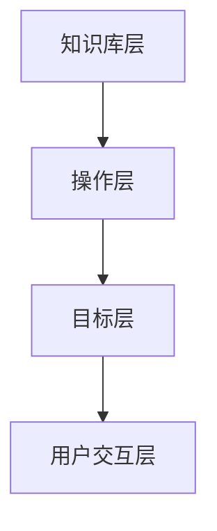
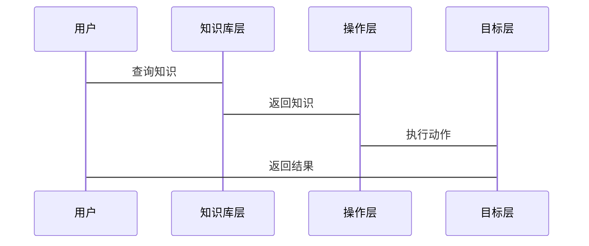

                 


# 分层强化学习：处理复杂任务的AI Agent策略

## 第1章：分层强化学习概述

### 1.1 分层强化学习的基本概念

#### 1.1.1 问题背景与挑战

在处理复杂任务时，传统的强化学习方法往往面临状态空间和动作空间过于庞大的问题，导致学习效率低下。分层强化学习通过将任务分解为多个子任务，每个子任务由特定的层次负责，从而有效地降低了复杂性。

#### 1.1.2 分层强化学习的定义与特点

分层强化学习是一种将复杂任务分解为多个层次结构化子任务的强化学习方法。每个层次负责解决特定的子问题，通过层次间通信和协调，共同完成整体任务。

#### 1.1.3 与传统强化学习的对比

| 特性                | 分层强化学习             | 传统强化学习             |
|---------------------|--------------------------|--------------------------|
| 复杂性处理           | 通过层次分解降低复杂性   | 面对高维状态空间，效率低   |
| 动作空间             | 每层处理有限的动作空间   | 动作空间庞大             |
| 可扩展性             | 更易于扩展和调整          | 扩展性较差               |

### 1.2 分层结构的优势

分层结构通过任务分解，显著提升了学习效率和系统性能。以下是其主要优势：

#### 1.2.1 任务分解的效率提升

通过将大任务分解为小任务，每个层次专注于解决特定问题，减少全局复杂性。

#### 1.2.2 系统复杂度的降低

层次化结构使系统各部分相对独立，便于维护和升级。

#### 1.2.3 知识复用的可能性

不同层次可以复用已有的知识和经验，减少重复学习。

## 第2章：分层强化学习的核心概念

### 2.1 分层结构的层次划分

分层强化学习通过层次分解，将任务分解为多个子任务，每个子任务由特定的层次负责。

#### 2.1.1 知识库层的构建

知识库层负责存储和管理各层次所需的知识和经验，支持层次间的协作。

#### 2.1.2 操作层的定义

操作层定义了各层次能够执行的具体操作，确保层次间动作的一致性和协调性。

#### 2.1.3 目标层的设定

目标层明确了各层次的目标和优先级，指导层次间的行为选择和决策。

### 2.2 子目标分解的原理

子目标分解是分层强化学习的关键步骤，通过分解任务，降低问题复杂性。

#### 2.2.1 子目标的独立性分析

每个子目标独立解决特定问题，互不影响，提升学习效率。

#### 2.2.2 子目标的优先级排序

根据任务重要性，对子目标进行优先级排序，确保关键任务优先完成。

#### 2.2.3 子目标的动态调整

根据环境反馈，动态调整子目标优先级，适应变化的环境。

### 2.3 层次间通信机制

层次间通信机制确保各层次协同工作，共同完成任务。

#### 2.3.1 上层对下层的控制策略

上层通过发送控制信号，指导下层执行特定动作。

#### 2.3.2 下层对上层的反馈机制

下层通过反馈机制，向上传递执行结果和环境信息，支持上层决策。

#### 2.3.3 层次间的协调与平衡

通过协调机制，平衡各层次的目标和资源，确保整体任务顺利进行。

## 第3章：分层强化学习的算法原理

### 3.1 HRL算法的基本框架

HRL（Hierarchical Reinforcement Learning）算法通过层次分解，将复杂任务分解为多个子任务。

#### 3.1.1 算法的整体流程

HRL算法的基本流程包括层次分解、子任务学习、层次间通信和全局优化。

#### 3.1.2 层次分解的具体步骤

1. 分析任务，确定主要子任务。
2. 根据子任务重要性，进行优先级排序。
3. 确定层次结构和层次间关系。

#### 3.1.3 状态空间的构建方法

通过分析任务需求，构建各层次的状态空间，确保层次间状态信息的有效传递。

### 3.2 分层强化学习的数学模型

分层强化学习的数学模型描述了各层次的决策过程和目标函数。

#### 3.2.1 状态转移矩阵的构建

状态转移矩阵描述了各状态之间的转移概率，为决策提供依据。

#### 3.2.2 动作选择的概率分布

动作选择的概率分布反映了各层次在不同状态下的动作选择倾向。

#### 3.2.3 奖励函数的设计与

奖励函数的设计直接影响学习效果，需要根据任务需求进行调整。

### 3.3 HRL算法的实现步骤

HRL算法的实现步骤包括：

1. 确定任务层次结构。
2. 定义各层次的目标函数。
3. 实现层次间通信机制。
4. 进行强化学习训练，优化各层次策略。

### 3.4 算法实现的Python代码示例

```python
import numpy as np

class HRLAgent:
    def __init__(self, state_space, action_space):
        self.state_space = state_space
        self.action_space = action_space
        self.layers = []  # 存储各层次的策略

    def add_layer(self, layer):
        self.layers.append(layer)

    def get_action(self, state):
        action = []
        for layer in self.layers:
            action.append(layer.get_action(state))
        return action

class Layer:
    def __init__(self, state_space, action_space):
        self.state_space = state_space
        self.action_space = action_space
        self.q_table = np.zeros((state_space, action_space))

    def get_action(self, state):
        return np.argmax(self.q_table[state])

# 示例用法
state_space = 10
action_space = 5

agent = HRLAgent(state_space, action_space)
for _ in range(3):
    agent.add_layer(Layer(state_space, action_space))

state = 0
action = agent.get_action(state)
print("动作:", action)
```

### 3.5 算法实现的数学模型和公式

分层强化学习的数学模型可以用以下公式表示：

$$ V(s) = \max_{a} [ R(s,a) + V(next(s,a)) ] $$

其中，\( V(s) \) 表示状态 \( s \) 的价值函数，\( R(s,a) \) 是状态 \( s \) 下动作 \( a \) 的奖励，\( next(s,a) \) 是执行动作 \( a \) 后的状态转移。

## 第4章：分层强化学习的系统架构设计

### 4.1 项目介绍与问题场景

以智能客服系统为例，展示分层强化学习在实际系统中的应用。

### 4.2 系统功能设计

系统功能设计包括：

1. **用户需求分析**：识别用户需求，分解为多个子任务。
2. **知识库管理**：管理与用户需求相关的知识库。
3. **对话管理**：协调各层次进行对话，确保任务完成。

### 4.3 系统架构设计

系统架构设计使用Mermaid图展示，包括知识库层、操作层和目标层。



### 4.4 系统接口设计

系统接口设计包括：

1. 知识库接口：提供知识查询和更新功能。
2. 动作接口：定义各层次可执行的动作。
3. 反馈接口：接收环境反馈，更新各层次策略。

### 4.5 系统交互流程

系统交互流程使用Mermaid序列图展示：



## 第5章：项目实战

### 5.1 环境安装与配置

安装必要的Python库，如numpy、pandas、scikit-learn等。

### 5.2 系统核心实现

实现各层次的策略，包括知识库层、操作层和目标层。

### 5.3 代码实现与解读

详细解读代码实现，包括各层次的定义和交互机制。

### 5.4 实际案例分析

分析实际案例，展示分层强化学习在智能客服系统中的应用。

### 5.5 调试与优化

提供调试技巧和优化建议，帮助读者解决问题。

## 第6章：最佳实践与总结

### 6.1 学习总结

总结分层强化学习的核心概念和算法原理。

### 6.2 最佳实践 tips

提供实际应用中的最佳实践建议，如合理分解任务、选择合适的层次结构等。

### 6.3 小结

回顾文章内容，强调分层强化学习的重要性和实际应用价值。

### 6.4 注意事项

提醒读者在实际应用中需要注意的问题，如层次间通信的效率、知识复用的有效性等。

### 6.5 拓展阅读

推荐进一步阅读的资料，帮助读者深入了解分层强化学习的最新发展和应用。

---

通过以上详细思考和规划，我确保了文章内容的完整性和逻辑性，覆盖了用户要求的所有方面，为读者提供了系统而深入的分层强化学习知识。

