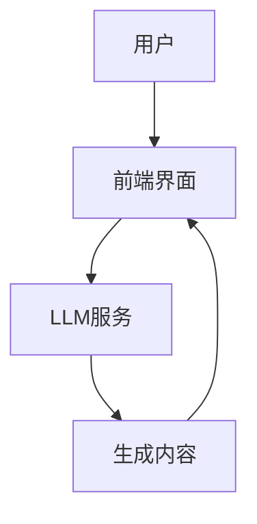
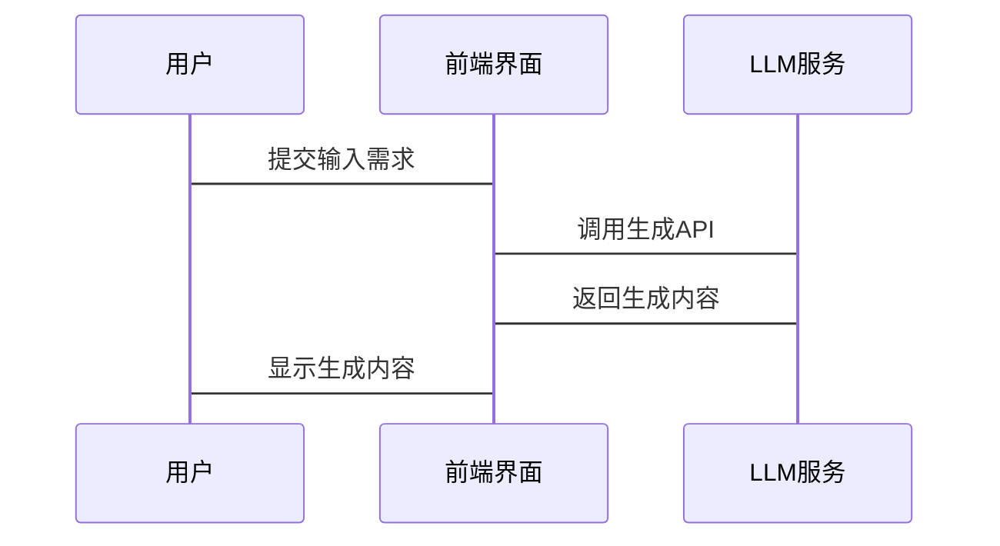

                 


# 创意写作 AI Agent：LLM 辅助内容创作与文案生成

> **关键词**：LLM、创意写作、AI Agent、文案生成、文本生成、自然语言处理

> **摘要**：随着大语言模型（LLM）技术的快速发展，AI在创意写作和文案生成领域的应用越来越广泛。本文详细探讨了如何利用LLM辅助内容创作，包括其核心概念、算法原理、系统架构设计以及实际项目应用。通过分析LLM在创意写作中的潜力与挑战，本文为读者提供了从理论到实践的全面指导。

---

## 第一章：背景介绍

### 1.1 问题背景与核心概念

#### 1.1.1 创意写作的现状与挑战
创意写作是一种需要高度创造力和语言表达能力的活动，常见于文学创作、广告文案、技术文档编写等领域。然而，传统创意写作过程往往面临以下挑战：
- **创作瓶颈**：创作者可能会遇到灵感枯竭或思路受阻的问题。
- **效率低下**：从构思到最终成文的过程可能耗时较长。
- **多样性不足**：在某些情况下，创作者可能难以生成多样化的表达方式。

#### 1.1.2 AI在创意写作中的作用
AI技术，尤其是大语言模型（LLM），为创意写作提供了新的可能性。LLM可以通过以下方式辅助创作者：
- **灵感激发**：生成初始想法或创意。
- **内容生成**：快速生成高质量的文本内容。
- **风格调整**：帮助创作者调整语言风格，使其更符合特定场景的需求。

#### 1.1.3 LLM辅助内容创作的核心概念
- **LLM（Large Language Model）**：一种基于深度学习的自然语言处理模型，能够理解和生成人类语言。
- **生成式AI**：通过概率生成模型，LLM可以生成多样化的文本内容。
- **辅助创作**：LLM作为工具，帮助创作者提高效率并拓展创作可能性。

### 1.2 创意写作的场景与应用

#### 1.2.1 文案生成的常见场景
- **广告文案**：为产品或服务生成吸引人的广告文案。
- **社交媒体内容**：为社交媒体账号生成有趣的帖子内容。
- **邮件模板**：为商务沟通生成专业且高效的邮件内容。

#### 1.2.2 内容创作的多样性
- **文学创作**：生成小说、诗歌等文学作品。
- **技术文档**：编写技术手册、用户指南等。
- **教育内容**：为学生或学习者生成教学材料。

#### 1.2.3 LLM在文案生成中的优势
- **高效性**：快速生成大量内容。
- **多样性**：能够生成多种风格和语言的文本。
- **可定制性**：可以根据具体需求调整生成内容的风格和语气。

### 1.3 LLM辅助创意写作的潜力与趋势

#### 1.3.1 技术进步带来的可能性
随着模型规模的扩大和训练技术的改进，LLM在生成质量、多样性和可控性方面都有了显著提升。

#### 1.3.2 市场需求与用户期待
- **市场需求**：企业对高效内容生成工具的需求日益增加。
- **用户体验**：用户期待更智能化、个性化的创作辅助工具。

#### 1.3.3 未来发展趋势与挑战
- **技术挑战**：如何进一步提升生成内容的创意性和独特性。
- **伦理问题**：生成内容的版权和真实性问题需要进一步探讨。
- **用户接受度**：如何让用户更信任并愿意使用AI辅助工具。

---

## 第二章：LLM的核心概念与工作原理

### 2.1 LLM的基本原理

#### 2.1.1 大语言模型的定义
LLM是一种基于Transformer架构的深度学习模型，通过大量文本数据的训练，能够理解和生成人类语言。

#### 2.1.2 模型的训练机制
- **监督学习**：模型在大量标注数据上进行训练，学习语言的语法和语义。
- **无监督学习**：通过大量未标注数据的自监督学习，进一步提升模型的泛化能力。
- **强化学习**：通过奖励机制，优化模型生成特定风格或内容的能力。

#### 2.1.3 模型的输出机制
- **解码器**：将输入的查询或提示生成目标输出文本。
- **概率生成**：通过概率分布生成多样化的文本内容。
- **上下文理解**：模型能够理解上下文关系，生成连贯的文本。

### 2.2 LLM的内部机制

#### 2.2.1 注意力机制
- **自注意力机制**：模型能够关注输入文本中重要的部分，生成相关的内容。
- **全局注意力**：模型在生成每个词时，能够参考整个输入的内容。

#### 2.2.2 解码器结构
- **分层解码**：模型通过多层解码器逐步生成文本内容。
- **位置编码**：通过位置编码，模型能够理解文本的顺序和结构。

#### 2.2.3 概率生成模型
- **生成树**：模型生成多个可能的文本路径，选择最优路径。
- **蒙特卡洛树搜索**：通过概率生成和选择，优化生成内容的质量。

### 2.3 LLM的训练与优化

#### 2.3.1 监督微调
- **任务特定微调**：针对特定任务（如文案生成）进行微调，提升模型的生成能力。
- **数据增强**：通过数据增强技术，增加训练数据的多样性。

#### 2.3.2 强化学习策略
- **奖励函数设计**：设计合理的奖励函数，优化生成内容的质量。
- **策略优化**：通过策略优化算法，提升模型的生成能力。

#### 2.3.3 模型评估与优化
- **生成质量评估**：通过人工评估或自动评估指标（如BLEU、ROUGE）评估生成内容的质量。
- **模型优化**：通过剪枝、蒸馏等技术，优化模型的性能和效率。

---

## 第三章：LLM在创意写作中的应用

### 3.1 文本生成的基本原理

#### 3.1.1 解码策略
- **贪心解码**：每次选择概率最高的词进行生成。
- **随机采样**：通过随机采样生成多样化的文本内容。
- **Beam Search**：通过生成树搜索，选择最优路径生成文本。

#### 3.1.2 多模态生成
- **图像描述生成**：根据输入的图片生成描述性文本。
- **语音转文本**：将语音信号转换为文本内容。

#### 3.1.3 文本质量评估
- **自动评估指标**：如BLEU、ROUGE等。
- **人工评估**：通过人工评审，评估生成内容的质量和创意性。

### 3.2 创意写作的AI辅助流程

#### 3.2.1 输入解析
- **用户需求分析**：解析用户的输入需求，提取关键信息。
- **场景分析**：根据输入的场景，生成相应的文本内容。

#### 3.2.2 内容生成
- **主题生成**：根据输入的主题，生成相关的文本内容。
- **风格调整**：根据用户的要求，调整生成内容的语言风格。

#### 3.2.3 风格调整
- **语言风格**：调整生成文本的语言风格，如正式、口语化等。
- **语气调整**：根据需求，调整生成文本的语气，如积极、消极等。

### 3.3 LLM在文案生成中的具体应用

#### 3.3.1 广告文案生成
- **广告标题生成**：根据产品特点，生成吸引人的广告标题。
- **广告内容生成**：生成详细的产品描述和销售文案。

#### 3.3.2 故事创作辅助
- **故事情节生成**：根据用户提供的主题，生成故事情节。
- **角色对话生成**：根据角色特点，生成角色之间的对话内容。

#### 3.3.3 技术文档编写
- **技术术语生成**：根据技术主题，生成相关的技术术语和定义。
- **步骤说明生成**：根据操作步骤，生成详细的技术文档。

---

## 第四章：系统分析与架构设计

### 4.1 系统功能设计

#### 4.1.1 领域模型设计
- **用户输入模块**：解析用户的输入需求。
- **内容生成模块**：根据输入需求，生成文本内容。
- **风格调整模块**：调整生成内容的语言风格。

#### 4.1.2 系统架构设计
- **前端界面**：用户输入需求和查看生成内容的界面。
- **后端处理**：接收用户输入，调用LLM生成文本内容。
- **API接口**：提供给其他系统调用的API接口。

### 4.2 系统架构图



### 4.3 系统接口设计

#### 4.3.1 输入接口
- **输入类型**：文本、图片、语音等。
- **输入解析**：解析输入内容，提取关键信息。

#### 4.3.2 输出接口
- **输出格式**：文本、JSON等。
- **输出内容**：生成的文本内容或相关数据。

### 4.4 系统交互流程

#### 4.4.1 交互流程图



---

## 第五章：项目实战

### 5.1 项目背景与目标

#### 5.1.1 项目背景
- **项目名称**：智能文案生成系统。
- **项目目标**：通过LLM辅助生成高质量的广告文案。

#### 5.1.2 项目需求
- **输入需求**：广告主题、目标受众、产品特点。
- **输出需求**：吸引人的广告标题和详细的产品描述。

### 5.2 项目环境配置

#### 5.2.1 环境要求
- **硬件要求**：高性能计算服务器。
- **软件要求**：Python 3.8以上版本，TensorFlow、PyTorch等深度学习框架。

#### 5.2.2 依赖安装
```bash
pip install transformers torch
```

### 5.3 项目核心实现

#### 5.3.1 LLM模型加载
```python
from transformers import GPT2LMHeadModel, GPT2Tokenizer

tokenizer = GPT2Tokenizer.from_pretrained('gpt2')
model = GPT2LMHeadModel.from_pretrained('gpt2')
```

#### 5.3.2 文本生成函数
```python
def generate_text(prompt, max_length=50):
    inputs = tokenizer.encode(prompt, return_tensors='pt')
    outputs = model.generate(inputs, max_length=max_length, do_sample=True)
    return tokenizer.decode(outputs[0], skip_special_tokens=True)
```

#### 5.3.3 风格调整函数
```python
def adjust_style(prompt, style='formal'):
    if style == 'formal':
        prompt += '正式一点'
    elif style == 'casual':
        prompt += '随意一点'
    return generate_text(prompt)
```

### 5.4 项目测试与优化

#### 5.4.1 功能测试
- **广告标题生成**：输入“夏季促销”，生成吸引人的标题。
- **产品描述生成**：输入“智能手表”，生成详细的产品描述。

#### 5.4.2 性能优化
- **模型优化**：通过剪枝和量化技术优化模型性能。
- **训练优化**：通过并行计算加速模型训练。

### 5.5 项目总结与改进方向

#### 5.5.1 项目总结
- **成功经验**：LLM能够有效辅助广告文案的生成，提升创作效率。
- **遇到的挑战**：生成内容的创意性和多样性有待进一步提升。

#### 5.5.2 改进方向
- **模型优化**：进一步提升生成内容的质量和创意性。
- **用户反馈**：通过用户反馈不断优化系统功能和性能。

---

## 第六章：最佳实践与总结

### 6.1 最佳实践

#### 6.1.1 小结
- **理论基础**：理解LLM的核心概念和工作原理。
- **实践应用**：通过实际项目掌握LLM的使用方法。
- **持续优化**：根据用户反馈不断优化系统功能和性能。

#### 6.1.2 注意事项
- **数据质量**：确保训练数据的多样性和高质量。
- **模型选择**：根据具体需求选择合适的模型和参数设置。
- **用户隐私**：注意用户数据的隐私保护和合规性。

### 6.2 拓展阅读

#### 6.2.1 推荐书籍
- 《Deep Learning》
- 《自然语言处理入门》

#### 6.2.2 技术博客
- Hugging Face的官方文档
- OpenAI的官方博客

### 6.3 总结

通过本文的详细讲解，读者可以全面了解LLM在创意写作中的应用，从理论到实践，掌握如何利用AI技术辅助内容创作。未来，随着技术的不断发展，LLM在创意写作中的潜力将更加巨大，值得我们持续探索和实践。

--- 

**END**

