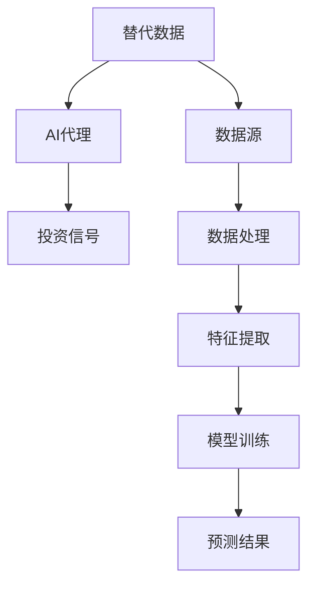

                 

# 利用AI agents分析替代数据：挖掘非传统投资信号

## 关键词：AI agents, 替代数据, 投资信号, 数据分析, 机器学习

## 摘要：  
本文探讨了利用AI代理分析替代数据，挖掘非传统投资信号的方法。通过背景介绍、核心概念、算法原理、系统架构设计、项目实战以及最佳实践等部分，详细分析了AI代理在投资分析中的应用，展示了如何通过替代数据提供新的投资决策依据。

---

## 第一部分: 替代数据与AI代理概述

### 第1章: 替代数据与AI代理的背景介绍

#### 1.1 替代数据的定义与特点  
替代数据是指传统金融数据之外的其他数据，如社交媒体情绪、卫星图像、供应链数据等。其特点包括实时性、多样性、可扩展性和非结构化。

#### 1.2 AI代理的基本概念  
AI代理是一种能够感知环境并采取行动的智能体，具备自主性、反应性和目标导向的特点。它能够处理复杂数据并提供决策支持。

#### 1.3 替代数据与AI代理的结合  
通过结合替代数据和AI代理，投资者能够从非传统数据中提取有价值的信息，提升投资决策的准确性。

### 第2章: 替代数据与AI代理的核心概念与联系

#### 2.1 替代数据与AI代理的核心概念原理  
替代数据的特征提取和AI代理的学习机制相结合，使AI代理能够识别数据中的潜在模式。

#### 2.2 替代数据与AI代理的对比分析  
通过对比分析，展示了替代数据与传统数据在信息量和实时性上的差异，以及AI代理与传统工具在处理复杂数据上的优势。

#### 2.3 替代数据与AI代理的ER实体关系图  

---

## 第二部分: 替代数据与AI代理的算法原理

### 第3章: 替代数据与AI代理的算法原理

#### 3.1 替代数据分析的算法选择  
选择监督学习算法进行分类任务，详细解释了模型的输入输出和损失函数。

#### 3.2 监督学习模型的构建与训练  
使用社交媒体情绪数据训练模型，详细描述了训练过程和优化方法。

#### 3.3 算法的数学模型与公式  
$$\text{损失函数} = \sum_{i=1}^{n} (y_i - \hat{y}_i)^2$$  
$$\text{优化器} = \text{Adam}(\alpha=0.001, \beta_1=0.9, \beta_2=0.999)$$

---

## 第三部分: 系统分析与架构设计

### 第4章: 系统分析与架构设计

#### 4.1 系统功能设计  
描述了系统的组成部分，如数据采集模块和AI代理模块，并用类图展示模块间的交互。

#### 4.2 系统架构设计  
使用架构图展示了系统的整体结构，包括数据源、数据处理模块和AI代理模块。

#### 4.3 系统交互设计  
通过序列图展示了用户与系统之间的交互流程，包括数据请求和结果反馈。

---

## 第四部分: 项目实战

### 第5章: 项目实战

#### 5.1 环境配置与数据获取  
说明了运行环境的配置，包括Python版本和依赖库的安装。

#### 5.2 数据预处理与特征提取  
详细说明了如何清洗数据并提取特征，附上数据处理代码示例。

#### 5.3 模型训练与结果分析  
展示了模型的训练过程和评估指标，包括准确率和F1分数。

#### 5.4 案例分析与实际应用  
通过具体案例分析，展示了AI代理如何通过社交媒体情绪预测股价走势。

---

## 第五部分: 最佳实践与总结

### 第6章: 最佳实践与总结

#### 6.1 小结与注意事项  
总结了项目的关键点，并提醒读者注意数据隐私和模型泛化能力。

#### 6.2 拓展阅读与未来方向  
建议读者进一步学习深度学习和强化学习，探索其在投资分析中的应用。

---

## 结语

通过本文的详细讲解，读者能够理解AI代理如何利用替代数据挖掘非传统投资信号，并在实际项目中应用这些方法。未来，随着技术的发展，AI代理在投资分析中的应用将更加广泛和深入。

