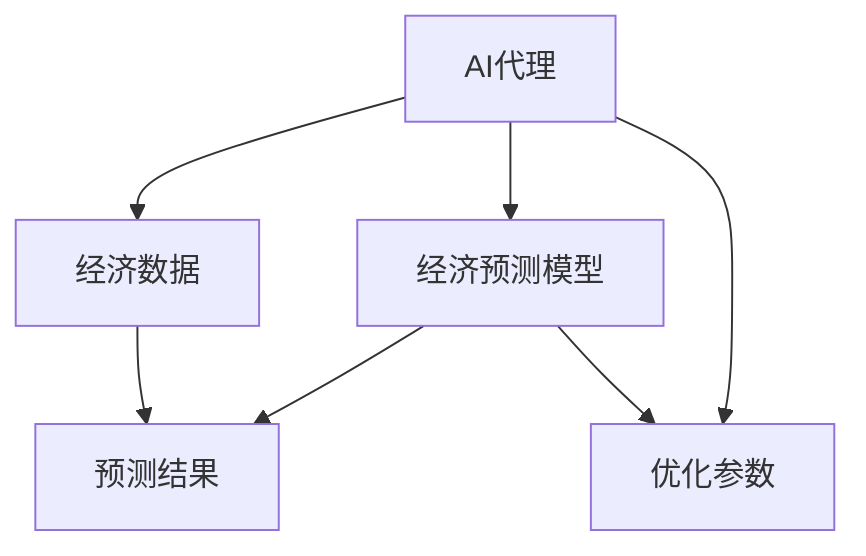
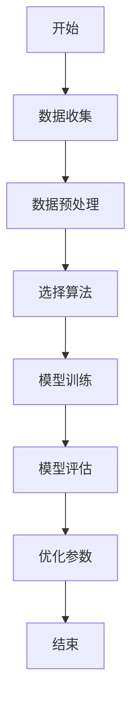
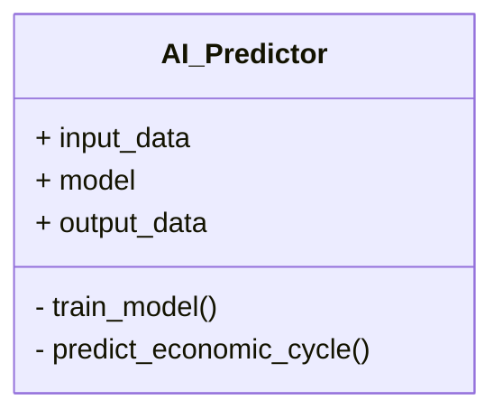
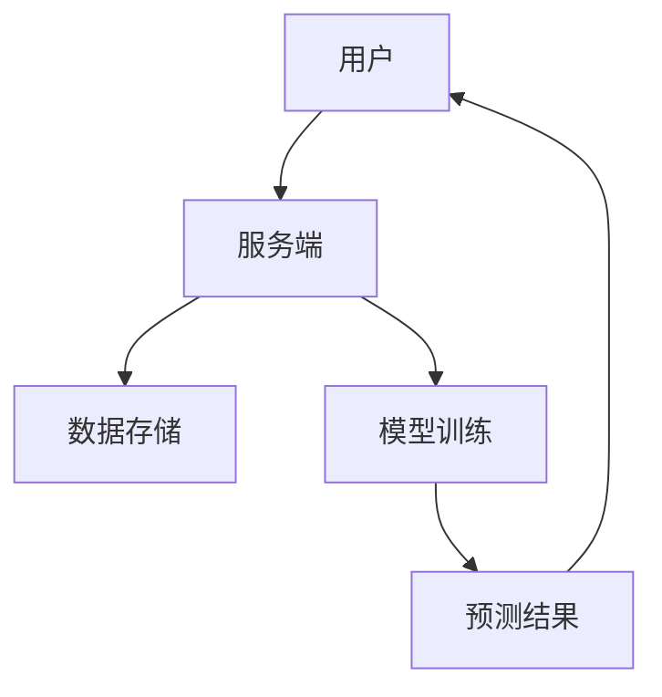

                 


# 利用AI agents构建全球经济周期预测模型：把握大趋势

## 关键词：AI代理，全球经济周期，预测模型，经济预测，数据驱动

## 摘要：  
本文探讨如何利用AI代理构建全球经济周期预测模型，通过分析经济周期的基本概念、AI代理的核心原理，以及它们在经济预测中的应用，结合算法原理、系统架构设计和实际案例，详细阐述如何利用AI代理构建高效、准确的全球经济周期预测模型，帮助投资者和决策者更好地把握经济趋势，做出明智的决策。

---

# 第一部分: 全球经济周期预测的背景与AI代理的结合

## 第1章: 全球经济周期预测的背景与挑战

### 1.1 经济周期的基本概念

#### 1.1.1 经济周期的定义与特征  
经济周期是指经济活动在时间上的波动，通常分为以下几个阶段：  
1. **繁荣阶段**：经济增长迅速，就业率高，企业利润增加。  
2. **衰退阶段**：经济增长放缓，企业利润下降，失业率上升。  
3. **萧条阶段**：经济活动大幅下降，失业率高企，企业倒闭。  
4. **复苏阶段**：经济开始逐步恢复，企业开始重新招聘员工，市场逐渐活跃。  

经济周期的核心特征包括波动性、周期性、不均匀性和复杂性。

#### 1.1.2 经济周期预测的重要性  
准确预测经济周期可以帮助投资者做出更明智的决策，减少经济损失，优化资源配置。例如，在经济衰退前及时调整投资策略，避免重大损失；在经济繁荣时抓住机会，获取更多收益。

#### 1.1.3 经济周期预测的难点与挑战  
经济周期预测面临数据复杂性、模型局限性和外部不确定性等挑战。例如，经济数据受到多种因素影响，如政策变化、自然灾害、全球疫情等，这些因素使得经济周期预测更加复杂。

---

### 1.2 AI代理的核心概念

#### 1.2.1 AI代理的基本定义  
AI代理（Artificial Intelligence Agent）是指能够感知环境并采取行动以实现目标的智能实体。AI代理可以是软件程序，也可以是机器人，它们通过感知和行动与环境交互。

#### 1.2.2 AI代理的主要类型  
AI代理可以分为以下几种类型：  
1. **反应式代理**：根据当前环境输入做出反应，不依赖历史信息。  
2. **基于模型的代理**：利用内部模型对环境进行预测和规划。  
3. **学习型代理**：通过机器学习算法不断优化自身行为。  

#### 1.2.3 AI代理在经济预测中的应用潜力  
AI代理可以通过分析海量数据，发现复杂模式，帮助预测经济趋势。例如，利用自然语言处理（NLP）技术分析新闻、社交媒体和政策文件，提取情绪指标，预测市场波动。

---

## 第2章: AI代理与经济周期预测的核心原理

### 2.1 AI代理在经济预测中的作用

#### 2.1.1 数据收集与处理  
AI代理可以从多种来源（如新闻、社交媒体、经济数据）收集数据，并利用自然语言处理和数据挖掘技术进行清洗和预处理。  
例如，利用NLP技术分析新闻标题的情绪，生成情绪指标，用于预测市场波动。

#### 2.1.2 模型训练与优化  
AI代理可以利用机器学习算法（如神经网络、随机森林）训练经济预测模型，并通过回测和交叉验证优化模型性能。  
例如，利用时间序列分析模型（如ARIMA）预测GDP增长率。

#### 2.1.3 结果分析与反馈  
AI代理可以根据预测结果生成报告，并根据实际结果调整模型参数，提高预测精度。  
例如，如果模型预测某季度GDP增长率为3%，但实际增长率为2.5%，AI代理可以根据误差调整模型参数。

---

### 2.2 经济周期预测模型的构建原理

#### 2.2.1 数据特征提取  
经济周期预测模型需要提取反映经济状况的关键特征，例如：  
- **GDP增长率**：反映经济整体增长情况。  
- **失业率**：反映劳动力市场状况。  
- **通货膨胀率**：反映价格水平。  
- **消费者信心指数**：反映市场情绪。  

#### 2.2.2 模型选择与训练  
根据数据特征选择合适的预测模型，并通过训练数据优化模型参数。例如，使用LSTM（长短期记忆网络）模型预测时间序列数据。

#### 2.2.3 模型评估与优化  
通过测试数据评估模型性能，使用指标如均方误差（MSE）、平均绝对误差（MAE）等。  
例如，如果模型在测试集上的MSE为0.05，说明预测结果与实际值接近。

---

### 2.3 AI代理与经济周期预测的结合

#### 2.3.1 数据驱动的预测方法  
AI代理可以通过分析历史数据，发现数据中的模式和趋势，生成预测结果。  
例如，利用AI代理分析过去10年的GDP增长率，预测未来5年的GDP增长趋势。

#### 2.3.2 知识驱动的预测方法  
AI代理可以利用专家知识和经济理论，构建预测模型。例如，结合凯恩斯经济理论和机器学习算法，预测经济周期波动。

#### 2.3.3 综合驱动的预测方法  
结合数据驱动和知识驱动的方法，构建更准确的预测模型。例如，利用AI代理整合历史数据和专家意见，生成综合预测结果。

---

## 第3章: AI代理与经济周期预测的核心概念对比

### 3.1 AI代理与传统经济预测模型的对比

| 对比维度          | AI代理预测模型                     | 传统经济预测模型               |
|-------------------|------------------------------------|-------------------------------|
| 数据处理能力      | 强大的数据处理能力，可以处理非结构化数据 | 数据处理能力有限，主要处理结构化数据 |
| 模型灵活性        | 高度灵活，可以实时调整模型参数      | 灵活性较低，模型更新周期较长    |
| 预测精度          | 可能更高，特别是大数据环境下        | 精度较低，依赖于模型假设        |

### 3.2 经济周期预测模型的属性特征对比

| 模型属性          | AI代理预测模型                     | 传统经济预测模型               |
|-------------------|------------------------------------|-------------------------------|
| 数据依赖性        | 高度依赖数据量和质量               | 依赖于模型假设和参数选择       |
| 可解释性          | 可能较低，特别是复杂模型           | 可解释性较高                   |
| 计算效率          | 计算效率较高，可以快速生成预测结果  | 计算效率较低                   |

---

### 3.3 实体关系图（ER图）架构



---

# 第二部分: AI代理与经济周期预测模型的核心原理

## 第4章: AI代理与经济周期预测的核心算法

### 4.1 AI代理预测算法的流程图



### 4.2 经济预测模型的数学公式

经济预测模型可以表示为：  
$$ y_t = \beta_0 + \beta_1 y_{t-1} + \epsilon_t $$  
其中，$y_t$ 表示当前时间点的经济指标，$\beta_0$ 和 $\beta_1$ 是模型参数，$\epsilon_t$ 是误差项。

### 4.3 项目实战：AI代理预测经济周期的代码实现

#### 4.3.1 环境搭建

```python
import numpy as np
import pandas as pd
from sklearn.model_selection import train_test_split
from sklearn.metrics import mean_squared_error
from sklearn.ensemble import RandomForestRegressor
```

#### 4.3.2 数据收集与预处理

```python
# 假设我们有一个包含经济指标的数据集
data = pd.read_csv('economic_data.csv')
# 数据预处理
X = data.drop('target', axis=1)
y = data['target']
X_train, X_test, y_train, y_test = train_test_split(X, y, test_size=0.2, random_state=42)
```

#### 4.3.3 模型训练与评估

```python
# 训练随机森林模型
model = RandomForestRegressor(n_estimators=100, random_state=42)
model.fit(X_train, y_train)
# 预测结果
y_pred = model.predict(X_test)
# 评估模型
mse = mean_squared_error(y_test, y_pred)
print(f"均方误差：{mse}")
```

---

## 第5章: 经济周期预测系统的架构设计

### 5.1 系统功能设计



### 5.2 系统架构设计



---

## 第6章: 项目实战与总结

### 6.1 实战案例分析

```python
# 示例代码：使用LSTM预测GDP增长率
import keras
from keras.layers import LSTM, Dense
from keras.models import Sequential

# 数据准备
X_train = ...
y_train = ...

# 构建LSTM模型
model = Sequential()
model.add(LSTM(50, input_shape=(timesteps, features)))
model.add(Dense(1))
model.compile(optimizer='adam', loss='mean_squared_error')
model.fit(X_train, y_train, epochs=100, batch_size=32)
```

### 6.2 总结与展望

通过本文的分析，我们可以看到AI代理在经济周期预测中的巨大潜力。AI代理可以帮助我们更准确地预测经济趋势，优化资源配置。未来，随着AI技术的不断发展，经济周期预测模型将更加智能化和精准化。

---

## 第七章: 总结与最佳实践

### 7.1 最佳实践Tips

- 确保数据质量：经济预测模型的性能依赖于数据的质量和完整性。  
- 定期更新模型：经济环境不断变化，需要定期更新模型参数。  
- 结合专家意见：结合经济专家的意见，提高预测结果的可信度。

### 7.2 注意事项

- 数据隐私问题：在处理经济数据时，需要注意数据隐私和安全。  
- 模型解释性：在某些情况下，模型的解释性比预测精度更重要。  

---

### 7.3 未来展望

随着AI技术的不断进步，经济周期预测模型将更加智能化和精准化。例如，利用生成对抗网络（GAN）生成合成数据，增强模型的泛化能力；或者利用强化学习优化投资策略，提高收益。

---

通过以上步骤，我们可以利用AI代理构建高效的全球经济周期预测模型，帮助投资者和决策者更好地把握经济趋势，做出明智的决策。

