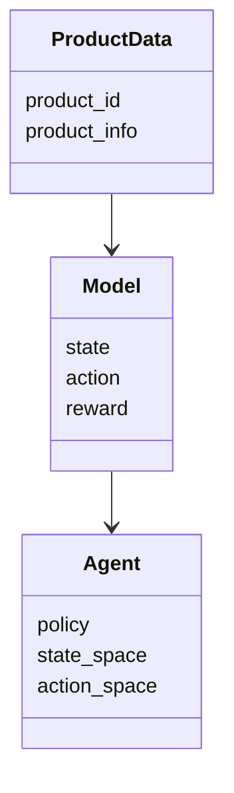
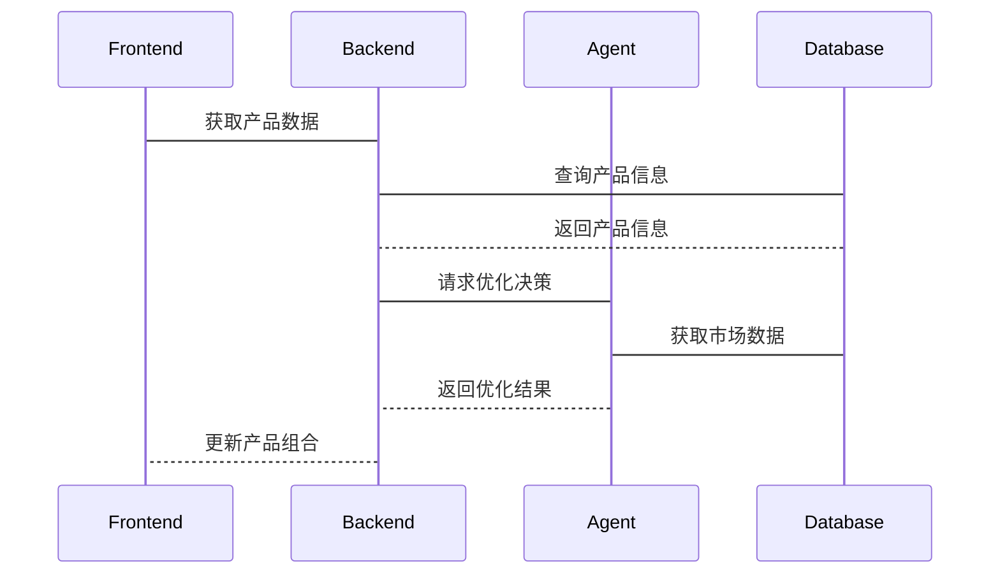

                 


# 利用AI agents构建动态产品生命周期模型：评估公司产品组合

> 关键词：AI代理，动态产品生命周期，产品组合评估，强化学习，动态规划，系统架构设计

> 摘要：本文探讨如何利用AI代理构建动态产品生命周期模型，以帮助企业评估和优化产品组合。文章详细介绍了AI代理的核心概念、动态模型的构建方法、相关算法原理、系统架构设计以及实际应用案例。通过结合强化学习和动态规划算法，本文展示了如何利用AI代理实时优化产品生命周期，从而提升企业竞争力。

---

## 第一部分：引言

### 1.1 问题背景与目标
#### 1.1.1 当前企业产品管理的挑战
在快速变化的市场环境中，企业需要不断优化其产品组合以适应市场需求。然而，传统的产品生命周期模型通常是静态的，无法实时捕捉市场变化和客户需求的变化。这种静态模型可能导致企业错失市场机会或面临不必要的风险。

#### 1.1.2 动态产品生命周期模型的必要性
动态产品生命周期模型能够实时更新和优化产品组合，帮助企业更好地应对市场变化。通过动态调整产品策略，企业可以更快地响应客户需求，提升产品竞争力。

#### 1.1.3 利用AI agents的创新意义
AI代理（AI agents）能够实时收集和分析市场数据，动态调整产品生命周期模型。通过AI代理，企业可以自动化地优化产品组合，提高决策效率和准确性。

### 1.2 本书的目标与意义
#### 1.2.1 本书的核心目标
本文旨在探讨如何利用AI代理构建动态产品生命周期模型，并将其应用于公司产品组合的评估和优化。

#### 1.2.2 本书的创新点
本文结合AI代理和动态规划算法，提出了一种动态产品生命周期模型的新方法，能够实时优化产品组合，提升企业竞争力。

#### 1.2.3 本书的适用读者
本文适合企业的产品经理、技术负责人以及对AI代理和动态模型感兴趣的读者阅读。

---

## 第二部分：核心概念与联系

### 2.1 AI agents的核心概念
#### 2.1.1 AI agents的定义与特点
AI代理是一种能够感知环境并采取行动以实现目标的智能实体。它具有自主性、反应性、目标导向性和社交性等特点。

#### 2.1.2 AI agents的分类与应用场景
AI代理可以分为简单反射型代理、基于模型的反射型代理、目标驱动型代理和效用驱动型代理。它们在推荐系统、动态优化、智能决策等领域有广泛应用。

#### 2.1.3 AI agents与动态模型的关系
AI代理通过实时感知环境数据，驱动动态模型的更新和优化。动态模型为AI代理提供决策支持，AI代理则为动态模型提供实时反馈。

### 2.2 动态产品生命周期模型
#### 2.2.1 产品生命周期的定义与阶段划分
产品生命周期包括引入期、成长期、成熟期和衰退期四个阶段。动态模型能够实时调整各阶段的划分和策略。

#### 2.2.2 动态模型的核心要素
动态模型的核心要素包括市场数据、产品特性、客户行为和决策规则。这些要素共同驱动模型的动态更新。

#### 2.2.3 动态模型与传统模型的对比
动态模型能够实时更新和优化，而传统模型通常是静态的。动态模型通过AI代理实现实时反馈和调整，提升模型的准确性和实用性。

### 2.3 AI agents与动态模型的关联
#### 2.3.1 AI agents在动态模型中的角色
AI代理作为动态模型的核心驱动力，负责实时收集数据、更新模型并做出决策。

#### 2.3.2 动态模型的构建逻辑
动态模型基于AI代理的实时反馈，通过动态规划算法优化产品组合，实现产品生命周期的动态管理。

#### 2.3.3 2.3.3 动态模型的应用场景
动态模型可以应用于产品引入、市场推广、库存管理和产品退市等场景，帮助企业实现产品生命周期的全阶段优化。

---

## 第三部分：算法原理讲解

### 3.1 强化学习算法
#### 3.1.1 强化学习的定义与特点
强化学习是一种通过试错机制优化决策的算法。它通过智能体与环境的交互，学习最优策略。

#### 3.1.2 强化学习的核心组件
强化学习的核心组件包括智能体、环境、状态、动作和奖励。智能体通过与环境交互，学习最优策略。

#### 3.1.3 强化学习的应用场景
强化学习可以应用于动态模型的优化，帮助AI代理做出最优决策。

#### 3.1.4 强化学习算法实现
使用Python实现强化学习算法，包括状态空间的定义、动作空间的设计、奖励函数的实现以及策略的更新。

```python
# 强化学习算法实现示例代码
class Agent:
    def __init__(self, state_space, action_space):
        self.state_space = state_space
        self.action_space = action_space
        # 初始化策略
        self.policy = np.random.rand(state_space, action_space)
    
    def act(self, state):
        # 根据策略选择动作
        return np.argmax(self.policy[state])
    
    def update_policy(self, state, action, reward):
        # 更新策略
        self.policy[state][action] += reward
```

### 3.2 动态规划算法
#### 3.2.1 动态规划的定义与特点
动态规划是一种通过分解问题优化决策的算法。它通过状态转移方程，计算最优解。

#### 3.2.2 动态规划的核心组件
动态规划的核心组件包括状态、转移概率和奖励函数。通过状态转移方程，动态规划算法优化决策。

#### 3.2.3 动态规划的应用场景
动态规划可以应用于动态模型的优化，帮助AI代理制定长期策略。

#### 3.2.4 动态规划算法实现
使用Python实现动态规划算法，包括状态转移方程的定义、价值函数的计算以及最优策略的实现。

```python
# 动态规划算法实现示例代码
def dynamic_programming(state_space, action_space, transition_probabilities):
    # 初始化价值函数
    value = np.zeros(state_space)
    
    # 动态规划迭代
    for _ in range(iterations):
        new_value = np.zeros(state_space)
        for state in range(state_space):
            for action in range(action_space):
                for next_state, prob in transition_probabilities[state][action]:
                    new_value[state] += prob * (reward(state, action, next_state) + discount_factor * value[next_state])
        value = new_value
    
    return value
```

---

## 第四部分：系统分析与架构设计

### 4.1 问题场景介绍
动态产品生命周期模型需要实时更新和优化产品组合，以适应市场变化。

### 4.2 系统功能设计
#### 4.2.1 系统功能模块
系统功能模块包括数据采集、模型构建、优化决策和结果输出。

#### 4.2.2 系统功能流程
系统功能流程包括数据采集、模型构建、优化决策和结果输出四个步骤。

#### 4.2.3 系统功能设计的领域模型
使用Mermaid类图展示系统功能的领域模型。



### 4.3 系统架构设计
#### 4.3.1 系统架构图
使用Mermaid架构图展示系统架构。


#### 4.3.2 系统接口设计
系统接口包括数据接口、模型接口和决策接口。

#### 4.3.3 系统交互流程
使用Mermaid序列图展示系统交互流程。



---

## 第五部分：项目实战

### 5.1 环境安装
安装必要的Python库，包括NumPy、Pandas、Scikit-learn和Mermaid工具。

### 5.2 核心代码实现
实现AI代理和动态模型的核心代码。

#### 5.2.1 强化学习代码
```python
# 强化学习代码示例
import numpy as np

class Agent:
    def __init__(self, state_size, action_size):
        self.state_size = state_size
        self.action_size = action_size
        self.policy = np.random.rand(state_size, action_size)
    
    def act(self, state):
        return np.argmax(self.policy[state])
    
    def update_policy(self, state, action, reward):
        self.policy[state][action] += reward
```

#### 5.2.2 动态规划代码
```python
# 动态规划代码示例
def dynamic_programming(state_size, action_size, transition_probabilities, reward):
    value = np.zeros(state_size)
    for _ in range(iterations):
        new_value = np.zeros(state_size)
        for state in range(state_size):
            for action in range(action_size):
                for next_state, prob in transition_probabilities[state][action]:
                    new_value[state] += prob * (reward[state][action][next_state] + discount_factor * value[next_state])
        value = new_value
    return value
```

### 5.3 案例分析
分析一个实际案例，展示动态模型如何优化产品组合。

#### 5.3.1 案例背景
假设某公司有三个产品，需要优化其产品组合以适应市场需求。

#### 5.3.2 数据准备
准备市场数据、产品特性和客户行为数据。

#### 5.3.3 模型实现
实现动态模型，并利用AI代理优化产品组合。

#### 5.3.4 结果展示
展示优化后的结果，包括产品生命周期的动态调整和收益提升。

### 5.4 项目小结
总结项目实现的关键点和经验教训。

---

## 第六部分：最佳实践与总结

### 6.1 最佳实践
#### 6.1.1 模型优化建议
建议根据实际需求调整模型参数和算法。

#### 6.1.2 数据质量的重要性
强调数据质量和实时性对模型性能的影响。

#### 6.1.3 系统维护与更新
定期更新模型和优化算法，以适应市场变化。

### 6.2 小结
总结本文的主要内容和价值。

### 6.3 注意事项
提醒读者注意模型的局限性和实际应用中的挑战。

### 6.4 拓展阅读
推荐相关领域的书籍和资源，供读者进一步学习。

---

通过以上目录结构，文章详细探讨了利用AI代理构建动态产品生命周期模型的方法，结合理论和实践，帮助读者理解和应用这一技术。

