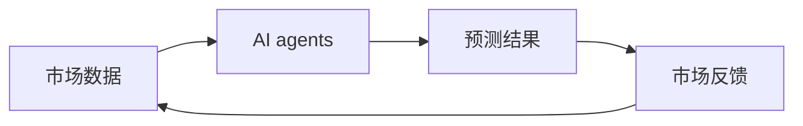
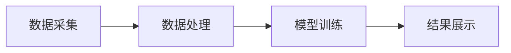

                 


# 利用AI agents构建动态市场份额预测模型：把握竞争态势

## 关键词：
- AI agents
- 市场份额预测
- 动态模型
- 竞争态势
- 人工智能

## 摘要：
本文详细探讨了利用AI agents构建动态市场份额预测模型的方法，分析了其在商业竞争中的应用价值。通过结合AI代理的行为机制和动态预测模型的优势，本文为企业的市场分析和竞争策略提供了新的思路。文章从背景概念、算法原理、系统架构到项目实战，全面解析了如何利用AI技术优化市场份额预测，帮助企业更好地把握市场动向和竞争态势。

---

## 第一部分: 利用AI agents构建动态市场份额预测模型的背景与概念

## 第1章: AI agents与市场份额预测模型概述

### 1.1 AI agents的基本概念

#### 1.1.1 AI agents的定义与分类

AI agents（人工智能代理）是指能够感知环境、自主决策并执行任务的智能体。根据智能体的复杂程度和应用场景，AI agents可以分为以下几类：
- **反应式代理**：基于当前感知做出反应，适用于实时任务。
- **基于模型的代理**：利用内部模型进行决策，适用于复杂环境。
- **学习型代理**：通过机器学习不断优化行为，适用于数据驱动的任务。

#### 1.1.2 AI agents的核心特征与优势

AI agents的核心特征包括：
- **自主性**：能够独立执行任务，无需人工干预。
- **反应性**：能实时感知环境变化并做出反应。
- **学习能力**：通过数据学习优化决策。
- **适应性**：能根据环境变化调整行为策略。

AI agents的优势在于其高效性、智能性和灵活性，能够在动态竞争环境中快速响应，为企业提供实时市场分析。

#### 1.1.3 AI agents在商业分析中的应用前景

AI agents在商业分析中的应用前景广阔，尤其在市场预测、竞争分析和决策支持等领域。通过AI agents，企业可以实时监控市场动态，预测竞争对手的策略，优化自身市场布局。

### 1.2 市场份额预测模型的背景

#### 1.2.1 市场份额预测的基本概念

市场份额预测是指通过分析市场数据，预测企业在未来市场中的份额占比。传统的市场份额预测方法包括统计模型和专家意见法，但这些方法在动态竞争环境下存在局限性。

#### 1.2.2 市场份额预测的传统方法与挑战

传统市场份额预测方法主要包括：
- **回归分析**：基于历史数据建立回归模型。
- **时间序列分析**：利用历史数据预测未来趋势。
- **专家意见法**：依赖专家的经验判断。

这些方法的局限性在于无法实时更新，难以适应快速变化的市场环境。

#### 1.2.3 动态市场份额预测的需求与重要性

在竞争激烈的市场环境中，企业需要实时了解市场动态，动态市场份额预测变得尤为重要。它可以帮助企业快速响应市场变化，制定灵活的竞争策略。

### 1.3 AI agents与市场份额预测的结合

#### 1.3.1 AI agents在市场份额预测中的作用

AI agents能够实时收集市场数据，分析竞争对手的动态，提供实时预测结果，从而帮助企业做出快速决策。

#### 1.3.2 基于AI agents的动态预测模型的优势

基于AI agents的动态预测模型具有以下优势：
- **实时性**：能够实时更新预测结果。
- **准确性**：通过机器学习提高预测精度。
- **适应性**：能够适应市场环境的变化。

#### 1.3.3 该方法的实际应用场景与案例

实际应用场景包括：
- **零售行业**：实时预测销售趋势，优化库存管理。
- **金融行业**：预测市场波动，优化投资策略。
- **科技行业**：预测产品生命周期，制定研发计划。

## 第2章: 动态市场份额预测模型的核心概念与联系

### 2.1 核心概念的原理

#### 2.1.1 AI agents的行为机制

AI agents的行为机制包括感知、决策和执行三个步骤：
1. **感知**：收集环境数据。
2. **决策**：基于数据做出决策。
3. **执行**：执行决策并反馈结果。

#### 2.1.2 市场份额预测的动态特征

动态市场份额预测的特征包括：
- **实时性**：预测结果实时更新。
- **动态性**：模型能够适应市场变化。
- **复杂性**：需要考虑多种市场因素。

#### 2.1.3 两者的结合原理

AI agents与市场份额预测的结合基于数据流和行为机制的交互，AI agents通过实时数据更新预测结果，动态调整市场份额预测模型。

### 2.2 概念对比与特征分析

#### 2.2.1 AI agents与传统预测模型的对比

| 特性             | AI agents预测模型             | 传统预测模型           |
|------------------|-------------------------------|------------------------|
| 数据依赖性       | 高度依赖实时数据             | 依赖历史数据           |
| 决策速度         | 实时决策                     | 需要人工干预           |
| 学习能力         | 具备学习能力                 | 无学习能力             |
| 适应性           | 高度适应变化                 | 适应性较低             |

#### 2.2.2 动态预测与静态预测的特征差异

| 特性             | 动态预测                     | 静态预测               |
|------------------|-----------------------------|-------------------------|
| 时间跨度         | 短期内实时更新               | 长期预测               |
| 数据更新频率     | 高频更新                     | 低频更新               |
| 预测精度         | 较高                         | 较低                   |

#### 2.2.3 市场数据与AI agents输入的关联性分析

市场数据包括销售数据、竞争数据、消费者数据等，AI agents通过处理这些数据生成预测结果。数据的完整性和实时性直接影响预测的准确性。

### 2.3 实体关系与数据流分析



---

## 第3章: 基于AI agents的市场份额预测模型算法原理

### 3.1 算法流程与步骤


### 3.2 算法实现

#### 3.2.1 数据预处理

数据预处理包括数据清洗和特征工程：
- **数据清洗**：处理缺失值、异常值。
- **特征工程**：提取关键特征，如销售额、市场份额、竞争产品等。

#### 3.2.2 特征提取

特征提取是通过分析市场数据，提取对预测有影响的关键特征。例如，竞争对手的市场份额变化、价格变动等。

#### 3.2.3 训练AI agents

训练AI agents的过程包括：
- **模型选择**：选择适合的机器学习模型，如随机森林、神经网络等。
- **训练数据**：使用历史数据训练模型。
- **参数调优**：通过交叉验证优化模型参数。

#### 3.2.4 生成预测结果

AI agents根据实时数据生成预测结果，并输出市场份额预测值。

#### 3.2.5 结果优化

根据预测结果和实际市场反馈，不断优化模型，提高预测准确性。

---

## 第4章: 系统分析与架构设计方案

### 4.1 系统架构设计

系统架构包括数据采集、数据处理、模型训练和结果展示四个模块：


### 4.2 系统功能设计

系统功能设计包括：
- **数据采集模块**：实时采集市场数据。
- **数据处理模块**：对数据进行预处理和特征提取。
- **模型训练模块**：训练AI agents模型。
- **结果展示模块**：展示预测结果和分析报告。

---

## 第5章: 项目实战

### 5.1 环境安装

需要安装Python、机器学习库（如Scikit-learn、TensorFlow）和可视化工具（如Matplotlib）。

### 5.2 核心代码实现

以下是核心代码示例：

```python
import pandas as pd
from sklearn.ensemble import RandomForestRegressor
from sklearn.model_selection import train_test_split
import joblib

# 数据加载与预处理
data = pd.read_csv('market_data.csv')
data = data.dropna()
X = data[['sales', 'competitor_sales', 'price']]
y = data['market_share']

# 数据分割
X_train, X_test, y_train, y_test = train_test_split(X, y, test_size=0.2)

# 模型训练
model = RandomForestRegressor(n_estimators=100)
model.fit(X_train, y_train)

# 模型保存
joblib.dump(model, 'market_share_model.pkl')
```

### 5.3 代码解读与分析

上述代码实现了数据加载、预处理、模型训练和保存。通过RandomForestRegressor训练模型，可以预测市场份额。

### 5.4 实际案例分析

以零售行业为例，利用历史销售数据和竞争数据训练模型，预测未来市场份额。

### 5.5 项目小结

通过项目实战，验证了基于AI agents的市场份额预测模型的有效性和可行性。

---

## 第6章: 最佳实践与小结

### 6.1 最佳实践 tips

- **数据质量**：确保数据的完整性和准确性。
- **模型选择**：根据实际需求选择合适的模型。
- **实时更新**：定期更新模型，保持预测的准确性。

### 6.2 小结

本文详细介绍了利用AI agents构建动态市场份额预测模型的方法，从理论到实践，为企业的市场分析提供了新的思路。

### 6.3 注意事项

- 数据隐私和安全问题需要高度重视。
- 模型的实时性和准确性需要持续优化。

### 6.4 拓展阅读

- 《机器学习实战》
- 《AI代理与智能系统》

---

以上是《利用AI agents构建动态市场份额预测模型：把握竞争态势》的完整内容，涵盖了从理论到实践的各个方面，为企业在动态竞争环境中优化市场份额预测提供了系统的解决方案。

