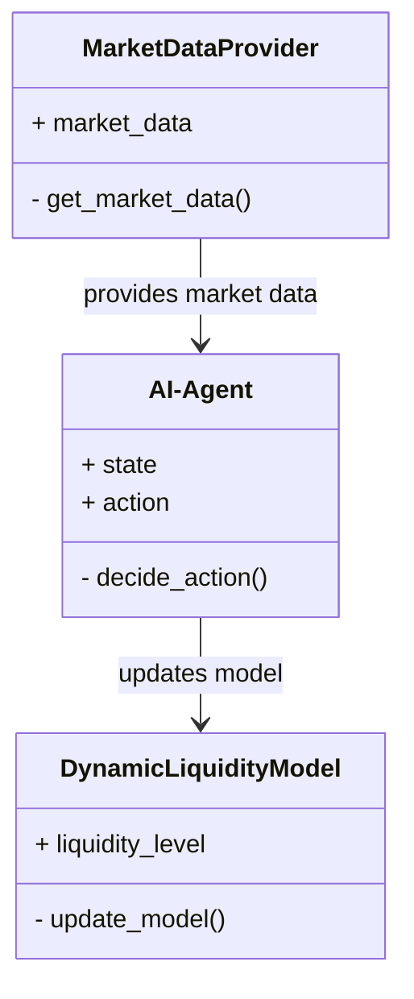

                 


# 利用AI agents构建动态市场流动性模型：优化交易执行

## 关键词：AI代理、动态市场流动性模型、交易执行优化、强化学习、时间序列分析

## 摘要

随着金融市场日益复杂化和数据化的推进，传统的交易执行策略面临着诸多挑战。为了在瞬息万变的市场环境中实现高效的交易执行，利用AI代理构建动态市场流动性模型成为一种创新且有效的解决方案。本文详细探讨了如何通过AI代理优化市场流动性模型，从而提升交易执行效率。从理论基础到算法实现，再到系统架构，本文为读者提供了全面而深入的指导。

---

## 第一部分：背景介绍

### 第1章：问题背景与概念

#### 1.1 问题背景
金融市场中的交易执行效率直接影响投资者的收益和市场整体的稳定性。传统的交易执行策略依赖于静态的市场流动性模型，难以应对市场环境的快速变化，如价格波动、订单量变化等。这种静态模型在面对突发事件或市场异动时，往往无法及时调整策略，导致交易成本增加或收益减少。

#### 1.2 市场流动性模型的动态特性
市场流动性模型是用来描述市场中资产买卖的难易程度及其影响因素的数学模型。动态市场流动性模型强调对市场流动性的实时监控和预测，能够根据市场环境的变化动态调整模型参数，从而提供更准确的流动性预测。

#### 1.3 AI代理的应用前景
AI代理（AI Agents）是一种能够感知环境、自主决策并执行任务的智能实体。在金融领域，AI代理可以实时分析市场数据，优化交易策略，并与市场参与者进行交互。通过AI代理构建动态市场流动性模型，可以显著提升交易执行的效率和准确性。

---

### 第2章：核心概念与联系

#### 2.1 AI代理的核心原理
AI代理通过感知环境信息、分析数据并做出决策来执行任务。在交易执行中，AI代理可以实时分析市场数据，预测价格走势，并优化订单执行策略。

#### 2.2 动态市场流动性模型的构建
动态市场流动性模型需要实时更新，以反映市场环境的变化。AI代理通过收集和分析市场数据，动态调整模型参数，从而提供更准确的流动性预测。

#### 2.3 AI代理与动态流动性模型的关系
AI代理与动态流动性模型相互依赖，共同优化交易执行。AI代理通过分析市场数据更新流动性模型，而流动性模型为AI代理提供决策支持，实现高效的交易执行。

---

## 第二部分：算法原理

### 第3章：强化学习算法

#### 3.1 强化学习的基本原理
强化学习是一种通过试错机制优化决策的机器学习方法。AI代理通过与环境交互，学习最优策略以最大化奖励。

#### 3.2 Q-learning算法在代理决策中的应用
Q-learning算法通过状态-动作价值函数（Q-value）更新策略。在交易执行中，Q-learning可以用于优化订单执行策略。

$$ Q(s, a) = r + \gamma \max Q(s', a') $$

其中：
- $s$ 是当前状态（如市场流动性状况）；
- $a$ 是执行动作（如提交订单）；
- $r$ 是奖励；
- $\gamma$ 是折扣因子。

#### 3.3 策略网络的实现
策略网络通过神经网络结构实现状态到动作的映射，用于生成最优交易策略。

$$ \text{策略网络} = \text{输入层} \rightarrow \text{隐藏层} \rightarrow \text{输出层} $$

---

### 第4章：时间序列分析

#### 4.1 常见的时间序列模型
ARIMA、LSTM等模型常用于时间序列分析。LSTM在处理长期依赖关系方面表现优异，适合用于流动性预测。

#### 4.2 LSTM网络的工作原理
LSTM通过遗忘门、输入门和输出门实现对长期信息的保留和短期信息的更新。

$$ \text{LSTM} = \text{Input} \rightarrow \text{Forget Gate} \rightarrow \text{Update Gate} \rightarrow \text{Output} $$

---

## 第三部分：系统架构

### 第5章：系统架构设计

#### 5.1 领域模型设计
领域模型描述系统的功能模块及其交互关系。



#### 5.2 系统架构图
系统架构图展示各组件之间的关系。

```mermaid
graph LR
    A[Market Data] --> B[MarketDataProvider]
    B --> C[AI-Agent]
    C --> D[DynamicLiquidityModel]
    D --> C: updated model
```

---

## 第四部分：项目实战

### 第6章：项目实战

#### 6.1 环境安装
安装必要的库：
- `pip install numpy pandas tensorflow`

#### 6.2 核心实现代码
实现AI代理和动态流动性模型的代码示例：

```python
import numpy as np
import tensorflow as tf
from tensorflow.keras import layers

# 定义强化学习代理
class AI-Agent:
    def __init__(self):
        self.model = self.build_model()
    
    def build_model(self):
        model = tf.keras.Sequential([
            layers.Dense(64, activation='relu'),
            layers.Dense(1, activation='linear')
        ])
        return model
    
    def decide_action(self, state):
        action = self.model.predict(np.array([state]))[0]
        return action

# 定义动态流动性模型
class DynamicLiquidityModel:
    def __init__(self):
        self.level = 0
    
    def update_model(self, new_level):
        self.level = new_level
        return self.level
```

---

### 第7章：总结与展望

通过AI代理构建动态市场流动性模型，优化了交易执行策略，提高了交易效率。未来的研究可以进一步探索更复杂的模型和更高效的算法，以应对更加复杂的市场环境。

---

### 最佳实践 Tips
- 在实际应用中，结合多种算法（如强化学习和时间序列分析）可以提升模型的性能。
- 定期更新模型参数，确保模型的有效性。
- 注意数据质量和实时性，确保模型的准确性。

---

### 小结
本文详细介绍了利用AI代理构建动态市场流动性模型的方法，从理论到实践，为读者提供了全面的指导。通过优化交易执行策略，可以显著提升交易效率和收益。

---

### 注意事项
- 数据隐私和安全问题需要高度重视。
- 模型的实时性要求较高的计算能力，需优化系统架构。
- 在实际应用中，需结合具体市场环境调整模型参数。

---

### 拓展阅读
- [《Reinforcement Learning: Theory and Algorithms》](#)
- [《LSTM for Time Series Prediction》](#)
- [《Dynamic Market Liquidity Models》](#)

--- 

通过本文的详细讲解，读者可以深入了解如何利用AI代理优化市场流动性模型，实现高效的交易执行。

