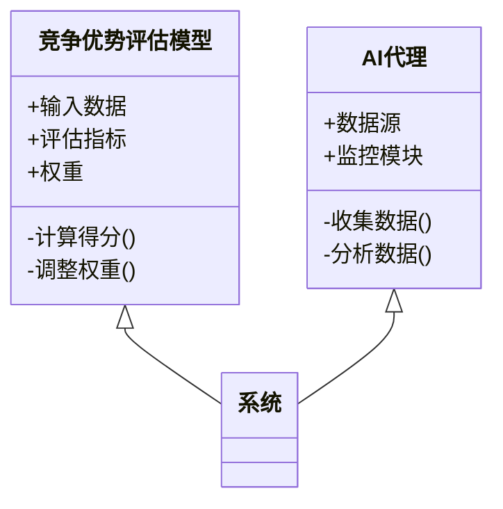
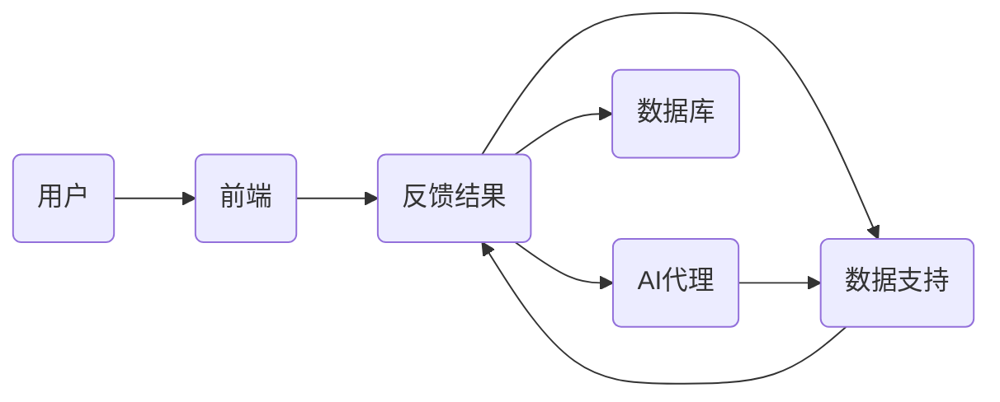
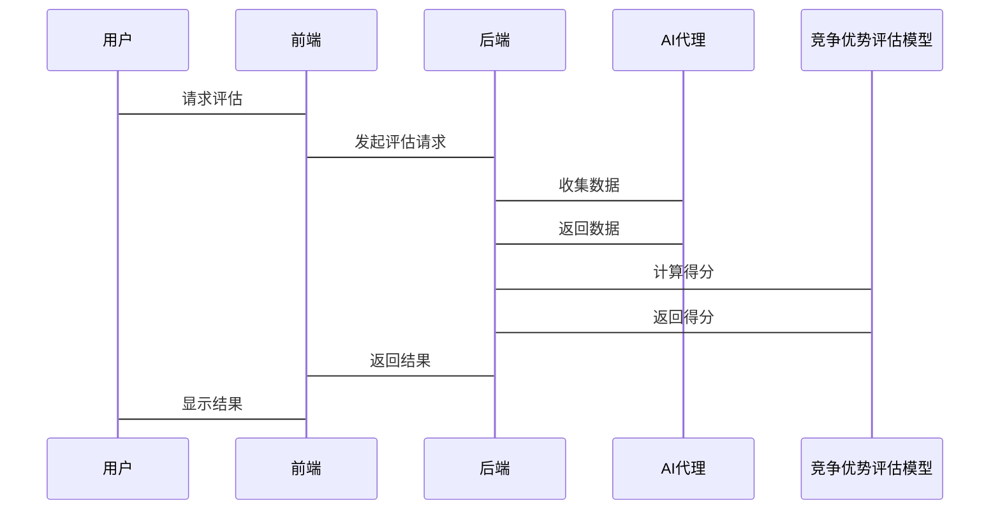

                 


# 利用AI agents构建动态竞争优势评估模型：护城河分析

## 关键词：AI代理、竞争优势评估、动态模型、护城河、系统架构

## 摘要：本文详细探讨了利用AI代理构建动态竞争优势评估模型的方法，分析了其在企业护城河中的应用价值。文章从背景、核心概念、算法原理到系统架构、项目实战，全面解析了如何通过AI技术提升竞争优势评估的动态性与准确性，为企业制定有效战略提供数据支持。

---

## 第一部分: 背景与核心概念

### 第1章: 动态竞争优势评估模型的背景与意义

#### 1.1 问题背景与问题描述

在现代商业环境中，企业的竞争优势并非一成不变。市场环境的变化、技术的进步、消费者偏好的转变等因素都会影响企业的竞争优势。传统的竞争优势评估方法往往基于静态的分析，无法实时捕捉这些动态变化。例如，一家企业可能在某一时期拥有强大的研发能力，但在市场需求转向用户体验时，这种优势可能迅速减弱。因此，企业需要一种能够动态评估其竞争优势的方法，以快速响应市场变化。

此外，竞争优势不仅仅体现在产品或服务本身，还包括企业的资源、能力、品牌、客户关系等多方面。如何量化这些因素，并实时更新评估结果，是企业面临的一个重要挑战。

#### 1.2 动态竞争优势评估模型的提出

动态竞争优势评估模型是一种能够实时更新企业竞争优势的模型。它通过整合多种数据源，包括市场数据、企业内部数据和外部环境数据，利用AI代理进行实时分析和评估。这种模型不仅可以帮助企业识别当前的竞争优势，还可以预测未来的变化趋势，从而制定更具前瞻性的战略。

#### 1.3 AI agents在竞争优势评估中的作用

AI代理（AI agents）是一种能够感知环境、自主决策并执行任务的智能实体。在竞争优势评估中，AI代理可以实时收集和分析大量的数据，识别关键的竞争因素，并提供动态的评估结果。例如，AI代理可以监控市场趋势、竞争对手的动态以及企业的内部运营情况，自动调整评估模型的参数，确保评估结果的准确性和及时性。

此外，AI代理还能够与企业内部的其他系统（如ERP、CRM）进行集成，获取实时数据，进一步提升评估的精准度。

#### 1.4 本章小结

本章介绍了动态竞争优势评估模型的背景和意义，重点探讨了AI代理在其中的作用。通过AI代理的实时数据处理能力，企业可以更准确地评估自身的竞争优势，并根据动态变化调整战略。

---

## 第二部分: 核心概念与原理

### 第2章: AI agents与竞争优势评估模型的核心概念

#### 2.1 核心概念原理

AI代理的核心原理是通过感知环境、分析数据、制定决策并执行任务。在竞争优势评估模型中，AI代理可以作为数据的收集者和分析者，实时更新评估结果。例如，AI代理可以通过爬取竞争对手的网站数据，分析其产品特点、价格策略等，从而帮助企业识别自身的竞争优势和劣势。

竞争优势评估模型则通过一系列的指标（如市场份额、利润率、客户满意度等）来量化企业的竞争优势。这些指标可以根据不同的权重进行加权计算，得出一个综合的评估结果。

#### 2.2 核心概念属性对比

以下是AI代理和竞争优势评估模型的核心属性对比：

| 属性                | AI代理                     | 竞争优势评估模型           |
|---------------------|---------------------------|---------------------------|
| 数据来源            | 多样化，包括外部和内部数据 | 多指标，如市场份额、利润率等 |
| 处理方式            | 实时分析，自主决策         | 静态或动态评估             |
| 输出结果            | 动态反馈，实时调整         | 综合评估结果               |

从上表可以看出，AI代理和竞争优势评估模型在数据来源、处理方式和输出结果上有明显的差异，但也相互补充。

#### 2.3 实体关系图（ER图）

以下是使用Mermaid绘制的实体关系图，展示了AI代理、竞争优势评估模型、企业、环境等实体之间的关系。

```mermaid
erd
    企业 -> AI代理: 使用
    竞争优势评估模型 -> 企业: 提供评估结果
    AI代理 -> 竞争优势评估模型: 提供数据支持
    竞争优势评估模型 -> 环境: 监控环境变化
```

从图中可以看出，企业使用AI代理收集数据，并将其输入竞争优势评估模型，模型根据环境变化实时更新评估结果，为企业提供动态的竞争优势分析。

---

## 第三部分: 算法原理与数学模型

### 第3章: 动态竞争优势评估模型的算法原理

#### 3.1 算法原理

动态竞争优势评估模型的核心算法基于多因素加权评分法。以下是使用Mermaid绘制的算法流程图：

```mermaid
graph TD
    A[开始] -> B[初始化参数]
    B -> C[收集数据]
    C -> D[计算各项指标]
    D -> E[权重分配]
    E -> F[计算加权得分]
    F -> G[动态调整权重]
    G -> H[输出结果]
    H -> A[结束]
```

从流程图中可以看出，模型首先收集数据，计算各项指标，然后根据权重分配计算加权得分，并动态调整权重，最终输出结果。

#### 3.2 数学模型与公式

以下是动态竞争优势评估模型的数学公式：

$$ 竞争优势得分 = \sum_{i=1}^{n} (权重_i \times 评估指标_i) $$

其中，权重_i 是第i个评估指标的权重，评估指标_i 是第i个评估指标的得分。

权重的动态调整公式如下：

$$ 动态调整因子 = \alpha \times 时间因素 + \beta \times 竞争环境变化 $$

其中，\alpha 和 \beta 是调整系数，时间因素表示时间的变化对权重的影响，竞争环境变化表示竞争环境的变化对权重的影响。

#### 3.3 代码实现示例

以下是Python代码实现示例：

```python
def calculate_competitive_edge(assessment_metrics, weights):
    return sum(metric * weight for metric, weight in zip(assessment_metrics, weights))

# 示例数据
assessment_metrics = [0.8, 0.6, 0.9]
weights = [0.5, 0.3, 0.2]

# 计算竞争优势得分
score = calculate_competitive_edge(assessment_metrics, weights)
print(f"竞争优势得分: {score}")
```

输出结果为：

```
竞争优势得分: 0.8*0.5 + 0.6*0.3 + 0.9*0.2 = 0.4 + 0.18 + 0.18 = 0.76
```

---

## 第四部分: 系统分析与架构设计

### 第4章: 系统分析与架构方案

#### 4.1 问题场景介绍

在动态竞争优势评估模型的系统设计中，我们需要解决以下几个问题：

1. 如何实时收集和处理大量的数据？
2. 如何动态调整评估模型的参数？
3. 如何保证系统的可扩展性和可维护性？

#### 4.2 系统功能设计

以下是系统功能模块的类图：



从类图中可以看出，系统由竞争优势评估模型和AI代理两个主要模块组成，AI代理负责数据的收集和分析，竞争优势评估模型负责计算得分和调整权重。

#### 4.3 系统架构设计

以下是系统架构的Mermaid图：



从图中可以看出，用户通过前端与系统交互，前端将请求发送到后端，后端调用AI代理和竞争优势评估模型进行分析，并将结果反馈给用户。

#### 4.4 接口设计与交互

以下是接口设计的Mermaid序列图：



---

## 第五部分: 项目实战

### 第5章: 项目实战与案例分析

#### 5.1 环境安装

要实现动态竞争优势评估模型，需要以下环境：

- Python 3.8+
- Anaconda 或其他Python发行版
- Jupyter Notebook 或 VS Code
- AI代理框架（如LangChain）
- 数据库（如MySQL、MongoDB）

#### 5.2 核心代码实现

以下是竞争优势评估模型的核心代码实现：

```python
from langchain import AIProxy, InternetInfoAgent

# 初始化AI代理
ai_proxy = AIProxy()
internet_agent = InternetInfoAgent(ai_proxy=ai_proxy)

# 收集数据
data = internet_agent.send_message("获取竞争对手的市场数据")

# 计算竞争优势得分
def calculate_competitive_edge(assessment_metrics, weights):
    return sum(metric * weight for metric, weight in zip(assessment_metrics, weights))

# 示例数据
assessment_metrics = [0.8, 0.6, 0.9]
weights = [0.5, 0.3, 0.2]

# 计算竞争优势得分
score = calculate_competitive_edge(assessment_metrics, weights)
print(f"竞争优势得分: {score}")
```

#### 5.3 案例分析

以一家科技公司为例，假设其竞争优势评估指标包括市场份额、利润率和客户满意度，权重分别为0.5、0.3和0.2。当前的评估指标分别为0.8、0.6和0.9。计算竞争优势得分如下：

$$ 竞争优势得分 = 0.8 \times 0.5 + 0.6 \times 0.3 + 0.9 \times 0.2 = 0.4 + 0.18 + 0.18 = 0.76 $$

---

## 第六部分: 最佳实践与总结

### 第6章: 最佳实践与总结

#### 6.1 最佳实践

- 定期更新评估模型的权重和指标，确保模型的准确性。
- 确保数据源的多样性和实时性，提高模型的动态调整能力。
- 结合企业的实际业务需求，灵活调整模型的参数。

#### 6.2 小结

本文详细探讨了利用AI代理构建动态竞争优势评估模型的方法，从背景、核心概念到算法原理和系统架构，再到项目实战，全面解析了如何通过AI技术提升竞争优势评估的动态性和准确性。

#### 6.3 注意事项

- 在实际应用中，需要考虑数据隐私和安全问题。
- 确保模型的可解释性，避免黑箱操作。
- 定期监控模型的性能，及时发现和解决问题。

#### 6.4 拓展阅读

- 《AI代理与动态数据分析》
- 《竞争优势评估模型的优化与应用》
- 《动态系统架构设计与实现》

---

## 总结

通过本文的介绍，读者可以全面了解如何利用AI代理构建动态竞争优势评估模型，并通过实际案例和代码实现，掌握其核心原理和应用方法。希望本文能够为企业的竞争优势评估提供新的思路和方法，帮助企业在动态竞争环境中保持优势。

--- 

感谢您的耐心阅读，希望本文对您有所帮助！

