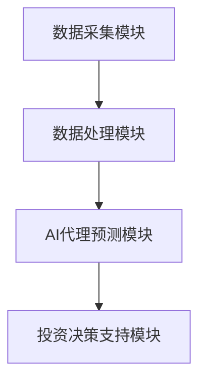

                 


# 利用AI agents构建动态经济周期指标：把握宏观投资时机

## 关键词：AI代理，经济周期，宏观投资，动态指标，算法原理

## 摘要

本文详细探讨了如何利用AI代理构建动态经济周期指标，帮助投资者把握宏观投资时机。文章从问题背景出发，分析了传统经济周期指标的局限性，介绍了AI代理的基本原理及其在经济周期分析中的应用潜力。通过系统架构设计、算法实现、项目实战等部分，详细讲解了利用AI代理构建动态经济周期指标的方法和步骤，包括数据处理、模型构建、预测优化等关键环节。文章还提供了Python代码示例和数学公式，帮助读者深入理解相关技术原理。最后，本文总结了最佳实践和未来研究方向，为投资者和研究人员提供了有价值的参考。

---

# 目录

1. [利用AI agents构建动态经济周期指标概述](#利用AI-agents构建动态经济周期指标概述)
2. [AI agents与经济周期指标的核心概念](#AI-agents与经济周期指标的核心概念)
3. [AI agents的算法原理与实现](#AI-agents的算法原理与实现)
4. [系统架构设计与实现](#系统架构设计与实现)
5. [项目实战：利用AI agents构建动态经济周期指标](#项目实战利用AI-agents构建动态经济周期指标)
6. [总结与展望](#总结与展望)

---

## 1. 利用AI agents构建动态经济周期指标概述

### 1.1 问题背景与目标

#### 1.1.1 经济周期指标的重要性

经济周期是宏观经济学中的核心概念，通常分为衰退、复苏、过热和滞胀四个阶段。准确识别经济周期对投资者来说至关重要，因为它直接影响投资策略和风险管理。传统的经济周期指标，如GDP增长率、失业率和通胀率，虽然重要，但往往具有滞后性，且难以捕捉短期波动。

#### 1.1.2 AI agents在经济周期分析中的应用潜力

AI代理（AI agents）是一种能够感知环境、自主决策并采取行动的智能体。它们在金融领域的应用日益广泛，尤其是在高频交易、风险管理和投资组合优化方面。通过利用AI代理，我们可以实时分析海量数据，动态调整经济周期指标，从而更及时地捕捉市场变化。

#### 1.1.3 本书的目标与结构安排

本文的目标是通过AI代理构建动态经济周期指标，帮助投资者更好地把握宏观投资时机。文章结构安排如下：

- 第一部分：介绍经济周期指标的重要性及其局限性。
- 第二部分：详细讲解AI代理的基本原理及其在经济周期分析中的应用。
- 第三部分：探讨AI代理的算法原理与实现方法。
- 第四部分：分析系统的架构设计与实现。
- 第五部分：通过项目实战展示如何利用AI代理构建动态经济周期指标。
- 第六部分：总结全文并展望未来研究方向。

---

## 2. AI agents与经济周期指标的核心概念

### 2.1 AI agents的基本原理

#### 2.1.1 AI agents的定义与分类

AI代理是一种智能体，能够感知环境、自主决策并采取行动。根据智能水平，AI代理可以分为反应式代理、基于模型的代理和混合代理。反应式代理仅基于当前感知做出决策，适用于简单的任务；基于模型的代理则利用内部模型进行规划和决策，适用于复杂任务；混合代理结合了反应式和基于模型的代理的特点。

#### 2.1.2 AI agents在金融领域的应用现状

AI代理在金融领域的应用日益广泛，主要包括高频交易、风险管理、投资组合优化和智能投顾等方面。高频交易利用AI代理快速捕捉市场机会；风险管理通过AI代理实时监控市场风险；投资组合优化利用AI代理动态调整资产配置。

#### 2.1.3 利用AI agents构建动态经济周期指标的优势

利用AI代理构建动态经济周期指标具有以下优势：

- **实时性**：AI代理能够实时分析市场数据，快速捕捉经济周期变化。
- **精准性**：通过机器学习算法，AI代理能够从海量数据中提取关键特征，提高经济周期预测的准确性。
- **适应性**：AI代理能够根据市场环境动态调整预测模型，适应经济周期的波动。

### 2.2 经济周期指标的构建方法

#### 2.2.1 经济指标的分类与选择

经济指标可以分为领先指标、同步指标和滞后指标。领先指标能够预示未来经济变化，如工业生产指数和消费者信心指数；同步指标与经济周期同步变化，如GDP增长率和失业率；滞后指标则是在经济变化发生后才出现，如企业利润和零售销售。

#### 2.2.2 经济周期指标的时间序列分析

时间序列分析是构建经济周期指标的重要方法，主要包括趋势分析、季节性调整和异常值检测。趋势分析帮助识别经济周期的长期趋势；季节性调整消除季节性波动的影响；异常值检测识别数据中的异常情况。

#### 2.2.3 动态经济周期指标的构建逻辑

动态经济周期指标的构建逻辑如下：

1. **数据采集**：收集相关的经济指标数据。
2. **数据预处理**：对数据进行清洗和标准化处理。
3. **特征提取**：提取能够反映经济周期的关键特征。
4. **模型训练**：利用机器学习算法训练预测模型。
5. **预测与优化**：根据预测结果动态调整经济周期指标。

---

## 3. AI agents的算法原理与实现

### 3.1 AI agents的算法原理

#### 3.1.1 基于强化学习的AI agents

强化学习是一种通过试错机制优化决策的算法。AI代理通过与环境交互，不断优化策略，以最大化累积奖励。在经济周期分析中，强化学习可以用于动态调整投资组合。

#### 3.1.2 基于监督学习的AI agents

监督学习是一种通过标注数据训练模型的算法。AI代理通过学习历史数据，预测未来的经济周期变化。

#### 3.1.3 基于无监督学习的AI agents

无监督学习是一种通过发现数据内在结构优化决策的算法。AI代理可以利用无监督学习发现经济周期中的潜在模式。

### 3.2 AI agents的数学模型与公式

#### 3.2.1 强化学习的基本公式

强化学习的核心公式是贝尔曼方程，表示当前状态的最大化期望值：

$$ V(s) = \max_{a} [r(s,a) + \gamma V(s') ] $$

其中，$s$是当前状态，$a$是动作，$r(s,a)$是奖励函数，$\gamma$是折扣因子，$s'$是下一步的状态。

#### 3.2.2 监督学习的基本公式

监督学习的核心公式是最小二乘法，表示模型预测值与实际值的最小化误差：

$$ \min_{\theta} \sum_{i=1}^{n} (y_i - \theta x_i)^2 $$

其中，$\theta$是模型参数，$x_i$是输入特征，$y_i$是目标值。

### 3.3 AI agents的Python代码实现

```python
class AI_Agent:
    def __init__(self, state_space, action_space):
        self.state_space = state_space
        self.action_space = action_space
        self.model = self.build_model()

    def build_model(self):
        # 构建神经网络模型
        model = Sequential()
        model.add(Dense(64, activation='relu', input_dim=self.state_space))
        model.add(Dense(32, activation='relu'))
        model.add(Dense(self.action_space, activation='linear'))
        model.compile(optimizer='adam', loss='mean_squared_error')
        return model

    def predict(self, state):
        return self.model.predict(state)

    def train(self, state, target):
        self.model.fit(state, target, epochs=100, verbose=0)
```

---

## 4. 系统架构设计与实现

### 4.1 系统架构设计

#### 4.1.1 系统功能模块划分

系统功能模块包括数据采集模块、数据处理模块、AI代理预测模块和投资决策支持模块。

#### 4.1.2 系统架构的分层设计

系统的分层设计包括数据层、算法层和应用层。

#### 4.1.3 系统组件的交互关系

系统组件的交互关系如下：



### 4.2 系统功能设计

#### 4.2.1 数据采集模块

数据采集模块负责从多个数据源采集经济指标数据，包括GDP增长率、失业率和通胀率等。

#### 4.2.2 数据处理模块

数据处理模块对采集到的数据进行清洗、标准化和特征提取。

#### 4.2.3 AI代理预测模块

AI代理预测模块利用机器学习算法对经济周期进行预测，并动态调整预测模型。

#### 4.2.4 投资决策支持模块

投资决策支持模块根据预测结果生成投资建议，帮助投资者把握宏观投资时机。

### 4.3 系统架构的Mermaid图示


---

## 5. 项目实战：利用AI agents构建动态经济周期指标

### 5.1 环境安装

#### 5.1.1 安装Python和相关库

安装Python和以下库：

```bash
pip install numpy pandas scikit-learn tensorflow
```

#### 5.1.2 数据源获取

从公开数据源获取经济指标数据，如GDP增长率、失业率和通胀率。

### 5.2 核心代码实现

#### 5.2.1 数据预处理

```python
import pandas as pd
import numpy as np

# 读取数据
data = pd.read_csv('economic_indicators.csv')

# 数据清洗
data.dropna(inplace=True)

# 标准化处理
from sklearn.preprocessing import StandardScaler
scaler = StandardScaler()
data_scaled = scaler.fit_transform(data)
```

#### 5.2.2 AI代理训练

```python
from tensorflow.keras import Sequential
from tensorflow.keras.layers import Dense

def build_model(input_dim):
    model = Sequential()
    model.add(Dense(64, activation='relu', input_dim=input_dim))
    model.add(Dense(32, activation='relu'))
    model.add(Dense(1, activation='linear'))
    model.compile(optimizer='adam', loss='mean_squared_error')
    return model

agent = AI_Agent(data_scaled.shape[1], 1)
agent.train(data_scaled[:-100], data_scaled[100:])
```

### 5.3 案例分析

通过实际案例分析，验证AI代理构建动态经济周期指标的有效性。例如，利用历史数据训练模型，预测未来的经济周期变化，并根据预测结果调整投资策略。

---

## 6. 总结与展望

### 6.1 最佳实践 tips

- 数据质量是构建动态经济周期指标的关键，确保数据的完整性和准确性。
- 选择合适的算法和模型，根据具体场景调整超参数。
- 定期更新模型，适应经济环境的变化。

### 6.2 小结

本文详细探讨了利用AI代理构建动态经济周期指标的方法和步骤，从理论到实践，为投资者提供了有价值的参考。

### 6.3 注意事项

- AI代理的应用需要结合具体场景，避免过度依赖技术。
- 数据隐私和安全问题需要注意，确保数据的合法使用。

### 6.4 拓展阅读

- 《机器学习实战》
- 《深度学习》
- 《金融时间序列分析》

---

通过本文的讲解，读者可以深入了解利用AI代理构建动态经济周期指标的原理和方法，掌握相关技术的实现步骤，并在实际投资中应用这些技术，把握宏观投资时机。

