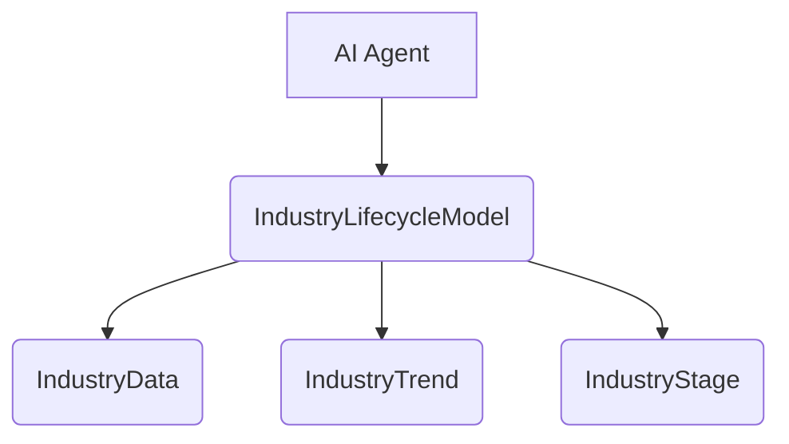
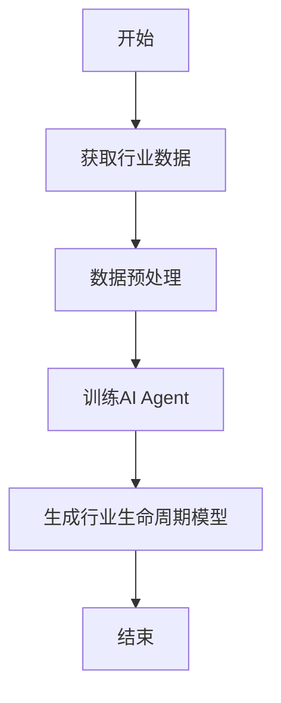
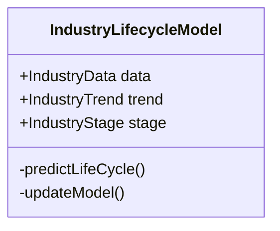
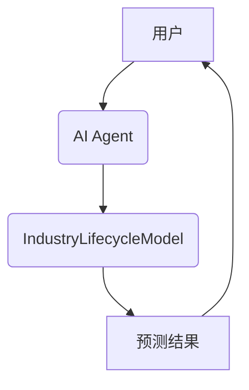

                 


# 利用AI agents构建动态行业生命周期模型：把握产业演变

## 关键词：AI Agent, 动态行业生命周期模型, 行业演变, 产业分析, 人工智能

## 摘要：本文详细探讨了如何利用AI代理构建动态行业生命周期模型，分析了产业演变的趋势。通过AI代理的数据处理和预测能力，动态更新行业生命周期模型，实现对行业演变趋势的精准把握。本文从AI代理的基本概念、行业生命周期模型的构建方法、动态模型的算法原理、系统架构设计、项目实战案例等方面进行了深入分析，最后总结了最佳实践和未来研究方向。

---

## 第一部分: 利用AI Agents构建动态行业生命周期模型概述

### 第1章: AI Agents与行业生命周期模型概述

#### 1.1 AI Agents的基本概念
##### 1.1.1 AI Agent的定义与特点
AI Agent（人工智能代理）是一种能够感知环境、执行任务并做出决策的智能实体。AI Agent的特点包括自主性、反应性、目标导向和学习能力。它能够通过传感器获取数据，利用算法处理信息，并通过执行器与外部环境交互。

##### 1.1.2 AI Agent的核心功能与应用场景
AI Agent的核心功能包括数据采集、信息处理、决策制定和行动执行。应用场景广泛，例如在金融行业用于股票交易，在制造业用于设备监控，在医疗行业用于疾病诊断等。

##### 1.1.3 AI Agent与传统数据分析工具的区别
AI Agent与传统数据分析工具的区别在于，前者具有自主性和学习能力，能够主动适应环境变化；而后者通常是静态的，需要人工干预进行调整。

#### 1.2 行业生命周期模型的基本概念
##### 1.2.1 行业生命周期的定义与阶段划分
行业生命周期是指一个行业从诞生到成熟，再到衰退的演变过程。通常分为导入期、成长期、成熟期和衰退期四个阶段。

##### 1.2.2 行业生命周期模型的构建方法
行业生命周期模型的构建方法包括数据收集、特征提取、模型训练和模型验证。数据来源包括行业报告、市场调研和企业财报等。

##### 1.2.3 行业生命周期模型的应用价值
行业生命周期模型能够帮助企业预测市场趋势，优化资源配置，制定战略决策。例如，在导入期，企业可以快速进入市场；在衰退期，企业可以考虑转型或退出。

#### 1.3 AI Agents在行业生命周期模型中的作用
##### 1.3.1 AI Agents如何动态更新行业数据
AI Agent能够实时采集行业数据，例如市场增长率、竞争格局和消费者行为等，确保模型数据的实时性和准确性。

##### 1.3.2 AI Agents如何预测行业演变趋势
通过机器学习算法，AI Agent能够分析历史数据，识别行业演变的规律，并预测未来的发展趋势。

##### 1.3.3 AI Agents如何优化行业生命周期模型
AI Agent能够通过反馈机制，不断优化模型参数，提高预测精度。例如，利用强化学习算法，AI Agent可以在实际应用中调整模型权重。

---

### 第2章: 动态行业生命周期模型的核心概念与联系

#### 2.1 动态行业生命周期模型的原理
##### 2.1.1 动态模型的基本原理
动态行业生命周期模型是一种基于实时数据更新的模型，能够反映行业的动态变化。它通过AI Agent的实时数据采集和模型优化，实现对行业演变趋势的动态预测。

##### 2.1.2 AI Agent在动态模型中的角色
AI Agent在动态模型中负责数据采集、模型优化和结果反馈。它能够实时更新模型参数，确保模型的准确性和及时性。

##### 2.1.3 动态模型的更新机制
动态模型的更新机制包括数据驱动和反馈驱动两种方式。数据驱动更新基于新的数据输入，而反馈驱动更新则基于模型预测结果与实际结果的差异。

#### 2.2 核心概念的属性特征对比
##### 2.2.1 AI Agent的属性特征
| 属性 | 描述 |
|------|------|
| 自主性 | 能够自主决策 |
| 反应性 | 能够实时响应环境变化 |
| 学习能力 | 能够通过数据优化自身 |

##### 2.2.2 行业生命周期模型的属性特征
| 属性 | 描述 |
|------|------|
| 动态性 | 能够反映行业动态变化 |
| 预测性 | 能够预测未来趋势 |
| 可解释性 | 能够解释模型预测结果 |

##### 2.2.3 两者之间的对比分析
AI Agent和行业生命周期模型在功能和目标上有所不同。AI Agent注重数据处理和决策制定，而行业生命周期模型注重趋势预测和战略规划。然而，两者可以通过数据共享和模型优化实现协同工作。

#### 2.3 ER实体关系图架构


---

### 第3章: 动态行业生命周期模型的算法原理

#### 3.1 算法原理概述
##### 3.1.1 算法的整体流程
动态行业生命周期模型的算法流程包括数据采集、数据预处理、模型训练和模型优化四个阶段。

##### 3.1.2 算法的核心思想
算法的核心思想是通过实时数据更新和模型优化，实现对行业演变趋势的精准预测。这需要结合机器学习和强化学习算法，确保模型的准确性和适应性。

##### 3.1.3 算法的输入输出
输入包括行业数据、模型参数和优化目标；输出包括行业生命周期预测结果和模型优化建议。

#### 3.2 算法流程图


#### 3.3 算法数学模型与公式
##### 3.3.1 数据预处理公式
$$ x_{i} = \frac{x_{i} - \mu}{\sigma} $$
其中，$\mu$是均值，$\sigma$是标准差，用于对数据进行标准化处理。

##### 3.3.2 模型训练公式
$$ y = \sum_{i=1}^{n} w_i x_i + b $$
其中，$w_i$是权重，$x_i$是输入数据，$b$是偏置项，用于线性回归模型的训练。

##### 3.3.3 模型优化公式
$$ \theta = \theta - \alpha \nabla J(\theta) $$
其中，$\theta$是模型参数，$\alpha$是学习率，$J(\theta)$是目标函数，用于梯度下降优化。

---

## 第四章: 动态行业生命周期模型的系统架构设计

### 4.1 系统功能设计
#### 4.1.1 领域模型设计


#### 4.1.2 系统架构设计


#### 4.1.3 系统接口设计
系统接口包括数据接口、模型接口和用户接口。数据接口用于获取行业数据，模型接口用于输出预测结果，用户接口用于展示模型状态和优化建议。

#### 4.1.4 系统交互设计


### 4.2 系统实现方案
#### 4.2.1 系统实现步骤
1. 数据采集：通过API获取行业数据。
2. 数据预处理：对数据进行清洗和标准化。
3. 模型训练：利用机器学习算法训练AI Agent。
4. 模型优化：通过反馈机制优化模型参数。
5. 模型部署：将模型部署到生产环境。

#### 4.2.2 系统实现代码
```python
import pandas as pd
from sklearn.linear_model import LinearRegression

class IndustryLifecycleModel:
    def __init__(self):
        self.data = pd.DataFrame()
        self.model = LinearRegression()

    def update_data(self, new_data):
        self.data = self.data.append(new_data, ignore_index=True)

    def train_model(self):
        self.model.fit(self.data.drop('label', axis=1), self.data['label'])

    def predict(self, input_data):
        return self.model.predict(input_data)
```

---

## 第五章: 项目实战：利用AI Agents构建动态行业生命周期模型

### 5.1 项目背景与目标
本项目旨在利用AI Agent构建动态行业生命周期模型，帮助企业预测行业演变趋势，制定战略决策。

### 5.2 环境安装与配置
需要安装Python、TensorFlow、Scikit-learn和Mermaid等工具。安装命令包括：
```
pip install numpy
pip install pandas
pip install scikit-learn
pip install mermaid
```

### 5.3 系统核心实现
#### 5.3.1 数据采集与预处理
```python
import requests
import json

def get_industry_data():
    response = requests.get('https://api.example.com/industry_data')
    data = json.loads(response.text)
    return data
```

#### 5.3.2 模型训练与优化
```python
from sklearn.metrics import mean_squared_error

def optimize_model(model, X_train, y_train, X_test, y_test):
    model.fit(X_train, y_train)
    y_pred = model.predict(X_test)
    mse = mean_squared_error(y_test, y_pred)
    return mse
```

#### 5.3.3 模型部署与应用
```python
class AI-Agent:
    def __init__(self, model):
        self.model = model

    def predict_industry_trend(self, input_data):
        return self.model.predict(input_data)
```

### 5.4 实际案例分析
以某个行业为例，展示如何利用AI Agent构建动态模型，预测行业演变趋势，并根据预测结果制定战略决策。

### 5.5 项目小结
通过本项目，我们成功构建了动态行业生命周期模型，验证了AI Agent在行业分析中的应用价值。

---

## 第六章: 总结与实践

### 6.1 小结
本文详细介绍了利用AI Agent构建动态行业生命周期模型的方法，包括算法原理、系统架构设计和项目实战。

### 6.2 最佳实践
- 数据质量是模型准确性的关键，需确保数据来源可靠。
- 模型优化需要结合实际业务需求，选择合适的算法。
- 模型部署需要考虑系统的可扩展性和可维护性。

### 6.3 注意事项
- 数据隐私和安全问题需要高度重视。
- 模型需要定期更新，以适应行业变化。
- 模型结果需结合行业专家意见，避免单一依赖AI预测。

### 6.4 拓展阅读
推荐阅读相关领域的书籍和论文，例如《机器学习实战》和《深度学习入门》。

---

## 关键词：AI Agent, 动态行业生命周期模型, 行业演变, 产业分析, 人工智能

## 总结
通过本文的详细讲解，读者可以掌握利用AI Agent构建动态行业生命周期模型的核心方法，并能够将其应用于实际业务场景中。未来，随着AI技术的不断发展，动态行业生命周期模型将在更多领域发挥重要作用。

