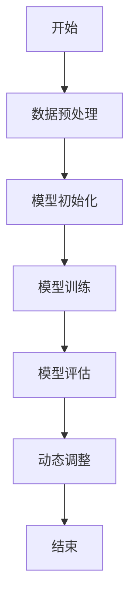
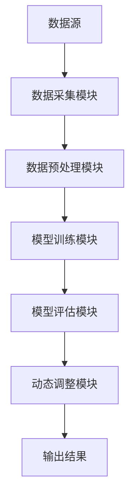
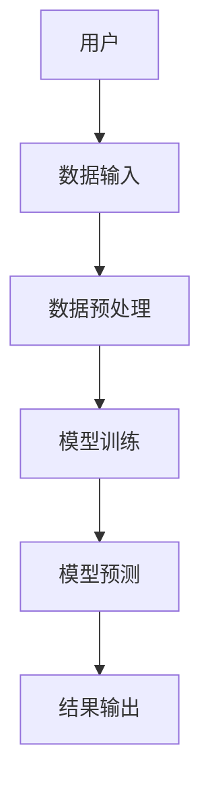

                 


# 利用AI agents构建自适应型估值模型：应对市场变化

## 关键词：AI代理、自适应估值模型、市场变化、金融建模、动态调整

## 摘要：  
随着市场环境的快速变化，传统的静态估值模型已难以满足企业的需求。本文探讨了如何利用AI代理构建自适应型估值模型，以实时捕捉市场动态并优化估值过程。文章从背景、原理、算法实现到系统设计和项目实战，全面解析了利用AI代理构建自适应估值模型的方法，为企业应对市场变化提供了新的思路。

---

## 第一部分: 背景与概述

### 第1章: 自适应估值模型与AI代理概述

#### 1.1 问题背景与技术背景
现代金融市场瞬息万变，企业估值需要面对复杂多变的内外部环境。传统的估值模型通常基于历史数据和固定假设，难以适应市场动态变化。例如，经济波动、政策调整或突发事件都可能对估值结果产生重大影响，而静态模型难以及时捕捉这些变化。  

AI代理（AI Agents）是一种能够感知环境、自主决策并采取行动的智能实体。通过结合AI代理，我们可以构建自适应型估值模型，使其能够实时调整参数和假设，以应对市场变化。

#### 1.2 自适应估值模型的核心概念
自适应估值模型是一种能够根据市场变化自动调整其内部参数和假设的动态模型。其核心在于通过实时数据输入和反馈机制，不断优化模型的预测能力和估值精度。  

AI代理在自适应模型中的作用主要体现在以下几个方面：
1. **数据采集与处理**：AI代理可以实时采集市场数据，如价格、成交量、行业趋势等，并进行预处理。
2. **模型调整**：通过机器学习算法，AI代理能够识别数据中的模式和趋势，并调整模型参数以适应新的市场环境。
3. **决策与反馈**：AI代理根据模型输出的结果，生成最优的估值方案，并通过反馈机制不断优化模型性能。

#### 1.3 AI代理与自适应模型的联系
AI代理与自适应估值模型的结合，使得模型能够实时响应市场变化。例如，在经济危机期间，AI代理可以通过分析新闻、社交媒体和市场数据，快速识别潜在风险，并调整模型参数以反映新的市场环境。

---

## 第二部分: 核心概念与原理

### 第2章: AI代理与自适应模型的核心原理

#### 2.1 AI代理的定义与工作原理
AI代理是一种智能实体，能够通过传感器或接口与环境交互，并基于感知的信息做出决策和行动。其核心工作流程包括：
1. **感知环境**：通过数据采集模块获取外部信息。
2. **分析与决策**：利用机器学习算法对数据进行分析，并生成决策方案。
3. **执行行动**：根据决策结果采取行动，并将结果反馈到环境中。

#### 2.2 自适应估值模型的数学基础
自适应模型通常基于回归分析、时间序列分析或神经网络等技术。其数学表达式可以表示为：  
$$f(x) = w_1x_1 + w_2x_2 + ... + w_nx_n$$  
其中，$w_i$是模型的权重参数，$x_i$是输入变量。通过机器学习算法，模型可以动态调整权重，以适应新的数据输入。

#### 2.3 AI代理与自适应模型的关系
AI代理通过实时数据输入和反馈机制，驱动自适应模型的动态调整。例如，当市场环境发生变化时，AI代理会触发模型重新训练，并更新其权重参数。这种动态调整使得模型能够更好地反映当前市场状况。

---

## 第三部分: 算法原理与实现

### 第3章: 自适应估值模型的算法实现

#### 3.1 算法原理概述
自适应估值模型的核心算法包括：
1. **数据预处理**：清洗和标准化输入数据。
2. **模型训练**：使用机器学习算法（如随机森林、神经网络）训练模型。
3. **模型评估**：通过交叉验证评估模型性能。
4. **动态调整**：根据实时数据更新模型参数。

#### 3.2 算法实现步骤
1. **数据预处理**：  
   - 数据清洗：处理缺失值、异常值等。  
   - 数据标准化：将数据归一化到相同范围内。  

2. **模型训练**：  
   - 使用训练数据训练模型。  
   - 调整模型超参数（如学习率、正则化系数）以优化性能。  

3. **模型评估**：  
   - 使用测试数据评估模型的准确率、召回率等指标。  
   - 根据评估结果调整模型结构或参数。  

4. **动态调整**：  
   - 根据实时数据更新模型参数。  
   - 使用反馈机制优化模型性能。  

#### 3.3 通过 Mermaid 流程图展示算法流程


#### 3.4 Python 实现示例
以下是使用Python实现自适应估值模型的代码示例：
```python
import numpy as np
import pandas as pd
from sklearn.model_selection import train_test_split
from sklearn.linear_model import LinearRegression
from sklearn.metrics import mean_squared_error

# 数据预处理
data = pd.read_csv('market_data.csv')
X = data[['price', 'volume', 'sentiment']]
y = data['value']

# 数据分割
X_train, X_test, y_train, y_test = train_test_split(X, y, test_size=0.2, random_state=42)

# 模型训练
model = LinearRegression()
model.fit(X_train, y_train)

# 模型评估
y_pred = model.predict(X_test)
mse = mean_squared_error(y_test, y_pred)
print(f'均方误差: {mse}')

# 动态调整（示例）
# 假设我们有新的数据输入
new_data = pd.read_csv('new_market_data.csv')
new_X = new_data[['price', 'volume', 'sentiment']]
new_y = model.predict(new_X)
```

---

## 第四部分: 系统设计与架构

### 第4章: 系统设计与架构

#### 4.1 系统功能设计
自适应估值模型系统的主要功能包括：
1. **数据采集**：实时采集市场数据。  
2. **模型训练**：基于数据训练自适应模型。  
3. **模型评估**：评估模型性能并优化参数。  
4. **动态调整**：根据实时数据更新模型。  

#### 4.2 系统架构设计
以下是系统的架构图：


#### 4.3 接口设计
系统主要接口包括：
1. **数据输入接口**：接收市场数据。  
2. **模型接口**：提供模型训练和预测的API。  
3. **结果输出接口**：输出估值结果。  

#### 4.4 交互流程设计
以下是系统的交互流程图：


---

## 第五部分: 项目实战

### 第5章: 项目实战

#### 5.1 项目环境安装
要运行本项目，需要安装以下Python库：
- `pandas`
- `numpy`
- `scikit-learn`

安装命令：
```bash
pip install pandas numpy scikit-learn
```

#### 5.2 系统核心实现
以下是系统的核心实现代码：
```python
import numpy as np
import pandas as pd
from sklearn.linear_model import LinearRegression
from sklearn.metrics import mean_squared_error

def load_data(file_path):
    return pd.read_csv(file_path)

def preprocess_data(data):
    # 数据清洗和标准化
    data.dropna(inplace=True)
    data = data[['price', 'volume', 'sentiment', 'value']]
    return data

def train_model(X_train, y_train):
    model = LinearRegression()
    model.fit(X_train, y_train)
    return model

def evaluate_model(model, X_test, y_test):
    y_pred = model.predict(X_test)
    mse = mean_squared_error(y_test, y_pred)
    print(f'均方误差: {mse}')
    return model

def adapt_model(model, new_data):
    new_X = new_data[['price', 'volume', 'sentiment']]
    new_y_pred = model.predict(new_X)
    return new_y_pred

# 主函数
def main():
    # 加载数据
    data = load_data('market_data.csv')
    # 数据预处理
    processed_data = preprocess_data(data)
    # 数据分割
    X = processed_data[['price', 'volume', 'sentiment']]
    y = processed_data['value']
    X_train, X_test, y_train, y_test = train_test_split(X, y, test_size=0.2, random_state=42)
    # 模型训练
    model = train_model(X_train, y_train)
    # 模型评估
    evaluate_model(model, X_test, y_test)
    # 动态调整
    new_data = load_data('new_market_data.csv')
    new_processed_data = preprocess_data(new_data)
    new_X = new_processed_data[['price', 'volume', 'sentiment']]
    predictions = adapt_model(model, new_X)
    print(f'预测值: {predictions}')

if __name__ == '__main__':
    main()
```

#### 5.3 项目总结
通过本项目，我们展示了如何利用AI代理构建自适应型估值模型。该模型能够实时捕捉市场变化，并动态调整其参数以适应新的市场环境。未来，我们可以进一步优化模型结构，引入更复杂的算法（如深度学习）来提高模型的预测精度。

---

## 第六部分: 总结与扩展

### 第6章: 总结与扩展

#### 6.1 总结
本文详细探讨了利用AI代理构建自适应型估值模型的方法。通过结合AI代理的实时感知和机器学习算法的动态调整能力，我们可以构建出能够应对市场变化的自适应模型。该模型在金融、经济等领域具有广泛的应用前景。

#### 6.2 注意事项
在实际应用中，需要注意以下几点：
1. **数据质量**：确保数据的准确性和完整性。  
2. **模型优化**：定期更新模型参数以保持其性能。  
3. **风险管理**：建立风险控制机制以应对模型失效的情况。  

#### 6.3 拓展阅读
1. 《机器学习实战》—— 周志华  
2. 《深度学习》—— Ian Goodfellow  
3. 《强化学习》—— Richard S. Sutton  

---

通过本文的探讨，我们相信利用AI代理构建自适应型估值模型将成为未来金融建模的重要方向。

