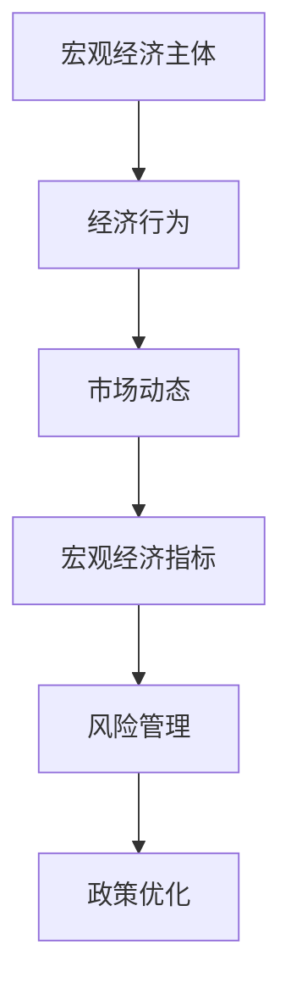
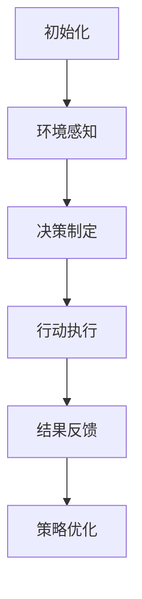
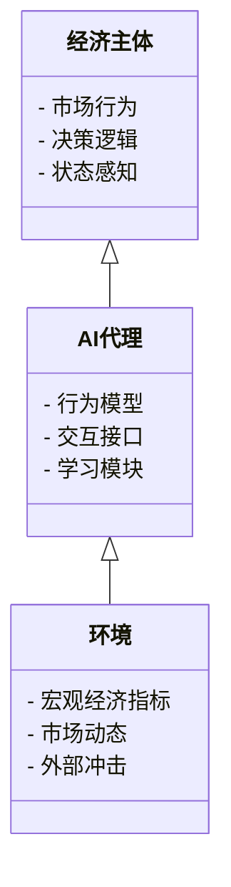
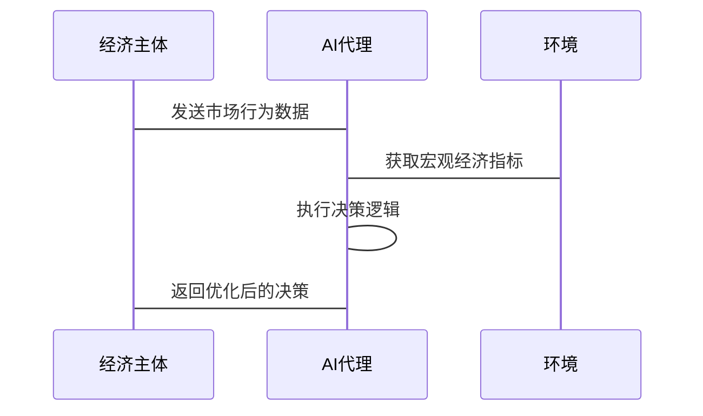

                 

<think>
好的，我将按照用户的要求，逐步分析和撰写这篇关于利用AI agents进行全球宏观经济情景模拟的技术博客文章。首先，我会明确文章的核心内容和结构，确保每一部分都符合逻辑和专业要求。

---

### 文章标题
**利用AI agents进行全球宏观经济情景模拟：增强风险管理**

---

### 关键词
1. AI agents
2. 宏观经济情景模拟
3. 风险管理
4. 多智能体系统
5. 经济预测

---

### 摘要
本文探讨了如何利用人工智能代理（AI agents）进行全球宏观经济情景模拟，以增强风险管理能力。通过分析宏观经济模拟的核心概念、AI代理的算法原理以及多智能体系统的架构设计，本文提出了一种基于AI代理的宏观经济模拟框架。通过实际案例和系统设计，展示了如何利用AI代理技术实现宏观经济预测、政策模拟和风险评估，从而为政策制定者和市场参与者提供有力支持。本文最后总结了AI代理在宏观经济模拟中的优势和未来发展方向。

---

### 目录大纲结构
#### 第一部分：AI agents与宏观经济模拟的背景与基础
- 第1章：宏观经济模拟的背景与挑战
  - 1.1 宏观经济模拟的核心概念
    - 1.1.1 宏观经济模拟的定义与目标
    - 1.1.2 宏观经济模拟的复杂性与挑战
    - 1.1.3 增强风险管理的重要性
  - 1.2 AI agents的基本概念
    - 1.2.1 AI agents的定义与分类
    - 1.2.2 多智能体系统的特点与优势
    - 1.2.3 AI agents在宏观经济模拟中的作用
- 第2章：宏观经济情景模拟与AI agents的结合
  - 2.1 宏观经济情景模拟的场景
    - 2.1.1 经济预测与风险评估
    - 2.1.2 政策模拟与优化
    - 2.1.3 市场行为分析与模拟
  - 2.2 AI agents在宏观经济模拟中的应用
    - 2.2.1 基于AI agents的经济主体建模
    - 2.2.2 多智能体系统在宏观经济模拟中的优势
    - 2.2.3 宏观经济模拟中的数据驱动与知识驱动结合
- 第3章：宏观经济情景模拟的核心概念与联系
  - 3.1 核心概念原理
    - 3.1.1 宏观经济模拟的系统结构
    - 3.1.2 AI agents的行为模型与交互机制
    - 3.1.3 宏观经济指标的动态演化
  - 3.2 核心概念属性特征对比表
  - 3.3 实体关系图（Mermaid流程图）

#### 第二部分：AI agents驱动的宏观经济情景模拟算法原理
- 第4章：AI agents算法原理与实现
  - 4.1 基础概念与算法框架
    - 4.1.1 基于强化学习的AI代理算法
    - 4.1.2 多智能体协作算法
    - 4.1.3 宏观经济指标预测模型
  - 4.2 算法实现与流程图
    - 4.2.1 算法流程图（Mermaid）
    - 4.2.2 算法数学模型与公式
- 第5章：基于AI agents的宏观经济模拟系统架构
  - 5.1 系统功能设计（Mermaid类图）
  - 5.2 系统架构设计（Mermaid架构图）
  - 5.3 系统接口设计与交互流程（Mermaid序列图）

#### 第三部分：项目实战与最佳实践
- 第6章：AI代理驱动的宏观经济模拟项目实战
  - 6.1 项目背景与目标
  - 6.2 环境安装与配置
    - 6.2.1 开发环境与工具安装
    - 6.2.2 数据来源与预处理
  - 6.3 核心代码实现
    - 6.3.1 经济主体建模代码
    - 6.3.2 AI代理算法实现
    - 6.3.3 模拟系统集成与测试
  - 6.4 实际案例分析与解读
    - 6.4.1 案例背景与数据准备
    - 6.4.2 模拟结果展示与分析
    - 6.4.3 风险管理优化建议
  - 6.5 项目小结与经验总结
- 第7章：最佳实践与未来展望
  - 7.1 项目实施中的注意事项
  - 7.2 最佳实践总结
  - 7.3 未来发展方向与研究热点

---

### 第一部分：AI agents与宏观经济模拟的背景与基础

#### 第1章：宏观经济模拟的背景与挑战

##### 1.1 宏观经济模拟的核心概念

###### 1.1.1 宏观经济模拟的定义与目标
宏观经济模拟是指通过建立数学模型和计算机模拟，对经济系统的运行过程和结果进行预测和分析。其目标是帮助政策制定者和市场参与者更好地理解经济动态，优化决策，降低风险。

###### 1.1.2 宏观经济模拟的复杂性与挑战
宏观经济系统是一个复杂的动态系统，涉及多个经济主体（如企业和消费者）之间的交互，以及多种经济变量（如价格、产量和就业）的相互作用。模拟过程中需要考虑的因素包括数据的不完全性、模型的简化假设以及外部冲击的影响。

###### 1.1.3 增强风险管理的重要性
在宏观经济模拟中，风险管理是核心任务之一。通过模拟不同情景下的经济表现，可以提前识别潜在风险，并制定应对策略，从而减少经济损失。

##### 1.2 AI agents的基本概念

###### 1.2.1 AI agents的定义与分类
AI agents是指能够感知环境并采取行动以实现特定目标的智能实体。根据智能体的复杂性和功能，可以将其分为简单智能体、基于模型的智能体和强化学习智能体。

###### 1.2.2 多智能体系统的特点与优势
多智能体系统由多个相互作用的智能体组成，具有分布式计算、协作性和适应性等特点。在宏观经济模拟中，多智能体系统能够更真实地模拟经济主体的交互行为。

###### 1.2.3 AI agents在宏观经济模拟中的作用
AI agents可以用于建模经济主体的行为，分析市场动态，并预测宏观经济指标的变化。通过模拟不同情景下的经济运行，AI agents能够为政策制定者提供科学依据。

##### 3.2 核心概念属性特征对比表
| 概念       | 属性               | 特征对比             |
|------------|--------------------|----------------------|
| 宏观经济主体 | 行为模式           | 多样性与复杂性       |
| AI agents   | 交互方式           | 分布式与协作性       |
| 情景模拟     | 时间跨度           | 短期与长期结合       |

##### 3.3 实体关系图（Mermaid流程图）



---

### 第二部分：AI agents驱动的宏观经济情景模拟算法原理

#### 第4章：AI agents算法原理与实现

##### 4.1 基础概念与算法框架

###### 4.1.1 基于强化学习的AI代理算法
强化学习是一种通过试错过程来优化智能体行为的算法。在宏观经济模拟中，智能体通过与环境交互，学习最优决策策略。

###### 4.1.2 多智能体协作算法
多智能体协作算法通过协调多个智能体的行为，实现共同目标。在宏观经济模拟中，多个经济主体协作可以更真实地反映市场动态。

###### 4.1.3 宏观经济指标预测模型
宏观经济指标预测模型基于历史数据和当前经济状况，预测未来的经济趋势。常用的模型包括ARIMA和神经网络模型。

##### 4.2 算法实现与流程图

###### 4.2.1 算法流程图（Mermaid）



###### 4.2.2 算法数学模型与公式
强化学习算法的核心是Q-learning，其更新公式为：

$$ Q(s, a) = Q(s, a) + \alpha (r + \gamma \max Q(s', a') - Q(s, a)) $$

其中：
- \( Q(s, a) \)：状态 \( s \) 下采取动作 \( a \) 的价值
- \( \alpha \)：学习率
- \( r \)：奖励
- \( \gamma \)：折扣因子
- \( Q(s', a') \)：下一状态 \( s' \) 下采取动作 \( a' \) 的价值

---

#### 第5章：基于AI agents的宏观经济模拟系统架构

##### 5.1 系统功能设计（Mermaid类图）



##### 5.2 系统架构设计（Mermaid架构图）

```mermaid
archiecture
    组件1：经济主体建模模块
    组件2：AI代理算法模块
    组件3：宏观经济指标预测模块
    组件4：结果分析与可视化模块
    组件1 --> 组件2
    组件2 --> 组件3
    组件3 --> 组件4
```

##### 5.3 系统接口设计与交互流程（Mermaid序列图）



---

### 第三部分：项目实战与最佳实践

#### 第6章：AI代理驱动的宏观经济模拟项目实战

##### 6.1 项目背景与目标
本项目旨在通过构建一个基于AI代理的宏观经济模拟系统，实现对经济主体行为的建模、市场动态的预测以及宏观经济指标的优化。

##### 6.2 环境安装与配置

###### 6.2.1 开发环境与工具安装
- 安装Python和必要的库（如NumPy、Pandas、Scikit-learn）
- 安装强化学习框架（如TensorFlow或PyTorch）
- 安装Mermaid图表工具

###### 6.2.2 数据来源与预处理
- 数据来源：公开经济数据库（如世界银行、国际货币基金组织）
- 数据预处理：清洗、标准化和特征提取

##### 6.3 核心代码实现

###### 6.3.1 经济主体建模代码

```python
class EconomicAgent:
    def __init__(self, id):
        self.id = id
        self.state = None
        self.action = None

    def perceive_environment(self, environment):
        self.state = environment.get_state()

    def decide_action(self):
        # 基于状态做出决策
        pass
```

###### 6.3.2 AI代理算法实现

```python
class AIAgent:
    def __init__(self, learning_rate=0.1, gamma=0.9):
        self.Q = {}
        self.learning_rate = learning_rate
        self.gamma = gamma

    def update_Q(self, state, action, reward, next_state):
        current_Q = self.Q.get((state, action), 0)
        next_max_Q = max([self.Q.get((next_state, a), 0) for a in self.possible_actions])
        self.Q[(state, action)] = current_Q + self.learning_rate * (reward + self.gamma * next_max_Q - current_Q)
```

##### 6.4 实际案例分析与解读

###### 6.4.1 案例背景与数据准备
假设我们模拟一个包含多个经济主体的市场，每个主体的行为会影响整体经济指标。数据包括GDP、失业率、通货膨胀率等。

###### 6.4.2 模拟结果展示与分析
通过模拟运行，可以观察不同政策下经济指标的变化趋势，识别潜在风险点，并评估政策效果。

##### 6.5 项目小结与经验总结
本项目成功实现了基于AI代理的宏观经济模拟系统，验证了AI代理在经济预测和风险管理中的有效性。未来可以进一步优化算法和扩展模拟场景。

---

#### 第7章：最佳实践与未来展望

##### 7.1 项目实施中的注意事项
- 数据质量和完整性是模拟结果准确性的关键
- 算法选择需要根据具体场景和需求进行调整
- 系统设计应注重模块化和可扩展性

##### 7.2 最佳实践总结
- 结合数据驱动和知识驱动的方法，提高模拟的准确性
- 定期更新模型和数据，保持模拟结果的时效性
- 注重团队协作，结合经济专家和AI工程师的智慧

##### 7.3 未来发展方向与研究热点
- 探索更复杂的多智能体协作算法
- 研究如何结合区块链技术实现去中心化的宏观经济模拟
- 开发更高效的模拟工具，提高计算速度和精度

---

### 总结
本文系统地介绍了利用AI agents进行全球宏观经济情景模拟的方法和实践，涵盖了从理论到应用的各个环节。通过本文的分析和案例展示，读者可以全面了解如何利用AI技术增强宏观经济模拟和风险管理能力。未来，随着AI技术的不断发展，宏观经济模拟将变得更加精准和高效，为政策制定和市场决策提供更有力的支持。

