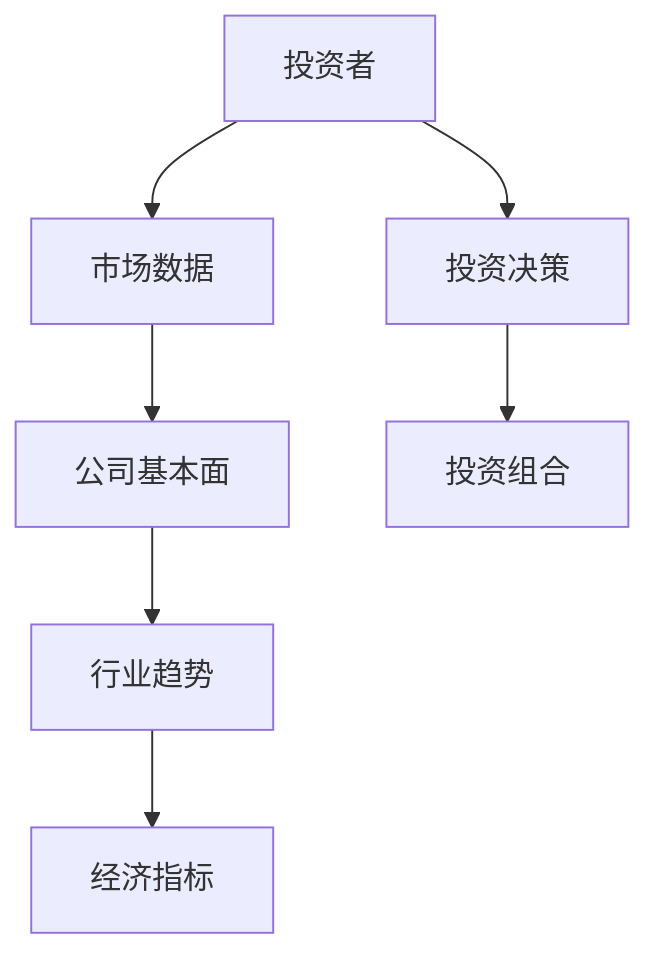
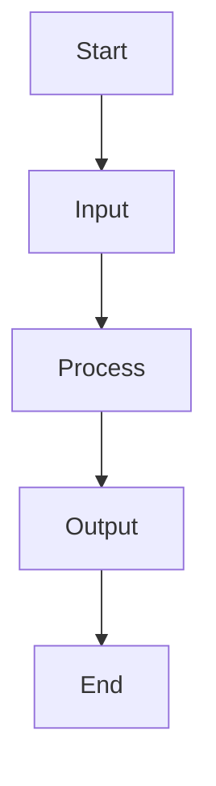
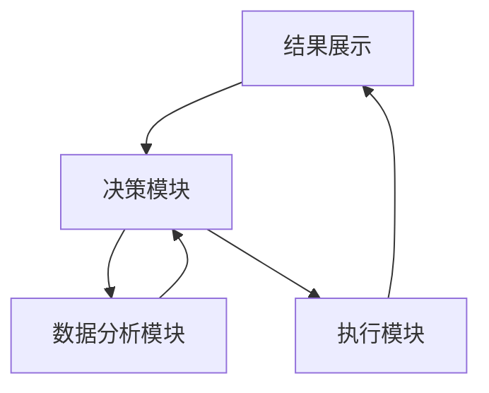

                 


# 利用AI agents进行情景分析：增强价值投资的适应性

## 关键词：AI Agent，情景分析，价值投资，适应性，投资策略

## 摘要：  
价值投资是一种依赖于对市场和企业基本面分析的投资策略，而AI agents（智能体）则是能够自主感知环境、做出决策并执行行动的智能系统。将AI agents应用于价值投资的情景分析中，可以显著增强投资策略的适应性。本文将详细探讨AI agents在价值投资中的应用，分析其核心原理、系统架构以及实际案例，最终为投资者提供一种更高效、更精准的投资决策支持方法。

---

## 第一部分：AI Agent与价值投资的背景

### 第1章：价值投资的定义与核心要素

#### 1.1 价值投资的基本概念  
价值投资是一种长期投资策略，强调以低于内在价值的价格购买优质资产。其核心在于识别市场中的估值偏差，并在价格回归内在价值时实现收益。价值投资的关键在于对企业的基本面分析，包括财务状况、行业地位、管理团队等因素。

#### 1.2 价值投资的核心要素  
1. **企业基本面分析**：包括收入、利润、现金流、资产负债表等财务指标。  
2. **行业分析**：研究行业趋势、竞争格局和政策影响。  
3. **市场估值分析**：通过市盈率、市净率等指标评估资产的相对价值。  
4. **风险评估**：分析投资标的的波动性和潜在风险。  

#### 1.3 价值投资的边界与外延  
价值投资并非仅限于股票投资，还可以扩展到债券、房地产等领域。其外延包括对宏观经济环境、政策变化的适应性分析。

### 第2章：AI Agent的定义与特点

#### 2.1 AI Agent的基本概念  
AI Agent是指能够感知环境、自主决策并执行行动的智能系统。它可以基于实时数据做出反应，具有学习和优化能力。

#### 2.2 AI Agent的核心特点  
1. **自主性**：AI Agent能够独立运作，无需人工干预。  
2. **反应性**：能够实时感知环境变化并做出响应。  
3. **学习能力**：通过机器学习算法不断优化决策模型。  
4. **适应性**：能够在复杂环境中调整策略以应对变化。  

#### 2.3 AI Agent与传统数据分析工具的区别  
AI Agent不仅能够处理和分析数据，还能根据数据做出决策并执行行动，而传统数据分析工具仅限于数据处理和展示。

### 第3章：价值投资中引入AI Agent的必要性

#### 3.1 传统价值投资的局限性  
1. **信息处理能力有限**：面对海量数据时，人工分析效率低下。  
2. **决策滞后性**：市场变化迅速，人工决策难以及时应对。  
3. **情绪化影响**：投资者情绪可能干扰理性决策。  

#### 3.2 AI Agent在价值投资中的优势  
1. **高效数据处理**：AI Agent能够快速分析大量数据，提供实时支持。  
2. **持续优化**：通过机器学习不断优化投资策略，提高准确性。  
3. **情绪中立**：AI Agent不受情绪影响，能够理性决策。  

#### 3.3 价值投资与AI Agent结合的可行性  
通过AI Agent的情景分析能力，投资者可以更好地应对市场变化，提升决策的科学性和及时性。AI Agent能够帮助投资者发现潜在机会，降低投资风险。

---

## 第二部分：AI Agent的核心概念与联系

### 第4章：AI Agent的核心原理

#### 4.1 AI Agent的感知模块  
感知模块负责收集和处理环境中的数据，包括市场数据、公司新闻等。例如，AI Agent可以通过API获取实时股票价格和财务报表数据。

#### 4.2 AI Agent的决策模块  
决策模块基于感知到的数据，利用机器学习算法生成投资建议。例如，使用强化学习算法模拟投资决策过程，优化投资组合。

#### 4.3 AI Agent的执行模块  
执行模块负责根据决策结果执行实际操作，如买卖股票或调整投资组合。这通常通过API连接到交易系统完成。

### 第5章：核心概念的属性特征对比

#### 5.1 感知模块的特征对比  
| 特性       | AI Agent感知模块       | 传统方法             |
|------------|------------------------|----------------------|
| 数据来源   | 多源数据（API、网络爬取） | 单一来源（人工收集） |
| 处理速度   | 实时处理               | 延后处理             |
| 精度       | 高精度                 | 低精度               |

#### 5.2 决策模块的特征对比  
| 特性       | AI Agent决策模块       | 传统方法             |
|------------|------------------------|----------------------|
| 决策速度   | 实时决策               | 延后决策             |
| 决策依据   | 多维度数据             | 单一维度数据         |
| 决策优化   | 持续优化               | 静态决策             |

#### 5.3 执行模块的特征对比  
| 特性       | AI Agent执行模块       | 传统方法             |
|------------|------------------------|----------------------|
| 执行速度   | 自动执行               | 手动执行             |
| 执行效率   | 高效率                 | 低效率               |
| 执行精度   | 高精度                 | 低精度               |

### 第6章：ER实体关系图架构



---

## 第三部分：AI Agent的算法原理

### 第7章：算法原理概述

#### 7.1 强化学习的AI Agent  
强化学习是一种通过试错机制优化决策的算法。例如，使用Q-learning算法模拟股票交易，通过不断试错优化交易策略。

#### 7.2 监督学习的AI Agent  
监督学习基于已知数据进行训练，预测未来趋势。例如，使用回归模型预测股票价格。

#### 7.3 无监督学习的AI Agent  
无监督学习用于发现数据中的隐藏模式。例如，使用聚类算法识别市场中的相似股票。

### 第8章：算法原理的数学模型

#### 8.1 强化学习模型  
$$ R = r_1 + r_2 + ... + r_n $$  
其中，$R$ 是累积奖励，$r_i$ 是每一步的奖励。

#### 8.2 监督学习模型  
$$ y = f(x) $$  
其中，$y$ 是目标值，$x$ 是输入特征，$f$ 是预测模型。

#### 8.3 无监督学习模型  
$$ z = g(x) $$  
其中，$z$ 是潜在空间中的表示，$x$ 是输入数据，$g$ 是编码函数。

### 第9章：算法流程图



---

## 第四部分：价值投资中的AI Agent系统分析与架构设计

### 第10章：价值投资场景介绍

#### 10.1 价值投资的基本流程  
1. 数据收集：获取市场数据和公司基本面信息。  
2. 数据分析：识别低估资产。  
3. 投资决策：制定投资策略。  

#### 10.2 价值投资的关键环节  
1. 数据处理：清洗和预处理数据。  
2. 模型训练：构建预测模型。  
3. 决策执行：根据模型结果进行投资操作。  

### 第11章：系统功能设计

#### 11.1 数据采集模块  
负责收集市场数据，包括股票价格、财务报表等。

#### 11.2 数据分析模块  
对收集到的数据进行处理和分析，识别投资机会。

#### 11.3 投资决策模块  
根据分析结果生成投资建议，优化投资组合。

### 第12章：系统架构设计



---

## 第五部分：项目实战

### 第13章：环境安装与系统实现

#### 13.1 环境搭建  
1. 安装Python和必要的库（如Pandas、NumPy、Scikit-learn）。  
2. 配置开发环境（如Jupyter Notebook）。  

#### 13.2 核心代码实现  
```python
import pandas as pd
from sklearn.model_selection import train_test_split
from sklearn.linear_model import LinearRegression

# 数据加载
data = pd.read_csv('stock_data.csv')

# 数据预处理
X = data[['price', 'volume']]
y = data['target']

# 数据分割
X_train, X_test, y_train, y_test = train_test_split(X, y, test_size=0.2)

# 模型训练
model = LinearRegression()
model.fit(X_train, y_train)

# 模型预测
y_pred = model.predict(X_test)
```

#### 13.3 代码解读  
1. 数据加载：从CSV文件中读取股票数据。  
2. 数据预处理：选择相关特征并分割数据集。  
3. 模型训练：使用线性回归模型进行训练。  
4. 模型预测：对测试集进行预测并输出结果。  

### 第14章：实际案例分析

#### 14.1 案例背景  
分析某股票的历史数据，预测其未来价格走势。

#### 14.2 数据分析与建模  
使用回归模型分析股票价格与交易量的关系，生成投资建议。

#### 14.3 结果解读  
根据模型预测结果，调整投资组合，优化投资策略。

### 第15章：项目小结  
通过实际案例，展示了AI Agent在价值投资中的应用，验证了其有效性和优势。

---

## 第六部分：总结与展望

### 第16章：总结

#### 16.1 核心内容回顾  
1. 价值投资的基本概念和核心要素。  
2. AI Agent的定义、特点及其在价值投资中的优势。  
3. AI Agent的算法原理及其在投资决策中的应用。  
4. 系统架构设计和实际项目实现。  

#### 16.2 投资者的核心收获  
- 了解如何利用AI技术提升投资决策的科学性和效率。  
- 掌握AI Agent的基本原理和实现方法。  

### 第17章：未来展望

#### 17.1 未来发展方向  
1. 多模态数据的整合：结合文本、图像等多种数据源进行分析。  
2. 分布式计算的应用：利用云计算和分布式系统提升计算能力。  
3. 自适应模型的优化：开发更智能的自适应算法，提升决策能力。  

#### 17.2 投资者建议  
1. 加强对AI技术的学习，提升技术应用能力。  
2. 关注行业动态，及时了解新技术和新工具。  
3. 在实际投资中，结合AI Agent和传统方法，制定综合策略。  

---

## 第七部分：最佳实践与注意事项

### 第18章：最佳实践

#### 18.1 数据质量管理  
确保数据的准确性和完整性，避免因数据问题影响分析结果。

#### 18.2 模型验证与优化  
定期验证模型的准确性和稳定性，及时进行优化和调整。

#### 18.3 风险管理  
在实际投资中，合理控制风险，避免因模型错误导致的重大损失。

### 第19章：注意事项

#### 19.1 数据隐私与安全  
确保数据的隐私和安全，遵守相关法律法规。

#### 19.2 模型局限性  
认识到AI模型的局限性，避免过度依赖模型，保持理性判断。

#### 19.3 技术更新与迭代  
关注技术的发展，及时更新和升级系统，保持竞争优势。

### 第20章：拓展阅读

#### 20.1 推荐书籍  
1. 《The Intelligent Investor》——本杰明·格雷厄姆  
2. 《机器学习实战》——Aurélien Géron  

#### 20.2 推荐课程  
1. Coursera：《Introduction to AI》  
2. edX：《Investment Fundamentals》  

---

## 结语  
通过本文的详细讲解，读者可以深入了解AI Agent在价值投资中的应用，掌握其核心原理和实现方法。未来，随着技术的不断发展，AI Agent将在投资领域发挥越来越重要的作用，为投资者提供更强大的决策支持。

