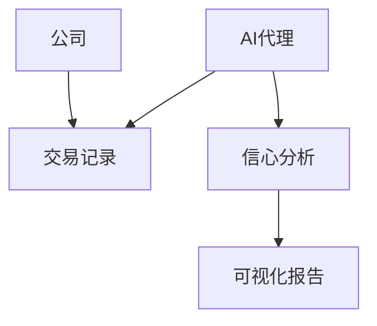
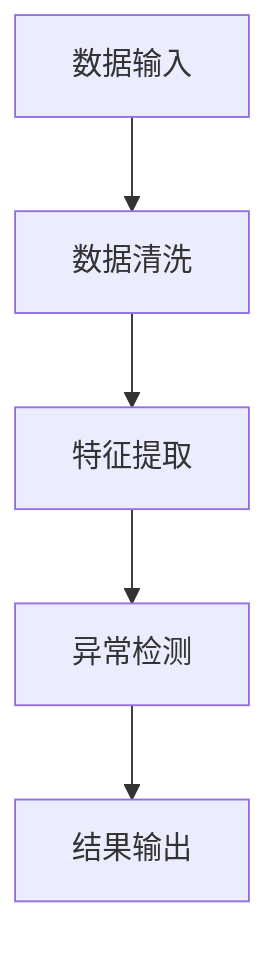

                 


# 利用AI agents追踪内部交易：洞察公司内部信心

> 关键词：AI代理，内部交易，公司信心，数据处理，异常检测，系统架构，金融分析

> 摘要：本文探讨了利用AI代理技术追踪公司内部交易，以洞察公司内部信心的方法。文章从背景介绍、核心概念、算法原理、系统架构到项目实战，全面分析了如何通过AI代理实现内部交易的追踪，并通过实际案例展示了其在公司治理中的应用价值。最后，本文总结了AI代理在内部交易追踪中的优势与挑战，并提出了相应的解决方案。

---

## 第一部分：背景介绍

### 第1章：内部交易与公司内部信心概述

#### 1.1 内部交易的概念与重要性
- **内部交易的定义**：指公司内部员工或管理层进行的证券交易，可能反映对公司前景的信心。
- **内部交易在公司治理中的作用**：揭示管理层对公司未来的态度，影响投资者决策。
- **内部交易与公司信心的关系**：高频率的内部交易可能表明高管对公司前景不确定。

#### 1.2 公司内部信心的衡量
- **内部信心的定义**：公司管理层和员工对公司未来表现的信念。
- **内部信心的指标体系**：包括高管持股比例、内部交易频率、交易金额等。
- **内部信心与公司绩效的关系**：内部信心高的公司通常绩效表现更好。

#### 1.3 AI agents在内部交易追踪中的应用
- **AI agents的基本概念**：智能代理，能够自动处理和分析数据。
- **AI agents在金融领域的应用**：用于实时数据分析、异常检测等。
- **AI agents的优势**：高效、准确，能够处理大量数据，发现潜在模式。

---

### 第2章：内部交易追踪的核心概念与框架

#### 2.1 内部交易追踪的背景与问题
- **传统内部交易追踪的局限性**：依赖人工分析，效率低，容易遗漏异常。
- **数据量爆炸的挑战**：传统方法难以处理海量数据。
- **AI技术的潜力**：AI能够快速分析数据，识别潜在异常。

#### 2.2 AI agents追踪内部交易的核心原理
- **数据驱动的识别**：通过分析交易数据，识别异常模式。
- **AI代理的角色**：处理数据清洗、特征提取和异常检测。
- **内部交易追踪的流程与框架**：数据采集、清洗、分析、可视化。

#### 2.3 内部交易追踪的边界与外延
- **范围界定**：明确数据范围和交易类型。
- **与其他交易分析的关系**：区分内部和外部交易。
- **法律与伦理边界**：确保数据隐私和合规性。

---

## 第二部分：核心概念与联系

### 第3章：内部交易追踪的核心要素与概念结构

#### 3.1 核心概念与原理
- **AI代理**：数据处理、特征提取、异常检测。
- **内部交易**：定义、特征、与公司信心的关系。

#### 3.2 概念属性特征对比
| 特征 | 内部交易 | 公司信心 |
|------|----------|----------|
| 定义 | 公司内部员工的交易行为 | 对公司未来表现的信念 |
| 数据源 | 交易记录 | 交易数据、财务数据 |
| 目标 | 识别异常 | 分析信心水平 |
| 方法 | 数据分析、AI代理 | 统计分析、机器学习 |

#### 3.3 实体关系图


---

## 第三部分：算法原理讲解

### 第4章：内部交易追踪的算法实现

#### 4.1 数据清洗与特征提取
- **数据清洗**：处理缺失值、异常值。
- **特征提取**：交易金额、频率、时间间隔。

#### 4.2 异常检测算法
- **基于统计的方法**：Z-score。
- **基于机器学习的方法**：Isolation Forest。

#### 4.3 异常检测流程


#### 4.4 异常检测代码示例
```python
import numpy as np
from sklearn.ensemble import IsolationForest

# 示例数据
X = np.array([[100, 10], [200, 20], [300, 30], [400, 40], [500, 50]])

# 训练模型
model = IsolationForest(n_estimators=100, random_state=42)
model.fit(X)

# 预测异常
y_pred = model.predict(X)
print(y_pred)
```

#### 4.5 数学模型与公式
- **统计方法**：$$ Z = \frac{X - \mu}{\sigma} $$
- **机器学习模型**：$$ y = f(X) $$

---

## 第四部分：系统分析与架构设计

### 第5章：系统设计与实现

#### 5.1 问题场景介绍
- 数据来源：交易记录、员工信息。
- 问题：识别异常交易，分析信心。

#### 5.2 系统功能设计
- 数据采集模块：收集交易数据。
- 数据处理模块：清洗和特征提取。
- 分析模块：异常检测和信心评估。
- 可视化模块：生成报告。

#### 5.3 系统架构设计


---

## 第五部分：项目实战

### 第6章：内部交易追踪的实战应用

#### 6.1 环境安装
- 安装Python、Pandas、Scikit-learn、Mermaid。

#### 6.2 核心代码实现
```python
import pandas as pd
from sklearn.ensemble import IsolationForest

# 数据读取
data = pd.read_csv('交易记录.csv')

# 数据清洗
data.dropna(inplace=True)

# 特征提取
features = data[['交易金额', '交易时间间隔']]

# 模型训练
model = IsolationForest(n_estimators=100, random_state=42)
model.fit(features)

# 预测异常
data['异常'] = model.predict(features)
```

#### 6.3 实际案例分析
- 数据分析：识别高管异常交易。
- 案例结果：发现潜在的内部问题。

---

## 第六部分：总结与展望

### 第7章：总结与最佳实践

#### 7.1 最佳实践
- 数据隐私保护。
- 模型优化与维护。
- 系统扩展性设计。

#### 7.2 小结
AI代理在内部交易追踪中的应用具有高效、准确的优势，但需注意数据隐私和模型优化。

#### 7.3 注意事项
- 数据来源的可靠性。
- 模型的可解释性。
- 系统的鲁棒性。

#### 7.4 拓展阅读
- 《机器学习实战》
- 《AI代理与金融分析》

---

通过以上结构，文章系统地介绍了利用AI代理追踪内部交易的方法，从理论到实践，为读者提供了全面的指导。

