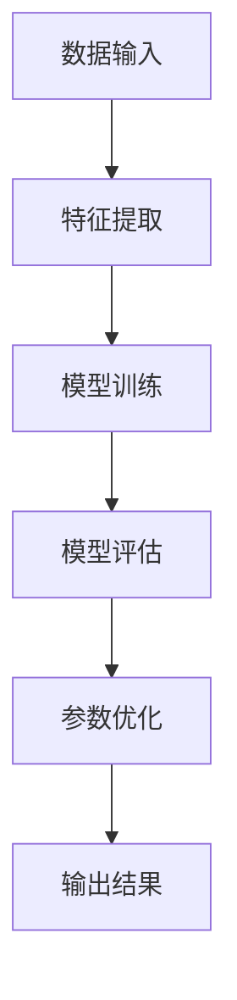
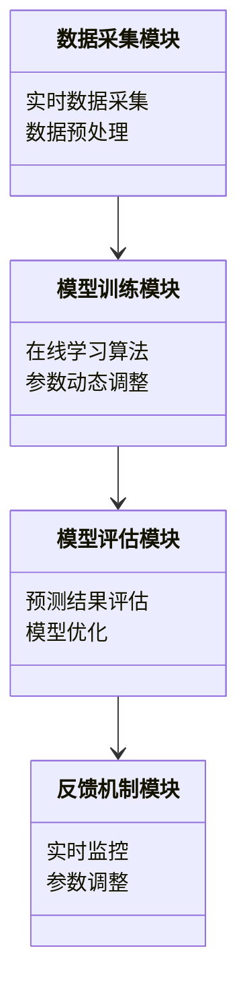
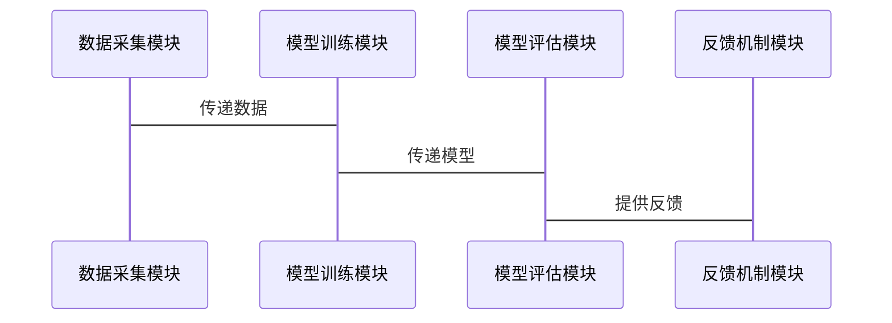

                 


# 利用AI构建自适应型信用风险评估模型：增强投资安全性

> 关键词：AI，信用风险评估，自适应模型，投资安全性，金融风险管理

> 摘要：随着金融市场的复杂化和不确定性增加，传统的信用风险评估方法已难以满足现代投资需求。本文将介绍如何利用人工智能技术构建自适应型信用风险评估模型，通过动态调整模型参数和实时数据处理，提升投资安全性。文章从背景介绍、核心概念、算法原理、系统架构到项目实战，全面解析自适应模型的构建过程，并通过实际案例展示其优势。

---

# 第一部分：信用风险评估的背景与挑战

## 第1章：信用风险评估的基本概念

### 1.1 信用风险的定义与特征

#### 1.1.1 信用风险的定义
信用风险是指借款人或交易对手未能履行其合同义务，导致债权人或投资者遭受损失的可能性。它是金融风险管理中的核心问题之一。

#### 1.1.2 信用风险的主要特征
- **时间依赖性**：信用风险会随着时间变化而变化。
- **数据依赖性**：依赖于历史数据和实时数据的输入。
- **复杂性**：涉及多个变量和因素，如经济指标、市场波动等。

#### 1.1.3 信用风险的分类
- **单体风险**：个体借款人违约风险。
- **系统性风险**：整个金融系统中的系统性违约风险。
- **传染风险**：风险在金融市场中的传播风险。

### 1.2 传统信用风险评估方法

#### 1.2.1 传统信用评分模型
传统的信用评分模型（如FICO评分）基于静态的历史数据，无法实时更新和调整。

#### 1.2.2 传统模型的优缺点
- **优点**：方法简单，易于解释。
- **缺点**：静态性、数据依赖性强、无法实时调整。

#### 1.2.3 传统模型的局限性
- 无法适应市场变化。
- 数据更新周期长，导致模型失效。

### 1.3 AI技术在信用风险评估中的应用前景

#### 1.3.1 AI技术的基本概念
人工智能（AI）是指计算机系统模拟人类智能的能力，包括学习、推理和自适应等。

#### 1.3.2 AI在信用风险评估中的优势
- **实时性**：能够实时处理数据并更新模型。
- **动态性**：能够根据市场变化动态调整模型参数。
- **准确性**：通过机器学习算法提高预测精度。

#### 1.3.3 未来发展趋势
- 结合大数据技术，提升模型的预测能力。
- 增强模型的可解释性，满足监管需求。

## 第2章：自适应型信用风险评估模型的背景与需求

### 2.1 传统信用风险模型的局限性

#### 2.1.1 数据依赖性问题
传统模型依赖于历史数据，无法处理实时数据。

#### 2.1.2 模型的静态性问题
传统模型无法根据市场变化动态调整。

#### 2.1.3 鲁棒性不足的问题
传统模型在面对极端市场波动时表现不佳。

### 2.2 自适应型模型的需求分析

#### 2.2.1 自适应模型的核心需求
- 实时数据处理能力。
- 动态参数调整能力。
- 高准确性与稳定性。

#### 2.2.2 自适应模型的应用场景
- 金融市场实时监控。
- 风险预警系统。
- 投资组合管理。

#### 2.2.3 自适应模型的技术挑战
- 数据处理的实时性要求高。
- 模型的动态调整需要高效的计算能力。
- 需要解决模型的可解释性问题。

### 2.3 信用风险评估的业务价值

#### 2.3.1 投资安全性提升
通过实时监控和动态调整，降低投资组合的风险。

#### 2.3.2 企业风险管理优化
帮助企业更好地管理信用风险，避免重大损失。

#### 2.3.3 金融监管效率提升
为监管机构提供实时数据和预警信息，提升监管效率。

---

# 第二部分：自适应型信用风险评估模型的核心概念与原理

## 第3章：自适应型模型的核心概念与特征

### 3.1 自适应模型的基本原理

#### 3.1.1 自适应学习机制
模型能够根据新的数据输入，动态调整自身的参数和结构。

#### 3.1.2 动态参数调整
通过在线学习算法，实时更新模型参数。

#### 3.1.3 实时数据处理
模型能够实时处理新的数据，保持对市场变化的敏感性。

### 3.2 自适应模型与传统模型的对比

#### 3.2.1 模型结构对比
- 传统模型：静态结构。
- 自适应模型：动态结构。

#### 3.2.2 模型性能对比
- 传统模型：预测精度较低。
- 自适应模型：预测精度高，且能够实时更新。

#### 3.2.3 模型应用场景对比
- 传统模型：适用于数据稳定场景。
- 自适应模型：适用于数据动态变化场景。

### 3.3 自适应模型的核心要素

#### 3.3.1 数据流
实时数据的输入和处理。

#### 3.3.2 模型训练
基于实时数据的在线训练过程。

#### 3.3.3 反馈机制
模型输出结果与实际数据的对比，用于优化模型。

## 第4章：自适应型模型的数学基础与算法原理

### 4.1 基础数学模型

#### 4.1.1 线性回归模型
$$ y = \beta_0 + \beta_1 x + \epsilon $$

#### 4.1.2 支持向量机模型
$$ \text{目标函数}：\min \frac{1}{2}||\beta||^2 $$
$$ \text{约束条件}：y_i (\beta \cdot x_i + \beta_0) \geq 1 $$

#### 4.1.3 随机森林模型
随机森林是一种基于树的集成学习方法，通过组合多个决策树的预测结果，提高模型的准确性和稳定性。

### 4.2 自适应算法的核心原理

#### 4.2.1 在线学习算法
模型在接收到新的数据时，实时更新自身的参数。

#### 4.2.2 迁移学习算法
将已有的知识和经验迁移到新的任务中，减少训练时间。

#### 4.2.3 强化学习算法
通过与环境的交互，不断优化自身的策略，提高预测准确性。

### 4.3 算法流程图



---

# 第三部分：自适应型信用风险评估模型的系统架构与实现

## 第5章：系统架构设计

### 5.1 问题场景介绍
自适应型信用风险评估系统需要实时处理大量数据，动态调整模型参数，以应对复杂的金融市场环境。

### 5.2 系统功能设计

#### 5.2.1 数据采集模块
- 实时采集市场数据。
- 数据预处理。

#### 5.2.2 模型训练模块
- 在线学习算法实现。
- 模型参数动态调整。

#### 5.2.3 模型评估模块
- 预测结果评估。
- 模型优化。

#### 5.2.4 反馈机制模块
- 实时监控模型表现。
- 根据反馈调整模型参数。

### 5.3 系统架构图



### 5.4 系统接口设计
- 数据输入接口。
- 模型训练接口。
- 模型评估接口。
- 反馈机制接口。

### 5.5 系统交互流程图



---

## 第6章：项目实战

### 6.1 环境配置

#### 6.1.1 安装Python
```bash
python --version
```

#### 6.1.2 安装依赖库
```bash
pip install numpy pandas scikit-learn tensorflow
```

### 6.2 系统核心实现

#### 6.2.1 数据采集与预处理
```python
import pandas as pd
data = pd.read_csv('credit_data.csv')
```

#### 6.2.2 模型训练
```python
from sklearn.svm import SVC
model = SVC()
model.fit(X_train, y_train)
```

#### 6.2.3 模型评估
```python
from sklearn.metrics import accuracy_score
accuracy = accuracy_score(y_test, model.predict(X_test))
print(f'Accuracy: {accuracy}')
```

#### 6.2.4 实时反馈机制
```python
def update_model(new_data):
    model.partial_fit(new_data)
```

### 6.3 实际案例分析

#### 6.3.1 数据分析
通过分析历史违约数据，提取关键特征变量。

#### 6.3.2 模型训练与优化
使用在线学习算法，动态调整模型参数。

#### 6.3.3 结果解读
通过模型输出结果，识别高风险客户，优化投资组合。

### 6.4 项目小结
通过项目实战，验证了自适应型信用风险评估模型的有效性和实用性。

---

## 第7章：总结与展望

### 7.1 最佳实践

#### 7.1.1 数据质量管理
确保数据的准确性和完整性。

#### 7.1.2 模型可解释性
提高模型的可解释性，满足监管需求。

#### 7.1.3 模型优化
定期优化模型，提升预测精度。

### 7.2 小结
自适应型信用风险评估模型通过实时数据处理和动态参数调整，显著提升了信用风险评估的准确性和效率。

### 7.3 注意事项

#### 7.3.1 数据隐私保护
确保数据的隐私性和安全性。

#### 7.3.2 模型稳定性
避免模型过度拟合，保持模型的稳定性。

#### 7.3.3 系统性能优化
优化系统的运行效率，确保实时处理能力。

### 7.4 拓展阅读

#### 7.4.1 AI在金融领域的其他应用
如智能投顾、市场预测等。

#### 7.4.2 高阶算法研究
如深度学习在信用风险评估中的应用。

#### 7.4.3 相关学术论文
推荐阅读最新的学术研究成果。

---

通过以上目录大纲，文章从背景介绍、核心概念、算法原理、系统架构到项目实战，全面解析了自适应型信用风险评估模型的构建过程，帮助读者深入了解如何利用AI技术提升信用风险评估的准确性和效率，从而增强投资安全性。

