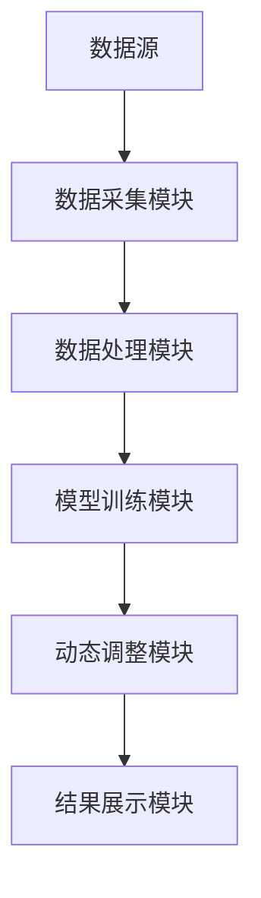

                 


# 利用AI构建自适应型公司估值模型：动态调整估值方法

## 关键词：AI，公司估值模型，动态调整，自适应型，机器学习，金融应用

## 摘要：随着金融市场的复杂化和动态化，传统的公司估值方法逐渐显现出其局限性。本文将介绍如何利用人工智能技术构建自适应型公司估值模型，通过动态调整估值方法，以应对市场变化和公司情况的不确定性。本文将详细探讨自适应型估值模型的核心概念、算法原理、系统架构设计以及实际项目中的实现细节，最后总结最佳实践和未来发展方向。

---

# 第一部分: 利用AI构建自适应型公司估值模型概述

## 第1章: 背景与问题背景

### 1.1 传统公司估值方法的局限性
- 传统估值方法（如DCF模型、市盈率法）的定义与特点
- 传统估值方法在实际应用中的局限性，例如对历史数据的依赖、难以适应市场快速变化等问题
- 传统估值方法与现代金融市场变化的矛盾

### 1.2 AI在金融领域的应用前景
- AI在金融领域的核心应用领域，例如股票预测、风险评估、信用评分等
- AI技术在公司估值中的潜在优势，如数据处理能力、实时分析能力、自适应能力等
- 当前AI在公司估值中的应用现状与面临的挑战

---

## 第2章: 自适应型公司估值模型的核心概念

### 2.1 自适应型公司估值模型的定义与特点
- 自适应型估值模型的定义：一种能够根据市场环境和公司实际情况动态调整的估值方法
- 自适应型估值模型的核心特点：实时性、动态性、智能化、高精度等
- 自适应型估值模型与传统估值模型的对比分析

### 2.2 动态调整估值方法的原理
- 动态调整的定义与实现方式：根据实时数据和市场变化，不断优化和调整估值模型的参数
- 动态调整的驱动因素与触发条件：市场波动、公司业绩变化、行业趋势等
- 自适应型估值模型的数学模型与算法框架

---

## 第3章: 自适应型公司估值模型的数学模型与算法原理

### 3.1 自适应型估值模型的数学模型
- 线性回归模型：$$ y = \beta_0 + \beta_1x + \epsilon $$
- 时间序列分析模型：ARIMA模型的定义与应用
- 机器学习模型：随机森林和神经网络在估值中的应用

### 3.2 动态调整估值方法的算法原理
- 基于机器学习的动态调整算法：梯度下降、支持向量机等
- 基于反馈机制的动态调整算法：强化学习在估值调整中的应用
- 基于实时数据流的动态调整算法：流数据处理技术

---

## 第4章: 自适应型公司估值模型的系统架构设计

### 4.1 系统功能设计
- 数据采集模块：收集市场数据、公司财务数据、行业数据等
- 数据处理模块：清洗、转换和预处理数据
- 模型训练模块：训练自适应型估值模型
- 动态调整模块：根据实时数据调整模型参数
- 结果展示模块：可视化估值结果

### 4.2 系统架构图


---

# 第二部分: 自适应型公司估值模型的实现与应用

## 第5章: 项目实战

### 5.1 环境安装与配置
- 安装Python、机器学习库（如scikit-learn、TensorFlow）和数据处理库（如Pandas、NumPy）

### 5.2 核心代码实现
- 数据预处理代码示例：
```python
import pandas as pd
import numpy as np

# 加载数据
data = pd.read_csv('company_valuation.csv')

# 数据清洗
data.dropna(inplace=True)
data = data[~data.isin([np.nan, np.inf, -np.inf]).any(axis=1)]
```

- 模型训练代码示例：
```python
from sklearn.linear_model import LinearRegression
from sklearn.metrics import mean_squared_error

# 训练模型
model = LinearRegression()
model.fit(X_train, y_train)

# 模型评估
y_pred = model.predict(X_test)
print('均方误差:', mean_squared_error(y_test, y_pred))
```

### 5.3 代码解读与分析
- 数据预处理：清洗和转换数据，确保数据质量
- 模型训练：选择合适的算法训练自适应型估值模型
- 模型评估：使用均方误差等指标评估模型性能

### 5.4 案例分析
- 假设一家公司，根据其财务数据和行业趋势，使用自适应型估值模型动态调整其估值

### 5.5 项目小结
- 项目实现的关键步骤和注意事项
- 项目成果展示：估值结果与传统估值方法的对比

---

## 第6章: 最佳实践与未来展望

### 6.1 最佳实践
- 数据质量的重要性：确保数据的完整性和准确性
- 模型选择与调优：根据具体场景选择合适的算法，并进行参数调优
- 系统维护与更新：定期更新模型和数据，确保模型的实时性和准确性

### 6.2 小结
- 本文的核心内容回顾
- 自适应型公司估值模型的优势与不足
- 对未来研究和应用的展望

### 6.3 注意事项
- 数据隐私与安全问题
- 模型的可解释性问题
- 系统的实时性和稳定性要求

### 6.4 拓展阅读
- 推荐相关书籍、论文和技术博客，供读者深入学习

---

# 结语

通过本文的详细讲解，读者可以了解到如何利用AI构建自适应型公司估值模型，并通过动态调整估值方法来应对复杂的金融市场环境。希望本文能够为金融领域的技术从业者提供有价值的参考和启示。

