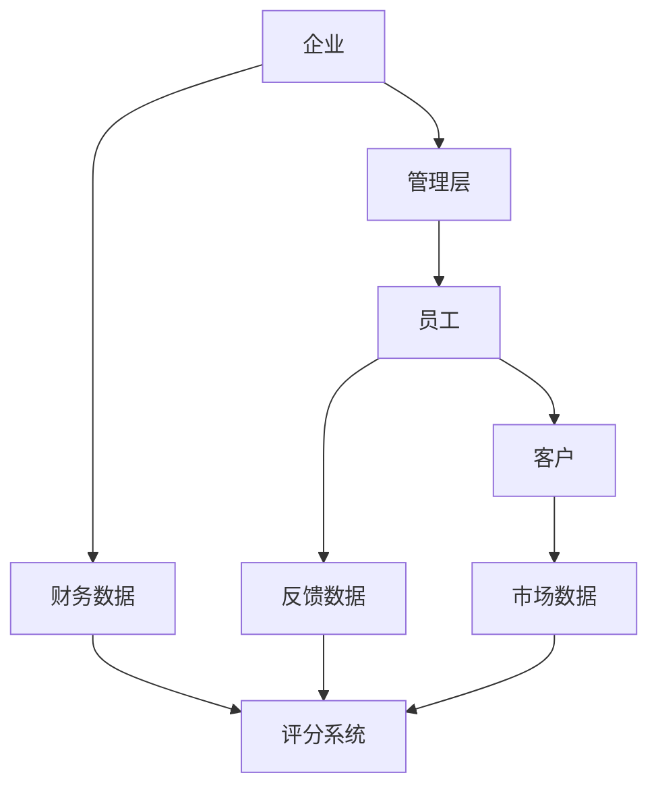
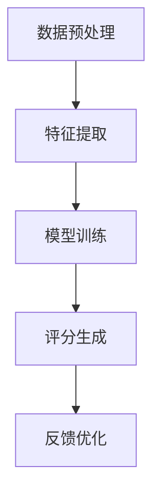
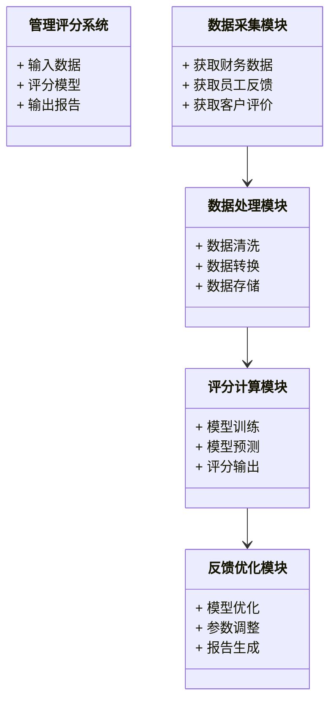
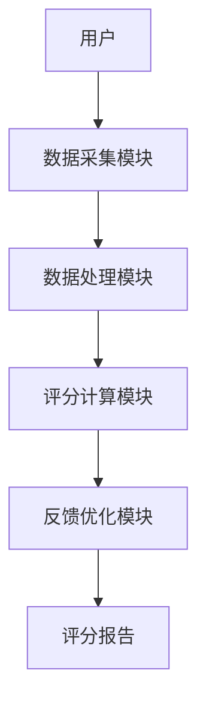

                 


# 利用AI构建自适应型公司治理评分系统：动态监控管理质量

---

## 关键词  
- AI技术  
- 公司治理  
- 自适应评分系统  
- 动态监控  
- 管理质量  
- 机器学习  
- 系统架构  

---

## 摘要  
本文将探讨如何利用人工智能技术构建一个自适应型公司治理评分系统，通过动态监控管理质量，提升企业治理效率。文章从背景、核心概念、算法原理、系统架构设计到项目实战，全面解析如何利用AI技术实现管理质量的智能化评估与优化。通过案例分析和实际应用，本文将展示如何利用技术手段解决传统公司治理中的痛点，为企业管理者提供科学的决策支持。

---

## 目录  

1. **背景与概念**  
   1.1 问题背景  
   1.2 核心概念与联系  

2. **算法原理讲解**  
   2.1 评分模型构建  
   2.2 动态调整机制  

3. **系统架构设计**  
   3.1 系统功能模块  
   3.2 系统架构图  

4. **项目实战**  
   4.1 环境与工具安装  
   4.2 核心代码实现  

5. **总结与展望**  
   5.1 实践总结  
   5.2 未来展望  

---

## 第一部分: 背景与概念  

### 第1章: 公司治理评分系统概述  

#### 1.1 问题背景  

##### 1.1.1 传统公司治理的局限性  
传统的公司治理模式依赖于定期 audits 和静态评估，难以实时捕捉管理质量的变化。这种模式通常基于固定的指标体系，无法灵活应对企业的动态需求。  

##### 1.1.2 当前公司治理面临的挑战  
- 数据孤岛问题：各部门之间数据分散，难以形成统一的评估标准。  
- 评估滞后性：传统评估周期长，无法及时反映管理质量的变化。  
- 主观性问题：人工评估容易受到主观因素影响，结果缺乏客观性。  

##### 1.1.3 引入AI技术的必要性  
人工智能技术能够实时处理海量数据，通过动态分析和预测，为公司治理提供更精准的决策支持。  

---

#### 1.2 核心概念与联系  

##### 1.2.1 核心概念原理  
自适应型公司治理评分系统通过收集企业运营数据，利用机器学习算法进行分析，生成实时评分，并根据反馈不断优化模型。  

##### 1.2.2 核心概念对比表  

| **概念**        | **描述**                                                                 |
|------------------|--------------------------------------------------------------------------|
| 数据来源         | 包括财务数据、员工反馈、客户评价、市场表现等                                   |
| 评分标准         | 基于权重的多维度评估模型                                                     |
| 动态调整机制     | 根据实时数据和模型反馈，自动优化评分策略                                       |
| 输出结果         | 自动生成评分报告，提供改进建议                                                 |

##### 1.2.3 实体关系图  



---

## 第二部分: 算法原理讲解  

### 第2章: 评分模型构建  

#### 2.1 算法流程  



#### 2.2 算法实现  

##### 2.2.1 代码实现  

```python
import pandas as pd
from sklearn.linear_model import LinearRegression

# 数据加载
data = pd.read_csv('management_data.csv')

# 特征提取
features = data[['revenue', 'profit', 'employee_satisfaction']]
target = data['management_score']

# 模型训练
model = LinearRegression()
model.fit(features, target)

# 预测评分
new_data = pd.DataFrame({
    'revenue': [1000000],
    'profit': [200000],
    'employee_satisfaction': [0.8]
})
predicted_score = model.predict(new_data)
print(f"预测评分：{predicted_score[0]:.2f}")
```

##### 2.2.2 数学模型  

管理质量评分公式：  
$$ \text{评分} = \alpha \cdot \text{收入} + \beta \cdot \text{利润} + \gamma \cdot \text{员工满意度} $$  

其中，$\alpha + \beta + \gamma = 1$，确保评分的加权合理性。  

---

## 第三部分: 系统架构设计  

### 第3章: 系统功能模块  

#### 3.1 功能模块设计  



#### 3.2 系统架构图  



---

## 第四部分: 项目实战  

### 第4章: 核心代码实现  

#### 4.1 环境安装  

```bash
pip install numpy pandas scikit-learn matplotlib
```

#### 4.2 核心代码实现  

```python
import numpy as np
import pandas as pd
from sklearn.model_selection import train_test_split
from sklearn.metrics import mean_squared_error

# 加载数据
data = pd.read_csv('management_data.csv')

# 数据预处理
X = data[['revenue', 'profit', 'employee_satisfaction']]
y = data['management_score']

# 划分训练集和测试集
X_train, X_test, y_train, y_test = train_test_split(X, y, test_size=0.2, random_state=42)

# 模型训练
model = LinearRegression()
model.fit(X_train, y_train)

# 模型预测
y_pred = model.predict(X_test)

# 评估模型
mse = mean_squared_error(y_test, y_pred)
print(f"均方误差：{mse:.2f}")
print(f"决定系数：{model.score(X_test, y_test):.2f}")
```

---

## 第五部分: 总结与展望  

### 第5章: 总结与展望  

#### 5.1 实践总结  
本文详细介绍了如何利用AI技术构建自适应型公司治理评分系统，通过动态监控管理质量，提升企业治理效率。通过案例分析和代码实现，展示了该系统的实际应用价值。  

#### 5.2 未来展望  
未来，可以进一步优化评分模型，引入更先进的机器学习算法（如深度学习和强化学习），提升系统的智能化水平。同时，可以扩展系统的功能，支持多维度的管理评估和实时反馈，为企业提供更全面的决策支持。

--- 

以上是文章的完整目录和内容概要，您可以根据需要进一步扩展和补充具体内容。

