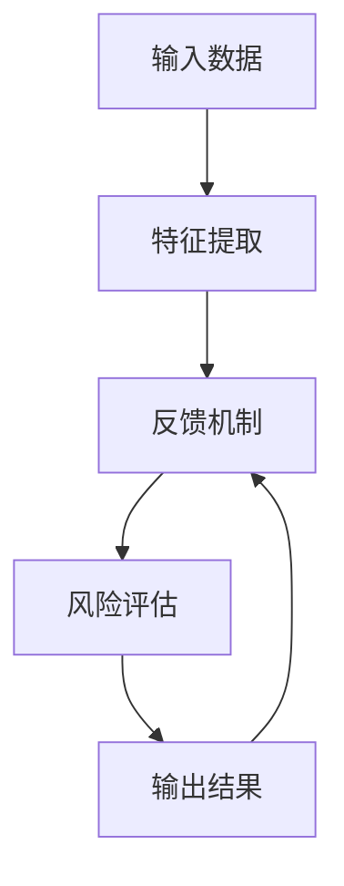
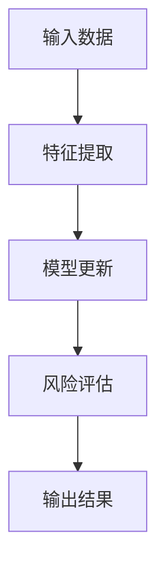
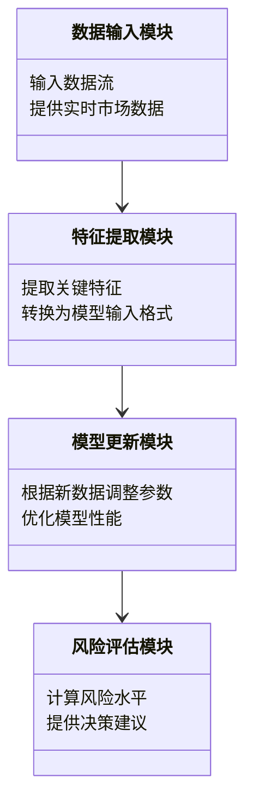
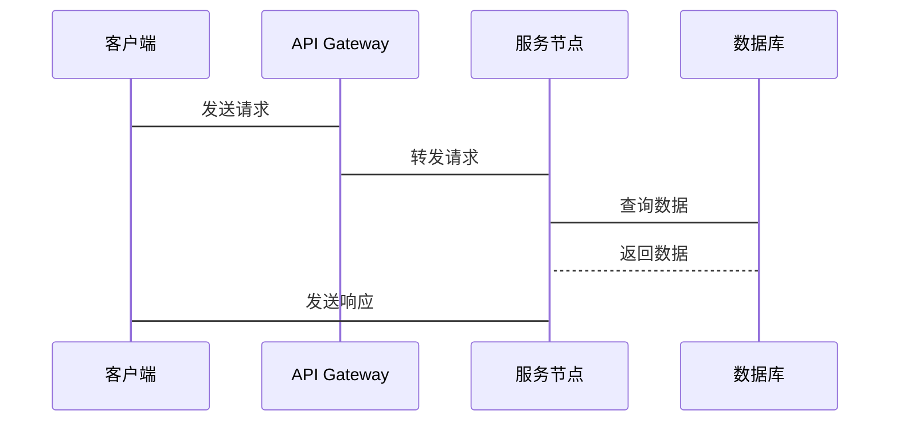

                 


# 利用AI构建自适应型安全边际模型：动态风险管理

## 关键词：自适应型安全边际模型、动态风险管理、AI算法、风险管理、安全边际模型

## 摘要：本文详细探讨了如何利用人工智能技术构建自适应型安全边际模型，实现动态风险管理。文章从传统安全边际模型的局限性出发，逐步分析了自适应型模型的核心概念、算法原理、系统架构，并通过实际案例展示了模型的实现过程和应用效果。最后，文章总结了最佳实践经验和未来研究方向，为读者提供了全面的理论和实践指导。

---

## 第一部分：背景与概念

### 第1章：安全边际模型与动态风险管理概述

#### 1.1 传统安全边际模型的局限性

传统的安全边际模型是一种用于风险评估和管理的工具，通常基于历史数据和统计方法。然而，这些模型存在以下局限性：

- **静态性**：传统模型假设市场环境是静态的，无法适应市场变化。
- **缺乏实时性**：模型更新周期长，无法及时反映市场波动。
- **数据依赖性**：高度依赖历史数据，可能无法捕捉新兴风险因素。

#### 1.2 自适应型安全边际模型的核心概念

自适应型安全边际模型是一种动态风险管理工具，能够在实时数据流中自适应调整模型参数，以应对不断变化的市场环境。其核心概念包括：

- **动态调整**：模型能够根据实时数据动态更新，以反映最新的市场状况。
- **实时性**：风险评估结果可以实时更新，提供及时的决策支持。
- **自适应学习**：模型能够从新数据中学习，优化风险评估的准确性。

#### 1.3 安全边际模型的核心要素组成

自适应型安全边际模型的核心要素包括：

1. **数据驱动的特征提取**：通过机器学习算法提取关键特征，用于模型训练。
2. **模型的自适应调整机制**：利用反馈机制动态调整模型参数，优化风险评估结果。
3. **风险评估与决策优化**：结合风险评估结果，提供最优决策建议。

---

## 第二部分：核心概念与联系

### 第2章：核心概念与原理分析

#### 2.1 自适应型安全边际模型的原理

自适应型安全边际模型的动态调整机制可以分为以下几个步骤：

1. **数据输入与特征提取**：实时收集市场数据，提取关键特征。
2. **模型更新**：根据新特征调整模型参数，优化风险评估能力。
3. **风险评估**：基于更新后的模型，计算当前风险水平。
4. **反馈机制**：根据评估结果，调整模型参数，形成闭环。

#### 2.2 核心概念的属性特征对比

以下是传统安全边际模型与自适应型模型的属性特征对比表：

| 属性 | 传统模型 | 自适应型模型 |
|------|----------|--------------|
| 数据来源 | 历史数据 | 实时数据流 |
| 更新频率 | 低频 | 高频 |
| 模型复杂度 | 简单 | 复杂 |
| 适应性 | 低 | 高 |

#### 2.3 模型的动态调整流程

以下用Mermaid流程图展示自适应型安全边际模型的动态调整流程：



---

## 第三部分：算法原理

### 第3章：算法原理与数学模型

#### 3.1 模型的输入与输出

- **输入数据**：实时市场数据，包括价格、交易量、波动率等。
- **输出结果**：风险评估结果，包括风险等级和建议的决策策略。

#### 3.2 核心算法的数学模型

以下是模型更新和风险评估的核心公式：

- **模型更新公式**：
  $$ \theta_{t+1} = \theta_t + \alpha \cdot (y_t - \hat{y}_t) \cdot X_t $$
  其中，$\theta$ 表示模型参数，$\alpha$ 表示学习率，$y_t$ 表示真实值，$\hat{y}_t$ 表示预测值，$X_t$ 表示输入特征。

- **风险评估公式**：
  $$ R = \sum_{i=1}^n w_i \cdot r_i $$
  其中，$w_i$ 表示风险因子的权重，$r_i$ 表示风险因子的值。

#### 3.3 算法流程图

以下用Mermaid流程图展示算法的整体流程：



---

## 第四部分：系统分析与架构设计

### 第4章：系统分析与架构设计

#### 4.1 问题场景介绍

假设我们正在开发一个金融交易平台的风险管理系统，需要实时监控市场波动，动态调整风险模型，以优化交易策略。

#### 4.2 项目介绍

项目目标是开发一个基于AI的自适应型安全边际模型，实现动态风险管理，提升交易决策的准确性和效率。

#### 4.3 系统功能设计（领域模型）

以下用Mermaid类图展示系统的功能模块及其关系：



#### 4.4 系统架构设计（架构图）

以下用Mermaid架构图展示系统的整体架构：


#### 4.5 系统接口设计和交互图

以下用Mermaid序列图展示系统接口的设计和交互过程：



---

## 第五部分：项目实战

### 第5章：项目实战

#### 5.1 环境安装与配置

为了运行本项目，需要安装以下工具和库：

- **Python**：3.6+
- **机器学习库**：scikit-learn, TensorFlow
- **数据处理库**：Pandas, NumPy
- **可视化库**：Matplotlib, Seaborn
- **其他工具**：Jupyter Notebook

#### 5.2 系统核心实现源代码

以下是一个简单的自适应型安全边际模型的Python实现示例：

```python
import numpy as np
import pandas as pd
from sklearn.linear_model import LinearRegression

def adaptive_model_update(theta, alpha, y_true, y_pred, X):
    # 计算梯度
    gradient = np.dot(X.T, (y_true - y_pred)) * alpha
    # 更新参数
    theta += gradient
    return theta

# 示例数据
X = np.array([[1, 2], [3, 4], [5, 6]])
y_true = np.array([7, 8, 9])
y_pred = np.array([6, 7, 8])

# 初始化模型参数
theta = np.array([0, 0])
alpha = 0.1

# 更新模型参数
theta_updated = adaptive_model_update(theta, alpha, y_true, y_pred, X)
print("Updated theta:", theta_updated)
```

#### 5.3 实际案例分析

以下是一个实际案例分析，展示模型在金融交易中的应用：

1. **数据收集**：收集过去一年的股票价格数据，包括开盘价、收盘价、最高价、最低价、交易量等。
2. **特征提取**：提取波动率、相对强弱指数（RSI）等技术指标。
3. **模型训练**：使用历史数据训练自适应型安全边际模型。
4. **实时监控**：根据实时数据更新模型，计算当前风险水平。
5. **决策优化**：根据风险评估结果，调整交易策略。

---

## 第六部分：最佳实践

### 第6章：最佳实践与总结

#### 6.1 小结

本文详细探讨了如何利用AI构建自适应型安全边际模型，实现动态风险管理。通过分析传统模型的局限性，提出了一种基于机器学习的自适应调整机制，能够在实时数据流中动态优化风险评估结果，提升风险管理的准确性和效率。

#### 6.2 注意事项与建议

- **数据质量**：确保输入数据的准确性和完整性，避免噪声干扰。
- **模型鲁棒性**：设计鲁棒的模型，能够适应不同市场环境的变化。
- **实时性优化**：优化模型的计算效率，确保实时更新和响应。

#### 6.3 拓展阅读

- 《机器学习实战》：Lei Ma
- 《风险管理与金融创新》：John C. Hull
- 《深度学习》：Ian Goodfellow, Yoshua Bengio, Aaron Courville

---

## 总结

通过本文的详细讲解，读者可以全面了解如何利用AI技术构建自适应型安全边际模型，实现动态风险管理。从理论分析到实际应用，本文提供了完整的解决方案和实践指导，为未来的风险管理研究和应用提供了有益的参考。

