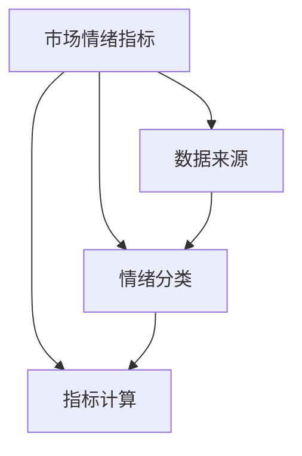
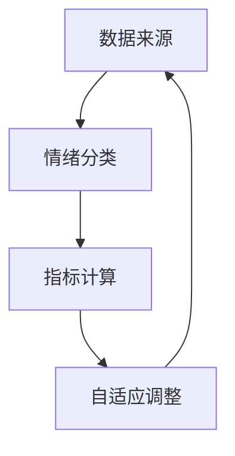

                 


# 利用AI构建自适应型市场情绪指标：把握投资时机

## 关键词：
- AI, 市场情绪指标, 自适应型, 投资时机, 机器学习

## 摘要：
随着金融市场日益复杂化和不确定性的增加，投资者对实时、动态的市场情绪分析需求日益迫切。传统的情绪指标由于其静态性和局限性，难以适应市场的快速变化。本文将介绍如何利用人工智能技术构建自适应型市场情绪指标，通过动态调整和实时更新，帮助投资者更好地把握市场趋势和投资时机。本文将从市场情绪分析的背景、核心概念、算法原理、系统架构设计到实际项目实现进行全面阐述，为读者提供一套基于AI的自适应市场情绪指标构建方法。

---

# 第一部分：背景介绍

## 第1章：市场情绪分析的背景与意义

### 1.1 什么是市场情绪
市场情绪是指投资者在市场中的整体情绪状态，反映了市场参与者对当前市场环境的看法和预期。市场情绪的波动往往与市场价格的变化密切相关，是投资者决策的重要参考指标。

#### 1.1.1 市场情绪的定义
市场情绪是投资者对市场未来走势的乐观或悲观程度的体现，通常通过市场参与者的交易行为、新闻媒体的报道、社交媒体的情绪分析等多种方式来衡量。

#### 1.1.2 市场情绪的重要性
- 帮助投资者预测市场价格走势
- 为投资决策提供参考依据
- 识别市场风险和机会

#### 1.1.3 市场情绪与投资决策的关系
市场情绪直接影响投资者的决策行为，例如过度乐观可能导致市场泡沫，过度悲观可能导致市场超跌。

### 1.2 传统市场情绪分析的局限性
传统市场情绪指标（如恐慌指数、市场情绪指数等）由于其静态性和滞后性，难以适应市场的快速变化。

#### 1.2.1 传统情绪指标的不足
- 数据来源单一，缺乏动态调整能力
- 指标计算周期较长，无法实时更新
- 无法适应市场的非线性变化

#### 1.2.2 传统方法的局限性
- 数据处理能力有限，难以应对海量数据
- 情绪分类精度不高，容易受噪声影响
- 缺乏自适应能力，难以应对市场环境的变化

#### 1.2.3 传统指标与实际市场波动的差距
传统指标往往无法准确捕捉市场短期波动，导致投资者错失交易机会或承担额外风险。

### 1.3 AI在市场情绪分析中的优势
人工智能技术的引入，为市场情绪分析带来了新的可能性。

#### 1.3.1 AI技术的特点
- 数据处理能力强，能够处理海量非结构化数据
- 具备动态调整能力，能够实时更新情绪指标
- 可以通过机器学习模型捕捉市场中的非线性关系

#### 1.3.2 AI在情绪分析中的独特优势
- 能够从多源数据中提取情感特征
- 可以通过自然语言处理技术分析文本情绪
- 可以通过强化学习优化情绪指标的计算方式

#### 1.3.3 AI如何提升市场情绪分析的准确性
- 引入情感分类算法，提高情绪识别的精度
- 利用时间序列分析模型，捕捉市场波动的趋势
- 建立动态反馈机制，实时调整情绪指标

---

## 第2章：自适应型市场情绪指标的定义与目标

### 2.1 自适应型市场情绪指标的核心概念
自适应型市场情绪指标是一种能够根据市场环境动态调整的指标，其核心在于通过实时数据更新和模型优化，提高指标的准确性和实用性。

#### 2.1.1 自适应型指标的定义
自适应型市场情绪指标是一种能够根据市场环境的变化，自动调整其计算方式和权重的动态指标，旨在更准确地反映市场情绪。

#### 2.1.2 自适应型指标的核心特征
- 动态性：能够根据市场变化实时更新
- 自适应性：能够根据市场环境自动调整参数
- 高精度：能够更准确地捕捉市场情绪

#### 2.1.3 自适应型指标与传统指标的区别
| 特性 | 传统指标 | 自适应型指标 |
|------|----------|--------------|
| 数据来源 | 单一 | 多源、动态 |
| 计算周期 | 固定 | 实时、动态 |
| 精度 | 较低 | 较高 |

### 2.2 自适应型市场情绪指标的目标
自适应型指标的目标是通过实时数据更新和模型优化，提高市场情绪分析的准确性和实用性。

#### 2.2.1 实时动态调整的目标
- 实时更新情绪指标，反映当前市场情绪
- 根据市场波动调整指标权重

#### 2.2.2 提高预测准确性的目标
- 通过动态调整模型参数，提高情绪预测的精度
- 利用机器学习算法捕捉市场波动的非线性特征

#### 2.2.3 适应市场变化的目标
- 根据市场环境的变化，自动调整指标的计算方式
- 通过反馈机制优化情绪指标

### 2.3 自适应型指标的边界与外延
#### 2.3.1 应用场景的边界
- 适用于金融市场的实时情绪分析
- 适用于其他市场的情绪分析

#### 2.3.2 数据来源的边界
- 数据来源包括新闻、社交媒体、交易数据等
- 数据类型包括文本、价格、成交量等

#### 2.3.3 指标更新频率的边界
- 更新频率可以根据市场环境动态调整
- 最低更新频率为分钟级

### 2.4 自适应型指标的概念结构与核心要素组成
#### 2.4.1 概念结构图


#### 2.4.2 核心要素的相互关系
市场情绪指标的计算过程涉及数据来源、情绪分类和指标计算三个核心要素，三者之间相互关联，共同构成自适应型市场情绪指标的核心结构。

#### 2.4.3 概念结构的动态调整机制
- 数据来源的动态调整：根据市场环境变化，动态调整数据来源的权重
- 情绪分类的动态调整：根据市场反馈，动态调整情绪分类的阈值
- 指标计算的动态调整：根据市场波动，动态调整指标计算的参数

---

## 第3章：市场情绪指标的核心要素与概念结构

### 3.1 核心要素分析
市场情绪指标的核心要素包括数据来源、情绪分类、指标计算和自适应调整机制。

#### 3.1.1 数据来源的多样性
- 数据来源可以包括新闻、社交媒体、交易数据等多种类型
- 数据的多样性能提高情绪分析的准确性

#### 3.1.2 情感分类的准确性
- 情感分类是市场情绪分析的核心步骤
- 分类的准确性直接影响指标的精度

#### 3.1.3 指标计算的实时性
- 实时计算是自适应型指标的核心特征
- 计算的实时性能够提高指标的实用性

#### 3.1.4 指标调整的自适应性
- 自适应调整是指标动态更新的关键
- 调整的自适应性能够提高指标的灵活性

### 3.2 自适应型指标的数学模型与公式
#### 3.2.1 基于时间序列的模型
- 时间序列模型可以用来预测市场情绪的未来走势
- 常用模型包括ARIMA、LSTM等

#### 3.2.2 基于机器学习的模型
- 机器学习模型可以用来分类市场情绪
- 常用算法包括支持向量机（SVM）、随机森林（RF）等

#### 3.2.3 指标权重的动态调整公式
$$ w_t = \alpha \cdot w_{t-1} + (1-\alpha) \cdot w_{new} $$
其中，$\alpha$ 是调整系数，$w_t$ 是当前权重，$w_{t-1}$ 是上一时刻的权重，$w_{new}$ 是新权重。

---

## 第4章：自适应型市场情绪指标的核心原理

### 4.1 自适应型指标的原理
#### 4.1.1 数据驱动的动态调整
- 通过实时数据更新，动态调整指标的计算方式
- 根据数据的变化，实时更新指标的权重

#### 4.1.2 基于反馈的自适应机制
- 通过市场反馈，不断优化指标的计算模型
- 根据实际表现，动态调整模型的参数

### 4.2 自适应型指标的核心算法
#### 4.2.1 基于机器学习的情绪分类算法
- 使用自然语言处理技术对文本数据进行情绪分类
- 常用算法包括支持向量机（SVM）、随机森林（RF）等

#### 4.2.2 基于时间序列的预测模型
- 使用LSTM等深度学习模型预测市场情绪的未来走势
- 通过反馈机制优化模型的预测精度

---

# 第二部分：核心概念与联系

## 第5章：自适应型市场情绪指标的核心概念与联系

### 5.1 核心概念
自适应型市场情绪指标的核心概念包括数据来源、情绪分类、指标计算和自适应调整机制。

#### 5.1.1 数据来源
- 数据来源可以包括新闻、社交媒体、交易数据等多种类型
- 数据的多样性能提高情绪分析的准确性

#### 5.1.2 情感分类
- 情感分类是市场情绪分析的核心步骤
- 分类的准确性直接影响指标的精度

#### 5.1.3 指标计算
- 指标计算是自适应型指标的核心过程
- 计算的实时性能够提高指标的实用性

#### 5.1.4 自适应调整
- 自适应调整是指标动态更新的关键
- 调整的自适应性能够提高指标的灵活性

### 5.2 核心概念的联系
自适应型市场情绪指标的各个核心概念之间相互关联，共同构成一个动态调整的系统。

#### 5.2.1 数据来源与情绪分类的联系
- 数据来源的多样性能够提高情绪分类的准确性
- 情绪分类的结果会影响指标计算的权重

#### 5.2.2 指标计算与自适应调整的联系
- 指标计算的结果会反馈到自适应调整机制
- 自适应调整机制会影响数据来源的权重

### 5.3 实体关系图


---

## 第6章：自适应型市场情绪指标的特征与优势

### 6.1 核心特征
自适应型市场情绪指标的核心特征包括动态性、自适应性和高精度。

#### 6.1.1 动态性
- 指标能够实时更新，反映当前市场情绪
- 数据来源和计算方式可以动态调整

#### 6.1.2 自适应性
- 指标可以根据市场环境自动调整参数
- 反馈机制能够优化指标的计算方式

#### 6.1.3 高精度
- 通过机器学习算法提高情绪分类的准确性
- 动态调整模型参数提高预测精度

### 6.2 对比分析
与传统市场情绪指标相比，自适应型指标具有以下优势。

#### 6.2.1 数据处理能力
- 自适应型指标能够处理海量非结构化数据
- 传统指标通常依赖于有限的数据来源

#### 6.2.2 计算精度
- 自适应型指标通过动态调整提高计算精度
- 传统指标通常计算周期较长，精度较低

#### 6.2.3 反应速度
- 自适应型指标能够实时更新，反映当前市场情绪
- 传统指标通常滞后于市场变化

---

# 第三部分：算法原理

## 第7章：基于AI的市场情绪分析算法

### 7.1 算法原理
#### 7.1.1 数据预处理
- 文本清洗：去除停用词、标点符号等
- 数据归一化：将数据标准化，方便模型训练

#### 7.1.2 特征提取
- 使用TF-IDF提取文本特征
- 使用Word2Vec生成词向量

#### 7.1.3 模型训练
- 使用SVM、随机森林等算法进行情绪分类
- 使用LSTM进行时间序列预测

### 7.2 算法实现
#### 7.2.1 情绪分类算法
- 使用SVM进行二分类，将市场情绪分为乐观和悲观两类
- 使用随机森林进行多分类，将市场情绪分为多个类别

#### 7.2.2 时间序列预测算法
- 使用LSTM进行时间序列预测
- 使用ARIMA进行传统时间序列预测

### 7.3 算法优化
#### 7.3.1 参数调整
- 调整SVM的核函数和惩罚系数
- 调整随机森林的树数和深度

#### 7.3.2 模型融合
- 使用集成学习方法融合多种模型的结果
- 使用投票机制进行结果融合

---

## 第8章：自适应型指标的数学模型

### 8.1 基于机器学习的情绪分类模型
#### 8.1.1 SVM分类模型
$$ \text{损失函数} = \sum_{i=1}^{n} \max(0, 1 - y_i w^T x_i - b) $$
其中，$y_i$ 是标签，$w$ 是权重向量，$x_i$ 是输入向量，$b$ 是偏置项。

#### 8.1.2 随机森林分类模型
- 使用集成学习方法，将多个决策树的结果进行投票
- 每个决策树的特征选择采用随机采样

### 8.2 基于时间序列的预测模型
#### 8.2.1 LSTM预测模型
- 使用LSTM进行时间序列预测
- 模型结构包括输入门、遗忘门和输出门

#### 8.2.2 ARIMA预测模型
- 使用ARIMA模型进行时间序列预测
- 模型参数包括自回归阶数、差分阶数和移动平均阶数

---

## 第9章：算法实现与优化

### 9.1 算法实现
#### 9.1.1 数据预处理代码
```python
from sklearn.preprocessing import StandardScaler
from sklearn.feature_extraction.text import TfidfVectorizer

# 文本清洗
def preprocess(text):
    text = text.lower()
    text = re.sub(r'[^\w\s]', '', text)
    return text

# 特征提取
vectorizer = TfidfVectorizer()
X = vectorizer.fit_transform(corpus)
```

#### 9.1.2 模型训练代码
```python
from sklearn.svm import SVC
from sklearn.ensemble import RandomForestClassifier

# SVM分类
svm_model = SVC(kernel='rb

