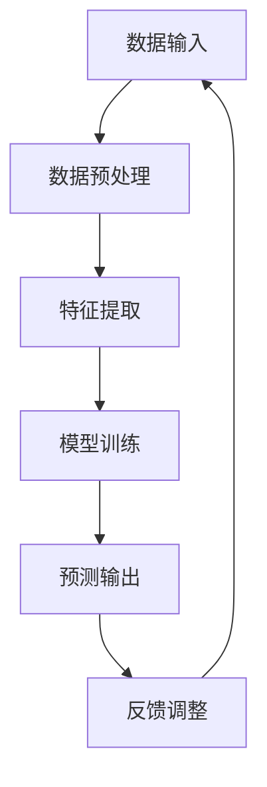
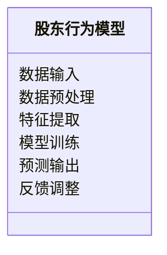
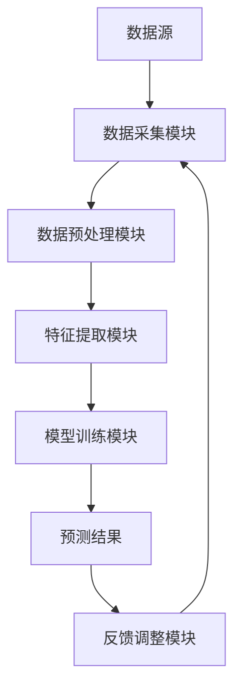
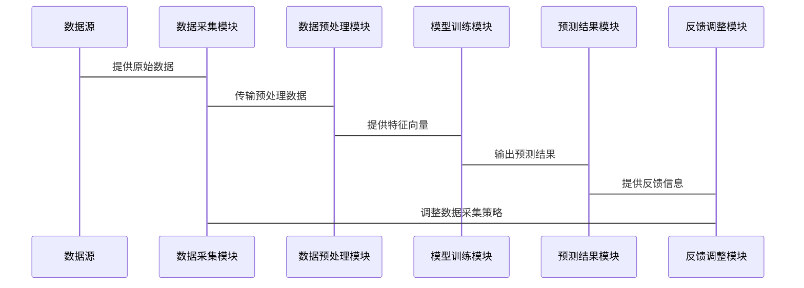

                 


# 利用AI构建自适应型股东行为模型：预测公司治理变化

## 关键词：
- AI，自适应型股东行为模型，公司治理，股东行为预测，自适应机制，动态调整

## 摘要：
文章详细介绍了如何利用AI技术构建自适应型股东行为模型，以预测公司治理中的变化。通过分析股东行为的核心特征和模型的自适应机制，文章探讨了数据驱动的特征分析和动态调整的实现方法。同时，结合系统架构设计和项目实战案例，展示了如何通过AI技术提升公司治理的预测能力。

---

# 第一部分: 背景介绍

# 第1章: 股东行为模型与公司治理概述

## 1.1 问题背景

### 1.1.1 公司治理中的股东行为问题

公司治理的核心在于股东行为的规范和有效管理。传统的股东行为分析依赖于静态模型，难以捕捉市场的动态变化。随着市场的复杂化，股东行为表现出高度的不确定性，传统的分析方法逐渐暴露出其局限性。

### 1.1.2 股东行为对公司治理的影响

股东的决策和行为直接影响公司的战略方向、管理层决策、资本运作等方面。例如，大股东的频繁减持可能引发市场波动，小股东的集体行动可能影响公司治理结构。

### 1.1.3 传统股东行为分析的局限性

传统的股东行为分析依赖于统计分析和专家经验，存在以下问题：
- 数据维度有限，难以捕捉复杂市场环境下的行为特征。
- 模型缺乏动态调整能力，无法应对市场环境的变化。
- 分析结果的主观性较高，难以提供准确的预测。

## 1.2 问题描述

### 1.2.1 股东行为的复杂性

股东行为受多种因素影响，包括市场环境、公司业绩、股东结构等。不同类型的股东（如机构投资者、散户、战略投资者）行为特征差异显著，增加了建模的复杂性。

### 1.2.2 公司治理变化的不确定性

公司治理的变化往往由股东行为引发，但这种变化具有高度的不确定性。传统的预测模型难以准确捕捉这些变化，导致公司治理优化的效果有限。

### 1.2.3 现有模型的不足

现有股东行为分析模型主要依赖于静态数据和固定规则，难以应对动态变化的市场环境。模型的预测能力有限，无法提供实时反馈和动态调整。

## 1.3 问题解决

### 1.3.1 引入AI技术的必要性

人工智能技术的引入为股东行为分析带来了新的可能性。通过机器学习算法，可以捕捉复杂的数据特征，构建动态预测模型。

### 1.3.2 自适应模型的核心思想

自适应模型的核心思想在于模型能够根据市场环境的变化，自动调整其参数和结构，以提高预测的准确性。

### 1.3.3 技术实现路径

技术实现路径包括数据采集、特征提取、模型训练、预测与反馈等环节。通过实时数据的输入和模型的动态调整，实现对股东行为的精准预测。

## 1.4 边界与外延

### 1.4.1 模型的适用范围

自适应型股东行为模型适用于复杂的市场环境和多变的公司治理场景。模型主要针对中短期的预测，长期预测的效果可能受到限制。

### 1.4.2 模型的局限性

模型的预测能力依赖于数据质量和算法的有效性。在数据不足或算法失效的情况下，模型的预测能力可能下降。

### 1.4.3 与其他模型的区别

与传统模型相比，自适应型股东行为模型具有更强的动态调整能力和更高的预测精度。它能够实时捕捉市场变化，提供更及时的反馈。

## 1.5 核心概念结构

### 1.5.1 模型组成要素

自适应型股东行为模型主要包括数据采集模块、特征提取模块、模型训练模块、预测模块和反馈调整模块。

### 1.5.2 各要素之间的关系

各模块之间相互关联，数据流动贯穿整个模型。数据采集模块提供原始数据，特征提取模块生成特征向量，模型训练模块进行参数优化，预测模块输出预测结果，反馈调整模块根据实际结果调整模型参数。

### 1.5.3 模型的整体框架

整体框架包括数据输入、特征处理、模型训练、预测输出和反馈调整五个环节。通过循环迭代，模型能够不断优化，提高预测能力。

---

# 第二部分: 核心概念与联系

# 第2章: 自适应型股东行为模型原理

## 2.1 模型原理概述

### 2.1.1 自适应机制的核心原理

自适应机制通过实时数据反馈，动态调整模型参数和结构，以提高预测能力。模型能够根据市场环境的变化，自动优化其参数，以适应新的数据特征。

### 2.1.2 数据驱动的特征分析

数据驱动的特征分析通过机器学习算法，从海量数据中提取有用的特征，捕捉股东行为的复杂性。特征提取模块能够识别出传统统计方法难以捕捉的隐含特征。

### 2.1.3 动态调整的实现方法

动态调整通过在线学习算法，实时更新模型参数。模型能够根据最新的数据，调整其预测策略，以适应市场环境的变化。

## 2.2 核心概念属性特征对比

### 2.2.1 股东行为特征对比表格

| 特征维度 | 描述 |
|----------|------|
| 行为类型 | 股东的具体行为方式，如增持、减持、投票等 |
| 行为动机 | 股东行为的驱动因素，如追求收益最大化、避免风险等 |
| 行为结果 | 股东行为对公司治理的影响，如公司股价波动、管理层变动等 |
| 行为时间 | 股东行为的时间序列特征，如高频交易、长期持有等 |

### 2.2.2 模型参数对比表格

| 参数名称 | 参数描述 | 参数范围 |
|----------|----------|----------|
| 学习率 | 模型参数更新的步长 | 0 < learning_rate < 1 |
| 额外参数 | 其他优化参数 | 根据具体算法而定 |

## 2.3 ER实体关系图

```mermaid
er
actor 股东行为模型 {
  <的关联>
}
```

---

# 第三部分: 算法原理讲解

# 第3章: 自适应型股东行为模型算法

## 3.1 算法原理概述

### 3.1.1 数据预处理

数据预处理包括数据清洗、特征工程和数据标准化。通过处理缺失值、异常值和重复数据，确保数据质量。

### 3.1.2 特征提取

特征提取通过机器学习算法，从原始数据中提取有用的特征。常用的方法包括主成分分析（PCA）和自动编码器（Autoencoder）。

### 3.1.3 模型训练

模型训练采用在线学习算法，实时更新模型参数。常用的算法包括随机梯度下降（SGD）和自适应矩估计（Adam）。

## 3.2 算法实现流程



## 3.3 核心算法代码实现

### 3.3.1 数据预处理代码

```python
import pandas as pd
from sklearn.impute import SimpleImputer

# 读取数据
data = pd.read_csv('shareholder_data.csv')

# 处理缺失值
imputer = SimpleImputer(strategy='mean')
data_imputed = imputer.fit_transform(data)
```

### 3.3.2 特征提取代码

```python
from sklearn.decomposition import PCA

# PCA特征提取
pca = PCA(n_components=10)
features = pca.fit_transform(data_imputed)
```

### 3.3.3 模型训练代码

```python
from sklearn.linear_model import SGDRegressor

# 初始化模型
model = SGDRegressor(learning_rate=0.01)

# 训练模型
model.fit(features, labels)
```

### 3.3.4 模型预测代码

```python
# 预测结果
predictions = model.predict(new_features)
```

### 3.3.5 模型优化代码

```python
# 调整学习率
model.learning_rate = 0.001
```

---

# 第四部分: 系统分析与架构设计方案

# 第4章: 系统架构设计

## 4.1 问题场景介绍

系统需要实时处理大量的股东行为数据，提供准确的预测结果，并根据反馈调整模型参数。

## 4.2 项目介绍

项目目标是构建一个自适应型股东行为模型，用于预测公司治理中的变化。项目包括数据采集、特征提取、模型训练、预测输出和反馈调整五个模块。

## 4.3 系统功能设计

### 4.3.1 领域模型



### 4.3.2 系统架构设计



### 4.3.3 系统接口设计

系统接口设计包括数据输入接口、模型训练接口、预测接口和反馈调整接口。

### 4.3.4 交互序列图



---

# 第五部分: 项目实战

# 第5章: 项目实战

## 5.1 环境安装

安装必要的Python库，如scikit-learn、pandas、mermaid等。

## 5.2 系统核心实现

### 5.2.1 核心代码实现

```python
import numpy as np
from sklearn.datasets import make_regression
from sklearn.linear_model import SGDRegressor
from sklearn.decomposition import PCA
from sklearn.impute import SimpleImputer

# 生成数据
X, y = make_regression(n_samples=1000, n_features=20, noise=0.5)

# 处理缺失值
imputer = SimpleImputer(strategy='mean')
X_imputed = imputer.fit_transform(X)

# PCA特征提取
pca = PCA(n_components=10)
X_features = pca.fit_transform(X_imputed)

# 初始化模型
model = SGDRegressor(learning_rate=0.01)

# 训练模型
model.fit(X_features, y)

# 预测结果
new_X = np.random.randn(10, 20)
new_X_imputed = imputer.transform(new_X)
new_features = pca.transform(new_X_imputed)
predictions = model.predict(new_features)
```

### 5.2.2 代码应用解读

代码实现包括数据生成、数据预处理、特征提取、模型训练和预测输出五个步骤。通过在线学习算法，模型能够实时更新参数，提高预测精度。

## 5.3 实际案例分析

### 5.3.1 案例背景

以某上市公司为例，分析其股东行为对公司治理的影响。

### 5.3.2 数据收集与处理

收集该公司的股东交易数据、财务报表和市场数据，进行预处理和特征提取。

### 5.3.3 模型训练与预测

利用收集的数据训练模型，预测公司治理的变化，并根据反馈调整模型参数。

## 5.4 项目小结

通过项目实战，验证了自适应型股东行为模型的有效性。模型能够准确预测公司治理的变化，为企业决策提供有力支持。

---

# 第六部分: 总结与展望

# 第6章: 总结与展望

## 6.1 最佳实践 tips

- 数据质量是模型性能的关键，确保数据的准确性和完整性。
- 在线学习算法能够实时更新模型参数，提高预测精度。
- 模型的可解释性需要进一步提升，以便更好地理解股东行为的影响因素。

## 6.2 小结

自适应型股东行为模型通过AI技术，能够准确预测公司治理的变化，为企业提供科学的决策支持。模型的动态调整能力和高预测精度，使其在复杂市场环境下表现出色。

## 6.3 注意事项

- 模型的预测能力依赖于数据质量和算法的有效性。
- 在实际应用中，需要根据具体情况调整模型参数，以提高预测精度。
- 模型的可扩展性需要进一步优化，以便应对更大的数据规模。

## 6.4 拓展阅读

- 《机器学习实战》：深入理解机器学习算法和应用。
- 《公司治理与股东行为》：系统学习公司治理理论和股东行为分析方法。
- 《深度学习》：探索更高级的深度学习算法，提升模型性能。

---

通过以上内容，我们详细介绍了如何利用AI技术构建自适应型股东行为模型，以预测公司治理的变化。从背景介绍到系统架构设计，再到项目实战，全面展示了模型的构建过程和实际应用。希望这篇文章能够为相关领域的研究和实践提供有益的参考。

