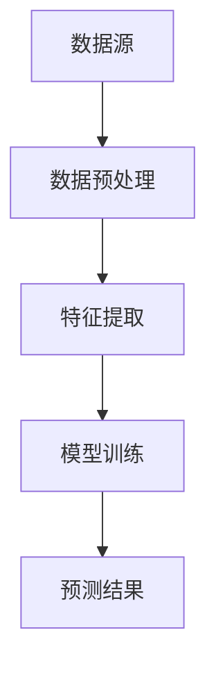
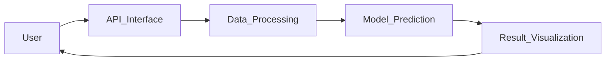

                 


# 利用AI进行全球资金流动分析：预测市场走向

**关键词：** 全球资金流动，AI，金融分析，时间序列预测，深度学习，市场预测

**摘要：**  
随着全球金融市场的复杂化和数据的爆炸式增长，传统的资金流动分析方法已难以满足实时性和精准性的要求。人工智能（AI）技术的引入为资金流动分析带来了新的可能性，能够通过复杂的数据挖掘和预测模型，帮助投资者和机构更准确地预测市场走向。本文将深入探讨AI在资金流动分析中的应用，从背景、原理到实际案例，全面解析如何利用AI技术优化全球资金流动分析。

---

## 第一部分：全球资金流动分析的背景与挑战

### 第1章：全球资金流动分析的背景与意义

#### 1.1 全球资金流动的现状与挑战
- **1.1.1 全球资金流动的基本概念**
  - 资金流动的定义与分类
  - 资金流动的驱动因素（经济、政治、市场情绪等）
  - 资金流动的时空特征

- **1.1.2 资金流动对全球经济的影响**
  - 资金流动对汇率、资产价格的影响
  - 资金流动与经济周期的关系
  - 资金流动的全球化趋势

- **1.1.3 传统资金流动分析的局限性**
  - 数据量大、维度多，传统方法难以处理
  - 市场动态变化快，模型更新困难
  - 人工分析的主观性和不准确性

#### 1.2 AI技术在金融分析中的应用前景
- **1.2.1 AI技术在金融领域的应用现状**
  - AI在股票预测、风险评估、交易策略中的应用
  - 大数据时代下AI的优势

- **1.2.2 AI在资金流动分析中的优势**
  - 数据处理能力：AI能够快速处理海量数据
  - 模型自适应性：AI能够捕捉非线性关系和隐含模式
  - 实时性：AI能够实现高频交易和实时预测

- **1.2.3 未来发展趋势与挑战**
  - 技术挑战：模型解释性、计算资源需求
  - 数据隐私与安全问题
  - 市场监管与伦理问题

---

## 第二部分：AI驱动的资金流动分析核心概念与联系

### 第2章：资金流动分析的核心概念与联系

#### 2.1 资金流动分析的核心概念
- **2.1.1 数据特征对比**
  | 特征维度 | 描述 | 示例 |
  |----------|------|------|
  | 时间序列 | 数据按时间排序 | 每天的外汇交易量 |
  | 多维性 | 数据包含多种属性 | 汇率、利率、GDP增长率 |
  | 非线性 | 数据关系复杂 | 市场情绪对资金流动的影响 |

- **2.1.2 系统架构图**
  ```mermaid
  graph TD
    A[数据源] --> B[数据预处理]
    B --> C[特征提取]
    C --> D[模型训练]
    D --> E[预测结果]
  ```

- **2.1.3 数据关联性分析**
  - 汇率与国际资本流动的关系
  - 利率变化对资金流动的影响
  - 经济指标（如GDP、失业率）与资金流动的关联

#### 2.2 AI技术在资金流动分析中的核心原理
- **2.2.1 数据特征对比**
  - 时间序列数据的长短期依赖关系
  - 数据的周期性、趋势性和随机性

- **2.2.2 系统架构图**
  ```mermaid
  graph TD
    Data --> Preprocessing
    Preprocessing --> FeatureExtraction
    FeatureExtraction --> ModelTraining
    ModelTraining --> Prediction
  ```

- **2.2.3 数据关联性分析**
  - 利用AI技术发现数据中的隐含模式
  - 通过深度学习捕捉复杂的关系

---

## 第三部分：AI驱动的资金流动分析算法原理

### 第3章：时间序列分析与预测算法

#### 3.1 时间序列分析的基本原理
- **3.1.1 时间序列数据的特性**
  - 趋势性、周期性、随机性
  - 自相关性和偏自相关性

- **3.1.2 常见的时间序列模型**
  - ARIMA模型
  - GARCH模型
  - Prophet模型

- **3.1.3 时间序列预测的数学模型**
  $$ARIMA(p, d, q) = \frac{(1 - B)^d}{(1 - \phi B)(1 - \theta B^{-1})} \cdot Y_t = c$$

#### 3.2 基于深度学习的时间序列预测
- **3.2.1 LSTM网络的结构与优势**
  - LSTM单元的结构：输入门、遗忘门、输出门
  - LSTM在时间序列预测中的优势

- **3.2.2 LSTM的实现流程**
  ```mermaid
  graph LR
    Input --> LSTM_Cell
    LSTM_Cell --> Output
    LSTM_Cell --> Hidden_State
  ```

- **3.2.3 LSTM模型实现代码**
  ```python
  from tensorflow.keras.models import Sequential
  from tensorflow.keras.layers import LSTM, Dense

  model = Sequential()
  model.add(LSTM(50, input_shape=(timesteps, features)))
  model.add(Dense(1))
  model.compile(loss='mean_squared_error', optimizer='adam')
  ```

#### 3.3 时间序列预测的Python实现
- **3.3.1 数据预处理代码**
  ```python
  import pandas as pd
  import numpy as np
  from sklearn.preprocessing import MinMaxScaler

  # 假设data是时间序列数据
  scaler = MinMaxScaler()
  data_scaled = scaler.fit_transform(data)
  ```

- **3.3.2 LSTM模型实现代码**
  ```python
  from tensorflow.keras.models import Sequential
  from tensorflow.keras.layers import LSTM, Dense

  model = Sequential()
  model.add(LSTM(50, input_shape=(timesteps, features)))
  model.add(Dense(1))
  model.compile(loss='mean_squared_error', optimizer='adam')
  ```

---

## 第四部分：系统分析与架构设计方案

### 第4章：系统分析与架构设计

#### 4.1 系统应用场景
- 全球资金流动监控与预警
- 资金流向预测与投资决策
- 风险评估与管理

#### 4.2 系统功能设计
- 数据采集与处理
- 特征提取与模型训练
- 预测与可视化
- 报告生成

#### 4.3 系统架构设计


#### 4.4 系统接口设计
- 数据接口：API接口设计
- 用户界面：可视化界面设计
- 报告接口：生成PDF/Excel报告

#### 4.5 系统交互流程


---

## 第五部分：项目实战

### 第5章：项目实战

#### 5.1 环境安装
- 安装Python、TensorFlow、Keras、Pandas等库
  ```bash
  pip install numpy pandas tensorflow keras matplotlib
  ```

#### 5.2 核心代码实现
- 数据预处理
  ```python
  import pandas as pd
  import numpy as np
  from sklearn.preprocessing import MinMaxScaler

  # 加载数据
  data = pd.read_csv('global_fund_flow.csv')
  scaler = MinMaxScaler()
  data_scaled = scaler.fit_transform(data)
  ```

- 模型训练
  ```python
  from tensorflow.keras.models import Sequential
  from tensorflow.keras.layers import LSTM, Dense

  model = Sequential()
  model.add(LSTM(50, input_shape=(timesteps, features)))
  model.add(Dense(1))
  model.compile(loss='mean_squared_error', optimizer='adam')
  model.fit(X_train, y_train, epochs=50, batch_size=32)
  ```

#### 5.3 案例分析
- 数据来源：全球主要经济体的资金流动数据
- 数据预处理：标准化、滑动窗口等
- 模型训练：使用LSTM进行预测
- 结果分析：预测精度、误差分析、可视化

#### 5.4 项目小结
- 项目实现的关键点
- 遇到的挑战与解决方案
- 改进建议

---

## 第六部分：最佳实践与拓展阅读

### 第6章：最佳实践

#### 6.1 小结
- AI在资金流动分析中的优势与局限性
- 未来研究方向

#### 6.2 注意事项
- 数据质量的重要性
- 模型的可解释性
- 风险控制

#### 6.3 拓展阅读
- 《机器学习实战》
- 《深度学习入门：基于Python和Keras》
- 《金融数据分析与预测》

---

通过以上目录结构，我们可以系统地了解如何利用AI技术进行全球资金流动分析，并预测市场走向。从理论到实践，从基础到高级，帮助读者掌握这一领域的核心知识与技能。

