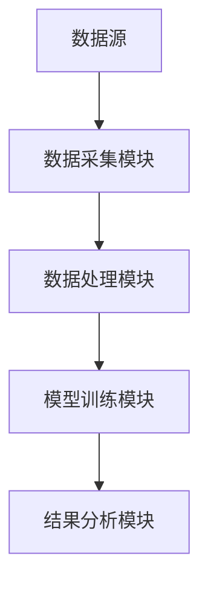

                 


# 利用AI进行动态财务压力测试：增强价值投资的安全性

## 关键词：AI，动态财务压力测试，价值投资，风险管理，机器学习

## 摘要：  
本文深入探讨了如何利用人工智能技术进行动态财务压力测试，以增强价值投资的安全性。通过结合机器学习算法、时间序列分析和自然语言处理等技术，本文提出了一种高效的动态压力测试方法，能够实时捕捉市场波动，评估潜在风险，并为投资者提供科学的决策支持。本文还详细介绍了系统架构设计、算法实现和实际案例，为读者提供了从理论到实践的全面指导。

---

## 第一部分: 利用AI进行动态财务压力测试概述

### 第1章: 动态财务压力测试与AI的结合

#### 1.1 什么是动态财务压力测试
- **财务压力测试的定义与作用**  
  财务压力测试是一种评估资产或投资组合在极端市场条件下的表现的方法。通过模拟不同场景（如经济衰退、市场崩盘等），压力测试可以帮助投资者了解潜在风险，并制定应对策略。

- **动态压力测试的特点**  
  动态压力测试与传统压力测试相比，具有更强的实时性和适应性。它能够根据市场环境的变化，动态调整测试参数和场景，提供更准确的评估结果。

- **AI在压力测试中的应用价值**  
  AI技术（特别是机器学习）能够处理海量数据，识别复杂模式，并快速生成预测结果。这使得AI成为动态压力测试的核心工具。

#### 1.2 价值投资与财务风险管理
- **价值投资的核心理念**  
  价值投资强调以合理价格购买具有长期竞争优势的公司。其核心在于识别低估资产，并在市场波动中保持投资稳定性。

- **财务风险管理的重要性**  
  在价值投资中，风险管理是确保投资组合安全的关键。通过压力测试，投资者可以评估极端市场条件下的潜在损失，并制定应对策略。

- **动态压力测试在价值投资中的作用**  
  动态压力测试能够帮助投资者实时评估市场风险，识别潜在的“黑天鹅”事件，并优化投资组合，从而提高投资决策的科学性和安全性。

#### 1.3 AI技术在金融领域的应用现状
- **机器学习在金融分析中的应用**  
  机器学习算法广泛应用于股票预测、信用评分、欺诈检测等领域。通过分析历史数据，机器学习能够发现隐藏的规律，并提供可靠的预测结果。

- **自然语言处理在财务数据中的应用**  
  自然语言处理（NLP）技术可以帮助分析新闻、财报等非结构化数据，提取关键信息，并生成实时的市场情绪指标。

- **深度学习在风险评估中的潜力**  
  深度学习模型（如LSTM和Transformer）在时间序列分析和文本挖掘中表现出色，为动态压力测试提供了新的可能性。

---

## 第二部分: AI驱动的动态财务压力测试方法论

### 第2章: 动态财务压力测试的理论基础

#### 2.1 财务压力测试的传统方法
- **历史模拟法**  
  通过回顾历史市场数据，模拟极端市场条件下的资产表现。这种方法简单易行，但缺乏灵活性。

- **方差-协方差法**  
  通过资产之间的协方差矩阵，计算投资组合的风险。这种方法假设市场是正态分布的，但在极端情况下可能失效。

- **蒙特卡洛模拟法**  
  通过随机抽样生成大量市场情景，评估资产在不同情景下的表现。这种方法灵活性高，但计算量较大。

#### 2.2 现代动态压力测试方法
- **时间序列分析**  
  时间序列分析通过分析资产价格的波动性，预测未来市场走势。常用的方法包括ARIMA和GARCH模型。

- **状态空间模型**  
  状态空间模型将市场状态分为不同的类别（如牛市、熊市），并根据当前状态预测未来走势。

- **非线性模型在压力测试中的应用**  
  非线性模型（如神经网络）能够捕捉复杂的市场动态，适用于极端市场条件下的压力测试。

#### 2.3 压力测试模型的构建与优化
- **数据采集与预处理**  
  数据采集是压力测试的第一步。需要收集资产价格、市场指数、宏观经济指标等数据，并进行清洗和标准化处理。

- **模型选择与训练**  
  根据数据特点选择合适的模型（如LSTM或随机森林），并进行训练和调优。

- **模型验证与优化**  
  通过回测和交叉验证评估模型的性能，并根据实际表现进行优化。

---

## 第三部分: 基于AI的动态压力测试算法原理

### 第3章: 机器学习算法在压力测试中的应用

#### 3.1 常见机器学习算法概述
- **线性回归**  
  线性回归用于预测资产价格的变化趋势，适用于线性关系较强的场景。

- **支持向量机**  
  支持向量机（SVM）通过构建超平面，将数据点分为不同类别，适用于分类和回归问题。

- **随机森林**  
  随机森林通过集成多个决策树，提高模型的泛化能力，适用于复杂的数据关系。

- **神经网络**  
  神经网络通过多层结构模拟人脑的处理方式，适用于非线性关系的建模。

#### 3.2 时间序列预测的机器学习方法
- **LSTM网络在时间序列预测中的应用**  
  LSTM（长短期记忆网络）能够捕捉时间序列中的长期依赖关系，适用于股票价格预测和市场趋势分析。

- **GRU网络的优势**  
  GRU（门控循环单元）是LSTM的一种变体，计算效率更高，适合处理短时间序列数据。

- **时间序列特征提取方法**  
  通过滑动窗口、差分等方法提取时间序列的特征，提高模型的预测能力。

#### 3.3 压力测试的分类与回归算法选择
- **分类算法在压力测试中的应用**  
  分类算法（如逻辑回归和SVM）可用于将市场状态分为不同类别（如牛市、熊市）。

- **回归算法在压力测试中的应用**  
  回归算法（如线性回归和随机森林）可用于预测资产在不同市场状态下的表现。

- **混合模型的优势**  
  混合模型（如集成学习和深度学习）结合了多种算法的优点，能够提高预测的准确性和稳定性。

#### 3.4 本章小结
- 机器学习算法在动态压力测试中的应用广泛，不同算法适用于不同的场景。选择合适的算法并进行优化是压力测试成功的关键。

---

## 第四部分: 系统架构与实现

### 第4章: 系统架构设计

#### 4.1 系统功能模块划分
- **数据采集模块**  
  负责收集资产价格、市场指数等数据，并进行清洗和预处理。

- **数据处理模块**  
  对数据进行特征提取和标准化处理，为模型训练提供输入。

- **模型训练模块**  
  根据选择的算法进行模型训练，并保存最优模型。

- **结果分析模块**  
  对模型的预测结果进行分析，并生成可视化报告。

#### 4.2 系统架构图


#### 4.3 接口设计与交互流程
- **API接口设计**  
  提供RESTful API接口，允许其他系统调用压力测试结果。

- **用户交互流程**  
  用户可以通过网页界面输入参数，查看压力测试结果。

- **系统日志与监控**  
  记录系统运行状态和错误信息，便于维护和优化。

#### 4.4 本章小结
- 系统架构设计是动态压力测试系统的核心部分。通过模块化设计和合理的接口设计，可以提高系统的可扩展性和可维护性。

---

## 第五部分: 项目实战与案例分析

### 第5章: 项目实战

#### 5.1 环境搭建与数据准备
- **Python环境安装**  
  安装Python和相关库（如TensorFlow、Pandas、Matplotlib）。

- **数据集获取与预处理**  
  从金融数据源（如Yahoo Finance）获取数据，并进行清洗和标准化。

- **开发工具配置**  
  配置Jupyter Notebook或IDE，方便代码编写和调试。

#### 5.2 核心代码实现
```python
import numpy as np
import pandas as pd
from tensorflow.keras.models import Sequential
from tensorflow.keras.layers import LSTM, Dense, Dropout

# 数据预处理
data = pd.read_csv('stock_prices.csv')
features = data[['close', 'open', 'high', 'low']]
labels = data['next_day_close']

# 划分训练集和测试集
train_data = features[:800]
test_data = features[800:]
train_labels = labels[:800]
test_labels = labels[800:]

# 构建LSTM模型
model = Sequential()
model.add(LSTM(units=50, return_sequences=True, input_shape=(train_data.shape[1], 1)))
model.add(LSTM(units=50, return_sequences=False))
model.add(Dense(1))
model.compile(optimizer='adam', loss='mean_squared_error')

# 训练模型
model.fit(train_data.values.reshape((train_data.shape[0], train_data.shape[1], 1)),
          train_labels.values,
          epochs=50,
          batch_size=32)
```

#### 5.3 项目小结
- 通过项目实战，我们可以看到AI在动态压力测试中的巨大潜力。模型的预测结果可以帮助投资者更好地进行风险管理，提高投资决策的科学性。

---

## 第六部分: 总结与展望

### 第6章: 总结与展望

#### 6.1 本章总结
- 本文详细介绍了AI在动态财务压力测试中的应用，从理论到实践，为读者提供了全面的指导。

#### 6.2 未来展望
- 随着AI技术的不断发展，动态压力测试将更加智能化和精准化。未来的研究方向包括更复杂模型的开发和多模态数据的分析。

#### 6.3 最佳实践 tips
- 在实际应用中，建议结合多种算法和数据源，提高模型的稳定性和准确性。

#### 6.4 注意事项
- 投资者在使用AI进行压力测试时，应结合市场实际情况，避免过度依赖模型。

#### 6.5 拓展阅读
- 推荐阅读相关领域的书籍和论文，深入了解机器学习在金融中的应用。

---

## 关键词：AI，动态财务压力测试，价值投资，风险管理，机器学习

---

通过本文的详细分析，读者可以全面了解如何利用AI技术进行动态财务压力测试，并在实际投资中增强风险管理能力。希望本文能够为价值投资者提供新的思路和工具，帮助他们在复杂多变的市场中做出更明智的投资决策。

