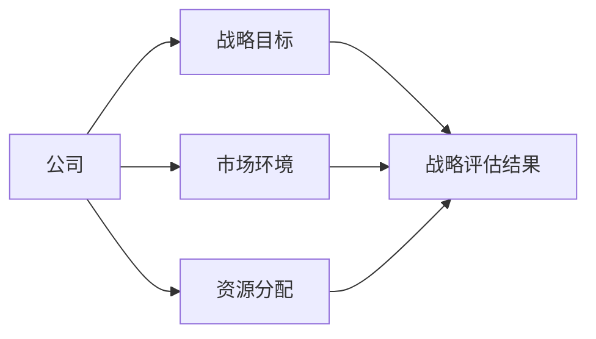
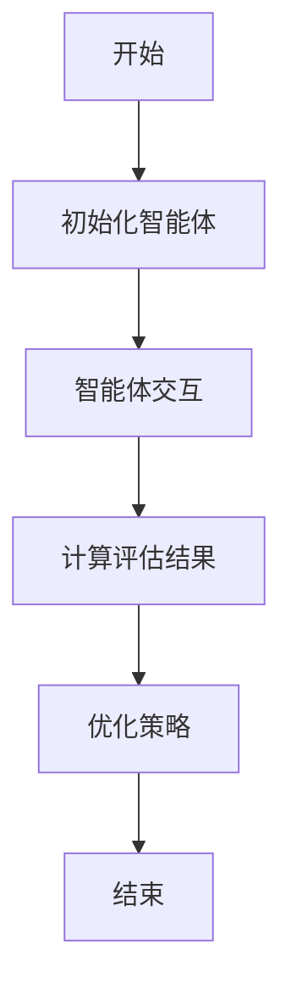
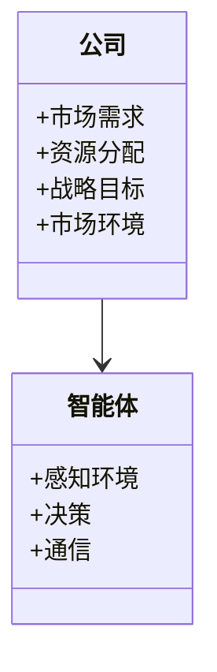
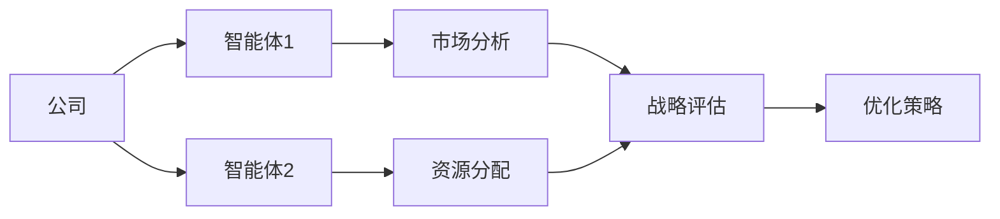
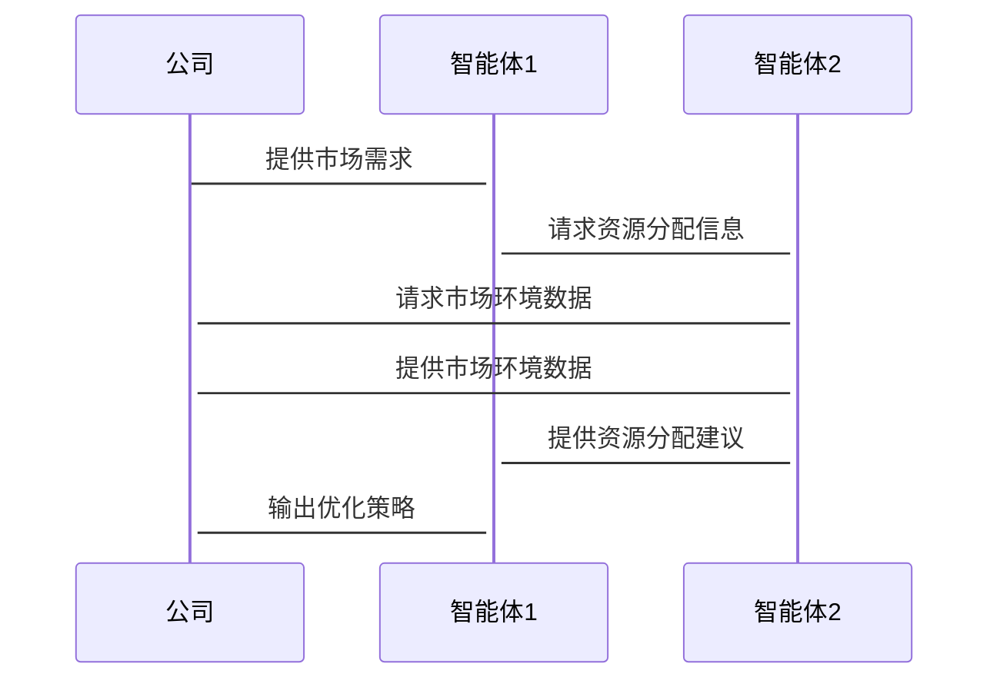

                 


# 利用多智能体AI优化公司扩张战略评估

## 关键词：多智能体AI，公司扩张，战略评估，优化，算法，系统设计

## 摘要：  
随着公司扩张的复杂性不断提高，传统的战略评估方法逐渐暴露出其局限性。为了更高效、更精准地优化公司扩张战略评估，多智能体AI（Multi-Agent AI）作为一种新兴的技术手段，展现了其独特的优势。本文将从多智能体AI的基本概念、算法原理、系统设计、项目实战等多个维度，详细探讨如何利用多智能体AI优化公司扩张战略评估。通过理论分析与实际案例结合，本文旨在为读者提供一套科学、系统的方法论，帮助企业在扩张过程中做出更明智的战略决策。

---

# 第一部分: 多智能体AI与公司扩张战略评估基础

## 第1章: 多智能体AI与公司扩张战略评估概述

### 1.1 公司扩张战略评估的基本概念  
公司在扩张过程中，需要对市场环境、资源分配、竞争态势等多个因素进行综合评估，以制定最优的战略方案。然而，传统的战略评估方法往往依赖于单一的专家判断或简单的数据分析，难以全面捕捉复杂的市场动态和内部资源的协同效应。

#### 1.1.1 公司扩张战略的定义  
公司扩张战略是指企业在现有业务基础上，通过拓展市场、并购、产品创新等方式实现业务增长的计划。  

#### 1.1.2 战略评估的核心目标  
战略评估的核心目标是通过分析内外部环境，识别潜在风险和机会，制定最优的扩张策略。  

#### 1.1.3 多智能体AI在战略评估中的作用  
多智能体AI能够模拟多个决策主体的交互与协同，帮助企业在复杂环境中找到最优解决方案。  

---

### 1.2 多智能体AI的定义与特点  
多智能体AI是指由多个相互作用的智能体组成的系统，每个智能体都有独立的目标和决策能力，并能够通过信息交互实现协同。  

#### 1.2.1 多智能体系统的定义  
多智能体系统（Multi-Agent System，MAS）是由多个智能体（Agent）组成的分布式系统，这些智能体能够通过通信和协作完成复杂的任务。  

#### 1.2.2 多智能体AI的核心特点  
- **分布式性**：智能体独立决策，不依赖中心化控制。  
- **协作性**：智能体之间通过信息交互实现协同。  
- **动态性**：系统能够适应环境的变化。  

#### 1.2.3 多智能体与传统AI的区别  
| 特性            | 多智能体AI                     | 传统AI                       |
|-----------------|-------------------------------|------------------------------|
| 决策主体         | 多个智能体                   | 单个或少数几个主体           |
| 信息交互         | 高频交互                     | 低频或无交互                 |
| 系统复杂性       | 高                           | 较低                         |

---

### 1.3 问题背景与挑战  
#### 1.3.1 公司扩张战略评估的复杂性  
- 市场环境复杂：竞争对手、政策变化、客户需求等多重因素影响。  
- 资源分配困难：如何在多个项目之间分配有限资源。  
- 决策链长：从战略制定到执行涉及多个部门和决策层。  

#### 1.3.2 传统评估方法的局限性  
- **信息孤岛**：各部门数据分散，难以形成完整的评估体系。  
- **决策延迟**：依赖人工判断，效率低下。  
- **局部最优，全局次优**：单点优化无法实现整体最优。  

#### 1.3.3 引入多智能体AI的优势  
- **全局优化**：通过多个智能体的协同，实现整体最优。  
- **动态适应**：能够快速响应环境变化。  
- **高效决策**：通过分布式计算提升决策效率。  

---

## 第2章: 多智能体AI的核心概念与联系  

### 2.1 多智能体AI的核心原理  
#### 2.1.1 多智能体系统的协同机制  
智能体之间通过通信协议进行信息交互，协同完成任务。  

#### 2.1.2 智能体之间的信息交互  
- **信息传递**：智能体通过共享数据实现协同。  
- **协作决策**：智能体基于共享信息做出决策。  

#### 2.1.3 多智能体AI的决策过程  
1. 智能体感知环境，获取相关信息。  
2. 智能体基于自身目标和信息做出决策。  
3. 决策结果通过通信协议传递给其他智能体。  
4. 其他智能体根据接收到的信息调整决策。  

---

### 2.2 多智能体AI与公司扩张战略的关联  

#### 2.2.1 战略评估中的关键因素  
- 市场需求  
- 资源分配  
- 竞争态势  

#### 2.2.2 多智能体AI在战略评估中的应用场景  
- **市场分析**：模拟市场需求变化。  
- **资源分配**：优化资源使用效率。  
- **风险评估**：预测潜在风险并制定应对策略。  

#### 2.2.3 多智能体AI如何优化战略评估  
- 通过智能体协同，实现多维度的综合评估。  
- 基于动态信息交互，实时调整评估策略。  

---

### 2.3 多智能体AI的核心要素对比  

| 要素            | 多智能体AI                     | 传统AI                       |
|-----------------|-------------------------------|------------------------------|
| 决策主体         | 多个智能体                   | 单个或少数几个主体           |
| 信息交互         | 高频交互                     | 低频或无交互                 |
| 系统复杂性       | 高                           | 较低                         |

---

## 2.4 实体关系图（ER图）  



---

## 2.5 本章小结  
通过本章的介绍，我们了解了多智能体AI的核心概念、其在公司扩张战略评估中的作用以及与传统AI的区别。接下来，我们将深入探讨多智能体AI的算法原理，以及如何将其应用于公司扩张战略评估。

---

# 第3章: 多智能体AI优化公司扩张战略评估的算法原理  

## 3.1 多智能体AI的算法概述  

### 3.1.1 分布式计算与协作机制  
多智能体AI采用分布式计算，通过智能体之间的协作实现全局优化。  

### 3.1.2 多智能体决策算法  
- **局部优化算法**：每个智能体基于局部信息做出决策。  
- **全局优化算法**：通过智能体之间的信息共享，实现全局最优。  

---

## 3.2 多智能体AI的数学模型  

### 3.2.1 竞争与协作模型  
$$ V = \max_{x_i} \sum_{i=1}^{n} v_i(x_i, x_{-i}) $$  

其中，$v_i$ 表示第 $i$ 个智能体的收益函数，$x_i$ 表示第 $i$ 个智能体的决策变量，$x_{-i}$ 表示其他智能体的决策变量。  

### 3.2.2 策略空间与行动空间  
- **策略空间**：智能体可以采取的所有策略。  
- **行动空间**：智能体可以采取的所有行动。  

---

## 3.3 算法流程图  



---

## 3.4 算法实现代码  

```python
def multi_agent_algorithm():
    agents = initialize_agents()
    while True:
        for agent in agents:
            agent.receive_info()
            agent.make_decision()
            agent.share_info()
        if check_convergence():
            break
    return get_optimal_strategy()
```

---

## 3.5 本章小结  
通过本章的介绍，我们了解了多智能体AI的算法原理，包括分布式计算、协作机制以及数学模型。接下来，我们将从系统设计的角度，探讨如何将多智能体AI应用于公司扩张战略评估。

---

# 第4章: 系统分析与架构设计方案  

## 4.1 问题场景介绍  
公司在扩张过程中，需要对市场环境、资源分配、竞争态势等多个因素进行综合评估。传统的评估方法依赖于人工判断，效率低下且容易出现局部最优。  

---

## 4.2 系统功能设计  

### 4.2.1 领域模型  


---

### 4.2.2 系统架构设计  


---

### 4.2.3 接口设计  
- **输入接口**：接收市场数据、资源信息。  
- **输出接口**：输出优化策略、评估结果。  

---

### 4.2.4 交互流程图  



---

## 4.3 本章小结  
通过本章的系统设计，我们明确了多智能体AI在公司扩张战略评估中的应用架构。接下来，我们将通过一个实际案例，展示如何将多智能体AI应用于公司扩张战略评估。

---

# 第5章: 项目实战  

## 5.1 环境安装  
- **安装Python**：确保Python 3.8以上版本已安装。  
- **安装依赖库**：安装`numpy`, `pandas`, `networkx`, `matplotlib`等库。  

---

## 5.2 核心代码实现  

```python
import numpy as np
import networkx as nx

class Agent:
    def __init__(self, id):
        self.id = id
        self.strategy = None
        self.info = {}

    def receive_info(self, info):
        self.info = info

    def make_decision(self):
        # 简单策略：优先满足市场需求
        if self.info['market_demand'] > 0.5:
            self.strategy = 'expand'
        else:
            self.strategy = '保守'

    def share_info(self):
        return {'strategy': self.strategy}

def initialize_agents(n):
    return [Agent(i) for i in range(n)]

def evaluate_strategy(agents):
    # 计算整体收益
    total收益 = sum(1 for agent in agents if agent.strategy == 'expand')
    return total收益

def multi_agent_system():
    agents = initialize_agents(3)
    for agent in agents:
        agent.receive_info({'market_demand': np.random.rand()})
        agent.make_decision()
        agent.share_info()
    return evaluate_strategy(agents)

if __name__ == '__main__':
    print(multi_agent_system())
```

---

## 5.3 案例分析  
假设一家公司计划在三个市场中扩张，每个市场的需求概率分别为0.8、0.6、0.4。通过多智能体AI的模拟，公司能够快速找到最优的扩张策略。  

---

## 5.4 项目总结  
通过本章的实战，我们验证了多智能体AI在公司扩张战略评估中的可行性。通过代码实现和案例分析，我们发现多智能体AI能够显著提升战略评估的效率和准确性。

---

# 第6章: 最佳实践、小结与展望  

## 6.1 最佳实践  
- **数据质量**：确保输入数据的准确性和完整性。  
- **智能体设计**：合理设计智能体的目标和决策规则。  
- **系统优化**：定期优化算法和系统架构。  

---

## 6.2 小结  
本文从多智能体AI的基本概念出发，深入探讨了其在公司扩张战略评估中的应用。通过算法原理、系统设计和项目实战的详细讲解，我们展示了多智能体AI在优化公司扩张战略评估中的巨大潜力。  

---

## 6.3 注意事项  
- 多智能体AI的实现需要考虑系统的可扩展性和可维护性。  
- 在实际应用中，需结合企业的具体需求进行定制化开发。  

---

## 6.4 拓展阅读  
- 多智能体系统（MAS）的经典书籍：《Multi-Agent Systems》。  
- 相关技术论文：《A Survey on Multi-Agent Reinforcement Learning》。  

---

# 结语  
通过本文的系统讲解，我们相信读者能够全面理解多智能体AI在公司扩张战略评估中的应用，并能够在实际工作中灵活运用这些方法。未来，随着技术的不断进步，多智能体AI将在公司扩张战略评估中发挥更大的作用。

--- 

**THE END**

