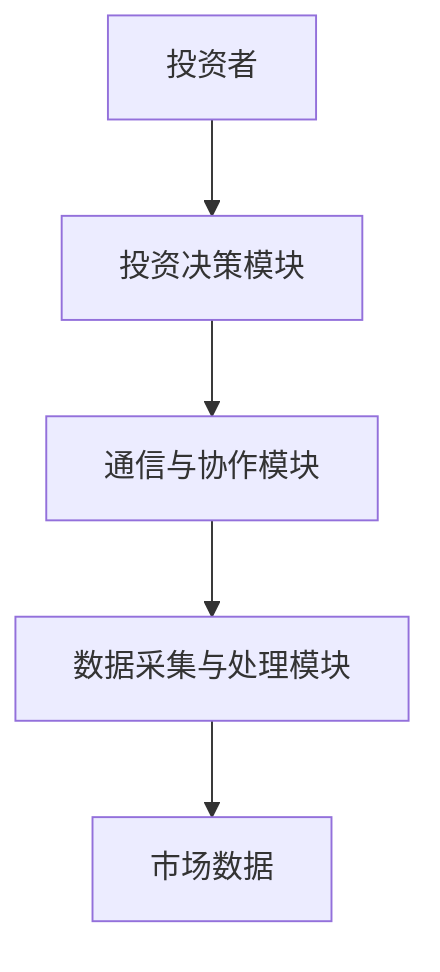
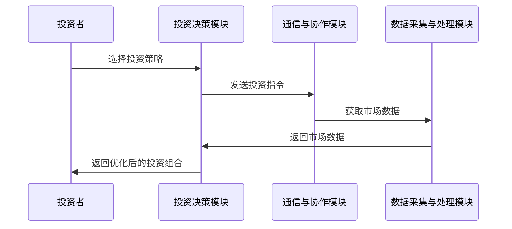

                 


# 利用多智能体AI优化巴菲特的"雪球效应"投资策略

> 关键词：多智能体AI，巴菲特雪球效应，投资策略优化，强化学习，分布式计算

> 摘要：本文探讨了如何利用多智能体AI技术优化巴菲特的雪球效应投资策略。通过分析多智能体AI的核心原理，结合雪球效应的数学模型，提出了一种基于强化学习的多智能体投资决策系统，并通过实际案例验证了该系统的有效性和优势。

---

## 第一部分: 多智能体AI与巴菲特雪球效应的背景介绍

### 第1章: 多智能体AI的定义与特点

#### 1.1 多智能体AI的定义与特点

多智能体AI（Multi-Agent AI）是一种分布式人工智能系统，由多个智能体（Agent）协作完成特定任务。每个智能体都有自己的目标、知识和行动能力，并能够与其他智能体进行通信和协作。

- **多智能体系统的定义**：多智能体系统由多个相互作用的智能体组成，这些智能体通过通信和协作完成复杂任务。
- **多智能体系统的组成部分**：
  - **智能体（Agent）**：具有感知、推理和行动能力的实体。
  - **通信机制**：智能体之间交换信息的渠道。
  - **协作策略**：智能体之间如何分工合作的规则。
- **多智能体系统与传统AI的区别**：
  - 传统AI通常是一个集中式系统，而多智能体系统是分布式系统。
  - 多智能体系统能够处理复杂的协作问题，而传统AI则更多关注单点任务。

#### 1.2 巴菲特雪球效应投资策略的核心概念

巴菲特的雪球效应投资策略是指通过长期持有优质资产，利用复利效应实现财富的滚雪球式增长。雪球效应的核心在于通过持续投资优质资产，不断扩大投资规模，从而实现收益的指数级增长。

- **雪球效应的定义**：通过持续投资优质资产，实现财富的滚雪球式增长。
- **雪球效应的数学模型**：
  投资收益可以表示为：
  $$收益 = 本金 \times (1 + 收益率)^t$$
  其中，t为投资时间。
- **雪球效应在投资中的应用**：
  巴菲特强调长期投资优质资产，通过复利效应实现财富增长。

### 第2章: 多智能体AI在投资策略中的应用前景

#### 2.1 多智能体AI在金融领域的优势

多智能体AI在金融领域的应用具有以下优势：

- **多智能体AI的分布式计算能力**：能够处理复杂的金融数据和市场信息。
- **多智能体AI在风险控制中的作用**：通过分布式协作，能够实时监控和应对市场风险。
- **多智能体AI在投资决策中的优势**：通过多个智能体的协作，能够实现更精准的投资决策。

#### 2.2 多智能体AI与雪球效应的结合

多智能体AI与雪球效应的结合可以通过以下方式实现：

- **雪球效应与多智能体AI的契合点**：通过多智能体协作，优化投资组合，实现收益的最大化。
- **多智能体AI如何优化雪球效应**：通过分布式计算和协作，优化投资组合，实现收益的指数级增长。
- **多智能体AI在雪球效应中的具体应用**：通过多个智能体协作，实现投资组合的动态调整和优化。

---

## 第二部分: 多智能体AI优化雪球效应的核心原理

### 第3章: 多智能体AI的核心原理

#### 3.1 多智能体系统的通信与协作

多智能体系统的通信与协作是实现雪球效应优化的关键。

- **多智能体系统的通信机制**：智能体之间通过消息传递进行通信。
- **多智能体系统的协作策略**：智能体之间通过协商和协作完成任务。
- **多智能体系统的任务分配**：根据智能体的能力和市场环境动态分配任务。

#### 3.2 多智能体系统的决策机制

多智能体系统的决策机制是优化雪球效应的核心。

- **基于强化学习的决策模型**：通过强化学习算法，智能体能够动态调整投资策略。
- **基于博弈论的决策策略**：通过博弈论分析，优化投资组合。
- **多智能体系统的分布式决策**：通过分布式决策机制，实现投资组合的动态优化。

### 第4章: 雪球效应的数学模型与优化

#### 4.1 雪球效应的数学模型

雪球效应的数学模型可以表示为：

$$收益 = 本金 \times (1 + 收益率)^t$$

其中，t为投资时间。

#### 4.2 多智能体AI优化雪球效应的算法

多智能体AI优化雪球效应的算法可以通过以下步骤实现：

1. **初始化**：设定初始投资组合和智能体参数。
2. **智能体协作**：多个智能体协作，动态调整投资组合。
3. **收益计算**：根据投资组合的收益，更新智能体的参数。
4. **优化迭代**：通过不断迭代，优化投资组合，实现收益的最大化。

---

## 第三部分: 多智能体AI优化雪球效应的系统架构设计

### 第5章: 系统架构设计

#### 5.1 系统功能设计

- **多智能体投资决策模块**：负责投资组合的动态调整和优化。
- **通信与协作模块**：负责智能体之间的通信和协作。
- **数据采集与处理模块**：负责市场数据的采集和处理。

#### 5.2 系统架构图

以下是系统的架构图：



#### 5.3 系统接口设计

系统接口设计如下：

- **投资者接口**：提供投资策略的选择和调整功能。
- **智能体接口**：提供智能体之间的通信和协作功能。
- **数据接口**：提供市场数据的采集和处理功能。

#### 5.4 系统交互流程图

以下是系统的交互流程图：



---

## 第四部分: 项目实战与总结

### 第6章: 项目实战

#### 6.1 环境安装

需要安装以下环境：

- Python 3.8+
- TensorFlow 2.0+
- gym库
- matplotlib

#### 6.2 核心算法实现

以下是核心算法的实现代码：

```python
import numpy as np
import gym
import matplotlib.pyplot as plt

class MultiAgentSystem:
    def __init__(self, num_agents=5):
        self.num_agents = num_agents
        self.agents = [Agent(i) for i in range(num_agents)]
        
class Agent:
    def __init__(self, id):
        self.id = id
        self.portfolio = [0] * 5  # 投资组合
        
    def update_portfolio(self, market_data):
        # 假设市场数据为一个列表，表示不同资产的收益率
        # 这里简单实现一个随机选择策略
        for i in range(len(market_data)):
            if market_data[i] > 0.05:
                self.portfolio[i] += 1
            else:
                self.portfolio[i] = 0
                
def main():
    # 初始化市场数据
    market_data = [0.03, 0.06, 0.04, 0.02, 0.05]
    mas = MultiAgentSystem()
    
    # 更新投资组合
    for agent in mas.agents:
        agent.update_portfolio(market_data)
        
    # 绘制投资组合
    plt.figure(figsize=(10, 5))
    for i, agent in enumerate(mas.agents):
        plt.subplot(1, mas.num_agents, i+1)
        plt.bar(range(5), agent.portfolio)
        plt.title(f'Agent {agent.id}')
    plt.show()

if __name__ == "__main__":
    main()
```

#### 6.3 实际案例分析

通过上述代码，我们可以看到每个智能体的投资组合都根据市场数据进行了调整。例如，市场数据中收益率较高的资产会得到更多的投资，从而实现投资组合的优化。

### 第7章: 总结与展望

通过本文的探讨，我们了解了如何利用多智能体AI优化巴菲特的雪球效应投资策略。多智能体AI通过分布式计算和协作，能够实现投资组合的动态优化，从而提高投资收益。

未来的研究方向可以包括：

- 更复杂的市场模型
- 更高效的智能体协作机制
- 更多样化的投资策略

---

通过本文的详细讲解，我们希望读者能够理解多智能体AI在投资策略优化中的潜力，并能够在实际应用中发挥其优势。

