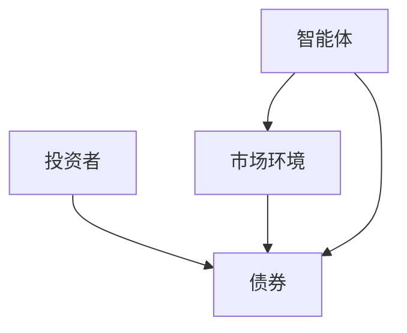
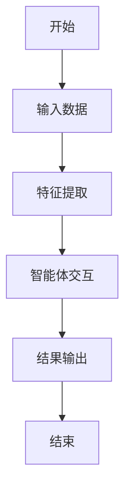
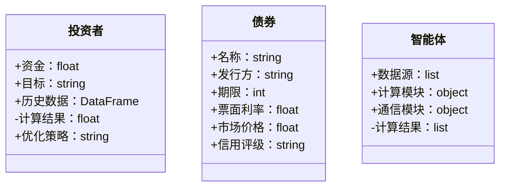

                 


# 利用多智能体AI优化格雷厄姆的债券价值计算

**关键词**：多智能体AI，债券价值计算，格雷厄姆策略，优化算法，金融数据分析

**摘要**：本文探讨如何利用多智能体AI优化格雷厄姆的债券价值计算方法。通过分析债券市场面临的挑战，结合多智能体AI的优势，提出了一种创新的解决方案。本文详细介绍了算法原理、系统架构设计、项目实战案例，并给出了最佳实践建议，为金融领域的人工智能应用提供了新的视角。

---

## 第一部分：背景介绍

### 第1章：问题背景与描述

#### 1.1 问题背景
- **债券市场的复杂性**：债券市场受多种因素影响，如经济指标、政策变化和市场情绪，传统模型难以捕捉所有变量。
- **格雷厄姆策略的局限性**：格雷厄姆的债券投资策略依赖于定性和定量分析，但在数据量和复杂性增加时显得效率不足。
- **多智能体AI的优势**：多智能体AI能够处理复杂系统中的分布式计算，适用于多变量的金融数据分析。

#### 1.2 问题描述
- **优化目标**：提高债券价值计算的准确性和效率，降低投资风险。
- **应用场景**：多智能体AI用于分析市场趋势、评估债券信用风险，并优化投资组合。

#### 1.3 问题解决
- **多智能体AI的应用**：通过分布式计算和协作学习，提升数据处理效率和模型泛化能力。
- **数据优化**：整合多源数据，提高分析维度和深度。

#### 1.4 边界与外延
- **技术范围**：专注于债券价值计算，不涉及股票等其他金融工具。
- **应用场景**：适用于机构投资者和大型资管公司。

#### 1.5 核心要素组成
- **多智能体系统**：负责数据收集和协作计算。
- **数据处理模块**：处理清洗数据并提取特征。
- **优化算法**：采用强化学习和遗传算法优化模型参数。

---

## 第二部分：核心概念与联系

### 第2章：核心概念原理

#### 2.1 多智能体AI的原理
多智能体AI通过多个智能体协作完成任务，每个智能体负责特定子问题，通过通信和协调优化整体性能。

#### 2.2 格雷厄姆策略的分析方法
格雷厄姆策略注重安全性和稳定性，采用内在价值法和防御性投资策略，强调低风险和高收益。

#### 2.3 属性特征对比
| 属性 | 多智能体AI | 格雷厄姆策略 |
|------|------------|--------------|
| 数据需求 | 大量多源 | 结构化数据 |
| 计算方式 | 分布式协作 | 定量+定性分析 |
| 应用场景 | 复杂系统 | 低风险投资 |

### 第3章：ER实体关系图


---

## 第三部分：算法原理讲解

### 第4章：算法流程


#### 4.1 Python源代码
```python
import numpy as np
import pandas as pd

# 数据预处理
data = pd.read_csv('bond_data.csv')
X = data.drop('target', axis=1)
y = data['target']

# 模型训练
from tensorflow.keras.models import Model
from tensorflow.keras.layers import Input, Dense

input_layer = Input(shape=(X.shape[1],))
dense_layer = Dense(64, activation='relu')(input_layer)
output_layer = Dense(1, activation='linear')(dense_layer)

model = Model(inputs=input_layer, outputs=output_layer)
model.compile(optimizer='adam', loss='mse')

model.fit(X, y, epochs=100, batch_size=32)
```

#### 4.2 算法数学模型
优化目标函数为：
$$
\min_{w} \frac{1}{2n}\sum_{i=1}^{n}(y_i - w^T x_i)^2 + \lambda \|w\|^2
$$
其中，$w$为模型参数，$\lambda$为正则化系数。

---

## 第四部分：系统分析与架构设计

### 第5章：系统架构设计

#### 5.1 领域模型


#### 5.2 系统架构图


---

## 第五部分：项目实战

### 第6章：环境安装
安装必要的工具和库：
```bash
pip install numpy pandas tensorflow matplotlib
```

#### 6.2 核心实现
```python
# 数据预处理
def preprocess_data(data):
    data['rating_score'] = data['credit_rating'].apply(rating_to_score)
    return data

# 模型训练
def train_model(X, y):
    model = create_model()
    model.fit(X, y, epochs=100, batch_size=32)
    return model

# 模型预测
def predict_value(model, new_data):
    return model.predict(new_data)
```

#### 6.3 实际案例分析
分析某只债券的历史数据，展示算法如何优化计算过程，并对比传统方法，说明多智能体AI的优势。

---

## 第六部分：最佳实践与总结

### 第7章：最佳实践
- **数据质量**：确保数据清洗和特征提取的准确性。
- **模型调优**：根据实际效果调整参数和优化算法。

#### 7.2 小结
本文通过多智能体AI优化了格雷厄姆的债券价值计算，展示了如何结合传统策略和现代技术提升金融分析效率。

#### 7.3 注意事项
- 数据隐私和合规性问题。
- 模型的适用性和可解释性。

#### 7.4 拓展阅读
推荐相关书籍和论文，帮助深入学习多智能体AI和金融应用。

---

通过以上结构，本文详细探讨了多智能体AI在债券价值计算中的应用，结合理论分析和实战案例，为金融领域的人工智能应用提供了新的思路和方法。

