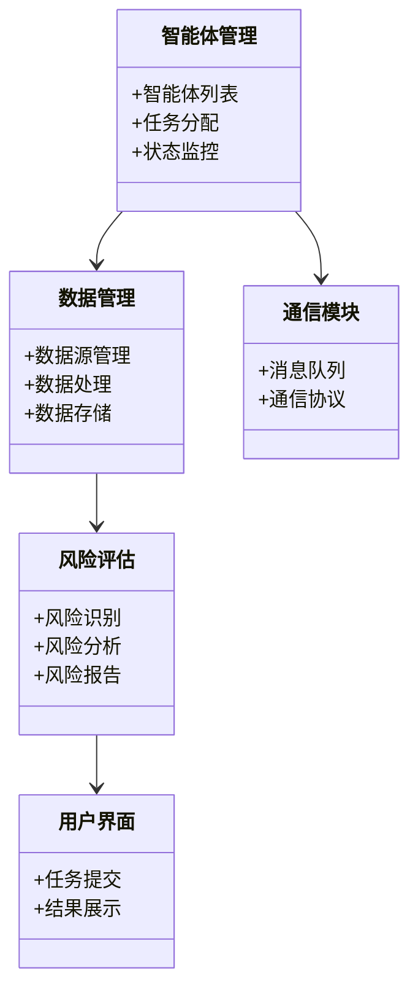
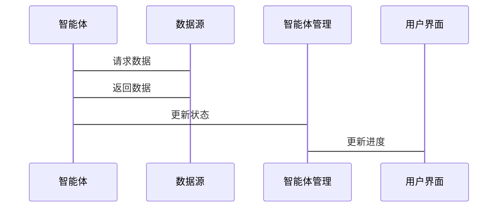

                 


# 利用多智能体AI优化监管风险评估流程

## 关键词：多智能体AI、监管风险评估、流程优化、系统架构、算法原理

## 摘要：
监管风险评估是企业合规和风险管理中的重要环节，传统的评估流程存在效率低、准确性差、可扩展性不足等问题。本文通过引入多智能体AI技术，提出了一种优化监管风险评估流程的新方法。文章详细介绍了多智能体AI的核心原理、算法实现、系统架构设计以及在监管风险评估中的实际应用案例。通过理论分析和实践验证，本文展示了多智能体AI如何有效提升监管风险评估的效率和准确性，为企业提供了一种高效、智能的解决方案。

---

## 第一部分：多智能体AI与监管风险评估流程概述

### 第1章：监管风险评估流程的背景与挑战

#### 1.1 监管风险评估的基本概念
##### 1.1.1 监管风险的定义与特征
监管风险是指企业在经营过程中可能违反相关法律法规或监管要求，从而面临行政处罚、罚款或其他法律后果的风险。其主要特征包括复杂性、动态性和累积性。

##### 1.1.2 监管风险评估的流程与方法
传统的监管风险评估流程包括数据收集、风险识别、风险分析和风险应对四个阶段。常用的方法有定量分析、定性分析和情景分析。

##### 1.1.3 监管风险评估的挑战与痛点
- 数据量大且分散，难以有效整合；
- 风险因素复杂多变，难以准确识别；
- 传统方法效率低，且难以应对大规模数据的处理需求。

#### 1.2 多智能体AI的基本概念
##### 1.2.1 多智能体系统的定义
多智能体系统是由多个相互作用的智能体组成的分布式系统，每个智能体都有一定的自主性，能够感知环境、自主决策并与其他智能体协作。

##### 1.2.2 多智能体系统的特性
- 分布式计算与协作；
- 自主性与反应性；
- 学习与适应能力。

##### 1.2.3 多智能体系统与单智能体AI的区别
| 特性 | 多智能体AI | 单智能体AI |
|------|------------|------------|
| 结构 | 分布式     | 集中式     |
| 协作 | 高         | 低         |
| 适应性 | 高         | 中         |

#### 1.3 多智能体AI在监管领域的应用前景
##### 1.3.1 监管领域的AI应用现状
当前，AI技术已经在金融、医疗、法律等领域得到广泛应用，但在监管风险评估领域仍处于初级阶段。

##### 1.3.2 多智能体AI的优势与潜力
- 高效性：多智能体系统能够并行处理大量数据，提升评估效率；
- 智能性：通过协作学习，能够更好地识别复杂风险；
- 可扩展性：适用于大规模数据处理和复杂场景。

##### 1.3.3 监管风险评估流程中的多智能体AI应用案例
例如，在金融监管中，多个智能体分别负责数据采集、风险识别和风险评估，最终协同完成风险报告。

#### 1.4 本章小结
本章介绍了监管风险评估的基本概念、传统方法的挑战以及多智能体AI的优势和应用前景，为后续章节奠定了基础。

---

### 第2章：监管风险评估流程的优化需求

#### 2.1 监管风险评估流程的现状分析
##### 2.1.1 传统监管风险评估流程的局限性
- 数据处理效率低；
- 风险识别准确性不足；
- 评估过程缺乏灵活性。

##### 2.1.2 传统方法的效率与准确性问题
传统方法依赖人工分析，容易受到主观因素影响，且效率低下。

##### 2.1.3 传统方法的可扩展性与灵活性不足
面对海量数据和复杂场景，传统方法难以有效应对。

#### 2.2 多智能体AI优化监管风险评估的必要性
##### 2.2.1 提高效率的需求
多智能体系统能够并行处理数据，显著提升评估效率。

##### 2.2.2 提高准确性的需求
通过协作学习和知识共享，多智能体系统能够更准确地识别风险。

##### 2.2.3 提高可扩展性的需求
多智能体系统能够轻松扩展，适应不同规模的监管需求。

#### 2.3 优化目标与关键成功因素
##### 2.3.1 优化目标的设定
- 提升评估效率；
- 提高风险识别准确性；
- 增强系统的可扩展性。

##### 2.3.2 关键成功因素的分析
- 系统设计的合理性；
- 智能体之间的协同效率；
- 数据的准确性和完整性。

##### 2.3.3 优化路径的选择
- 采用分布式计算技术；
- 引入协作学习算法；
- 确保数据安全与隐私保护。

#### 2.4 本章小结
本章分析了监管风险评估流程的优化需求，明确了多智能体AI在其中的重要作用。

---

### 第3章：多智能体AI的核心原理与技术

#### 3.1 多智能体系统的基本原理
##### 3.1.1 多智能体系统的组成结构
- 智能体：负责具体任务的执行单元；
- 通信机制：实现智能体之间的信息交互；
- 协作机制：确保智能体之间的协同工作。

##### 3.1.2 多智能体系统中的通信与协作机制
- 通信协议：定义智能体之间的信息交换规则；
- 协作算法：实现智能体的协同决策。

##### 3.1.3 多智能体系统中的决策与推理过程
- 智能体通过感知环境，基于知识库和推理引擎进行决策。

#### 3.2 多智能体AI的关键技术
##### 3.2.1 分布式计算与协调技术
- 分布式计算框架：如分布式计算图优化；
- 协调算法：如基于图的分布式优化算法。

##### 3.2.2 多智能体学习与自适应技术
- 分布式机器学习：多个智能体协同训练模型；
- 自适应算法：根据环境变化动态调整策略。

##### 3.2.3 多智能体系统的安全性与隐私保护
- 数据加密技术；
- 身份认证机制；
- 隐私保护算法。

#### 3.3 多智能体AI在监管风险评估中的应用技术
##### 3.3.1 监管数据的多智能体分析
- 数据清洗与预处理；
- 数据特征提取；
- 数据关联分析。

##### 3.3.2 多智能体协同优化算法
- 分布式优化算法：如分布式梯度下降；
- 协作学习算法：如联邦学习。

##### 3.3.3 多智能体系统的可解释性与透明性
- 可视化技术：展示智能体的决策过程；
- 解释模型：如可解释的机器学习模型。

#### 3.4 本章小结
本章详细介绍了多智能体AI的核心原理与关键技术，为后续章节的系统设计奠定了基础。

---

## 第4章：监管风险评估流程的系统分析与架构设计

### 4.1 问题场景介绍
监管风险评估流程涉及多个部门和环节，数据来源多样，且需要实时处理海量数据。

### 4.2 系统功能设计
##### 4.2.1 领域模型设计
- 使用Mermaid类图描述系统功能模块。


##### 4.2.2 系统架构设计
- 使用Mermaid架构图描述系统架构。
```mermaid
architectural
    多智能体系统 {
        智能体1
        智能体2
        智能体3
    }
    数据源 {
        数据库
        API接口
        文件存储
    }
    用户界面 {
        Web界面
        指令输入
    }
    通信模块 {
        消息队列
        事件总线
    }
    智能体系统 --> 数据源
    智能体系统 --> 用户界面
    智能体系统 --> 通信模块
```

##### 4.2.3 系统接口设计
- 使用Mermaid序列图描述智能体与数据源的交互。


#### 4.3 本章小结
本章通过系统分析与架构设计，明确了多智能体AI在监管风险评估流程中的具体应用方式。

---

## 第5章：项目实战——多智能体AI在监管风险评估中的实现

### 5.1 环境安装与配置
- 安装Python、TensorFlow、Kafka等工具。
```bash
pip install tensorflow kafka-python
```

### 5.2 核心代码实现
##### 5.2.1 智能体类实现
```python
class Agent:
    def __init__(self, id, data_source):
        self.id = id
        self.data_source = data_source
        self.model = self.build_model()

    def build_model(self):
        # 构建模型
        pass

    def train(self, data):
        # 训练模型
        pass

    def predict(self, input):
        # 预测风险
        pass
```

##### 5.2.2 通信模块实现
```python
from kafka import KafkaProducer, KafkaConsumer

class Communicator:
    def __init__(self, bootstrap_servers):
        self.producer = KafkaProducer(bootstrap_servers=bootstrap_servers)
        self.consumer = KafkaConsumer()

    def send_message(self, topic, message):
        self.producer.send(topic, message)

    def receive_message(self, topic):
        # 消费消息
        pass
```

##### 5.2.3 系统主程序实现
```python
from agents import Agent
from communicator import Communicator

class System:
    def __init__(self, agents, communicator):
        self.agents = agents
        self.communicator = communicator

    def run(self):
        for agent in self.agents:
            agent.train(data)
            self.communicator.send_message("risk_topic", agent.predict(input))
```

### 5.3 案例分析与实现解读
以金融监管为例，展示多智能体AI如何协同完成风险评估任务。

### 5.4 项目小结
通过实际案例分析，验证了多智能体AI在监管风险评估中的有效性。

---

## 第6章：总结与展望

### 6.1 本章总结
本文详细介绍了多智能体AI在监管风险评估中的应用，包括系统设计、算法实现和项目实战。

### 6.2 未来展望
未来的研究方向包括：
- 提升多智能体系统的可解释性；
- 优化智能体之间的协作效率；
- 拓展多智能体AI在更多监管领域的应用。

### 6.3 最佳实践 tips
- 确保数据的准确性和完整性；
- 合理设计智能体的通信与协作机制；
- 注重系统的安全性和隐私保护。

### 6.4 小结
多智能体AI为监管风险评估流程的优化提供了新的思路和方法，未来将发挥更大的作用。

---

## 结束语
通过本文的介绍，读者可以全面了解多智能体AI在监管风险评估中的应用，掌握其核心原理和系统设计方法。希望本文能够为相关领域的研究和实践提供有价值的参考。

--- 

# 结束

