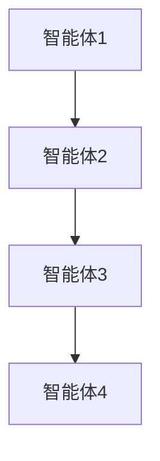
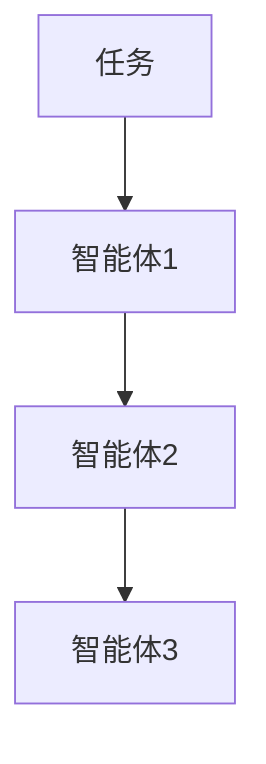
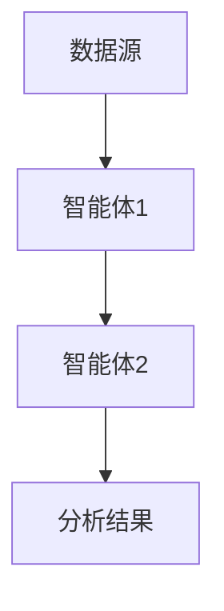

                 


# 利用多智能体AI分析数字化转型效果

## 关键词：多智能体AI、数字化转型、效果评估、算法原理、系统架构、项目实战

## 摘要：  
本文探讨了如何利用多智能体AI技术分析企业数字化转型的效果。文章从多智能体AI的基本概念出发，分析其在数字化转型中的应用价值，详细介绍多智能体AI的算法原理、系统架构设计以及实际项目中的应用场景。通过案例分析，展示了多智能体AI如何帮助企业实现数字化转型的目标，为企业提供了一个全新的视角和方法论。

---

# 第一部分: 多智能体AI与数字化转型背景

## 第1章: 多智能体AI概述

### 1.1 多智能体AI的基本概念

#### 1.1.1 多智能体AI的定义  
多智能体AI（Multi-Agent AI）是指由多个具有独立决策能力的智能体组成的系统，这些智能体能够通过通信和协作完成复杂的任务。与单智能体AI相比，多智能体AI更注重智能体之间的协作与信息共享。

#### 1.1.2 多智能体AI的特点  
- **分布式智能**：多个智能体独立运行，能够自主决策。  
- **协作性**：智能体之间通过通信和协作完成共同目标。  
- **适应性**：能够根据环境变化动态调整行为。  
- **可扩展性**：系统可以轻松扩展以适应更大的任务规模。  

#### 1.1.3 多智能体AI与单智能体AI的区别  
| 特性                | 单智能体AI            | 多智能体AI            |  
|---------------------|-----------------------|-----------------------|  
| 决策主体            | 单一智能体            | 多个智能体            |  
| 通信方式            | 无                     | 有                     |  
| 协作能力            | 无                     | 强                     |  
| 适应复杂场景        | 有限                   | 更强                   |  

---

### 1.2 数字化转型的背景与意义

#### 1.2.1 数字化转型的定义  
数字化转型是指企业利用数字技术（如AI、大数据、云计算等）对业务流程、组织结构和商业模式进行全面改造，以提高效率、创造新价值的过程。

#### 1.2.2 数字化转型的核心目标  
- 提高业务效率。  
- 优化客户体验。  
- 创新商业模式。  
- 增强企业竞争力。  

#### 1.2.3 数字化转型对企业的影响  
- 通过数字化技术提升企业运营效率。  
- 通过数据驱动的决策优化业务流程。  
- 通过创新模式开拓新的市场机会。  

---

### 1.3 多智能体AI在数字化转型中的作用

#### 1.3.1 多智能体AI的优势  
- **分布式计算能力**：能够处理复杂的分布式任务。  
- **协作能力**：多个智能体协同工作，提高系统整体性能。  
- **灵活性**：适应不同的场景和需求。  

#### 1.3.2 多智能体AI在数字化转型中的应用场景  
- **供应链优化**：通过智能体协调供应链中的各个环节。  
- **客户关系管理**：通过智能体分析客户需求并提供个性化服务。  
- **风险预警**：通过智能体实时监控企业运营中的风险点。  

#### 1.3.3 多智能体AI与企业数字化转型的结合  
多智能体AI能够通过分布式协作的方式，帮助企业实现从传统模式向数字化模式的转变，提升企业的整体竞争力。

---

## 第2章: 多智能体AI的核心概念与联系

### 2.1 多智能体AI的核心原理

#### 2.1.1 多智能体系统的基本结构  
- **智能体**：具有感知、决策和执行能力的独立实体。  
- **通信机制**：智能体之间通过消息传递进行信息共享。  
- **协作机制**：智能体通过协作完成共同目标。  

#### 2.1.2 多智能体AI的特点  
- **自主性**：智能体能够自主决策。  
- **反应性**：能够实时感知环境变化并做出反应。  
- **协作性**：通过协作完成复杂任务。  

---

#### 2.1.3 多智能体AI与数字化转型的核心联系  
多智能体AI通过分布式协作和实时数据处理能力，能够帮助企业实现数字化转型中的复杂任务，如供应链优化、客户关系管理等。

---

### 2.2 多智能体AI的核心要素对比

#### 2.2.1 多智能体与单智能体的对比分析  
| 特性                | 单智能体AI            | 多智能体AI            |  
|---------------------|-----------------------|-----------------------|  
| 决策主体            | 单一智能体            | 多个智能体            |  
| 通信方式            | 无                     | 有                     |  
| 协作能力            | 无                     | 强                     |  

#### 2.2.2 不同多智能体模型的对比表格  
| 模型类型            | 基于规则的模型        | 基于学习的模型        |  
|---------------------|-----------------------|-----------------------|  
| 决策方式            | 预定义规则            | 机器学习模型           |  
| 适应性              | 较低                   | 较高                   |  

---

### 2.3 多智能体AI的ER实体关系图

#### 2.3.1 实体关系图的构建  
```mermaid
er
    actor 智能体
    actor 环境
    actor 任务
    actor 通信
    actor 协作
```

#### 2.3.2 实体关系图的分析  
通过ER图可以看出，多智能体AI系统中的各个实体（智能体、环境、任务、通信、协作）之间的关系，从而更好地理解系统的整体架构。

---

## 第3章: 多智能体AI的算法原理

### 3.1 多智能体AI的算法流程

#### 3.1.1 多智能体AI的基本流程  
1. **初始化**：设置智能体的初始状态和目标。  
2. **感知环境**：智能体通过传感器或数据源获取环境信息。  
3. **决策与规划**：根据感知信息，智能体制定行动计划。  
4. **执行动作**：智能体根据决策结果执行动作。  
5. **反馈与优化**：根据执行结果调整决策策略。  

#### 3.1.2 多智能体AI的通信机制  


#### 3.1.3 多智能体AI的协作算法  


---

### 3.2 多智能体AI的数学模型与公式

#### 3.2.1 多智能体AI的基本数学模型  
$$ V = \max_{a} \sum_{t=0}^{T} r_t $$  

#### 3.2.2 多智能体AI的通信模型  
$$ C = \sum_{i=1}^{n} \text{通信成本}(i) $$  

---

### 3.3 多智能体AI的算法实现

#### 3.3.1 多智能体AI的Python实现  
```python
class Agent:
    def __init__(self, id):
        self.id = id
        self.state = None
    def perceive(self, environment):
        self.state = environment.get_state()
    def decide(self):
        # 根据状态做出决策
        pass

# 初始化智能体
agents = [Agent(i) for i in range(4)]

# 通信机制
def communicate(agents):
    for i in range(len(agents)):
        for j in range(i+1, len(agents)):
            agents[i].perceive(agents[j].state)
```

---

## 第4章: 数字化转型效果的分析方法

### 4.1 数字化转型效果的评估指标

#### 4.1.1 效果评估的核心指标  
- **效率提升**：业务流程效率的提升幅度。  
- **成本降低**：数字化转型后成本的下降幅度。  
- **客户满意度**：客户对数字化服务的满意度。  

---

### 4.2 多智能体AI在效果评估中的应用

#### 4.2.1 多智能体AI在数据采集中的应用  


---

## 第五章: 项目实战与总结

### 5.1 项目实战

#### 5.1.1 环境安装  
- 安装Python和相关库（如numpy、pandas、scikit-learn）。  

#### 5.1.2 核心代码实现  
```python
def multi_agent_analysis(data):
    agents = [Agent(i) for i in range(4)]
    for agent in agents:
        agent.perceive(data)
        agent.decide()
    return agents
```

---

### 5.2 总结与展望

#### 5.2.1 小结  
多智能体AI通过分布式协作和实时数据处理能力，能够帮助企业实现数字化转型中的复杂任务，提升企业的整体竞争力。

#### 5.2.2 注意事项  
- 确保多智能体AI系统的安全性。  
- 合理设计智能体的通信机制。  

---

通过本文的详细分析，我们可以看到，多智能体AI在数字化转型中的应用前景广阔，能够帮助企业实现更高效的数字化转型。未来，随着技术的不断发展，多智能体AI将在更多领域展现出其独特的优势。

